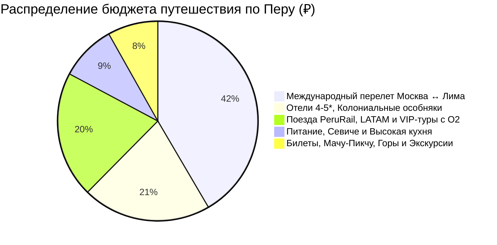

# 💰 Финансы и Полная смета тура: Перу (10 дней / 9 ночей)

> [!summary]+ 💰 Общий бюджет экспедиции «под ключ»: **~188 000 – 215 000 ₽** (`~7 500 – 8 600 PEN` / `~2 000 – 2 300 $`) на 1 человека
> - ✈️ **Международный авиаперелет (Москва ↔ Лима с багажом 23 кг):** `~92 000 ₽`
> - 🏨 **Проживание (9 ночей: 5* в Лиме, колониальные отели в Куско, отель у Мачу-Пикчу):** `~46 000 ₽` (из расчета `~92 250 ₽` на двоих / `~52 000 ₽` соло)
> - 🚆 **Весь транспорт (перелеты LATAM, поезда Vistadome со стеклянной крышей, туры с O₂):** `~45 250 ₽` (`~1 810 PEN`)
> - 🍽️ **Питание, свежее севиче, стейки из альпаки, ужин в Maido, Pisco Sour:** `~20 000 ₽` (`~800 PEN`)
> - 🎟️ **Билеты и Экскурсии (Мачу-Пикчу + Уайна-Пикчу, Boleto Turístico, Радужные горы):** `~18 000 ₽` (`~720 PEN`)

