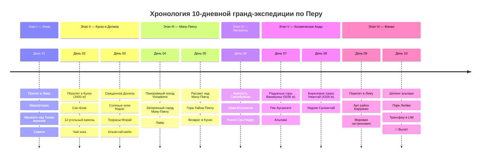

# 🇵🇪 Перу: Империя Инков, Затерянный Мачу-Пикчу и Священные Анды (10 Дней)

> **Концепция экспедиции:** Грандиозная 10-дневная одиссея по Южной Америке для соло-путешественника без автомобиля: от гастрономических высот Тихоокеанского побережья Лимы и колониальных площадей древней столицы инков Куско (3400 м) до панорамного поезда со стеклянным куполом в легендарную затерянную цитадель Мачу-Пикчу (ЮНЕСКО), марсианских соляных бассейнов Марас, изумрудного ледникового озера Умантай и сюрреалистичных семицветных Радужных гор Виникунка (5036 м).
> 
> 1. 🌊 **Этап I (День 01): Океанская Лима — Кулинарная столица Америки.** Район Мирафлорес на краю 80-метрового утеса над Тихим океаном, Парк Любви, свежайшее севиче из морской рыбы и коктейль Pisco Sour.
> 2. 👑 **Этап II (Дни 02–03): Столица Инков Куско и Священная Долина.** Колониальная Пласа-де-Армас, квартал художников Сан-Блас, 12-угольный камень без раствора, концентрические агро-террасы Морай, 3000 соляных ванн Салинас-де-Марас и циклопическая крепость Ольянтайтамбо.
> 3. 🏰 **Этап III (Дни 04–05): Чудо Света — Затерянный Город Мачу-Пикчу.** Панорамный поезд со стеклянной крышей *Inca Rail 360° / PeruRail Vistadome* вдоль бурной реки Урубамба, подъем к Мачу-Пикчу (террасы с ламами, Храм Солнца, Интиуатана), рассвет над цитаделью и вершина Уайна-Пикчу.
> 4. 🗿 **Этап IV (День 06): Мегалиты Саксайуамана и Храм Солнца Кориканча.** Циклопические 100-тонные каменные блоки крепости Саксайуаман, древнейший золотой храм инков Кориканча и экзотический рынок Сан-Педро.
> 5. 🌈 **Этап V (Дни 07–08): Космические Анды — Радужные Горы и Озеро Умантай.** Семицветные Радужные горы Виникунка (5036 м) на фоне заснеженного пика Аусангате (6384 м) и бирюзовая лагуна Умантай (4200 м) под ледником Салкантай.
> 6. 🛫 **Этап VI (Дни 09–10): Богемный Барранко, Шерсть Альпаки и Вылет.** Богемный арт-квартал Барранко в Лиме, Мост Вздохов, ужин в ресторане мировой кухни (*Maido / Astrid y Gastón*), покупка мягчайшего кашемира из альпаки и вылет домой.

---

## 🗺️ Ключевые параметры экспедиции

* **Продолжительность:** 10 дней / 9 ночей.
* **Сезонность:** Май – октябрь (сухой андский сезон: ясное синее небо, идеальная видимость на Мачу-Пикчу и Радужных горах).
* **Формат перемещений:** 100% без авто (внутренние перелеты **LATAM Airlines**, панорамные поезда со стеклянным куполом **PeruRail / Inca Rail**, комфортабельные индивидуальные минивэны с англоязычными лицензированными гидами на высотные локации с кислородным оборудованием).
* **Бюджет под ключ на 1 чел:** `~185 000 – 220 000 ₽` (`~2 000 – 2 400 $` / `~7 500 – 9 000 PEN`), включая трансатлантический перелет, внутренние авиарейсы, поезда PeruRail Vistadome, все отели 4*, входные билеты в Мачу-Пикчу, Радужные горы и премиальные дегустации.

---

## 📋 Разделы проекта `-- Peru`

1. **[[Personal Note/Travel/-- Peru/02 - Маршрутный план/Маршрутный план|🗓️ Сводный Маршрутный план (10 Дней)]]**
2. **[[Мачу-Пикчу, Затерянный город инков и Гора Уайна-Пикчу|🏰 Заметки: Мачу-Пикчу — Затерянный город инков и Уайна-Пикчу]]**
3. **[[Куско, Столица Империи Инков, Сан-Блас и 12-угольный камень|👑 Заметки: Куско — Столица инков, Сан-Блас и архитектура]]**
4. **[[Священная Долина Инков, Соляные террасы Марас, Морай и Ольянтайтамбо|🌄 Заметки: Священная Долина — Марас, Морай и Ольянтайтамбо]]**
5. **[[Радужные Горы Виникунка (5036м) и Ледниковое озеро Умантай|🌈 Заметки: Высотные Анды — Радужные горы и Озеро Умантай]]**
6. **[[Мегалитическая цитадель Саксайуаман и Храм Солнца Кориканча|🗿 Заметки: Мегалиты Саксайуаман и Золотой храм Кориканча]]**
7. **[[Лима, Гастрономическая столица Южной Америки, Мирафлорес и Барранко|🌊 Заметки: Лима — Мирафлорес, Барранко и Тихий океан]]**
8. **[[Перуанская гастрономия, Севиче, Ломо Сальтадо, Pisco Sour и Альпака|🍽️ Заметки: Перуанская кухня — Севиче, Вагю/Ломо и Pisco]]**
9. **[[Гайд по транспорту без прав, Поезда PeruRail, Перелеты LATAM и Uber|🚆 Заметки: Гайд по транспорту — Поезда PeruRail и Перелеты]]**
10. **[[Авиаперелеты (Peru)|✈️ Бронирования: Авиаперелеты (Москва ↔ Лима ↔ Куско)]]**
11. **[[Отели, Исторические монастыри и Лоджи в Андах|🏨 Бронирования: Отели в Лиме, Куско и Агуас-Кальентес]]**
12. **[[Транспорт, Панорамные поезда PeruRail, Перелеты и Трансферы (Без авто)|🚆 Бронирования: Поезда PeruRail, LATAM и Трансферы]]**
13. **[[Финансы (Peru)|💰 Бюджет и Полная смета тура (10 дней)]]**
14. **[[05 - Полезная информация|📖 Полезная информация: Горная акклиматизация (сороче), Листья коки и Деньги]]**
