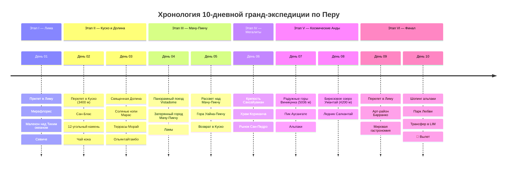

# 🇵🇪 Перу: Империя Инков, Затерянный Мачу-Пикчу и Священные Анды (10 Дней)

## 📝 Краткое описание

10-дневная экспедиция по следам Империи Инков: гастрономия Лимы на Тихом океане, древняя столица Куско, панорамный поезд в Мачу-Пикчу, соляные террасы Марас, высокогорное озеро Умантай и Радужные горы Виникунка (5036 м).

## 📖 Подробная концепция путешествия

Оптимизированный высотный маршрут по 6 ключевым этапам:

1. 🌊 **Этап I (День 01): Океанская Лима — Кулинарная столица Америки.** Район Мирафлорес на краю 80-метрового утеса над Тихим океаном, Парк Любви, свежайшее севиче из морской рыбы и коктейль Pisco Sour.
2. 👑 **Этап II (Дни 02–03): Столица Инков Куско и Священная Долина.** Колониальная Пласа-де-Армас, квартал художников Сан-Блас, 12-угольный камень без раствора, концентрические агро-террасы Морай, 3000 соляных ванн Салинас-де-Марас и циклопическая крепость Ольянтайтамбо.
3. 🏰 **Этап III (Дни 04–05): Чудо Света — Затерянный Город Мачу-Пикчу.** Панорамный поезд со стеклянной крышей *Inca Rail 360° / PeruRail Vistadome* вдоль бурной реки Урубамба, подъем к Мачу-Пикчу (террасы с ламами, Храм Солнца, Интиуатана), рассвет над цитаделью и вершина Уайна-Пикчу.
4. 🗿 **Этап IV (День 06): Мегалиты Саксайуамана и Храм Солнца Кориканча.** Циклопические 100-тонные каменные блоки крепости Саксайуаман, древнейший золотой храм инков Кориканча и экзотический рынок Сан-Педро.
5. 🌈 **Этап V (Дни 07–08): Космические Анды — Радужные Горы и Озеро Умантай.** Семицветные Радужные горы Виникунка (5036 м) на фоне заснеженного пика Аусангате (6384 м) и бирюзовая лагуна Умантай (4200 м) под ледником Салкантай.
6. 🛫 **Этап VI (Дни 09–10): Богемный Барранко, Шерсть Альпаки и Вылет.** Богемный арт-квартал Барранко в Лиме, Мост Вздохов, ужин в ресторане мировой кухни (*Maido / Astrid y Gastón*), покупка мягчайшего кашемира из альпаки и вылет домой.

```mermaid
timeline
    title Хронология 10-дневной гранд-экспедиции по Перу
    section Этап I — Лима
        День 01 : Прилет в Лиму : Мирафлорес : Малекон над Тихим океаном : Севиче
    section Этап II — Куско и Долина
        День 02 : Перелет в Куско (3400 м) : Сан-Блас : 12-угольный камень : Чай кока
        День 03 : Священная Долина : Соляные копи Марас : Террасы Морай : Ольянтайтамбо
    section Этап III — Мачу-Пикчу
        День 04 : Панорамный поезд Vistadome : Затерянный город Мачу-Пикчу : Ламы
        День 05 : Рассвет над Мачу-Пикчу : Гора Уайна-Пикчу : Возврат в Куско
    section Этап IV — Мегалиты
        День 06 : Крепость Саксайуаман : Храм Кориканча : Рынок Сан-Педро
    section Этап V — Космические Анды
        День 07 : Радужные горы Виникунка (5036 м) : Пик Аусангате : Альпаки
        День 08 : Бирюзовое озеро Умантай (4200 м) : Ледник Салкантай
    section Этап VI — Финал
        День 09 : Перелет в Лиму : Арт-район Барранко : Мировая гастрономия
        День 10 : Шопинг альпаки : Парк Любви : Трансфер в LIM : 🛫 Вылет
```

---

## 🗺️ Ключевые параметры экспедиции

* **Продолжительность:** 10 дней / 9 ночей.
* **Сезонность:** Май – октябрь (сухой андский сезон: ясное синее небо, идеальная видимость на Мачу-Пикчу и Радужных горах).
* **Формат перемещений:** 100% без авто (внутренние перелеты **LATAM Airlines**, панорамные поезда со стеклянным куполом **PeruRail / Inca Rail**, комфортабельные индивидуальные минивэны с англоязычными лицензированными гидами на высотные локации с кислородным оборудованием).
* **Бюджет под ключ на 1 чел:** `~185 000 – 220 000 ₽` (`~2 000 – 2 400 $` / `~7 500 – 9 000 PEN`), включая трансатлантический перелет, внутренние авиарейсы, поезда PeruRail Vistadome, все отели 4*, входные билеты в Мачу-Пикчу, Радужные горы и премиальные дегустации.
