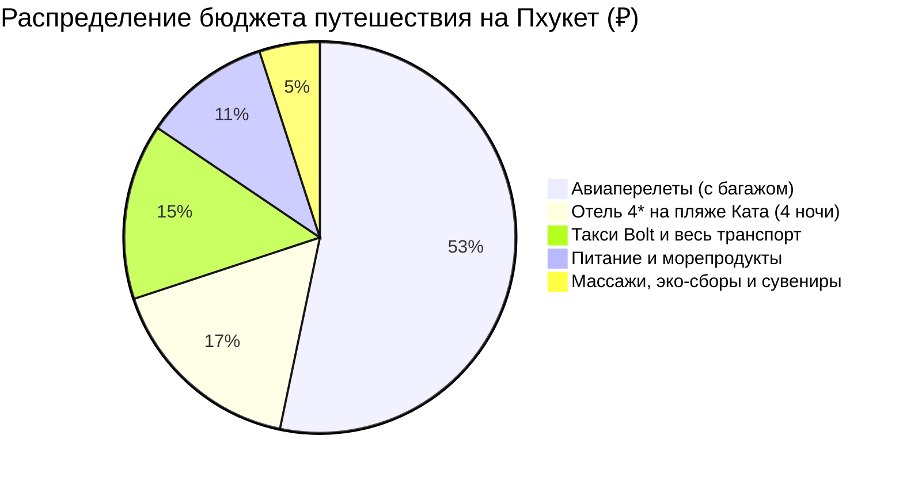

# 💰 Финансы и Полная смета тура: Пхукет (5 дней / 4 ночи)

> [!summary]+ 💰 Общий бюджет тропической экспедиции «под ключ»: **~76 000 – 88 000 ₽** (`~28 000 – 33 000 THB`) на 1 человека
> - ✈️ **Авиаперелеты (Москва ↔ HKT с багажом 23 кг):** `~48 000 ₽`
> - 🏨 **Проживание (4 ночи в Sugar Marina Hotel 4* с завтраками):** `~14 850 ₽` (из расчета `29 700 ₽` за номер на двоих / `29 700 ₽` соло)
> - 🚖 **Весь транспорт без авто (такси Bolt, Smart Bus):** `~13 100 ₽` (`~4 900 THB`)
> - 🍜 **Питание, морепродукты, Том Ям, манго и стритфуд:** `~9 500 ₽` (`~3 500 THB`)
> - 💆 **Тайские массажи, вход на Freedom Beach, сувениры:** `~4 500 ₽` (`~1 700 THB`)

---

## 📋 Детализированная структура расходов (в THB и RUB)

### 1. ✈️ Авиаперелет (`~48 000 ₽`)
* Регулярный рейс Москва ➔ Пхукет (HKT) ➔ Москва с багажом 23 кг.

### 2. 🏨 Проживание (4 ночи — `~11 000 THB` / `~29 700 ₽`)
* 4 ночи в *Sugar Marina Hotel - POP - Kata Beach 4\** у моря: `~2 750 THB/ночь` с завтраком.

### 3. 🚖 Такси и транспорт без авто (`~4 900 THB` / `~13 100 ₽`)
* Такси из аэропорта HKT на Ката: `750 THB`.
* Аренда авто с водителем на полдня (Будда + Ват Чалонг): `1 200 THB`.
* Поездки на такси Bolt по Южному мысу (Black Rock, Най Харн, Промтхеп): `750 THB`.
* Такси в Старый Пхукет-таун и обратно: `800 THB`.
* Такси на Freedom Beach и финальный трансфер в аэропорт HKT: `1 400 THB`.

### 4. 🍽️ Питание и деликатесы (`~3 500 THB` / `~9 500 ₽`)
* Ужины с сифудом, супы Том Ям, Пад Тай, свежие фрукты, кокосы и стритфуд на ночных маркетах: `~700 THB/день` × 5 дней.

### 5. 💆 Массажи, эко-сборы и сувениры (`~1 700 THB` / `~4 500 ₽`)
* 2 сеанса традиционного тайского массажа (по 1 часу): `600 THB`.
* Эко-сбор за вход на тропу Freedom Beach: `200 THB`.
* Спелое манго, сушеные фрукты, тайские бальзамы: `~900 THB`.
