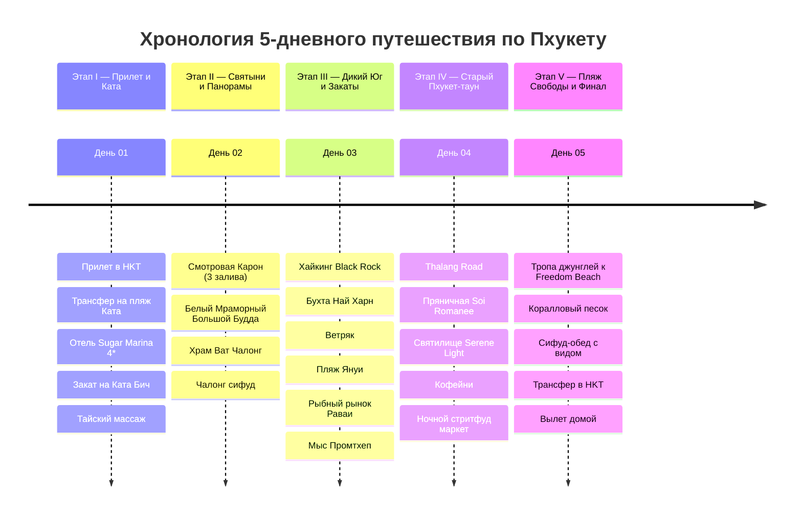

# 🌴 Пхукет и Андаманское побережье — 5 Дней Тропической Экспедиции

## 📝 Краткое описание

Сбалансированная 5-дневная экспедиция по Южному Пхукету: пляжи Ката и секретный Freedom Beach, мраморный Большой Будда и храм Ват Чалонг, хайкинг на Black Rock, закат на мысе Промтхеп и колониальная архитектура Пхукет-тауна.

## 📖 Подробная концепция путешествия

Оптимизированный маршрут по 5 ключевым этапам:

1. 🏖️ **Этап I (День 01): Прибытие и Пляж Ката.** Прилет в аэропорт HKT, трансфер в курортный отель на пляже Ката, мягкая акклиматизация, первый тропический закат над бирюзовым заливом и традиционный тайский массаж.
2. 🛕 **Этап II (День 02): Духовные вершины и Панорамы трех заливов.** Знаменитая смотровая площадка Карон (вид на Ката Ной, Ката и Карон), подъем на вершину Наккерд к 45-метровому мраморному Большому Будде, духовное сердце острова — храмовый комплекс Ват Чалонг и видовой ужин.
3. 🌅 **Этап III (День 03): Секретные виды Юга, Мыс Промтхеп и Рыбный рынок.** Хайкинг на скрытую смотровую площадку «Черный камень» (Black Rock Viewpoint), панорама Ветряка, купание в уютных бухтах Най Харн и Януи, выбор живых морепродуктов на пирсе Раваи и культовый закат на самой южной точке острова — мысе Промтхеп.
4. 🏛️ **Этап IV (День 04): Исторический Пхукет-таун и Ночные маркеты.** Контрастная смена пляжей на колониальный шарм: сино-португальские шопхаусы Thalang Road, пряничные фасады переулка Soi Romanee, китайские даосские святилища, спешелти-кофейни и гастрономический праздник на вечернем стритфуд-рынке.
5. 🌴 **Этап V (День 05): Скрытый Freedom Beach, Релакс и Вылет.** Поход сквозь джунгли к уединенному пляжу Свободы (Freedom Beach) с белоснежным коралловым песком, финальный манговый релакс, трансфер в аэропорт HKT и вечерний вылет домой.

---

## 🗺️ Ключевые параметры экспедиции

* **Продолжительность:** 5 дней / 4 ночи.
* **Базовая локация:** Пляж Ката (Юго-запад Пхукета) — идеальный баланс чистого моря, развитой пешей инфраструктуры и близости ко всем достопримечательностям.
* **Формат перемещений:** 100% без необходимости садиться за руль (приложения **Bolt** / **InDrive** / **Grab**, прибрежный **Phuket Smart Bus**, лонгтейлы и пешие прогулки).
* **Бюджет под ключ на 1 чел:** `~75 000 – 90 000 ₽` (`~28 000 – 34 000 THB`) включая перелет, отель 4*, все такси, дегустации морепродуктов, массажи и экскурсии.

---

## 📋 Разделы проекта `-- Phuket`

1. **[[Personal Note/Travel/-- Phuket/02 - Маршрутный план/Маршрутный план|🗓️ Сводный Маршрутный план (5 Дней)]]**
2. **[[Пляжи Южного Пхукета (Ката, Ката Ной, Карон, Най Харн, Януи)|🏖️ Заметки: Пляжи Южного Пхукета]]**
3. **[[Большой Будда, Храм Ват Чалонг и Смотровые площадки|🛕 Заметки: Большой Будда, Ват Чалонг и Панорамы]]**
4. **[[Мыс Промтхеп, Ветряк и Секретные бухты Юга|🌅 Заметки: Мыс Промтхеп, Black Rock и Ветряк]]**
5. **[[Старый Пхукет-таун, Китайско-португальская архитектура и Ночные рынки|🏛️ Заметки: Старый Пхукет-таун и Ночные рынки]]**
6. **[[Пляж Свободы (Freedom Beach) и Острова Андаманского моря|🌴 Заметки: Пляж Свободы (Freedom Beach) и Бухты]]**
7. **[[Тайская гастрономия, Сифуд-рынки и Стритфуд|🍜 Заметки: Тайская кухня, Рынок Раваи и Стритфуд]]**
8. **[[Гайд по транспорту без прав, такси Bolt, Grab и Smart Bus на Пхукете|🚕 Заметки: Гайд по транспорту без водительских прав]]**
9. **[[Авиаперелеты (Phuket)|✈️ Бронирования: Авиаперелеты на Пхукет (HKT)]]**
10. **[[Отели и Резорты|🏨 Бронирования: Отель Sugar Marina Pop Kata 4*]]**
11. **[[Такси, Лонгтейлы и Общественный транспорт (Без авто)|🚙 Бронирования: Такси, Лонгтейлы и Smart Bus]]**
12. **[[Финансы (Phuket)|💰 Бюджет и Полная смета (5 дней)]]**
13. **[[05 - Полезная информация|📖 Полезная информация: Этикет, Безопасность на воде и Здоровье]]**
