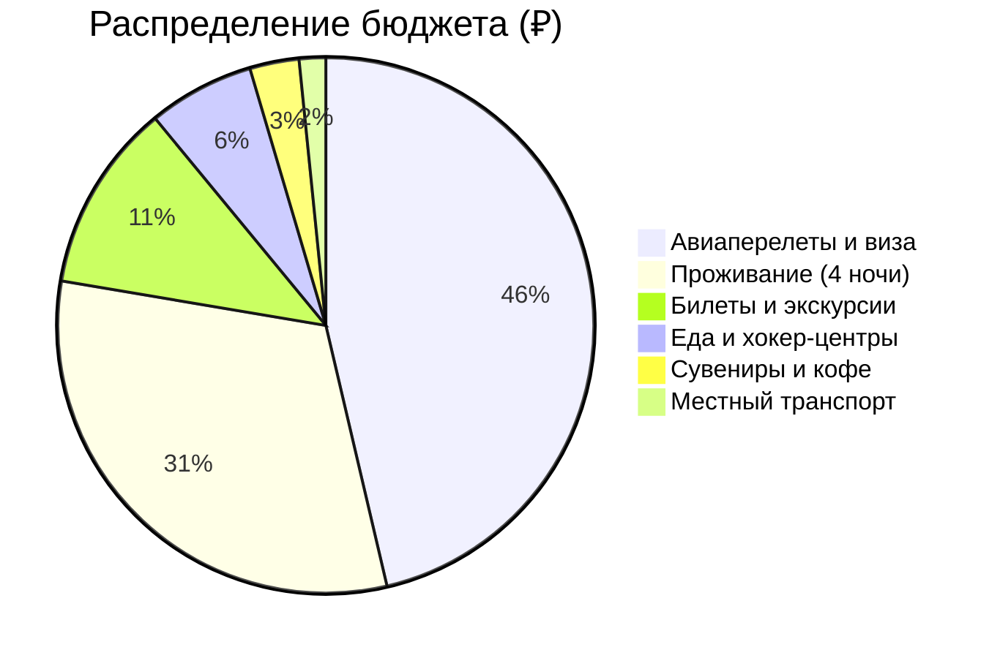
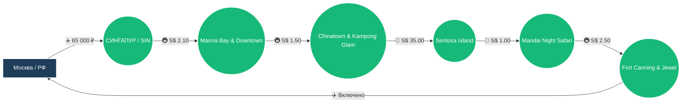

# 🗺️ Маршрут: РФ → Сингапур → РФ

> [!summary]+ 💰 Общий бюджет поездки: **153 230 ₽** (на 1 человека)
> - ✈️ **Авиаперелеты + Виза:** 71 000 ₽
> - 🏨 **Проживание (4 ночи):** 48 000 ₽
> - 🎟️ **Билеты и развлечения:** 17 430 ₽ (S$ 249)
> - 🍜 **Еда, напитки и хокеры:** 9 800 ₽ (S$ 140)
> - 🚇 **Местный транспорт:** 2 450 ₽ (S$ 35)
> - 🛍️ **Сувениры и подарки:** 4 550 ₽ (S$ 65)

---

### 📍 Визуальная схема логистики

---

### 📋 Детализация расходов

> [!info]- ✈️ Логистика и визовые формальности (73 450 ₽)
> *Нажмите, чтобы развернуть детали. Включает международный перелет, электронную визу и городской транспорт.*
> 
> | Статья расходов | Валюта (SGD) | Стоимость (RUB) | Примечание |
> | :--- | :---: | ---: | :--- |
> | ✈️ **Международный авиаперелет** (туда-обратно) | — | `65 000 ₽` | Регулярные рейсы с комфортной пересадкой |
> | 🛂 **Электронная виза в Сингапур (e-Visa)** | `S$ 85` | `6 000 ₽` | Оформление онлайн через агентство за 3-5 дней |
> | 🚇 **Метро MRT (SimplyGo) + Автобусы (5 дней)** | `S$ 25` | `1 750 ₽` | Бесконтактная оплата картой по факту поездок |
> | 🚕 **Такси Grab (2-3 короткие поездки)** | `S$ 10` | `700 ₽` | Faber Peak, ночной трансфер |

> [!abstract]- 🏨 Проживание (48 000 ₽)
> *Нажмите, чтобы развернуть детали. Оценочная стоимость при размещении в комфортном отеле 4\* в центре (Bugis / Chinatown / Downtown).*
> 
> | Локация | Ночей | Стоимость (SGD) | Стоимость (RUB) |
> | :--- | :---: | :---: | ---: |
> | 🇸🇬 **Центральный Сингапур (Bugis / Downtown)** | 4 | `S$ 685` | `48 000 ₽` |
> *В среднем ~S$ 170 / ночь (~12 000 ₽).*

> [!todo]- 🎟️ Развлечения и входные билеты (17 430 ₽ / S$ 249)
> *Нажмите, чтобы развернуть детали. Включает все платные объекты из 5-дневной программы.*
> 
> | Достопримечательность | Стоимость (SGD) | Стоимость (RUB) | Описание |
> | :--- | :---: | ---: | :--- |
> | 🌿 **Gardens by the Bay** (Flower Dome + Cloud Forest) | `S$ 32.00` | `2 240 ₽` | Два климатических купола и водопад |
> | 🚢 **Singapore River Cruise** | `S$ 28.00` | `1 960 ₽` | 40-минутный ночной круиз на бамбоуте |
> | 🚡 **Singapore Cable Car** (Mount Faber Line) | `S$ 35.00` | `2 450 ₽` | Канатная дорога над заливом на Сентозу |
> | 🦈 **S.E.A. Aquarium Sentosa** | `S$ 44.00` | `3 080 ₽` | Крупнейший океанариум региона |
> | 🛷 **Skyline Luge Sentosa** (2 спуска + подъемник) | `S$ 30.00` | `2 100 ₽` | Скоростной гравитационный спуск |
> | 🏙️ **Marina Bay Sands SkyPark Observation Deck** | `S$ 32.00` | `2 240 ₽` | Панорамная крыша 56 этажа |
> | 🌺 **Национальный сад орхидей** (Botanic Gardens) | `S$ 15.00` | `1 050 ₽` | Коллекция 3000 видов орхидей |
> | 🐅 **Mandai Night Safari** (Вход + Трамвай) | `S$ 55.00` | `3 850 ₽` | Ночной заповедник со слотом 19:15 |
> | 💎 **Canopy Park Jewel Changi** | `S$ 8.00` | `560 ₽` | Подвесные мосты и сады на 5 уровне |

> [!quote]- 🍜 Повседневные расходы и гастро-шопинг (14 350 ₽ / S$ 205)
> *Нажмите, чтобы развернуть детали. Рассчитано на основе подробных ежедневных смет.*
> 
> | Статья расходов | Стоимость (SGD) | Стоимость (RUB) | Описание |
> | :--- | :---: | ---: | :--- |
> | 🍽️ **Питание в хокерах и ресторанах (5 дней)** | `S$ 140.00` | `9 800 ₽` | Хайнаньский куриный рис, сатэй, лакса, Song Fa, димсамы |
> | 🛍️ **Сувениры и деликатесы** | `S$ 65.00` | `4 550 ₽` | Торт пандан Bengawan Solo, чай TWG, кофе Bacha, Irvins |
