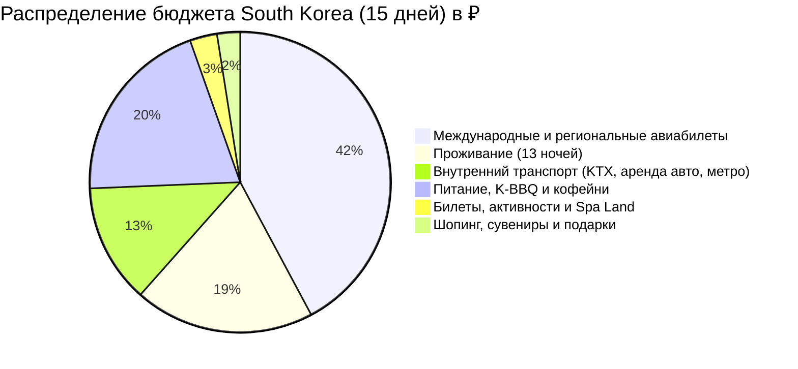

# 💰 Полный Бюджет: South Korea Grand Tour (15 дней / 13 ночей)

> [!summary]+ 💰 Общий бюджет поездки: **~201 500 ₽** (на 1 человека под ключ)
> - ✈️ **Международные и региональные авиабилеты:** `85 000 ₽`
> - 🏨 **Проживание (13 ночей в отелях Сеула, Пусана и Чеджу):** `39 000 ₽`
> - 🚄 **Внутренний транспорт (KTX, AREX, аренда авто на Чеджу, метро, паромы):** `25 800 ₽`
> - 🍜 **Питание, корейское барбекю, стритфуд и спешелти-кофе:** `40 800 ₽`
> - 🎟️ **Входные билеты, смотровые площадки и Spa Land:** `5 900 ₽`
> - 🎁 **Шопинг, сувениры, K-Beauty и чай Osulloc:** `5 000 ₽`

---

## 📋 Детализация расходов по категориям

### 1. ✈️ Авиабилеты и Логистика (~110 800 ₽)

| Статья расходов | KRW | RUB (курс 1 KRW ≈ 0.070 ₽) | Описание |
| :--- | :---: | :---: | :--- |
| Международный авиаперелет Москва ↔ Сеул Инчхон | — | `70 000 ₽` | Регулярный рейс с багажом 23 кг |
| Региональный авиаперелет Ульяновск ↔ Москва | — | `15 000 ₽` | Туда и обратно с багажом |
| Внутренний перелет Пусан (PUS) ➔ Чеджу (CJU) | `50 000 KRW` | `3 500 ₽` | Jeju Air / Air Busan (багаж 15 кг) |
| Внутренний перелет Чеджу (CJU) ➔ Сеул Инчхон (ICN) | `55 000 KRW` | `3 850 ₽` | Jeju Air / Jin Air |
| Аэроэкспресс AREX Non-Stop (Инчхон ➔ Сеул Station) | `11 000 KRW` | `770 ₽` | 43 минуты экспресс |
| Скоростной поезд KTX (Сеул ➔ Пусан) | `59 800 KRW` | `4 186 ₽` | 300 км/ч (2 ч 25 мин) |
| Скоростной поезд KTX (Пусан ➔ Кёнджу туда-обратно) | `22 000 KRW` | `1 540 ₽` | 2 поездки по 32 мин |
| Аренда автомобиля на острове Чеджу (2.5 суток, на 1 чел) | `70 000 KRW` | `4 900 ₽` | Компактный кроссовер + полная страховка |
| Бензин на Чеджу (доля на 1 чел) | `15 000 KRW` | `1 050 ₽` | Топливо на ~300 км пробега |
| Скай-Капсула Haeundae Blueline Park  | `17 500 KRW` | `1 225 ₽` | Монорельс над морем |
| Поезд Haeundae Beach Train | `7 000 KRW` | `490 ₽` | Прибрежный панорамный поезд |
| Канатная дорога Namsan Cable Car (спуск) | `12 000 KRW` | `840 ₽` | Спуск с горы Намсан |
| Карта T-money (метро и автобусы Сеула и Пусана) | `40 000 KRW` | `2 800 ₽` | Все поездки на общественном транспорте |
| Такси и резервный транспорт | `15 000 KRW` | `1 050 ₽` | Мелкие переезды |
| **Итого транспорт (с авиабилетами)** | — | **`~110 800 ₽`** | |

---

### 2. 🏨 Проживание (13 ночей — ~39 000 ₽)

* **Средняя стоимость за ночь на 1 чел:** `~42 300 KRW` (`~2 960 ₽`), что идеально соответствует нормативу комфортного путешествия (3 000 – 4 000 ₽/ночь при двухместном размещении).
* **Разбивка по городам:**
  * 🏙️ **Сеул (Мёндон / Чонно — 5 ночей):** `~250 000 KRW` (`~17 500 ₽`) — отели *L7 Myeongdong*, *Nine Tree Premier Hotel*.
  * 🌊 **Пусан (Сомён / Хэундэ — 5 ночей):** `~210 000 KRW` (`~14 700 ₽`) — отели *Stanford Hotel Busan*, *Felix Hotel*.
  * 🌋 **Остров Чеджу (Сончхан / Согвипхо — 3 ночи):** `~100 000 KRW` (`~7 000 ₽`) — отели *Co-op City Hotel Seongsan*.
* **Итого за 13 ночей:** **`~560 000 KRW`** (**`~39 200 ₽`**).

---

### 3. 🍜 Питание, K-BBQ, Стритфуд и Кофейни (15 дней — ~40 800 ₽)

* **Спешелти-кофе и авторские десерты (15 дней):** `~105 000 KRW` (`~7 350 ₽`) — *Cafe Onion*, *Jeonpo Tool Cafe*, *Anthracite*, *Felt*.
* **Обеды в традиционных заведениях и мишленовских гидах:** `~200 000 KRW` (`~14 000 ₽`) — *Oreno Ramen*, *Dwaeji Gukbap*, *Ssam-bap* в Кёнджу, холодный суп с лапшой Мильмён.
* **Ужины: Корейское барбекю (Самгёпсаль), Чимаэк и Черная свинина Чеджу:** `~220 000 KRW` (`~15 400 ₽`).
* **Ночные рынки, стритфуд и комбини (GS25/CU):** `~58 000 KRW` (`~4 050 ₽`) — токпокки, одэн, хотток, пирожки омэги тток, чипсы и кофе.
* **Итого по питанию:** **`~583 000 KRW`** (**`~40 800 ₽`**).

---

### 4. 🎟️ Достопримечательности, Музеи и Spa Land (~5 900 ₽)

* **Комбо-билет на 4 королевских дворца Сеула (Токсугун, Кёнбоккун и др.):** `10 000 KRW` (`~700 ₽`).
* **Смотровая площадка N Seoul Tower:** `21 000 KRW` (`~1 470 ₽`).
* **Башня Пусана (Busan Tower) и парк Ёндусан:** `12 000 KRW` (`~840 ₽`).
* **Шедевры ЮНЕСКО в Кёнджу (храм Пульгукса + грот Соккурам + курганы Дэрынгвон):** `16 000 KRW` (`~1 120 ₽`).
* **Термальный спа-комплекс Spa Land Centum City (4 часа):** `20 000 KRW` (`~1 400 ₽`).
* **Природные объекты ЮНЕСКО Чеджу (кратер Сончхан + пещера Манджангуль + скалы Чусандволли):** `5 000 KRW` (`~370 ₽`).
* **Итого по билетам и активностям:** **`~84 000 KRW`** (**`~5 900 ₽`**).

---

### 5. 🎁 Шопинг, Сувениры и K-Beauty (~5 000 ₽)

* **Оригинальный зеленый чай и десерты Osulloc Tea Museum:** `25 000 KRW` (`~1 750 ₽`).
* **Корейская косметика и уход K-Beauty (Olive Young):** `30 000 KRW` (`~2 100 ₽`).
* **Аутентичные сувениры (бумага ханчи, открытки, фотобудки Life4Cuts):** `16 500 KRW` (`~1 150 ₽`).
* **Итого по шопингу и сувенирам:** **`~71 500 KRW`** (**`~5 000 ₽`**).
