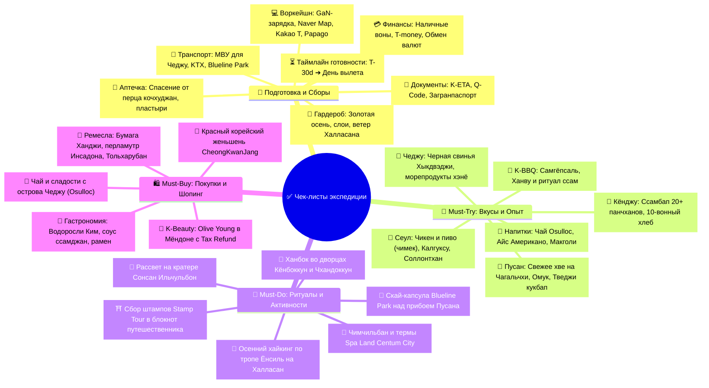

# ✅ 06 - Чек-листы: Подготовка, Сборы, Must-Try и Покупки

> [!TIP] Интерактивный навигатор экспедиции по Южной Корее
> Полный комплект контрольных списков для безупречной подготовки к путешествию по Южной Корее (Сеул ➔ Пусан ➔ Кёнджу ➔ Остров Чеджу): въездные формальности (K-ETA, Q-Code), упаковка багажа, цифровой воркейшн, медицинская безопасность, а также исчерпывающий каталог гастрономических экспериментов, аутентичного шопинга и попутных культурных ритуалов.

---

## 🧭 Навигация по разделу чек-листов

---

## 📂 Документы раздела

| Раздел | Документ | Ключевой фокус |
| :--- | :--- | :--- |
| 🧳 **Сборы и Подготовка** | **[[Чек-лист подготовки и сборов\|📋 Чек-лист подготовки и сборов]]** | Документы, въезд (K-ETA, Q-Code), финансы (KRW, T-money, обменники Мёндона), матрица бронирований для иностранца (KTX, AREX, аренда авто на Чеджу с МВУ 1949 г., Blueline Park), IT-воркейшн набор, локальный софт (Naver Map, Papago, Kakao T), аптечка, гардероб для золотой осени (+18°C в городах / +3°C на Халласане), предполетный таймлайн |
| 🍜 **Опыт и Покупки** | **[[Что попробовать и купить (Must-Try & Must-Buy)\|🎯 Что попробовать и купить (Must-Try & Must-Buy)]]** | 45+ блюд стритфуда и региональной кухни (Сеул, Пусан, Кёнджу, Чеджу), корейский этикет трапезы и ритуал «ссам», топ-активности (ханбок во дворцах, чимчильбан Spa Land, Скай-капсула, рассвет Ильчульбон), шопинг-лист K-Beauty в Olive Young, женьшень, чай Osulloc и аутентичные сувениры |

---

## ⚡ Экспресс-трекер ключевой готовности

### 🚨 Критические шаги перед вылетом (Не забыть!)
- [ ] **Электронное разрешение K-ETA:** Оформлено заранее на официальном портале `k-eta.go.kr` или в приложении K-ETA (минимум за 72 часа до вылета, сбор `10 000 KRW` оплачен зарубежной картой), результат в PDF распечатан в 2 экземплярах.
- [ ] **Загранпаспорт:** Срок действия строго более 6 месяцев на момент предполагаемого выезда из Южной Кореи; проверен на целостность страниц и ламинации.
- [ ] **Карантинная анкета Q-Code:** Заполнена онлайн на [qcode.kdca.go.kr](https://qcode.kdca.go.kr/) за 1–3 дня до вылета; сгенерированный персональный QR-код сохранен в галерее смартфона.
- [ ] **Строжайший запрет на мясную продукцию (АЧС):** В багаже и ручной клади **НЕТ НИКАКИХ мясных продуктов** (колбасы, сосисок, бутербродов, паштетов, сала, сублиматов с мясом) — штраф на таможне Южной Кореи составляет **до 5 000 000 – 10 000 000 KRW** (`~350 000 – 700 000 ₽`) с риском депортации и запрета на въезд!
- [ ] **Запрет наркосодержащих лекарств (Narcotics Control Act):** Проверено отсутствие препаратов с кодеином, псевдоэфедрином, сильнодействующих седативных и обезболивающих средств без официального разрешения корейского регулятора MFDS.
- [ ] **Международное водительское удостоверение (МВУ 1949 г.):** Для аренды автомобиля на острове Чеджу обязательно подготовлено МВУ (бумажная книжечка) по Женевской конвенции 1949 года совместно с национальными правами РФ. Без МВУ машину в прокате (Lotte, SK) не выдадут.
- [ ] **Навигация и софт:** Установлены и протестированы корейские сервисы: **Naver Map** и **KakaoMap** (Google Maps в Корее не строит пешие маршруты), переводчик **Papago** (лучше Google Translate распознает корейские вывески и меню через камеру), **Kakao T** для вызова такси.
- [ ] **Связь и e-SIM:** Оформлен и установлен профиль e-SIM (LG U+, SK Telecom, KT через Airalo / Nomad / Klook) для безлимитного интернета в сетях 5G.
- [ ] **VPN для РФ-сервисов:** Установлены независимые VPN-клиенты для доступа к российским банковским приложениям и Госуслугам из-за рубежа.
- [ ] **Наличная валюта:** Подготовлены чистые наличные купюры 100 USD / EUR нового образца без пометок для обмена на воны (KRW) по лучшему курсу в обменниках Мёндона у посольства Китая.
- [ ] **Транспортная карта T-money:** Запланирована покупка карты T-money в первом же комбини (CU, GS25, 7-Eleven) в аэропорту Инчхон с пополнением наличными вонами на `30 000 – 50 000 KRW`.
- [ ] **Блокнот для штампов:** Приготовлен чистый блокнот для сбора бесплатных авторских печатей путешественника (*Stamp Tour*) на станциях метро, вокзалах, во дворцах и на тропах острова Чеджу.
