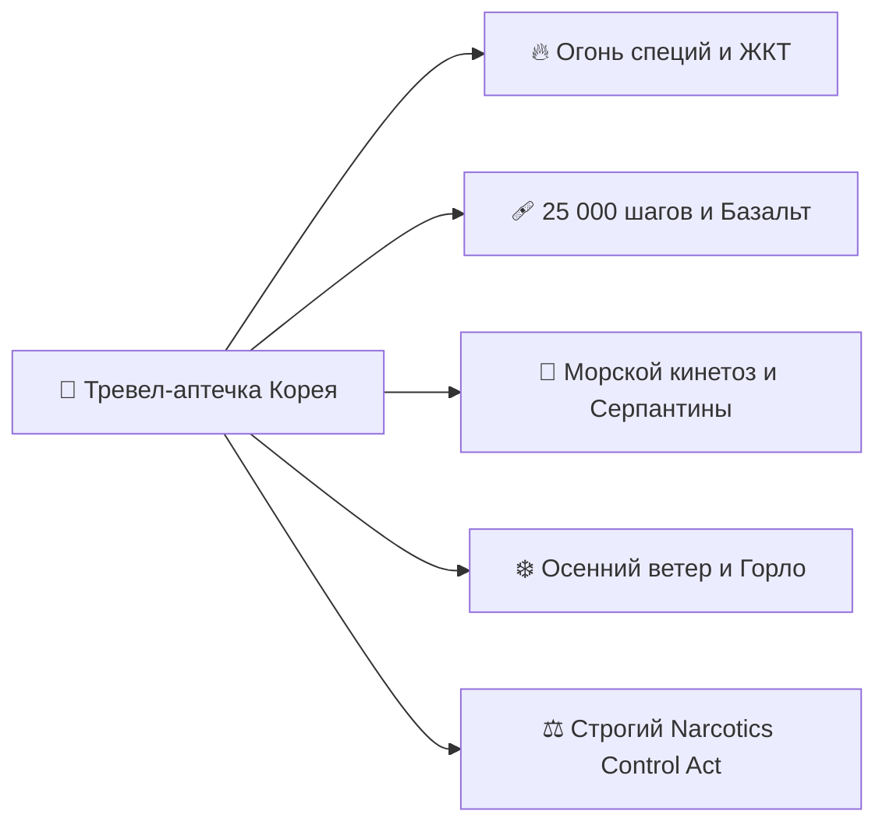
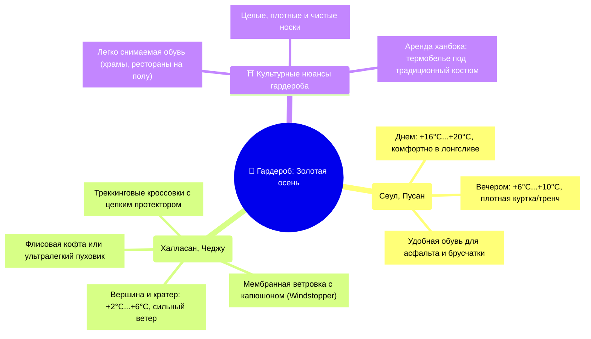
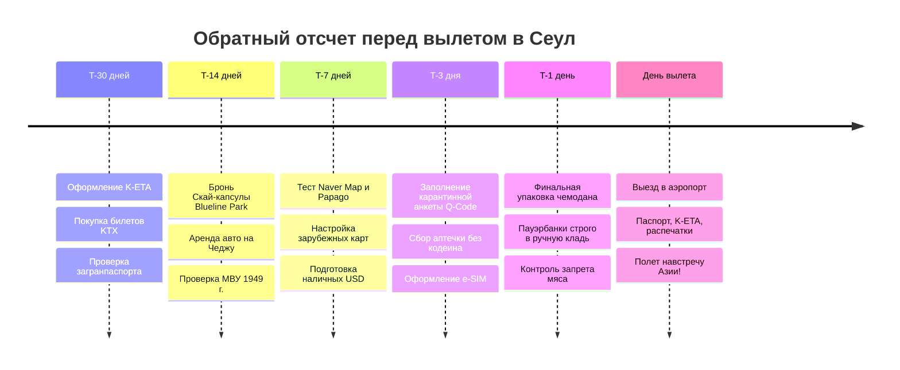

# 📋 Чек-лист подготовки и сборов

> [!INFO] Практическое руководство по экипировке, въезду и таймлайну
> Комплексный чек-лист сборов для 15-дневной экспедиции по Южной Корее (Сеул ➔ Пусан ➔ Кёнджу ➔ Чеджу): въездные формальности (K-ETA, Q-Code), финансовая стратегия, матрица бронирований для иностранца, цифровой воркейшн-сетап, аптечка с учетом строгого корейского антинаркотического законодательства, слоистый гардероб для золотой осени и контрольный предполетный таймлайн.

---

## 🪪 1. Документы, Въезд и Финансы

### 📄 Документы и въездные процедуры
- [ ] **Электронное разрешение K-ETA:** Оформлено на официальном государственном портале [k-eta.go.kr](https://www.k-eta.go.kr) или через официальное мобильное приложение *K-ETA* минимум за **72 часа до вылета** (рекомендуется за 2–3 недели). Сбор `10 000 KRW` (+ комиссия) оплачен картой зарубежного банка. Полученное подтверждение распечатано в 2 экземплярах и сохранено в PDF на смартфоне.
- [ ] **Загранпаспорт:** Срок действия строго не менее 6 месяцев с момента предполагаемого выезда из Южной Кореи; наличие минимум 2–3 чистых страниц для въездных и транзитных штампов.
- [ ] **Карантинная анкета Q-Code:** Заполнена онлайн за 1–3 дня до вылета на государственном портале [qcode.kdca.go.kr](https://qcode.kdca.go.kr/). Персональный QR-код сохранен в фотогалерее смартфона для мгновенного прохождения санитарного контроля в аэропорту Инчхон (ICN).
- [ ] **Международные авиабилеты:** Маршрутные квитанции Ульяновск ➔ Москва ➔ Сеул (ICN) и обратно распечатаны на английском языке и сохранены офлайн.
- [ ] **Внутренние авиабилеты по Корее:** Квитанции рейсов Пусан (PUS) ➔ Чеджу (CJU) и Чеджу (CJU) ➔ Сеул Инчхон (ICN) сохранены в PDF с номерами бронирования авиакомпаний (Air Busan / Jeju Air / Asiana / Korean Air).
- [ ] **Ваучеры отелей (13 ночей):** Бронирования по всему маршруту (Сеул, Пусан, Чеджу) сохранены офлайн на английском языке с точными корейскими адресами и названиями на хангыле (для показа водителю такси и ввода в Naver Map).
- [ ] **Медицинская страховка (ВЗР):** Оформлен страховой полис с покрытием от $50 000, включающий активный отдых (треккинг в горах до 2000 м — вулкан Халласан, пешие маршруты) и медицинскую эвакуацию. Медицина в Южной Корее для иностранцев без страховки экстремально дорогая.
- [ ] **Международное водительское удостоверение (МВУ 1949 г.):** Для аренды автомобиля на острове Чеджу обязательно подготовлено бумажное МВУ в виде книжечки по **Женевской конвенции 1949 года** совместно с национальным ВУ РФ (стаж от 1 года, возраст водителя от 21 года). Без физической книжечки МВУ 1949 г. ни один сетевой автопрокат Кореи машину не выдаст!
- [ ] **Цифровой архив документов:** Сканы всех документов (паспорта, K-ETA, страховка, права, билеты, ваучеры) загружены в облачное хранилище и сохранены в локальную зашифрованную папку смартфона.

---

### 💳 Финансы и платежные средства

> [!IMPORTANT] Особенности платежей в Южной Корее
> * **Культ безналичных расчетов vs Уличные рынки:** Корея — одна из самых безналичных стран мира (95%+ оплат картами в магазинах, кафе, такси и отелях). Однако **уличные тележки со стритфудом (Почжангмачха) в Мёндоне, на рынках Кванчжан, Чагальчхи и Оллэ принимают ТОЛЬКО наличные воны (KRW)** либо внутренний перевод KakaoPay.
> * **Карты РФ:** Российские карты Visa, Mastercard и МИР в Южной Корее **не работают**. Карты UnionPay российских банков (не находящихся под блокирующими санкциями) принимаются нестабильно — в основном только для снятия наличных в банкоматах с пометкой **Global ATM**.
> * **Лучший способ:** Везти наличные доллары (USD нового образца от 2013 года, без штампов и надрывов) и менять их в Сеуле.

- [ ] **Наличная валюта (USD нового образца):** Подготовлены свежие купюры по $100 без повреждений для обмена в специализированных обменных пунктах Мёндона.
- [ ] **Обмен валюты в Сеуле:** Запомнена главная точка лучшего курса в Корее — **район Мёндон у Китайского посольства** (3 минуты от выхода 5/6 станции метро *Myeongdong*, вывеска *«Currency Exchange in front of the Embassy»*). Разница с курсом аэропорта может составлять до 3–5%.
- [ ] **Зарубежные банковские карты:** Карты зарубежных банков (Казахстан, Кыргызстан, Турция, ОАЭ, Беларусь) протестированы на трансграничные операции и снятие наличных вон в корейских банкоматах *KB Kookmin Bank*, *Shinhan Bank*, *Woori Bank* (выбирать опцию *Foreign Card / Global ATM*).
- [ ] **Транспортная карта T-money:** Покупка пластиковой карты T-money в первом же круглосуточном магазине комбини (CU, GS25, 7-Eleven) в аэропорту Инчхон (`₩4 000 – 5 000`) и первичное пополнение наличными вонами на `₩30 000 – 50 000` через кассу или билетный автомат.

---

### 🎫 Матрица бронирования для иностранцев (Онлайн vs На месте)

| Сегмент / Активность | Категория бронирования | Окно открытия | Где бронировать иностранцу | Способ оплаты | Что нужно для посадки / входа |
| :--- | :---: | :---: | :--- | :--- | :--- |
| ✈️ **Авиаперелеты РФ ⇌ Сеул** | 🔴 **Строго онлайн** | За 2–6 мес | [Trip.com](https://ru.trip.com) или авиакомпания | Карта РФ (Trip.com) / Зарубежная карта | Загранпаспорт + маршрутная квитанция |
| 🏨 **Отели (Сеул, Пусан, Чеджу)** | 🔴 **Строго онлайн** | За 1–3 мес | [Trip.com](https://ru.trip.com), Booking, Agoda | Карта РФ (Trip.com) / Зарубежная карта | Загранпаспорт + ваучер с корейским адресом |
| 🚄 **Скоростной поезд KTX (Сеул ➔ Пусан)** | 🔴 **Строго онлайн** | **За 30 дней** (07:00 KST) | Официальный сайт [letskorail.com](https://www.letskorail.com) или [Trip.com](https://ru.trip.com) | Зарубежная карта (на Korail) / Карта РФ (на Trip.com) | Распечатанный E-Ticket с номером вагона и места (контролеры сверяют места по планшету) |
| 🚆 **Экспресс AREX (Инчхон ➔ Сеул)** | 🟡 **Онлайн / Автомат** | За 1–7 дней | Сайт [AREX](https://www.arex.or.kr) или касса/автомат в аэропорту | Зарубежная карта / Карта РФ (через Klook) / Наличные | Посадочный QR-код с фиксированным местом (оранжевый экспресс) |
| ✈️ **Перелет Пусан ➔ Чеджу (PUS-CJU)** | 🔴 **Строго онлайн** | За 1–2 мес | [Trip.com](https://ru.trip.com) или сайт Air Busan / Jeju Air | Карта РФ (Trip.com) / Зарубежная карта | Загранпаспорт + мобильный посадочный |
| ✈️ **Перелет Чеджу ➔ Инчхон (CJU-ICN)** | 🔴 **Строго онлайн** | За 1–2 мес | [Trip.com](https://ru.trip.com) или сайт Jeju Air / Asiana | Карта РФ (Trip.com) / Зарубежная карта | Загранпаспорт + мобильный посадочный |
| 🚗 **Аренда авто на Чеджу** | 🔴 **Строго онлайн** | За 2–4 недели | [Lotte Rent-a-Car](https://www.lotterentacar.net) / [SK Rent-a-Car](https://www.skcarrental.com) / Klook | Зарубежная карта / Карта РФ (на Klook) | Загранпаспорт + национальные права РФ + **МВУ 1949 г.** |
| 🚡 **Скай-капсула Haeundae Blueline Park** | 🔴 **Строго онлайн** | **За 14–21 день** | Официальный сайт [bluelinepark.com](https://www.bluelinepark.com) | Зарубежная карта / Klook | Электронный QR-ваучер на конкретный 30-минутный тайм-слот |
| 🧖 **Термальный спа Spa Land Centum City** | 🟡 **Онлайн / Касса** | За 1–3 дня | На кассе в ТЦ Shinsegae Centum City или [Klook](https://www.klook.com) со скидкой | Карта / Наличные / Ваучер Klook | Браслет с чипом на 4 часа посещения |
| 🌄 **Вход на кратер Сонсан Ильчульбон** | 🟢 **Строго на месте** | В день визита | Билетная касса у подножия кратера | Наличные KRW / Карта (`₩5 000`) | Бумажный билет перед подъемом на смотровую лестницу |
| 🚇 **Метро и автобусы (Сеул, Пусан)** | 🟢 **Строго на месте** | В момент поездки | Турникеты на входе / валидаторы в автобусе | Карта **T-money** | Касание картой на входе и **обязательно на выходе** (для учета зонной тарификации) |
| 🗼 **Смотровая площадка N Seoul Tower** | 🟡 **Онлайн / Касса** | За 1–3 дня | Касса башни или ваучер [Klook](https://www.klook.com) | Карта / Наличные / Ваучер Klook | Электронный QR-билет для лифта на смотровую |

---

## 💻 2. Воркейшн, Электроника и Софт

### 🔌 Аппаратная часть (Hardware)
- [ ] **Рабочий ноутбук:** Аккумулятор протестирован на автономность от 4–5 часов (для работы в поездах KTX и спешелти-кофейнях), диск очищен, установлены критические обновления ОС.
- [ ] **Розетки и вилки в Южной Корее:** В Корее используются розетки **Тип C и Тип F (евровилка «Schuko», 220V, 60Hz)**. Стандартные российские и европейские вилки подходят **напрямую без адаптеров**! Компактный переходник нужен только в том случае, если у вас американские/китайские гаджеты с плоскими штырьками (Тип A/B).
- [ ] **GaN-зарядное устройство (65W / 100W):** Универсальный многопортовый блок питания (2x Type-C + 1x USB-A) для одновременной быстрой зарядки ноутбука, смартфона и пауэрбанка от одной розетки.
- [ ] **Внешний аккумулятор (PowerBank 10 000 – 20 000 мАч):** Емкость строго до 100 Вт·ч / 20 000 мАч.
  > [!CAUTION] Авиационное правило провоза пауэрбанков
  > Любые аккумуляторы и PowerBank разрешено провозить **СТРОГО В РУЧНОЙ КЛАДИ**. Сдача пауэрбанка в багаж категорически запрещена авиационными правилами и приведет к вскрытию чемодана службой авиабезопасности аэропорта!
- [ ] **Комплект надежных кабелей:**
  - [ ] 2x Type-C ➔ Type-C (с поддержкой Power Delivery 100W, один кабель длиной 2 м для удобной работы в отелях).
  - [ ] 1x Type-C ➔ Lightning / USB-C для смартфона.
  - [ ] Кабель для зарядки смарт-часов / фитнес-трекера.
- [ ] **Наушники:**
  - [ ] Полноразмерные беспроводные наушники с активным шумоподавлением (ANC) — спасение во время 8-часового перелета в Сеул и работы в шумных кафе.
  - [ ] Компактные TWS-наушники для прогулок по городу и хайкинга.
- [ ] **Периферия:** Компактная беспроводная мышь + легкая складная подставка для ноутбука.

---

### 📱 Цифровой софт и приложения (Software)

> [!WARNING] Google Maps в Корее НЕ РАБОТАЕТ полноценно!
> Из-за строгих законов Южной Кореи о картографических данных и национальной безопасности компания Google не имеет права хранить детальные геоданные Кореи на зарубежных серверах. В Google Maps **не работает пешеходная навигация** и часто искажается расписание транспорта. Использовать Google Maps как основной навигатор в Корее **нельзя**!

- [ ] **Главная навигация: Naver Map (네이버 지도):**
  - Абсолютный навигатор №1 в Южной Корее.
  - Есть качественный английский интерфейс, пошаговая пешеходная навигация, номера выходов из станций метро, точнейшее расписание автобусов с отслеживанием в реальном времени.
  - Заранее авторизоваться и сохранить ключевые отели и точки маршрута в избранное (*Favorites*).
- [ ] **Альтернативная карта: KakaoMap (카카오맵):**
  - Отличная резервная карта с панорамами улиц высокого разрешения и 3D-схемами крупных транспортных хабов.
- [ ] **Переводчик №1: Papago (папаго от Naver):**
  - Корейский национальный нейросетевой переводчик. Переводит связки «Корейский ➔ Русский» и «Корейский ➔ Английский» на порядок точнее и естественнее, чем Google Translate.
  - Обязательно протестировать функцию мгновенного перевода фото через камеру (незаменима для чтения традиционных меню и вывесок).
- [ ] **Такси: Kakao T (카카오 T):**
  - Главное корейское приложение для вызова такси (аналог Uber). Позволяет выбрать опцию *«General Taxi»* и оплату водителю в салоне наличными вонами или картой, что решает проблему привязки иностранных карт.
- [ ] **Связь и e-SIM:**
  - Установлено приложение оператора e-SIM (Airalo / Nomad / Klook / Мой Сейф) с тарифом для Южной Кореи на сетях ведущих корейских операторов **SK Telecom, KT или LG U+**.
  - Проверен доступ к сетям 5G/LTE с безлимитным трафиком.
- [ ] **Метро: Subway Korea:**
  - Интерактивная офлайн-схема метрополитена Сеула, Пусана, Тэгу и Кванджу с расчетом времени в пути, удобных пересадок и номеров вагонов.
- [ ] **Железные дороги: KorailTalk:**
  - Официальное приложение корейских железных дорог Korail (для проверки расписания поездов KTX и платформ).
- [ ] **VPN-сервисы:**
  - Установлены и настроены 2 независимых надежных VPN-приложения (необходимы для доступа к российским банковским приложениям Тинькофф/Сбер, Госуслугам и рабочим сервисам из корейских сетей).
- [ ] **Экстренные оповещения: Emergency Ready App:**
  - Официальное англоязычное приложение Министерства общественной безопасности Кореи (оповещения о землетрясениях, сильном ветре, тайфунах).

---

## 💊 3. Медицинская Безопасность и Аптечка

### 🚨 Строжайшее таможенное регулирование лекарств (Narcotics Control Act)

> [!CAUTION] Запрет наркосодержащих и сильнодействующих препаратов
> В Южной Корее действует один из самых суровых в мире законов о контроле над психотропными и наркотическими веществами. 
> * **Категорически запрещен ввоз:** любых препаратов, содержащих **кодеин** (часто входит в сиропы от кашля и комбинированные обезболивающие типа *Пенталгин, Солпадеин, Коделак*), **псевдоэфедрин**, **трамадол**, сильные снотворные группы бензодиазепинов без специального предварительного разрешения Министерства безопасности пищевых продуктов и медикаментов Кореи (MFDS).
> * **Штраф:** Нарушение квалифицируется как контрабанда наркотиков и влечет за собой уголовное преследование и депортацию.
> * **Правило:** Брать только простые безрецептурные медикаменты в оригинальных фабричных блистерах. Если жизненно необходимы рецептурные препараты — обязательно иметь нотариально заверенный перевод рецепта и справки от лечащего врача на английском языке с указанием международного непатентованного наименования (МНН).

---

### 📦 Реестр походной аптечки

#### 1. ЖКТ и адаптация к жгучей корейской кухне
Корейская кухня богата ферментированными блюдами, чесноком и жгучим красным перцем *кочхукару*. Даже неострые блюда (*сунхан мат*) могут содержать специи:
- [ ] **Антациды и защита желудка:** Маалокс / Гевискон / Фосфалюгель в стиках (экстренное снятие изжоги после огненного ттокпокки или рамена).
- [ ] **Блокаторы секреции:** Омепразол / Рабепразол (принимать утром при чувствительном желудке).
- [ ] **Ферменты:** Мезим / Панкреатин / Креон (помощь при обильных вечерних мясных сетах K-BBQ).
- [ ] **Энтеросорбенты:** Полисорб / Энтеросгель / Смекта в пакетиках.
- [ ] **Противодиарейные средства:** Лоперамид / Имодиум.
- [ ] **Средства регидратации:** Регидрон / Гидровит (на случай пищевого расстройства или обезвоживания).

#### 2. Защита ног и опорно-двигательного аппарата (20 000–25 000 шагов в день)
Маршрут изобилует холмами, каменными ступенями дворцов и нацпарков:
- [ ] **Гидроколлоидные пластыри:** Набор пластырей *Compeed* разного размера от влажных мозолей (наклеивать при первых признаках натирания).
- [ ] **Бактерицидный пластырь:** Рулонный тканевый и штучные пластыри.
- [ ] **Охлаждающая мазь / крем для ног:** Троксевазин / Венолайф или гель с арникой для снятия отеков и усталости икроножных мышц вечером.
- [ ] **Эластичный бинт:** 1 рулон (фиксация голеностопа при хайкинге на Халласане).

#### 3. Простуда, горло и акклиматизация
Осенний морской бриз в Пусане и на Чеджу в сочетании с кондиционерами в метро:
- [ ] **Жаропонижающие и обезболивающие (МНН):** Парацетамол (500 мг), Ибупрофен (400 мг).
- [ ] **Боль в горле:** Леденцы с антисептиком (Стрепсилс / Граммидин), спрей с бензидамином.
- [ ] **Сосудосуживающие капли / спрей в нос:** Ксилометазолин / Оксиметазолин.
- [ ] **Противоаллергические (антигистаминные):** Цетиризин / Лоратадин (на случай аллергии на экзотические морепродукты).

#### 4. Морской кинетоз и укачивание
- [ ] **Таблетки от укачивания:** Драмина / Авиамарин (необходимы для паромов на остров Удо у берегов Чеджу и при поездках на автобусах по горным серпантинам).

---

## 👕 4. Гардероб и Экипировка по Климатическим Зонам

### 🍂 Осенний температурный профиль (Конец октября)
* **Сеул и Кёнджу:** Днем сухо, кристально ясное небо, золотые гинкго и клены, комфортные `+15°C...+19°C`. Ночью температура опускается до `+5°C...+8°C` — чувствуется холодное дыхание севера.
* **Пусан:** Морской мягкий климат, днем `+18°C...+21°C`, но на открытых набережных Хэундэ и Кванган дует постоянный влажный бриз.
* **Остров Чеджу и вулкан Халласан:** Очень ветрено! Внизу у побережья около `+17°C...+20°C`, но на плато Витсеорым (1 700 м) и на кратере Сонсан Ильчульбон на рассвете температура составляет всего `+2°C...+6°C` с ледяными порывами океанского ветра.

---

### 🧥 Концепция трех слоев одежды

#### Слой 1: Базовый (влагоотвод и терморегуляция)
- [ ] 3–4 хлопковые или синтетические футболки.
- [ ] 2 лонгслива с длинным рукавом.
- [ ] 1 комплект тонкого термобелья (верх + низ) — незаменим для рассвета на Сонсан Ильчульбоне в 06:00 утра и хайкинга по тропе Ёнсиль на Халласане.
- [ ] 5–6 пар качественных треккинговых и хлопковых носков (без дырок!).

#### Слой 2: Утепляющий
- [ ] 1 плотное худи или толстовка из флиса.
- [ ] 1 ультралегкий компактный пуховик (складывающийся в мешочек) — идеальный утеплитель под мембрану, весит 200 грамм.

#### Слой 3: Ветро- и влагозащитный
- [ ] Мембранная куртка-ветровка с капюшоном (Gore-Tex или аналоги) с защитой от сильного ветра (Windstopper).
- [ ] 2 пары удобных брюк / джинсов свободного кроя.
- [ ] 1 пара спортивных или треккинговых брюк для хайкинга на Чеджу.

---

### 👟 Обувь
- [ ] **Основные городские кроссовки:** Максимально удобные, разношенные амортизирующие кроссовки для ежедневного километража (18–25 км в день по Сеулу и Пусану).
- [ ] **Треккинговые кроссовки:** С жесткой нескользящей подошвой с выраженным протектором (Vibram). Вулканический базальт Чеджу и каменные тропы Халласана после утреннего тумана могут быть скользкими.
- [ ] **Легко снимаемая обувь:** Обувь должна легко сниматься и надеваться без пятиминутного расшнуровывания.

> [!TIP] Обувной этикет в Корее
> В Южной Корее обувь снимается:
> 1. При входе в любой жилой дом или квартиру (разуваются в прихожей *хёнван* на каменном полу ниже уровня комнат).
> 2. В традиционных ресторанах с низкой посадкой на полу на циновках (*Ондоли*).
> 3. В залах буддийских храмов перед молитвенной зоной.
> 4. В традиционных чайных домах и чимчильбанах.
> Обязательно позаботьтесь о чистых, плотных и аккуратных носках каждый день!

---

## 🎒 5. Личное снаряжение и Полезные мелочи

- [ ] **Легкий городской рюкзак (15–20 л):** Для ежедневных прогулок (помещаются бутылка воды, пуховик, пауэрбанк, паспорт, блокнот).
- [ ] **Многоразовая бутылка для воды / легкий термос (0.5 л):** В Корее практически во всех отелях, на станциях и в кафе установлены бесплатные диспенсеры с питьевой холодной и горячей водой (*Purifier*).
- [ ] **Складная эко-сумка (шоппер):** В магазинах Кореи одноразовые пластиковые пакеты платные и законодательно ограничены. Шоппер спасет при покупках в Olive Young и комбини.
- [ ] **Блокнот для штампов (Stamp Tour):** Компактный блокнот из плотной бумаги без линовки для сбора авторских памятных печатей на станциях метро, в королевских дворцах, инфоцентрах и на маршрутах Jeju Olle Trail.
- [ ] **Солнцезащитные очки и SPF-крем:** Осеннее корейское солнце на вершинах гор и у моря очень активное.
- [ ] **Увлажняющий бальзам для губ и крем для рук:** Сухой осенний воздух Сеула быстро сушит кожу.
- [ ] **Влажные антисептические салфетки:** Компактная пачка для стритфуда на рынках.

---

## ⏳ 6. Контрольный таймлайн готовности (T-30d ➔ Вылет)

### 🗓️ T-30 дней (За месяц до старта)
- [ ] Проверить срок действия загранпаспорта (не менее 6 месяцев от даты вылета из Кореи).
- [ ] Подать заявление и получить разрешение **K-ETA** на официальном сайте `k-eta.go.kr`.
- [ ] При открытии окна продаж (ровно за 30 дней в 07:00 KST) купить билеты на скоростной поезд KTX Сеул ➔ Пусан на сайте Korail или Trip.com.
- [ ] Оформить МВУ международного образца 1949 года в ГИБДД / МФЦ для аренды авто на Чеджу.

### 🗓️ T-14 дней (За 2 недели)
- [ ] Забронировать 30-минутный тайм-слот на Скай-капсулу Haeundae Blueline Park (Мипо ➔ Чонгсапо) на сайте `bluelinepark.com`.
- [ ] Подтвердить бронирование аренды автомобиля в аэропорту Чеджу (CJU).
- [ ] Проверить все внутренние авиаперелеты (PUS ➔ CJU, CJU ➔ ICN).

### 🗓️ T-7 дней (За неделю)
- [ ] Установить и настроить корейские приложения на смартфон: **Naver Map**, **Papago**, **Kakao T**, **Subway Korea**.
- [ ] Сохранить в Naver Map все отели и ключевые локации поездки.
- [ ] Проверить работу зарубежных банковских карт и установить лимиты.
- [ ] Купить в банке чистые купюры по $100 нового образца.

### 🗓️ T-3 дня (За 72 часа)
- [ ] Заполнить электронную декларацию здоровья **Q-Code** на портале `qcode.kdca.go.kr` и сохранить персональный QR-код.
- [ ] Оформить и установить профиль e-SIM для Кореи.
- [ ] Проверить аптечку на отсутствие запрещенных корейской таможней препаратов (кодеин, псевдоэфедрин).

### 🗓️ T-1 день (Накануне вылета)
- [ ] Пройти онлайн-регистрацию на международный рейс в Сеул.
- [ ] Проверить чемодан: убедиться, что **в багаже нет никаких пауэрбанков** (переложить в рюкзак ручной клади).
- [ ] **Строгий контроль биозащиты:** убедиться, что в багаже и ручной клади **нет мясных продуктов, колбас и фруктов**.
- [ ] Зарядить все гаджеты, пауэрбанк и наушники на 100%.
- [ ] Положить оригиналы паспорта, распечатки K-ETA, билетов и страховки в удобный карман ручной клади.

### ✈️ День вылета (T-0)
- [ ] Прибыть в аэропорт за 3 часа до международного вылета.
- [ ] Пройти паспортный контроль и таможню.
- [ ] Добро пожаловать в Южную Корею — Страну Утренней Свежести! 🇰🇷
