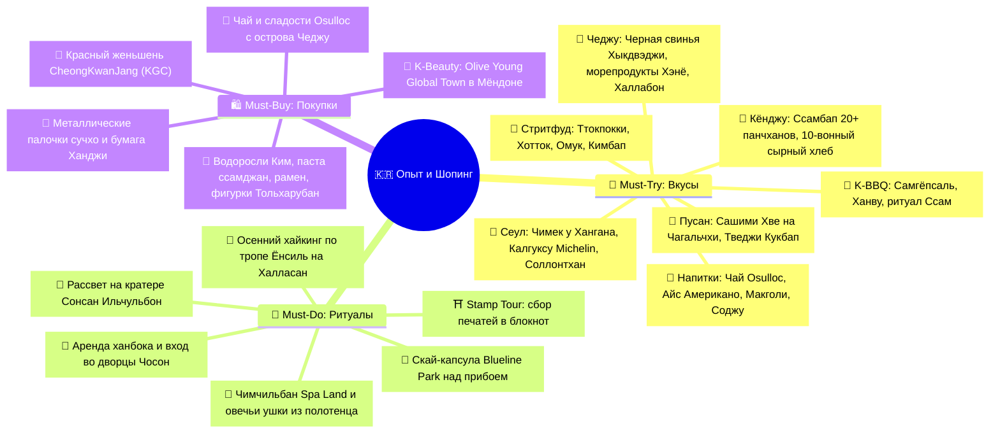
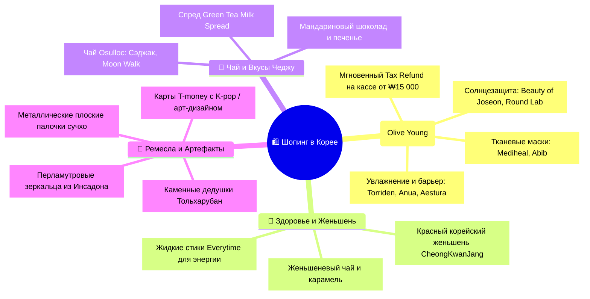

# 🎯 Что попробовать и купить (Must-Try & Must-Buy)

> [!INFO] Полный каталог гастрономии, впечатлений и аутентичного шопинга
> Интерактивный трекер всех вкусов, культовых культурных ритуалов и лучших приобретений в Южной Корее (Сеул, Пусан, Кёнджу, Остров Чеджу) с ориентировочными ценами в вонах и рублях, точными локациями и правилами корейского этикета.

---

## 🧭 Карта гастрономии, ритуалов и шопинга

---

## 🍜 I. Must-Try: Гастрономический гид (Что попробовать)

### 🏮 1. Легендарный стритфуд ночных рынков и переулков

- [ ] **Ттокпокки (Tteokbokki / 떡볶이) — Рисовые брусочки в огненном соусе:**
  - *Что это:* Упругие цилиндрические рисовые клецки *карэтток*, тушенные в густом сладко-остром соусе на основе пасты *кочхуджан* с рыбными пластинками омук, вареным яйцом и зеленым луком. Главный уличный символ Кореи.
  - *Где пробовать:* Ночной рынок Мёндон в Сеуле, рынок Кванчжан, палатки почжангмачха в Пусане (`~₩4 000–5 000 / ~280–350 ₽`).

- [ ] **Хотток (Hotteok / 호떡) — Золотистые блинчики с карамельной начинкой:**
  - *Что это:* Обжаренные на широкой масляной плите круглые дрожжевые лепешки. Внутри — расплавленный темный тростниковый сахар с корицей, дробленым арахисом и кунжутом. Обжигающе вкусно!
  - *Особая версия в Пусане:* **Ссиат Хотток (씨앗호떡)** на площади BIFF Square — после обжарки блинчик надрезают ножницами и засыпают горсть хрустящих семян подсолнечника и тыквы (`~₩2 000–3 000 / ~140–210 ₽`).

- [ ] **Омук / Одэнг (Eomuk / Odeng / 어묵) — Рыбные шпажки в горячем бульоне:**
  - *Что это:* Волнообразно нанизанные на длинные деревянные шпажки рыбные котлеты из фарша белой рыбы, сваренные в наваристом ароматном бульоне из анчоусов, водорослей дасима и редьки.
  - *Ритуал:* Берете шпажку прямо из кипящего котла тележки, макаете в соевый соус с луком, а бульон бесплатно наливаете половником в бумажный стаканчик и пьете горячим (`~₩1 000–1 500 / ~70–105 ₽` за шпажку).

- [ ] **Керан-ппан (Gyeran-ppang / 계란빵) — Теплый яичный хлеб:**
  - *Что это:* Порционный продолговатый кекс из сладковатого сливочного теста, поверх которого (или внутрь) запекается целое куриное яйцо с каплей соли и расплавленным сыром. Идеальный утренний перекус.
  - *Где пробовать:* Улицы Мёндона и студенческий район Хондэ (`~₩2 500–3 000 / ~175–210 ₽`).

- [ ] **Кимбап (Gimbap / 김밥) — Корейский ролл в морской капусте:**
  - *Что это:* Теплый рис, сдобренный кунжутным маслом и солью, завернутый в лист водоросли *ким* вместе с маринованным желтым редисом *танмуджи*, морковью, шпинатом, омлетом, говядиной или тунцом с майонезом. Нарезается кружочками на 10 частей.
  - *Где пробовать:* Сетевые кафе *Gimbap Cheonguk*, рынок Кванчжан («Маяк-кимбап» — наркотический кимбап с горчичным соусом; `~₩3 500–5 000 / ~245–350 ₽`).

- [ ] **Манду (Mandu / 만ду) — Королевские корейские пельмени:**
  - *Что это:* Большие тонко раскатанные пельмени на пару (*Чжинманду*) или поджаренные до хруста (*Кунманду*). Начинки: рубленая свинина с луком и тофу (*Коги манду*) или пикантные с кимчи (*Кимчи манду*).
  - *Где пробовать:* *Myeongdong Kyoja* в Сеуле, рынок Чагальчхи (`~₩7 000–12 000 / ~490–840 ₽` за сет из 10 шт).

- [ ] **Твигим (Twigim / 튀김) — Корейская хрустящая темпура:**
  - *Что это:* Кальмары, тигровые креветки, сладкий батат, фаршированные стеклянной лапшой перцы чили, обжаренные в легком воздушном кляре. Обычно макают прямо в соус от ттокпокки (`~₩4 000–6 000 / ~280–420 ₽`).

- [ ] **Танхулу (Tanghulu / 탕후루) — Ягоды в хрустальной карамели:**
  - *Что это:* Свежая отборная клубника, мандарины или виноград Шайн Мускат на шпажке, покрытые тончайшей стеклянной глазурью из застывшего сахара, звонко хрустящей на зубах (`~₩3 000–4 000 / ~210–280 ₽`).

---

### 🥩 2. Культовые столичные блюда и K-BBQ

> [!TIP] Сакральный корейский ритуал «Ссам» (Ssam / 쌈)
> В корейском барбекю мясо **никогда не едят голышом**! 
> 1. Возьмите на ладонь свежий лист салата или пряный лист кунжута/периллы (*ккэннип*).
> 2. Положите обжаренный на углях сочный кусочек свинины или говядины.
> 3. Обмакните мясо в соус **Ссамджан** (смесь соевой пасты твенджан и перца кочхуджан).
> 4. Добавьте печеный зубчик чеснока, маринованный редис и каплю кимчи.
> 5. Сверните лист в плотный конвертик и отправьте в рот **целиком в один укус**! В корейской культуре ритуал «ссам» символизирует заворачивание удачи и здоровья в свою судьбу.

- [ ] **Самгёпсаль (Samgyeopsal / 삼겹살) — Король корейского барбекю:**
  - *Что это:* Толстые сочные полосы свиной грудинки с тремя слоями мяса и сала, которые жарят на встроенной в стол газовой или угольной жаровне прямо перед вами, нарезая кулинарными ножницами на аппетитные брусочки.
  - *Где пробовать:* Традиционные BBQ-рестораны в районах Хондэ, Мёндон, Каннам (`~₩16 000–20 000 / ~1 120–1 400 ₽` за порцию 150-200 г).

- [ ] **Ханву (Hanwoo / 한우) — Элитная корейская мраморная говядина:**
  - *Что это:* Национальная гордость Кореи — автохтонная порода коров, чье мясо отличается высочайшей мраморностью, нежнейшей текстурой и насыщенным вкусом, превосходящим классический японский вагю.
  - *Где пробовать:* Район Мачжан (Majang Meat Market) в Сеуле, премиальные мясные рестораны Каннама (`~₩40 000–75 000 / ~2 800–5 250 ₽` за порцию).

- [ ] **Чимек (Chimaek / 치맥) — Культовая связка «Чикен + Пиво»:**
  - *Что это:* Знаменитая курица двойной обжарки с невероятно хрустящей корочкой, которая не размокает даже под густым соусом. Главные вкусы: медово-соевый (*Honey Soy*) и сладко-острый (*Yangnyeom*).
  - *Где пробовать:* Сети *BHC Chicken* (закажите хит *Bburinkle* с сырно-луковой пудрой), *Kyochon 1991* или вечерний заказ прямо на траву парка Ханган (`~₩22 000–28 000 / ~1 540–1 960 ₽` за целую курицу с пивом).

- [ ] **Калгуксу в Myeongdong Kyoja (명동교자):**
  - *Что это:* Легендарный ресторан, отмеченный гидом **Michelin Bib Gourmand с 2017 года**. Фирменная рукорезная лапша калгуксу в глубоком курином бульоне с нежным фаршем и пельменями манду. К ней подают самое чесночное кимчи в Сеуле!
  - *Где:* Мёндон, 29 Myeongdong 10-gil (`~₩11 000 / ~770 ₽` за порцию, добавка лапши и риса бесплатная).

- [ ] **Соллонтхан (Seolleongtang / 설렁탕) — Молочно-белый говяжий суп:**
  - *Что это:* Древний суп эпохи Чосон: говяжьи кости вывариваются на медленном огне более 12–16 часов до превращения бульона в шелковистую молочно-белую эмульсию. Подается несоленым с тонко нарезанной говядиной и лапшой сомен. Соль, зеленый лук и острый редис *кактуги* добавляются самостоятельно по вкусу.
  - *Где пробовать:* Исторический ресторан *Imun Seolnongtang* (старейший ресторан Сеула с 1904 г.) у Инсадона (`~₩13 000–16 000 / ~910–1 120 ₽`).

- [ ] **Даккальби (Dakgalbi / 닭갈비) — Острая курица на чугунной сковороде:**
  - *Что это:* Маринованное филе цыпленка, обжаренное на гигантской круглой сковороде с капустой, бататом, ттокпокки в соусе кочхуджан. В середину высыпают дорожку из расплавленного сыра моцарелла. В конце к остаткам соуса добавляют рис и водоросли, делая хрустящий жареный рис *поккымбап*.
  - *Где пробовать:* *Jangin Dakgalbi* в Мёндоне или Хондэ (`~₩14 000–18 000 / ~980–1 260 ₽`).

- [ ] **Нэнмён (Naengmyeon / 냉면) — Ледяная гречневая лапша:**
  - *Что это:* Тончайшая упругая гречневая лапша, подаваемая в ледяном кисло-сладком говяжьем бульоне с колотым льдом, ломтиками груши, огурца и вареным яйцом (*Муль-нэнмён*), либо в остром перечном соусе без бульона (*Пибим-нэнмён*).
  - *Где пробовать:* *Wooraeok* или *Eulji Myeonok* в Сеуле (`~₩14 000–16 000 / ~980–1 120 ₽`).

---

### 🌊 3. Морские сокровища Пусана

- [ ] **Модым Хве (Modeum Hoe / 모듬회) на рыбном рынке Чагальчхи:**
  - *Что это:* Ассорти свежайшего живого сашими: камбала, морской окунь, морской лещ, осьминог. Рыбу выбираете на 1-м этаже из аквариума, а на 2-м этаже вам накрывают стол с десятком закусок панчхан, листьями периллы и соусом чокочхуджан.
  - *Где пробовать:* Рыбный рынок *Jagalchi Market* или *Millak Raw Fish Center* у пляжа Кванган (`~₩40 000–60 000 / ~2 800–4 200 ₽` на двоих).

- [ ] **Саннакчи (Sannakji / 산낙지) — Живой осьминог с кунжутным маслом:**
  - *Что это:* Небольшого осьминога нарезают живым прямо перед подачей. Щупальца продолжают шевелиться на тарелке благодаря нервным окончаниям. Их макают в кунжутное масло с солью.
  - *Техника безопасности:* Тщательно пережевывайте каждый кусочек, чтобы присоски не прилипли к горлу (`~₩15 000–20 000 / ~1 050–1 400 ₽`).

- [ ] **Тведжи Кукбап (Dwaeji Gukbap / 돼지국밥) — Душа Пусана:**
  - *Что это:* Главное народное блюдо города, родившееся в годы Корейской войны: наваристый горячий свиной суп с нежнейшими кусочками мяса, в который опрокидывают чашу риса, добавляют ферментированные креветки *сэучот* для солености, острую пасту и зеленый лук.
  - *Где пробовать:* Улица Тведжи Кукбап у вокзала Пусана или в районе Сомён (`~₩8 500–10 000 / ~595–700 ₽`).

- [ ] **Чогэгуи (Jogae-gui / 조개구и) — Жареные ракушки с видом на мост Кванандэгё:**
  - *Что это:* Поднос живых моллюсков (гребешки, гигантские мидии, венерки), которые жарят на чугунной решетке прямо на столе с добавлением сливочного масла, сыра и лука.
  - *Где пробовать:* Рестораны вдоль пляжа Кванган (*Josaeho*) вечерней пятницей (`~₩50 000–70 000 / ~3 500–4 900 ₽` за сет).

- [ ] **Пусанский крафтовый Омук (Samjin Amook / 삼진어묵):**
  - *Что это:* Пусан считается корейской столицей рыбных пирогов. Старейшая фабрика *Samjin Amook* (с 1953 г.) производит омук в формате пекарни-бутика: рыбные крокеты с сыром, креветкой, сосиской, перцем чили.
  - *Где пробовать:* Флагманский магазин Samjin Amook на острове Йондо или на вокзале Busan Station (`~₩2 000–3 500 / ~140–245 ₽` за крокет).

---

### 🏛️ 4. Традиции Кёнджу

- [ ] **Кёнджуский Ссамбап (Ssambap / 쌈밥) — Королевская трапеза у курганов:**
  - *Что это:* Традиционный банкетный стол древней столицы Силла: тушеная свинина или говядина бульгоги, вокруг которой расставляют **более 20 видов гарниров-панчханов** и корзину из десятка сортов свежих и бланшированных листьев (капуста, тыквенный лист, салат, цикорий, перилла).
  - *Где пробовать:* Улица ресторанов Ссамбап у парка гробниц Тэрынвон (`~₩15 000–22 000 / ~1 050–1 540 ₽`).

- [ ] **Кёнджу 10-вонный хлеб (Shibwon-ppang / 십원빵):**
  - *Что это:* Горячая вафля в форме огромной монеты номиналом 10 вон (на которой изображена знаменитая пагода Дабхатхап храма Пульгукса). Внутри — гигантский кусок тянущегося сыра моцарелла.
  - *Где пробовать:* Хипстерская улица Хваннидан-гиль в Кёнджу (`~₩3 000–3 500 / ~210–245 ₽`).

- [ ] **Хваннам-ппан / Кёнджу-ппан (Hwangnam-ppang / 황남빵):**
  - *Что это:* Историческая выпечка Кёнджу с 1939 года: тончайшая оболочка из пшеничного теста с хризантемовым штампом, до краев наполненная плотной, не приторной начинкой из пасты сладкой красной фасоли адзуки.
  - *Где купить:* Фирменная пекарня *Hwangnam-ppang* в Кёнджу (`~₩12 000 / ~840 ₽` за коробку из 10 шт).

---

### 🌋 5. Вулканические дары острова Чеджу

- [ ] **Черная свинья Чеджу (Heukdwaeji / 흑돼지):**
  - *Что это:* Мясо автохтонной черной свиньи, выращенной на базальтовых предгорьях вулкана Халласан. Отличается невероятной сочностью, плотной текстурой и ореховыми нотками во вкусе.
  - *Секретный соус:* Жареное мясо макают в кипящий прямо на углях соус **Мельчот (Meljeot)** — соленый пряный соус из ферментированных анчоусов с чесноком и перцем.
  - *Где пробовать:* Улица черной свинины *Black Pork Street* в Чеджу-си или рестораны Согвипхо (`~₩22 000–26 000 / ~1 540–1 820 ₽` за порцию 200 г).

- [ ] **Свежие морские сокровища от ныряльщиц Хэнё (Haenyeo):**
  - *Что это:* Морские ежи (*Сонгэ*), драгоценные морские ушки (*Абалоны / Чонбок*), морские огурцы и осьминоги, добытые бабушками-фридайверами без акваланга со дна океана.
  - *Где пробовать:* Хижины хэнё у подножия кратера Сонсан Ильчульбон сразу после демонстрационного шоу в 13:30 (`~₩10 000–20 000 / ~700–1 400 ₽` за порцию, только наличные воны).

- [ ] **Чонбокчук (Jeonbokjuk / 전복죽) — Каша с морскими ушками:**
  - *Что это:* Знаменитая зеленоватая рисовая каша, приготовленная с мясом абалона и его внутренностями, обжаренными в кунжутном масле. Обладает глубоким вкусом океана и считается главным целебным блюдом острова.
  - *Где пробовать:* Рестораны традиционной кухни на Чеджу (`~₩12 000–15 000 / ~840–1 050 ₽`).

- [ ] **Мандарины Халлабон (Hallabong / 한라봉) и цитрусовые десерты:**
  - *Что это:* Сладчайший бескосточковый гибрид мандарина и апельсина с характерной вершиной-холмиком, напоминающей вулкан Халласан. В октябре — пик сезона сбора.
  - *Что пробовать:* Свежие плоды с фермерских лотков вдоль дорог, свежевыжатый сок Халлабон в бутылочках в форме каменного дедушки, а также мягкое мандариновое мороженое (`~₩4 000–5 000 / ~280–350 ₽`).

---

### 🍵 6. Чай, Спешелти-кофе и Напитки

- [ ] **Айс Американо («А-А» / Ah-Ah / 아아):**
  - *Что это:* Национальный корейский феномен. Существует поговорка: *«Даже если я замерзну насмерть — все равно выпью Айс Американо»*. Корейцы пьют крепкий черный эспрессо с кубиками льда через трубочку в любую погоду круглый год.
  - *Где пробовать:* Сети *Mega Coffee*, *Compose Coffee*, *Paik's Coffee* (`~₩1 500–2 500 / ~105–175 ₽`) или спешелти-ростерии в районе Сонсу-дон.

- [ ] **Матча и десерты Osulloc (О'соллок):**
  - *Что это:* Премиальный зеленый чай с экологически чистых плантаций у подножия вулкана Халласан на острове Чеджу.
  - *Что заказать:* Фирменный зеленый чай-роллкейк с сырным кремом (*Green Tea Roll Cake*), насыщенный холодный латте *O Fredo* с шариком чайного мороженого (`~₩7 500–9 000 / ~525–630 ₽`).

- [ ] **Традиционный корейский чай в ханоках Инсадона:**
  - *Что заказать:*
    - **Омиджа-чха (Omija-cha / 오미자차):** Чай из ягод лимонника пяти вкусов (сладкий, кислый, соленый, горький и пряный).
    - **Юджа-чха (Yuja-cha / 유자차):** Согревающий цитрусовый чай с юдзу и медом.
    - **Инсам-чха (Insam-cha / 인삼차):** Тонизирующий чай с корейским женьшенем и кедровыми орешками.
  - *Где пробовать:* Традиционные деревянные чайные дома Инсадона (например, *Shin Old Tea House*; `~₩7 000–9 000 / ~490–630 ₽`).

- [ ] **Макголи (Makgeolli / 막걸리) — Рисовое вино с блинчиками Паджон:**
  - *Что это:* Традиционный слабоалкогольный (5–7%) напиток цвета слоновой кости, получаемый путем сбраживания риса с дрожжами. Слегка газированный, кисло-сладкий и освежающий. Подается в золотистых алюминиевых чашах в паре с луковым блинчиком с морепродуктами *Хэмуль Паджон* (`~₩4 000–6 000 / ~280–420 ₽` за бутылку).

- [ ] **Банановое молоко Binggrae (바나나맛 우유):**
  - *Что это:* Легендарный напиток в пузатой пластиковой бутылочке, выпускаемый с 1974 года. Вкус детства любого корейца. Обязательно выпить после посещения сауны чимчильбан (`~₩1 700 / ~120 ₽` в любом комбини).

---

## 🎯 II. Must-Do: Попутные культурные ритуалы и активности

- [ ] **Аренда ханбока и прогулка по дворцам Кёнбоккун и Чхандоккун:**
  - *Суть ритуала:* Взять напрокат традиционный шелковый корейский костюм *Ханбок* (для мужчин — халат *турумаги* и шляпа *кат*, для женщин — пышная юбка *чхима* и жакет *чогори*).
  - *Лайфхак:* **Вход во все пять королевских дворцов Сеула в ханбоке — АБСОЛЮТНО БЕСПЛАТНЫЙ!**
  - *Где:* Десятки прокатов вокруг выхода 2 станции метро *Gyeongbokgung* (`~₩15 000–25 000 / ~1 050–1 750 ₽` за 2–4 часа).

- [ ] **Королевский релакс в спа Spa Land Centum City в Пусане:**
  - *Суть ритуала:* 4 часа в крупнейшем и роскошнейшем термальном спа-комплексе Азии (ТЦ Shinsegae Centum City). 18 природных гидромассажных ванн с минеральной водой с глубины 1000 метров, 13 тематических саун (римская, финская, соляная, ледяная, пирамида из желтой глины).
  - *Фирменный ритуал:* Свернуть полотенце в шапочку «овечьи ушки» (*Янмори*), купить запеченные на вулканических камнях коричневые яйца *Макбансок* и сладкий рисовый напиток *Сикхе* (`~₩20 000–23 000 / ~1 400–1 610 ₽`).

- [ ] **Полет над океаном на Скай-капсуле Haeundae Blueline Park:**
  - *Суть ритуала:* Прокатиться в разноцветной двухместной ретро-капсуле на высоте 10 метров над скалами и прибоем по маршруту Мипо ➔ Чонгсапо вдоль побережья Пусана. Лучшее время — за час до заката, когда солнце золотит волны (`~₩35 000 / ~2 450 ₽` за капсулу на двоих).

- [ ] **Встреча рассвета на короне кратера Сонсан Ильчульбон на Чеджу:**
  - *Суть ритуала:* Подняться по деревянным ступеням в утренней темноте на вершину 179-метрового потухшего кратера в 06:15 утра, чтобы увидеть, как золотой диск солнца поднимается из вод Тихого океана над 99 базальтовыми зубцами чаши (ЮНЕСКО).

- [ ] **Осенний хайкинг по тропе Ёнсиль на вулкан Халласан:**
  - *Суть ритуала:* Пройти по лучшей осенней эко-тропе Кореи среди багряных кленов к скалам 500 застывших монахов (*Обаэксеонин*) и плато Витсеорым (1 700 м) под бескрайним синим небом Чеджу.

- [ ] **Сбор штампов Stamp Tour в личный блокнот:**
  - *Суть ритуала:* На каждой станции метро, вокзалах KTX, в дворцах, инфоцентрах и на деревянных стойках тропы *Jeju Olle Trail* установлены уникальные авторские штемпели с изображением местных достопримечательностей. Коллекция штампов в блокноте — лучший бесплатный сувенир из Кореи.

- [ ] **Повесить замок любви на N Seoul Tower на горе Намсан:**
  - *Суть ритуала:* Подняться на закате к подножию телебашни N Seoul Tower, пристегнуть свой замочек с именами на террасе замков любви и полюбоваться океаном огней вечернего 10-миллионного Сеула.

---

## 🛍️ III. Must-Buy: Шопинг, Косметика и Сувениры

### 💄 1. K-Beauty и Уходовая косметика (OLIVE YOUNG)

> [!TIP] Шопинг в Olive Young и мгновенный Tax Refund
> Главный филиал сети — **OLIVE YOUNG Myeongdong Global** (Сеул, Мёндон). 
> * При покупке на сумму **от ₩15 000** (при предъявлении загранпаспорта) налог VAT (до 7–8%) **вычитается мгновенно прямо на кассе**! Вам не нужно стоять в очередях в аэропорту.
> * Обращайте внимание на пометки **«1+1»** (вторая упаковка бесплатно) и наборы **«Special Set»** (полноразмерное средство + миниатюры в подарок).

- [ ] **Культовые солнцезащитные кремы (SPF 50+ PA++++):**
  - **Beauty of Joseon Relief Sun (Rice + Probiotics):** Легчайший крем на экстракте риса и пробиотиках, не белит, впитывается как легкий лосьон (`~₩13 000–18 000 / ~910–1 260 ₽`).
  - **Round Lab Birch Juice Moisturizing Sunscreen:** Солнцезащитный крем на березовом соке, №1 в Корее по продажам.
- [ ] **Сыворотки и успокаивающий уход:**
  - **Torriden Dive-In Low Molecular Hyaluronic Acid Serum:** Сыворотка с низкомолекулярной гиалуроновой кислотой — экстремальное глубокое увлажнение без липкости.
  - **Anua Heartleaf 77% Soothing Toner:** Тонер на 77% экстракте хауттюйнии сердцевидной — абсолютный хит против воспалений и покраснений.
  - **Skin1004 Madagascar Centella Ampoule:** 100% чистая центелла азиатская для восстановления кожного барьера.
- [ ] **Восстановление барьера кожи:**
  - **Aestura Atobarrier 365 Cream:** Легендарный дерматологический крем с церамидными капсулами для сухой и чувствительной кожи.
- [ ] **Тканевые маски пачками (Sheet Masks):**
  - Наборы масок *Mediheal* (чайное дерево, плацента, коллаген) и *Abib Gummy Sheet Mask* (`~₩10 000–20 000 / ~700–1 400 ₽` за коробку из 10 шт).

---

### 🌿 2. Корейский красный женьшень (CheongKwanJang / 正官庄)

Корейский шестилетний красный женьшень — эталон мировой фитотерапии и главный подарок здоровья:
- [ ] **Жидкий экстракт в стиках (CheongKwanJang Korean Red Ginseng Extract Everytime):**
  - Самая удобная форма: порционные стики с чистым концентрированным экстрактом 6-летнего женьшеня. Мощнейший адаптоген, снимает усталость, повышает выносливость и иммунитет (`~₩80 000–120 000 / ~5 600–8 400 ₽` за коробку 30 стиков).
- [ ] **Женьшеневый чай в гранулах (Ginseng Tea):**
  - Доступный и приятный вариант для заваривания дома в золотистых пакетиках (`~₩12 000–20 000 / ~840–1 400 ₽`).
- [ ] **Где покупать:** Фирменные бутики *CheongKwanJang (KGC)* в Мёндоне, в универмагах *Lotte / Shinsegae* или в Duty Free аэропорта Инчхон.

---

### 🍵 3. Чайные сокровища и Сладости Чеджу

- [ ] **Чай Osulloc в подарочных тубусах:**
  - **Sejak (Сэджак):** Традиционный зеленый чай раннего весеннего сбора на Чеджу.
  - **Moon Walk (Лунная походка):** Фирменный купаж зеленого чая с нотками груши и медовым ароматом.
  - **Red Papaya Black Tea:** Черный чай с кусочками папайи и ароматом тропиков (`~₩15 000–25 000 / ~1 050–1 750 ₽` за упаковку).
- [ ] **Спред Osulloc Green Tea Milk Spread:**
  - Густая паста из зеленого чая матча и молока (корейский аналог Нутеллы для тостов и круассанов; `~₩9 500 / ~665 ₽`).
- [ ] **Мандариновые десерты Чеджу:**
  - Тонкие хрустящие шоколадки с начинкой из мандаринов Халлабон, мандариновые вафли и пирожные в красивых подарочных коробках (`~₩10 000–15 000 / ~700–1 050 ₽`).

---

### 🥢 4. Гастрономические сувениры

- [ ] **Морские водоросли Ким (Gim / 김):**
  - Пластинки сушеных хрустящих водорослей, обжаренные в ароматном кунжутном масле с морской солью. Продаются мультипаками по 16–20 упаковок (`~₩5 000–8 000 / ~350–560 ₽`).
- [ ] **Корейские ферментированные соусы в коробочках:**
  - **Ссамджан (Ssamjang):** Зеленая коробочка — орехово-чесночный соус для барбекю и заворачивания в салатные листья.
  - **Кочхуджан (Gochujang):** Красная коробочка — острая перцовая паста для ттокпокки и супов (`~₩3 000–5 000 / ~210–350 ₽` в супермаркетах Lotte Mart).
- [ ] **Премиальный корейский рамен:**
  - Несколько пачек для дома: *Shin Ramyun Black* (с наваристым костным бульоном селлонтан), *Chapagetti* (лапша в соусе из черных бобов чжачжан), *Neoguri* (лапша с морепродуктами).

---

### 🏺 5. Традиционные ремесла и Памятные артефакты

- [ ] **Корейский металлический набор палочек и ложки (Сучхо / Sujeo):**
  - В отличие от Китая и Японии, в Корее палочки делают из **плоской нержавеющей стали**, а супы и рис едят исключительно глубокой круглой ложкой на длинной ручке. В Инсадоне продаются роскошные подарочные наборы с гравировкой птиц и лотосов (`~₩10 000–25 000 / ~700–1 750 ₽`).
- [ ] **Шкатулки и зеркальца из перламутра (Наджончхильги / 나전칠기):**
  - Древнее ремесло инкрустации морского перламутра по черному лаку. Компактное карманное перламутровое зеркальце — изящнейший подарок (`~₩12 000–30 000 / ~840–2 100 ₽`).
- [ ] **Базальтовый Тольхарубан с острова Чеджу:**
  - Миниатюрная статуэтка «Каменного дедушки» из пористого вулканического туфа Чеджу — древний оберег дома, дарующий защиту и благополучие (`~₩5 000–15 000 / ~350–1 050 ₽`).
- [ ] **Дизайнерские транспортные карты T-money:**
  - Лимитированные карты с героями *Kakao Friends (Ryan, Apeach)*, персонажами LINE, культовыми K-pop группами или традиционными корейскими пейзажами (`~₩4 000–6 000 / ~280–420 ₽` в магазинах комбини).
