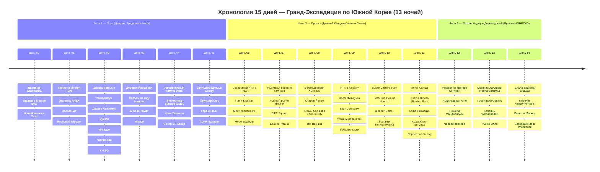

# 🇰🇷 Южная Корея — 15 Дней Гранд-Экспедиции: Сеул, Пусан, Кёнджу и Остров Чеджу

> **Концепция путешествия:** 15-дневная грандиозная экспедиция по главной культурной, исторической и природной оси Южной Кореи:
> 1. 🏙️ **Фаза 1 (Дни 00–05 — 6 дней / 5 ночей):** **СЕУЛ — ДИНАСТИЯ ЧОСОН И НЕОНОВЫЙ АВАНГАРД.** Королевские дворцы Кёнбоккун и Токсугун, площадь Кванхвамун, аристократическая деревня Букчон, чайный Инсадон, ручей Чхонгечхон, панорама N Seoul Tower над горой Намсан, международный Итэвон, архитектурный каньон университета Ихва, библиотека Starfield в Каннаме, буддийский храм Понынса 794 г., индустриальный «Сеульский Бруклин» Сонгсу-дон, Сеульский лес с оленями, вершина Ачасан над Ханганом и молодежный K-pop баскинг в Хондэ.
> 2. 🌊 **Фаза 2 (Дни 06–11 — 6 дней / 5 ночей):** **ПУСАН И ДРЕВНИЙ КЁНДЖУ — МОРСКИЕ ВОРОТА И ЦАРСТВО СИЛЛА.** Стрела поезда KTX (300 км/ч), пляж Кванган и подсвеченный мост Кванандэгё, радужная деревня Гамчхон, свежайшие морепродукты рынка Ягалчи, Белая деревня Хыннёль на скалах острова Йондо, 4 часа королевского спа в термах Spa Land Centum City, кофейная Мекка Jeonpo Cafe Street, монорельс Скай-Капсула Haeundae Blueline Park над океаном, скальный морской храм Хэдон Ёнгунса и однодневный выезд в древнюю столицу Силла — Кёнджу (шедевры ЮНЕСКО храм Пульгукса, грот Соккурам, курганы Дэрынгвон, обсерватория Чхомсондэ и ночной пруд Вольджи).
> 3. 🌋 **Фаза 3 (Дни 12–14 — 3 дня / 3 ночи):** **ОСТРОВ ЧЕДЖУ — ВУЛКАНЫ ЮНЕСКО И ТРОПИЧЕСКИЙ ОКЕАН.** Восход солнца над кратером Сончхан Ильчульбон (ЮНЕСКО), живое шоу ныряльщиц хэнё, лавовая пещера Манджангуль (ЮНЕСКО), бирюзовый пляж Волджонгни, осенний хайкинг по тропе Ёнгсиль на вулкан Халласан среди багряных кленов и скал 500 монахов, изумрудные чайные плантации Osulloc, базальтовые колонны Чусандволли, сочная черная свинина Чеджу и комфортный вылет домой через Инчхон и Москву в Ульяновск.

---

## 🗺️ Ключевые параметры

* **Продолжительность:** 15 дней / 13 ночей (17 октября – 01 ноября).
* **Структура маршрута:**
  * 🏙️ **Сеул (5 ночей):** Мёндон / Чонно — королевские дворцы, ханоки, панорамные вершины, футуристичные библиотеки, арт-кластеры и спешелти-кофе.
  * 🌊 **Пусан и Кёнджу (5 ночей):** Сомён / Хэундэ — морские пляжи, рыбные рынки, спа Spa Land, скальные храмы, монорельс над морем и древнее тысячелетнее царство Силла.
  * 🌋 **Остров Чеджу (3 ночи):** Сончхан / Согвипхо — вулканические кратеры ЮНЕСКО, лавовые пещеры, осенний вулкан Халласан, чайные плантации и гастрономия острова.
  * 🛫 **Дорога домой (2 дня транзита):** Удобные стыковки ULV ↔ SVO ↔ ICN, внутренние рейсы PUS ➔ CJU и CJU ➔ ICN.
* **Бюджет проживания (13 ночей):** `~39 000 – 42 000 ₽` (`~560 000 KRW`) — комфортные городские отели 3-4★ (`~3 000 – 3 500 ₽ / ночь` при двухместном размещении).
* **Бюджет под ключ на 1 чел:** `~201 500 ₽` (все международные и внутренние авиабилеты `85 000 ₽`, проживание `~39 000 ₽`, весь внутренний транспорт KTX/AREX/авто `~25 800 ₽`, питание и K-BBQ `~43 800 ₽`, музеи, смотровые и Spa Land `~7 900 ₽`).

---

## 📋 Разделы проекта `-- South Korea`

1. **[[Personal Note/Travel/-- South Korea/02 - Маршрутный план/Маршрутный план|🗓️ Сводный Маршрутный план (15 Дней)]]**
2. **[[Гайд по связи, навигации (Naver Map) и транспорту Кореи|📱 Гайд: Связь, Навигация Naver Map и Транспорт T-money]]**
3. **[[Сеул, Дворцы и Традиции|🎎 Заметки: Сеул, Дворцы Чосон, Букчон и Намсан]]**
4. **[[Сонгсу, Хондэ и Молодежная культура|🎨 Заметки: Сонгсу, Хондэ, Ихва и Молодежная культура]]**
5. **[[Пусан, Пляжи и Морская культура|🌊 Заметки: Пусан, Пляжи, Рынок Ягалчи и Хэдон Ёнгунса]]**
6. **[[Древняя столица Кёнджу (Силла)|🏛️ Заметки: Древний Кёнджу — Золотое тысячелетие Силла]]**
7. **[[Остров Чеджу, Вулканы и Мандарины|🌋 Заметки: Остров Чеджу — Вулканы ЮНЕСКО, Халласан и Хэнё]]**
8. **[[Personal Note/Travel/-- South Korea/03 - Бронирования/Отели и Проживание|🏨 Бронирования: Отели и Проживание (13 ночей)]]**
9. **[[Personal Note/Travel/-- South Korea/03 - Бронирования/Поезда, Аренда авто и Трансферы|🚆 Бронирования: Поезда KTX, Аренда авто и Трансферы]]**
10. **[[Personal Note/Travel/-- South Korea/03 - Бронирования/Авиаперелеты|✈️ Бронирования: Авиаперелеты]]**
11. **[[Финансы (-- South Korea)|💰 Бюджет и Полная смета (15 дней)]]**
12. **[[Personal Note/Travel/-- South Korea/05 - Полезная информация/05 - Полезная информация|📖 Полезная информация: История, Дух Мест и Культурный Код]]**
