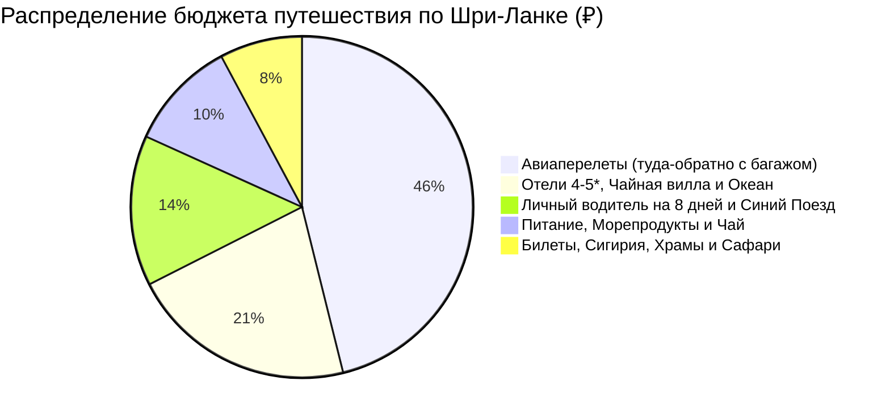

# 💰 Финансы и Полная смета тура: Шри-Ланка (9 дней / 8 ночей)

> [!summary]+ 💰 Общий бюджет экспедиции «под ключ»: **~122 000 – 142 000 ₽** (`~380 000 – 445 000 LKR` / `~1 300 – 1 500 $`) на 1 человека
> - ✈️ **Авиаперелеты (Москва ↔ Коломбо с багажом 23 кг):** `~62 000 ₽`
> - 🏨 **Проживание (8 ночей: отели 4-5*, вилла в Элле, отели на океане):** `~28 750 ₽` (из расчета `~57 500 ₽` на двоих / `~33 000 ₽` соло)
> - 🚗 **Весь транспорт (личный водитель на минивэне 8 дней, синий поезд, сафари 4x4):** `~19 150 ₽` (`~61 750 LKR` на чел)
> - 🍛 **Питание, свежие морепродукты, карри, фрукты, дегустации чая:** `~14 000 ₽` (`~45 000 LKR`)
> - 🎟️ **Билеты и Экскурсии (Сигирия, Дамбулла, Храм Зуба Будды, Перадения, Сафари):** `~10 500 ₽` (`~34 000 LKR`)

