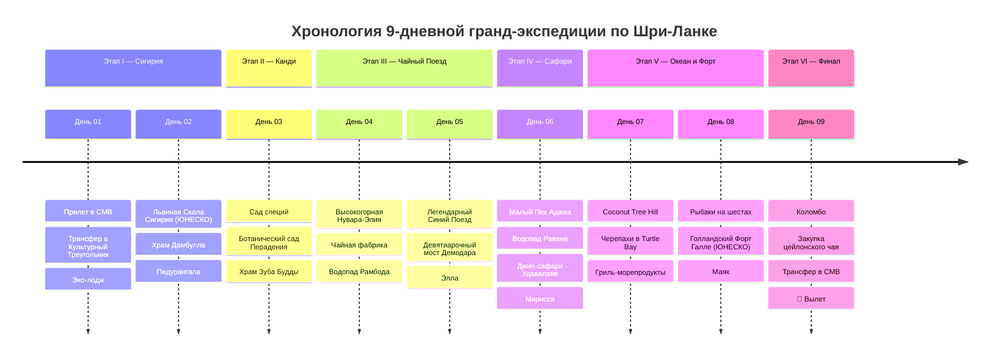

# 🇱🇰 Шри-Ланка: Чайный Экспресс, Львиная Скала и Океан (9 Дней)

> **Концепция экспедиции:** Идеальный 9-дневный маршрут по древнему острову Цейлон для соло-путешественника без автомобиля: подъем на 200-метровую цитадель на скале Сигирия (ЮНЕСКО), священные буддийские пещеры Дамбуллы, высокогорные чайные плантации Нувара-Элии, легендарный синий поезд с открытыми дверями через Девятиарочный мост в Эллу, сафари на диких слонов на джипах 4x4 и пляжный дзен с гигантскими морскими черепахами в Индийском океане.
> 
> 1. 🏰 **Этап I (Дни 01–02): Культурный Треугольник — Сигирия и Дамбулла.** Колоссальный 200-метровый монолит Львиной Скалы (Сигирия V века), пещерный буддийский Золотой Храм Дамбуллы с сотнями древних статуй и закат со скалы Пидурангала.
> 2. 👑 **Этап II (День 03): Последнее Королевство Канди.** Сад специй Матале, королевский ботанический сад Перадения и священный Храм Зуба Будды (Шри Далада Малигава) на берегу озера.
> 3. ☕ **Этап III (Дни 04–05): Высокогорный Чайный Край — Нувара-Элия и Элла.** «Маленькая Англия» (1900 м), дегустация чая Orange Pekoe на исторических чайных фабриках, культовый синий поезд сквозь туманные горы и виадук Девятиарочного моста Демодара.
> 4. 🐘 **Этап IV (День 06): Горные Вершины и Сафари со Слонами в Удавалаве.** Рассветный трекинг на Малый Пик Адама (Little Adam's Peak), мощный водопад Равана и сафари на открытых джипах 4x4 среди сотен диких слонов в нацпарке Удавалаве.
> 5. 🏖️ **Этап V (Дни 07–08): Южное Побережье — Мирисса и Форт Галле.** Открыточный кокосовый холм Coconut Tree Hill, снорклинг с гигантскими морскими черепахами, традиционные рыбаки на шестах и колониальные мощеные улочки голландского Форта Галле XVII века.
> 6. 🛫 **Этап VI (День 09): Коломбо, Покупка Цейлонского Чая и Вылет.** Колоритная набережная Galle Face Green, закупка премиального чая и специй, скоростной трансфер в аэропорт Bandaranaike (CMB) и вылет домой.

---

## 🗺️ Ключевые параметры экспедиции

* **Продолжительность:** 9 дней / 8 ночей.
* **Сезонность:** Ноябрь – апрель (юго-западное побережье и горы) или круглый год с комфортной погодой.
* **Формат перемещений:** 100% без необходимости садиться за руль (комфортный автомобиль/минивэн с кондиционером и личным водителем на весь культурный и горный маршрут за `~$40` в день + культовый панорамный **Синий Поезд Sri Lanka Railways** через чайные нагорья).
* **Бюджет под ключ на 1 чел:** `~120 000 – 145 000 ₽` (`~1 300 – 1 550 $` / `~390 000 – 460 000 LKR`), включая перелеты, комфортные отели 4* с бассейнами, виллу в чайных горах Эллы, сафари на джипах 4x4, синий поезд, личного водителя и свежие морепродукты.

---

## 📋 Разделы проекта `-- Sri Lanka`

1. **[[Personal Note/Travel/-- Sri Lanka/02 - Маршрутный план/Маршрутный план|🗓️ Сводный Маршрутный план (9 Дней)]]**
2. **[[Сигирия, Львиная Скала V века и Пещерные храмы Дамбуллы|🏰 Заметки: Сигирия, Львиная Скала и Храмы Дамбуллы]]**
3. **[[Чайная Нувара-Элия и Легендарный Синий Поезд в Эллу|☕ Заметки: Нувара-Элия, Чайные плантации и Синий Поезд]]**
4. **[[Горная Элла, Девятиарочный мост Демодара и Малый Пик Адама|🌉 Заметки: Элла — Девятиарочный мост и Малый Пик Адама]]**
5. **[[Сафари в Удавалаве, Дикие слоны, Леопарды и Павлины|🐘 Заметки: Джип-сафари в Удавалаве — Дикие слоны и Фауна]]**
6. **[[Мирисса, Кокосовый холм, Океанские черепахи и Серфинг|🏖️ Заметки: Мирисса — Coconut Tree Hill, Черепахи и Пляжи]]**
7. **[[Колониальный Форт Галле, Рыбаки на шестах и Коломбо|🏛️ Заметки: Форт Галле XVII века и Рыбаки на шестах]]**
8. **[[Цейлонская гастрономия, Карри с крабом, Роти и Чайная культура|🍛 Заметки: Кухня Цейлона — Карри, Роти и Чайные традиции]]**
9. **[[Гайд по транспорту без прав, Синий поезд, PickMe и Водители|🚗 Заметки: Гайд по транспорту — Синий поезд и Личный водитель]]**
10. **[[Авиаперелеты (Sri Lanka)|✈️ Бронирования: Авиаперелеты в Коломбо (CMB) и Электронная виза ETA]]**
11. **[[Отели, Чайные лоджи и Виллы на океане|🏨 Бронирования: Отели с бассейнами, Чайные лоджи и Виллы]]**
12. **[[Транспорт, Синий поезд, Джип-сафари и Личный водитель (Без авто)|🚆 Бронирования: Синий поезд, Джипы 4x4 и Водитель]]**
13. **[[Финансы (Sri Lanka)|💰 Бюджет и Полная смета тура (9 дней)]]**
14. **[[05 - Полезная информация|📖 Полезная информация: Виза ETA, Этикет в храмах, Деньги и Чаевые]]**
