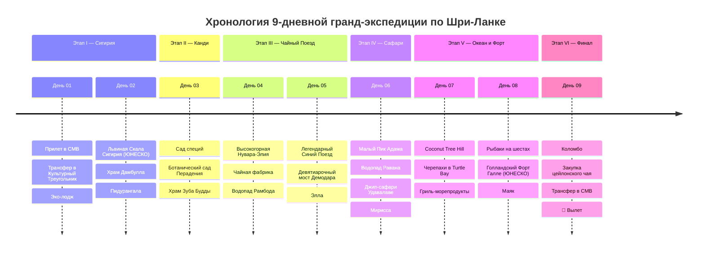

# 🇱🇰 Шри-Ланка: Чайный Экспресс, Львиная Скала и Океан (9 Дней)

## 📝 Краткое описание

9-дневный маршрут по Шри-Ланке: скальная крепость Сигирия и пещерные храмы Дамбуллы, священный Канди, синий чайный поезд через Девятиарочный мост в Эллу, сафари на слонов в Удавалаве и океанский релакс в Мириссе и Форте Галле.

## 📖 Подробная концепция путешествия

Оптимизированный маршрут по 6 ключевым этапам:

1. 🏰 **Этап I (Дни 01–02): Культурный Треугольник — Сигирия и Дамбулла.** Колоссальный 200-метровый монолит Львиной Скалы (Сигирия V века), пещерный буддийский Золотой Храм Дамбуллы с сотнями древних статуй и закат со скалы Пидурангала.
2. 👑 **Этап II (День 03): Последнее Королевство Канди.** Сад специй Матале, королевский ботанический сад Перадения и священный Храм Зуба Будды (Шри Далада Малигава) на берегу озера.
3. ☕ **Этап III (Дни 04–05): Высокогорный Чайный Край — Нувара-Элия и Элла.** «Маленькая Англия» (1900 м), дегустация чая Orange Pekoe на исторических чайных фабриках, культовый синий поезд сквозь туманные горы и виадук Девятиарочного моста Демодара.
4. 🐘 **Этап IV (День 06): Горные Вершины и Сафари со Слонами в Удавалаве.** Рассветный трекинг на Малый Пик Адама (Little Adam's Peak), мощный водопад Равана и сафари на открытых джипах 4x4 среди сотен диких слонов в нацпарке Удавалаве.
5. 🏖️ **Этап V (Дни 07–08): Южное Побережье — Мирисса и Форт Галле.** Открыточный кокосовый холм Coconut Tree Hill, снорклинг с гигантскими морскими черепахами, традиционные рыбаки на шестах и колониальные мощеные улочки голландского Форта Галле XVII века.
6. 🛫 **Этап VI (День 09): Коломбо, Покупка Цейлонского Чая и Вылет.** Колоритная набережная Galle Face Green, закупка премиального чая и специй, скоростной трансфер в аэропорт Bandaranaike (CMB) и вылет домой.

```mermaid
timeline
    title Хронология 9-дневной гранд-экспедиции по Шри-Ланке
    section Этап I — Сигирия
        День 01 : Прилет в CMB : Трансфер в Культурный Треугольник : Эко-лодж
        День 02 : Львиная Скала Сигирия (ЮНЕСКО) : Храм Дамбулла : Пидурангала
    section Этап II — Канди
        День 03 : Сад специй : Ботанический сад Перадения : Храм Зуба Будды
    section Этап III — Чайный Поезд
        День 04 : Высокогорная Нувара-Элия : Чайная фабрика : Водопад Рамбода
        День 05 : Легендарный Синий Поезд : Девятиарочный мост Демодара : Элла
    section Этап IV — Сафари
        День 06 : Малый Пик Адама : Водопад Равана : Джип-сафари Удавалаве : Мирисса
    section Этап V — Океан и Форт
        День 07 : Coconut Tree Hill : Черепахи в Turtle Bay : Гриль-морепродукты
        День 08 : Рыбаки на шестах : Голландский Форт Галле (ЮНЕСКО) : Маяк
    section Этап VI — Финал
        День 09 : Коломбо : Закупка цейлонского чая : Трансфер в CMB : 🛫 Вылет
```

---

## 🗺️ Ключевые параметры экспедиции

* **Продолжительность:** 9 дней / 8 ночей.
* **Сезонность:** Ноябрь – апрель (юго-западное побережье и горы) или круглый год с комфортной погодой.
* **Формат перемещений:** 100% без необходимости садиться за руль (комфортный автомобиль/минивэн с кондиционером и личным водителем на весь культурный и горный маршрут за `~$40` в день + культовый панорамный **Синий Поезд Sri Lanka Railways** через чайные нагорья).
* **Бюджет под ключ на 1 чел:** `~120 000 – 145 000 ₽` (`~1 300 – 1 550 $` / `~390 000 – 460 000 LKR`), включая перелеты, комфортные отели 4* с бассейнами, виллу в чайных горах Эллы, сафари на джипах 4x4, синий поезд, личного водителя и свежие морепродукты.
