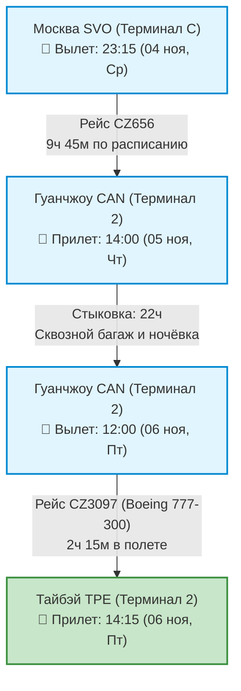
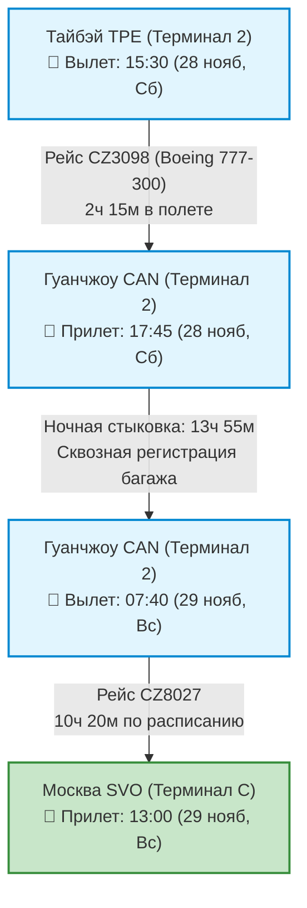

# ✈️ Бронирования: Авиаперелеты (23 дня / 22 ночи на Тайване)

> [!INFO] Перед перелётом — наземный пре-сегмент
> 3 ноября 20:45 из **Ульяновска** идёт поезд (купе, верхнее место), прибытие на **Москва Казанская 4 ноября в 09:56**. Билет куплен, контрольный купон № 77 665 043 657 695. Подробности и переезд Казанская ➔ SVO — в [[../03 - Бронирования/Транспорт|Транспорт]].

> [!SUCCESS]+ 🥇 Выбранный рейс: **China Southern Airlines (Москва ⇌ Тайбэй через Гуанчжоу)**
> * **Даты полета:** **4 ноября 2026 (Ср) ➔ 28 ноября 2026 (Сб)** (прибытие в Москву 29 ноября, Вс).
> * **Стоимость:** **`55 412 ₽`** туда и обратно с багажом (23 кг регистрируемый багаж + 8 кг ручная кладь).
> * **Статус:** 🟢 **Билеты выпущены** (заказ от 12 сентября 2026 г., номер бронирования: `1539368247406040`, пассажир: IVAN KORNILOV).
> * **Ссылка на заказ:** [🔗 Детали заказа на Trip.com](https://www.trip.com/online/orderdetail/index?oid=1539368247406040&source=bookings&channel=bookings&subChannel=tripcard&flightsignature=H4sIAAAAAAAA_4uuVirOTM_zS8xNVbJSSsvJTM8o0U1KS1PSAYuHJeaUgiQMTY0tjc0sjEzMTQzMDEwMoNKJJaVFIGlHR1dHx0BH76jcioIoowwDn3Cv3KgyN_OKErdsX1_HjDyzUuOC7LRio9B853ivgJLE5Ai3HFe3AveiJI9ir_Jw3ZKizAKQgUq1sQC13rY8kgAAAA%3D%3D-split-AAEAAQAPZmxpZ2h0c2lnbmF0dXJlMMtMLmCgkH4dbNOU6ot8vWVc0yx0J_X8EdP3ptBln-E%3D-tripsign&curr=RUB&locale=en-XX)
> * **Преимущества тарифа:** Оплата картами российских банков (МИР, Visa/MC), сквозная регистрация багажа (не нужно получать и заново сдавать в Гуанчжоу), питание, розетки и экраны на всех рейсах, дневное прибытие в Тайбэй (14:15).

> [!IMPORTANT] Контроль расписания перед вылетом
> Время ниже перенесено из купленной маршрут-квитанции. Источник истины — электронный билет / PNR China Southern; проверьте его за 72 и 24 часа до каждого вылета.

---

## 🛫 1. Перелет ТУДА: Москва (SVO) ➔ Тайбэй (TPE)

* **Дата отправления:** **4 ноября 2026, Среда**
* **Общая продолжительность до Тайбэя:** **34 часа**

| Сегмент маршрута | Рейс / Борт | Время отправления | Время прибытия | Время в пути | Питание / Удобства |
| :--- | :---: | :---: | :---: | :---: | :---: |
| **Москва (SVO-C) ➔ Гуанчжоу (CAN-T2)** | **CZ656** | **23:15** *(04 ноя, Ср)* | **14:00** *(05 ноя, Чт)* | **9 ч 45 мин** | Ручная кладь 8 кг; багаж 23 кг; питание по тарифу |
| 🔄 **Пересадка в Гуанчжоу (CAN, Терминал 2)** | — | — | — | **22 часа** | 🛡️ Сквозной багаж 🏨 Southern Airlines Pearl Hotel (North District), бронь подтверждена |
| **Гуанчжоу (CAN-T2) ➔ Тайбэй (TPE-T2)** | **CZ3097** `Boeing 777-300` | **12:00** *(06 ноя, Пт)* | **14:15** *(06 ноя, Пт)* | **2 ч 15 мин** | ⚡ Розетки 🍴 Горячее питание 📺 Мультимедиа |

> [!TIP]
> **Прибытие в Тайбэй в 14:15:** Идеальное время! Дорога на аэроэкспрессе *Taoyuan Airport MRT* до центра Тайбэя занимает 35 минут. Вы прибудете в отель ровно к стандартному времени заселения (15:00–16:00), успеете освежиться и выйти на вечерний маршрут к горе Слон и рынку Жаохэ.

---

## 🛫 2. Перелет ОБРАТНО: Тайбэй (TPE) ➔ Москва (SVO)

* **Дата отправления:** **28 ноября 2026, Суббота**
* **Общая продолжительность:** **21 час 30 минут**

| Сегмент маршрута | Рейс / Борт | Время отправления | Время прибытия | Время в пути | Питание / Удобства |
| :--- | :---: | :---: | :---: | :---: | :---: |
| **Тайбэй (TPE-T2) ➔ Гуанчжоу (CAN-T2)** | **CZ3098** `Boeing 777-300` | **15:30** *(28 нояб, Сб)* | **17:45** *(28 нояб, Сб)* | **2 ч 15 мин** | ⚡ Розетки 🍴 Питание на борту 📺 Мультимедиа |
| 🔄 **Пересадка в Гуанчжоу (CAN, Терминал 2)** | — | — | — | **13 ч 55 мин** | 🛡️ **Сквозной багаж** до Москвы Ночная стыковка |
| **Гуанчжоу (CAN-T2) ➔ Москва (SVO-C)** | **CZ8027** | **07:40** *(29 нояб, Вс)* | **13:00** *(29 нояб, Вс)* | **10 ч 20 мин** | Ручная кладь 8 кг; багаж 23 кг; питание по тарифу |

> [!IMPORTANT]
> **Особенности ночной стыковки 13 ч 55 мин в Гуанчжоу:**
> 1. **Сквозной багаж:** Чемоданы оформляются в Тайбэе сразу до Москвы — с собой на пересадку берется только легкий рюкзак с вещами для ночлега.
> 2. **Транзитный отель:** Право на бесплатное размещение подтверждено и для обратной пересадки, но отдельную бронь на ночь 28→29 ноября ещё нужно завершить в сервисе China Southern.
> 3. **Выход из транзитной зоны:** Решение принимает китайская пограничная служба по действующим на дату поездки правилам. Не делайте поездку в город обязательной частью стыковки.
> 4. **Утренний вылет:** Рейс CZ8027 отправляется в 07:40; вернуться в T2 нужно заблаговременно.

---

## 💡 Практические советы по перелету и транзиту

1. **Оплата на Trip.com:** Сервис официально принимает карты **МИР, Visa и Mastercard любых российских банков** с прямым списанием в рублях без скрытых комиссий за трансграничную конвертацию.
2. **Багажные нормы:** В тариф включено 1 место регистрируемого багажа весом до **23 кг** + ручная кладь до **8 кг**.
3. **Питание и выбор мест:** Сразу после оформления бронирования на Trip.com вы можете выбрать бесплатные места в салоне самолета и указать тип специального питания (азиатское, кошерное, вегетарианское и др.).
4. **Трансфер из аэропорта Таоюань (TPE):** После прилета и паспортного контроля в зале прилета Терминала 2 следуйте по указателям к **Taoyuan Airport MRT** (платформа A13). Оплата проезда осуществляется бесконтактной картой **EasyCard** (`~160 TWD / ~450 ₽`), время в пути до вокзала Taipei Main Station — 35 минут на экспрессе (фиолетовый состав).
