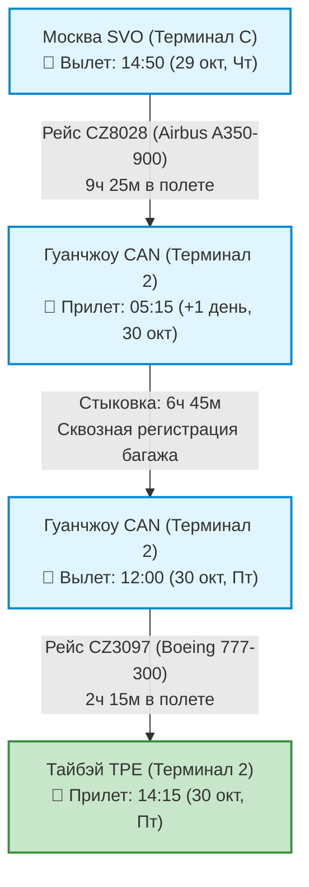
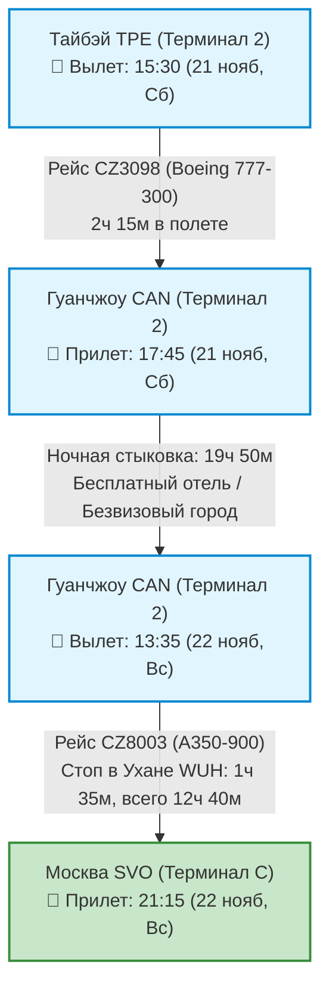

# ✈️ Бронирования: Авиаперелеты (22 дня / 21 ночь)

> [!SUCCESS]+ 🥇 Выбранный рейс: **China Southern Airlines (Москва ⇌ Тайбэй через Гуанчжоу)**
> * **Даты полета:** **29 октября 2026 (Чт) ➔ 21 ноября 2026 (Сб)** (прибытие в Москву 22 ноября, Вс).
> * **Стоимость:** **`62 793 ₽`** туда и обратно с багажом (23 кг регистрируемый багаж + 8 кг ручная кладь).
> * **Прямая ссылка на бронирование:** [🔗 Оформить билет на Trip.com в рублях с картой РФ](https://ru.trip.com/flights/ShowFareNext?pagesource=list&triptype=RT&class=Y&quantity=1&childqty=0&babyqty=0&jumptype=GoToNextJournay&dcity=mow&acity=tpe&ddate=2026-10-29&dcityName=Moscow&acityName=Taipei&rdate=2026-11-21&currentseqno=2&criteriaToken=SGP_SGP-NOR_PIDReduce-DW7wKIff20260831104949^whZMaWn9kBwlMTXY&shoppingid=SGP_SGP-NOR_PIDReduce-DW7wKIff20260831104949^List-kU8UWx&groupKey=SGP_SGP-NOR_PIDReduce-DW7wKIff20260831104949^List-kU8UWx&airline=&locale=ru-RU&curr=RUB)
> * **Преимущества тарифа:** Оплата картами российских банков (МИР, Visa/MC), сквозная регистрация багажа (не нужно получать и заново сдавать в Гуанчжоу), питание, розетки и экраны на всех рейсах, дневное прибытие в Тайбэй (14:15).

---

## 🛫 1. Перелет ТУДА: Москва (SVO) ➔ Тайбэй (TPE)

* **Дата отправления:** **29 октября 2026, Четверг**
* **Общая продолжительность:** **18 часов 25 минут**

| Сегмент маршрута | Рейс / Борт | Время отправления | Время прибытия | Время в пути | Питание / Удобства |
| :--- | :---: | :---: | :---: | :---: | :---: |
| **Москва (SVO-C) ➔ Гуанчжоу (CAN-T2)** | **CZ8028** `Airbus A350-900` | **14:50** *(29 окт, Чт)* | **05:15** *(30 окт, Пт)* | **9 ч 25 мин** | ⚡ Розетки / USB 🍴 Горячее питание (2 раза) 📺 Бортовые экраны |
| 🔄 **Пересадка в Гуанчжоу (CAN, Терминал 2)** | — | — | — | **6 ч 45 мин** | 🛡️ **Сквозной багаж** (получать не нужно) Лаунджи, кафе, зоны отдыха T2 |
| **Гуанчжоу (CAN-T2) ➔ Тайбэй (TPE-T2)** | **CZ3097** `Boeing 777-300` | **12:00** *(30 окт, Пт)* | **14:15** *(30 окт, Пт)* | **2 ч 15 мин** | ⚡ Розетки 🍴 Горячее питание 📺 Мультимедиа |

> [!TIP]
> **Прибытие в Тайбэй в 14:15:** Идеальное время! Дорога на аэроэкспрессе *Taoyuan Airport MRT* до центра Тайбэя занимает 35 минут. Вы прибудете в отель ровно к стандартному времени заселения (15:00–16:00), успеете освежиться и выйти на вечерний маршрут к горе Слон и рынку Жаохэ.

---

## 🛫 2. Перелет ОБРАТНО: Тайбэй (TPE) ➔ Москва (SVO)

* **Дата отправления:** **21 ноября 2026, Суббота**
* **Общая продолжительность:** **34 часа 45 минут**

| Сегмент маршрута | Рейс / Борт | Время отправления | Время прибытия | Время в пути | Питание / Удобства |
| :--- | :---: | :---: | :---: | :---: | :---: |
| **Тайбэй (TPE-T2) ➔ Гуанчжоу (CAN-T2)** | **CZ3098** `Boeing 777-300` | **15:30** *(21 нояб, Сб)* | **17:45** *(21 нояб, Сб)* | **2 ч 15 мин** | ⚡ Розетки 🍴 Питание на борту 📺 Мультимедиа |
| 🔄 **Пересадка в Гуанчжоу (CAN, Терминал 2)** | — | — | — | **19 ч 50 мин** | 🛡️ **Сквозной багаж** до Москвы 🏨 **Бесплатный транзитный отель** от авиакомпании / вечерний город |
| **Гуанчжоу (CAN-T2) ➔ Москва (SVO-C)** *(с технической остановкой в Ухане WUH)* | **CZ8003** `Airbus A350-900` | **13:35** *(22 нояб, Вс)* | **21:15** *(22 нояб, Вс)* | **12 ч 40 мин** *(включая тех. стоп 1ч 35м в Ухане)* | ⚡ Розетки / USB 🍴 Двухразовое горячее питание 📺 Индивидуальные мониторы |

> [!IMPORTANT]
> **Особенности длинной стыковки 19 ч 50 мин в Гуанчжоу:**
> 1. **Сквозной багаж:** Чемоданы оформляются в Тайбэе сразу до Москвы — с собой на пересадку берется только легкий рюкзак с вещами для ночлега.
> 2. **Бесплатный транзитный отель:** Пассажиры China Southern с международной стыковкой от 8 до 48 часов имеют право на бесплатный номер в транзитном отеле с трансфером (оформляется на фирменной стойке *China Southern Transfer Accommodation* в Терминале 2).
> 3. **Безвизовый выход в город (24/144-Hour TWOV):** На паспортном контроле оформляется бесплатный транзитный стикер, позволяющий съездить на метро на набережную реки Чжуцзян, увидеть подсвеченную Кантонскую телебашню и поужинать димсамами в кантонском ресторане.
> 4. **Техническая остановка в Ухане (1 ч 35 мин):** Вы остаетесь в транзитной зоне того же борта/терминала без смены самолета и повторной сдачи багажа.

---

## 💡 Практические советы по перелету и транзиту

1. **Оплата на Trip.com:** Сервис официально принимает карты **МИР, Visa и Mastercard любых российских банков** с прямым списанием в рублях без скрытых комиссий за трансграничную конвертацию.
2. **Багажные нормы:** В тариф включено 1 место регистрируемого багажа весом до **23 кг** + ручная кладь до **8 кг**.
3. **Питание и выбор мест:** Сразу после оформления бронирования на Trip.com вы можете выбрать бесплатные места в салоне самолета и указать тип специального питания (азиатское, кошерное, вегетарианское и др.).
4. **Трансфер из аэропорта Таоюань (TPE):** После прилета и паспортного контроля в зале прилета Терминала 2 следуйте по указателям к **Taoyuan Airport MRT** (платформа A13). Оплата проезда осуществляется бесконтактной картой **EasyCard** (`~160 TWD / ~450 ₽`), время в пути до вокзала Taipei Main Station — 35 минут на экспрессе (фиолетовый состав).

