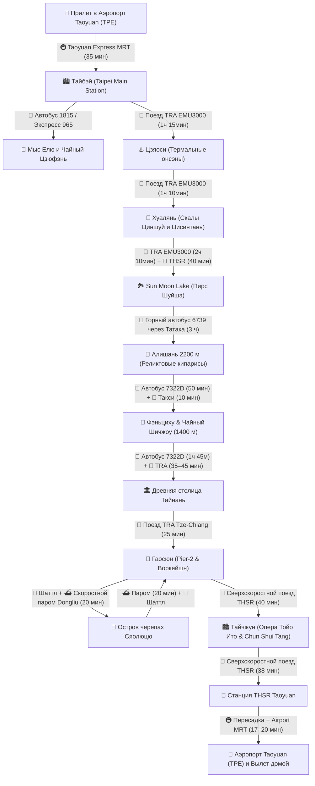

# 🚆 Бронирования: Поезда, Паромы и Трансферы (23 дня / 22 ночи)

> **Транспортная архитектура:** Линейный маршрут без обратных переездов вокруг всего острова Формоза: скоростная северная связка «Северный экспресс» (поезд TRA EMU3000 вдоль тихоокеанских скал до Banqiao + скоростная стрела THSR до Taichung и Sun Moon Lake) без пересылки багажа, горные автобусы в Алишань, короткие переезды по западному побережью, уикенд на Сяолюцю на пароме (20 мин), THSR на север в Тайчжун и трансфер в аэропорт Таоюань (THSR ~38 мин + пересадка + 17–20 мин Airport MRT).

---

## 📍 Сквозная схема маршрута и логистики

---

## 📋 График междугороднего транспорта

|   Дата...День   | Сегмент                                  |                           Транспорт                            |  Время в пути   | Способ бронирования / Оплата                     |
| :-------------: | :--------------------------------------- | :------------------------------------------------------------: | :-------------: | :----------------------------------------------- |
| **29 окт (Чт)** | Москва (SVO) ➔ Гуанчжоу ➔ Тайбэй (TPE)   |         ✈️ China Southern CZ8028 + CZ3097 (A350/B777)          |   18 ч 25 мин   | Включено в авиабилет на Trip.com (`62 793 ₽`)    |
| **30 окт (Пт)** | Аэропорт TPE ➔ Тайбэй Главный            |                     🚇 Taoyuan Express MRT                     |     35 мин      | EasyCard на турникете (`~450 ₽`)                 |
| **01 ноя (Вс)** | Тайбэй (Янминшань)                       |      🚌 Горный автобус Red 5 / 108 в Янминшань (Сяоюкан)       |     45 мин      | EasyCard (`~170–340 ₽`)                          |
| **02 ноя (Пн)** | Северный берег (Елю ➔ Цзюфэнь)           | 🚌 Автобус 1815 + 🚖 прямое такси Елю ➔ Цзюфэнь + экспресс 965 |    Весь день    | EasyCard / касса (`~750–1 200 ₽` на 1 чел)       |
| **03 ноя (Вт)** | Тайбэй ➔ Цзяоси (Илань)                  |               🚆 Поезд TRA Tze-Chiang / EMU3000                |   1 ч 15 мин    | За 28 дней на сайте TRA (`~790 ₽`)               |
| **04 ноя (Ср)** | Цзяоси ➔ Хуалянь                         |                      🚆 Поезд TRA EMU3000                      |   1 ч 10 мин    | За 28 дней на сайте TRA (`~950 ₽`)               |
| **04 ноя (Ср)** | Хуалянь ➔ Скалы Циншуй и Цисинтань       |                🚗 Авто с водителем (customized)                |     4 часа      | `~5 120 ₽` (за всю машину на 4 часа)             |
| **06 ноя (Пт)** | Хуалянь ➔ Banqiao (板橋)                   |                🚆 Скоростной поезд TRA EMU3000                 | **2 ч 10 мин**  | За 28 дней на сайте TRA (`~1 230 ₽`)             |
| **06 ноя (Пт)** | Станция Banqiao ➔ Станция THSR Taichung  |            🚄 Сверхскоростной поезд THSR (300 км/ч)            |   **40 мин**    | За 28 дней на сайте THSR (`~2 100 ₽`)            |
| **06 ноя (Пт)** | THSR Taichung ➔ Sun Moon Lake (Шуйшэ)    |              🚌 Шаттл Taiwan Tourist Shuttle 6670              | **~1 ч 20–30 мин** | [Официальный маршрут](https://www.taiwantrip.com.tw/Frontend/Route/Select_p_en?RouteID=R0005), EasyCard (`195 NTD / ~550 ₽`) |
| **08 ноя (Вс)** | Sun Moon Lake (Шуйшэ) ➔ Нацпарк Алишань  |          🚌 Горный автобус 6739 (через Татака 2610 м)          |    **~3 ч 10 мин**     | [Бронь](https://www.taiwantrip.com.tw/Frontend/Route/Select_p_en?RouteID=R0099), рейс 08:00 (`~840 ₽`) |
| **08 ноя (Вс)** | Парк Алишань (Alishan ➔ Chaoping/Shenmu) |       🚂 Лесной поезд узкоколейки Alishan Forest Railway       |     15 мин      | В кассе Alishan Station (`~280–560 ₽`)           |
| **09 ноя (Пн)** | Нацпарк Алишань ➔ Фэньциху (1400 м)      |             🚌 Рейс 7322D, 09:10 ➔ 10:00                      |     50 мин      | EasyCard; перепроверить сезонное расписание      |
| **09 ноя (Пн)** | Фэньциху ➔ Чайный Шичжоу (1400 м)        |                    🚖 Местное такси (5 км)                     |     10 мин      | Наличные водителю (`~750–850 ₽` за машину)       |
| **10 ноя (Вт)** | Чайный Шичжоу ➔ Вокзал Цзяи              |             🚌 Рейс 7322D, 10:10 ➔ 11:55                      | **1 ч 45 мин**  | EasyCard; на остановке быть к 10:00              |
| **10 ноя (Вт)** | Вокзал Цзяи ➔ Тайнань (Tainan)           |               🚆 Поезд TRA Tze-Chiang / EMU3000                |  **38–45 мин**  | EasyCard / касса TRA (`~200–380 ₽`)              |
| **12 ноя (Чт)** | Тайнань ➔ Гаосюн (Kaohsiung)             |            🚆 Поезд TRA Tze-Chiang / Local Express             |  **25–30 мин**  | EasyCard на турникете (`~190–300 ₽`)             |
| **13 ноя (Пт)** | Гаосюн ➔ Остров Цицзинь (туда-обратно)   |               ⛴️ Городской паром Гушань–Цицзинь                |      5 мин      | EasyCard (`~85 ₽` в одну сторону)                |
| **14 ноя (Сб)** | Гаосюн ➔ Порт Дунган                     |                   🚖 Шаттл / такси к причалу                   |    35–40 мин    | На месте / Klook (`~500 ₽` на 1 чел)             |
| **14 ноя (Сб)** | Порт Дунган ➔ Остров Сяолюцю             |                 ⛴️ Скоростной паром Tungliu                    |   **20 мин**    | [Расписание](https://www.tungliuen.com/), целевой рейс 10:45 (`~1 150 ₽` round-trip) |
| **14 ноя (Сб)** | Остров Сяолюцю (передвижение)            |             🛵 Одноместный E-bike без прав / скутер с МВУ      | до 2 тарифов | Без прав — по одному E-bike на человека (`~1 120–2 240 ₽`) |
| **15 ноя (Вс)** | Порт Дунган ➔ Гаосюн (Pier-2)            |                  🚖 Шаттл / такси от причала                   |    35–40 мин    | На месте / Klook (`~500 ₽` на 1 чел)             |
| **17 ноя (Вт)** | Гаосюн (Zuoying) ➔ Тайчжун               |            🚄 Сверхскоростной поезд THSR (300 км/ч)            | **40–50 мин** | [Расписание THSR](https://en.thsrc.com.tw/ArticleContent/a3b630bb-1066-4352-a1ef-58c7b4e8ef7c) (`~2 210 ₽`) |
| **21 ноя (Сб)** | Тайчжун ➔ Станция THSR Taoyuan           |            🚄 Сверхскоростной поезд THSR (300 км/ч)            |   **~38 мин** | [Расписание THSR](https://en.thsrc.com.tw/ArticleContent/a3b630bb-1066-4352-a1ef-58c7b4e8ef7c) (`~1 510 ₽`) |
| **21 ноя (Сб)** | Станция THSR Taoyuan ➔ Терминалы TPE     |             🚇 Taoyuan Airport MRT (A18 ➔ A12/A13)             | **17–20 мин** | [Официальная схема](https://www.taoyuan-airport.com/airport_mrt?lang=en), EasyCard (`~70 ₽`) |

---

## 💡 Практические советы по транспорту

1. **Транспортная карта EasyCard (悠遊卡):** Универсальное платежное средство на всем острове: метро (MRT) в Тайбэе, Гаосюне и Тайчжуне, канатка Маокун, городские и пригородные автобусы, паром на Цицзинь, пригородные поезда TRA, комбини 7-Eleven и FamilyMart.
2. **Скоростная связка «Северный экспресс» (TRA EMU3000 + THSR):** Выезд из Хуаляня в 07:30 и расчетное прибытие к Sun Moon Lake около 13:05. На Banqiao заложено 40 минут, а на переход к шаттлу 6670 — еще 30 минут; финальные рейсы фиксируются после публикации расписаний.
3. **Сверхскоростные поезда THSR (Taiwan High Speed Rail):** Развивают скорость до 300 км/ч по западному побережью. Переезд Гаосюн (Zuoying) ➔ Тайчжун занимает **40 минут**, а Тайчжун ➔ станция аэропорта Таоюань — всего **38 минут**! Билеты поступают в продажу за 28 дней.
4. **Линейный горный спуск Алишань ➔ Шичжоу ➔ Цзяи:** Автобус **6739** привозит вас на высоту 2200 м. Далее маршрут идёт сверху вниз: рейс 7322D `09:10–10:00` до Фэньциху, такси в Шичжоу и на следующее утро рейс 7322D `10:10–11:55` до вокзала Цзяи.
5. **Островной уикенд на Сяолюцю:** Все тяжелые чемоданы остаются в камере хранения отеля в Гаосюне. На паром Tungliu нужно прийти за 30–60 минут. Без подходящих прав разрешен только одноместный низкоскоростной E-bike; двухместный скутер требует соответствующих прав и МВУ.
6. **Пересадка в аэропорт Taoyuan (TPE):** На станции THSR Taoyuan переход к Airport MRT A18 занимает время; план закладывает 22 минуты до поезда. Сам путь от A18 до терминалов — 17 минут на экспрессе или 20 минут на обычном составе.
