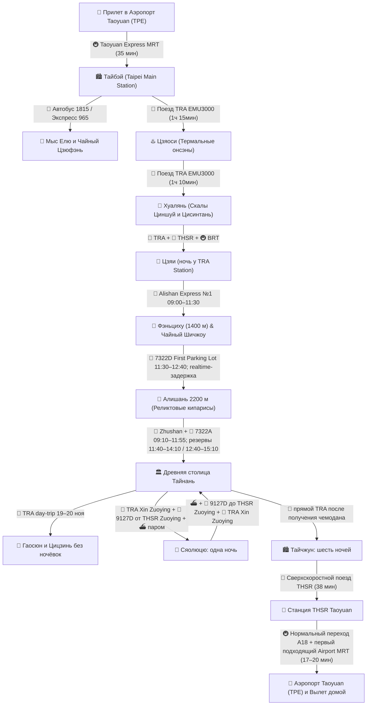

# 🚆 Бронирования: Поезда, Паромы и Трансферы (25 дней / 22 ночи)

> **Транспортная архитектура:** После горного блока база остаётся в Тайнане на четыре ночи. Гаосюн посещается двумя радиальными выездами без ночёвок; Сяолюцю — одна ночь. На остров едем Tainan TRA → Xin Zuoying → пеший переход к THSR Zuoying → 9127D → Dongliu Ferry Terminal → паром; обратно возвращаемся через THSR Zuoying и TRA Xin Zuoying, забираем чемодан в Yoshi и садимся на прямой TRA в Тайчжун.

---

## 📍 Сквозная схема маршрута и логистики

---

## 📋 График междугороднего транспорта

|   Дата...День   | Сегмент                                  |                           Транспорт                            |         Время в пути         | Способ бронирования / Оплата                                                                                                                                    |
| :-------------: | :--------------------------------------- | :------------------------------------------------------------: | :--------------------------: | :-------------------------------------------------------------------------------------------------------------------------------------------------------------- |
| **04 ноя (Ср)** | Москва (SVO) ➔ Гуанчжоу (CAN)            |                    ✈️ China Southern CZ656                     |          9 ч 45 мин          | Купленный сквозной билет; багаж до TPE                                                                                                                          |
| **05 ноя (Чт)** | CAN-T2 ➔ Pearl Hotel North ➔ CAN-T2      |               🏨 Бесплатный шаттл China Southern               |        22 ч стыковки         | Отель подтверждён; стойка T2 Gate 50                                                                                                                            |
| **06 ноя (Пт)** | Гуанчжоу (CAN) ➔ Тайбэй (TPE)            |                    ✈️ China Southern CZ3097                    |          2 ч 15 мин          | Купленный сквозной билет                                                                                                                                        |
| **06 ноя (Пт)** | Аэропорт TPE ➔ Тайбэй Главный            |                     🚇 Taoyuan Express MRT                     |            35 мин            | EasyCard на турникете (`~450 ₽`)                                                                                                                                |
| **08 ноя (Вс)** | Тайбэй (Янминшань)                       |      🚌 Горный автобус Red 5 / 108 в Янминшань (Сяоюкан)       |            45 мин            | EasyCard (`~170–340 ₽`)                                                                                                                                         |
| **09 ноя (Пн)** | Северный берег (Елю ➔ Цзюфэнь)           | 🚌 Автобус 1815 + 🚖 прямое такси Елю ➔ Цзюфэнь + экспресс 965 |          Весь день           | EasyCard / касса (`~750–1 200 ₽` на 1 чел)                                                                                                                      |
| **10 ноя (Вт)** | Тайбэй ➔ Цзяоси (Илань)                  |               🚆 Поезд TRA Tze-Chiang / EMU3000                |          1 ч 15 мин          | За 28 дней на сайте TRA (`~790 ₽`)                                                                                                                              |
| **11 ноя (Ср)** | Цзяоси ➔ Хуалянь                         |                      🚆 Поезд TRA EMU3000                      |          1 ч 10 мин          | За 28 дней на сайте TRA (`~950 ₽`)                                                                                                                              |
| **11 ноя (Ср)** | Хуалянь ➔ Скалы Циншуй и Цисинтань       |                🚗 Авто с водителем (customized)                |            4 часа            | `~5 120 ₽` (за всю машину на 4 часа)                                                                                                                            |
| **13 ноя (Пт)** | Хуалянь ➔ Banqiao (板橋)                   |                🚆 Скоростной поезд TRA EMU3000                 |        **2 ч 10 мин**        | За 28 дней на сайте TRA (`~1 230 ₽`)                                                                                                                            |
| **13 ноя (Пт)** | Banqiao ➔ Chiayi (嘉義)                    |            🚄 Сверхскоростной поезд THSR (300 км/ч)            |        **1 ч 15 мин**        | За 28 дней на сайте THSR (`~2 800 ₽`)                                                                                                                           |
| **14 ноя (Сб)** | Цзяи ➔ Фэньциху (1400 м)                 |       🚂 Alishan Forest Railway, поезд №1 **09:00 ➔ 11:30**        |       **2 ч 30 мин**        | Опубликованное время; нужен именно e-ticket Chiayi ➔ Fenqihu. Перед поездкой проверяется только operational status линии (`~1 075 ₽`) |
| **15 ноя (Вс)** | Фэньциху ⇄ Шичжоу (радиальный выезд)     |                 🚖 Заранее организованное местное такси                 |            ~10 мин в одну сторону            | Согласовать водителя и оба плеча заранее; наличные, ориентир `~400–450 ₽` на 1 чел; автобус только ситуационный Plan B |
| **16 ноя (Пн)** | Фэньциху ➔ Нацпарк Алишань (2200 м)      |                🚌 7322D, **First Parking Lot 11:30 ➔ Alishan 12:40**                |       **1 ч 10 мин**        | Опубликованное плановое время; в день поездки только realtime-проверка задержки. Plan B: 7329A 12:50 ➔ 14:05; Plan C: 7322A 14:00 ➔ 15:10 |
| **16 ноя (Пн)** | Парк Алишань: Alishan ➔ Zhaoping        |       🚂 Zhaoping Line, one-way       |            ~15 мин            | Основной пакет: admission + Alishan Station ➔ Zhaoping Station; тариф проверить на официальном сайте |
| **16 ноя (Пн)** | Парк Алишань: Shenmu ➔ Alishan         |       🚂 Shenmu Line, короткий обратный поезд       |            ~10 мин            | Отдельный one-way билет Shenmu ➔ Alishan Station; покупать отдельно |
| **17 ноя (Вт)** | Нацпарк Алишань ➔ Вокзал Цзяи            |          🚌 7322A **09:10 ➔ TRA Chiayi 11:55**          |       **2 ч 45 мин**        | 09:10 — желаемый, но не обязательный рейс; резервы: **11:40 ➔ 14:10** и **12:40 ➔ 15:10**. Перед посадкой только realtime-проверка |
| **17 ноя (Вт)** | Вокзал Цзяи ➔ Тайнань (Tainan)           |               🚆 Поезд TRA Tze-Chiang / EMU3000                |        **35–45 мин**         | EasyCard / касса TRA (`~250 ₽`)                                                                                                                                 |
| **18 ноя (Ср)** | Тайнань ➔ Анпин и рынок Ушэн             |                   🚖 Городской Uber / такси                    |          15–20 мин           | Приложение Uber (`~600 ₽` на 1 чел)                                                                                                                             |
| **19 ноя (Чт)** | Тайнань ⇄ Гаосюн                         |       🚆 TRA + MRT/такси: Lotus Pond ➔ портовый кластер        |   **~45–60 мин в сторону**   | Частый TRA: первый подходящий поезд в нужном окне; reserved express можно добавить после открытия продаж (`~380 ₽` TRA round-trip) |
| **20 ноя (Пт)** | Тайнань ⇄ Gushan Ferry Pier              |                    🚆 TRA + MRT Orange Line                    |  **~1 ч 15 мин в сторону**   | Частый TRA: первый подходящий поезд в нужном окне; номер заранее не является обязательной логистикой. EasyCard (`~170 ₽` round-trip) |
| **20 ноя (Пт)** | Гушань ⇄ Цицзинь                         |                       ⛴️ Городской паром                       |        **~5–10 мин**         | EasyCard (`~170 ₽` round-trip)                                                                                                                                  |
| **21 ноя (Сб)** | Tainan TRA ➔ Xin Zuoying ➔ THSR Zuoying ➔ Donggang | 🚆 TRA + пеший переход + 🚌 9127D **10:00 ➔ 10:50** | **08:20–10:50 door-to-terminal** | Первый подходящий утренний TRA до Xin Zuoying, затем 9127D от THSR Zuoying. Официальная таблица; realtime-проверка дорожной задержки (`~530 ₽`) |
| **21 ноя (Сб)** | Donggang ➔ Остров Сяолюцю             |                      ⛴️ Tungliu, целевой рейс около **11:30**                       |        **~15–20 мин**         | Plan B — следующий доступный официальный рейс; финальная проверка обязательна по сезону, погоде и морю (`~1 260 ₽` round-trip) |
| **21 ноя (Сб)** | Остров Сяолюцю (передвижение)            |         🛵 Одноместный E-bike без прав / скутер с МВУ          |         до 2 тарифов         | Без прав — по одному E-bike на человека (`~1 120–2 240 ₽`)                                                                                                      |
| **22 ноя (Вс)** | Остров ➔ Donggang ➔ THSR Zuoying ➔ TRA Xin Zuoying ➔ Tainan | ⛴️ около 14:00 + 🚌 9127D **14:38 ➔ 15:33** + 🚆 TRA | **14:00–16:25 door-to-door до Tainan** | Plan B автобуса: **15:08 ➔ 16:03**. Паром подтверждается оператором перед поездкой; 9127D — до THSR Zuoying, не Kaohsiung Main (`~530 ₽`) |
| **22 ноя (Вс)** | Yoshi Hotel ➔ Тайчжун                    |    🚖 за чемоданом + 🚖 обратно к Tainan TRA + 🚆 прямой TRA около 18:30 + 🚖 до Nagahiro Hotel     | **~16:25–21:15 door-to-door** | Первый подходящий прямой TRA после открытия продаж; текущий целевой вечерний слот около 18:30 реалистичен, номер пока не фиксировать (`~1 300 ₽`) |
| **28 ноя (Сб)** | Тайчжун ➔ Станция THSR Taoyuan           |            🚄 Сверхскоростной поезд THSR (300 км/ч)            |         **~38 мин**          | [Расписание THSR](https://en.thsrc.com.tw/ArticleContent/a3b630bb-1066-4352-a1ef-58c7b4e8ef7c) (`~1 510 ₽`)                                                     |
| **28 ноя (Сб)** | Станция THSR Taoyuan ➔ Терминалы TPE     |             🚇 Taoyuan Airport MRT (A18 ➔ A12/A13)             |        **17–20 мин**         | Первый подходящий поезд в сторону аэропорта, без ожидания Express; [официальная схема](https://www.taoyuan-airport.com/airport_mrt?lang=en), EasyCard (`~70 ₽`) |

---

* **Сверка опубликованных источников:** проверено **16 сентября 2026** — [Alishan Forest Railway Main Line](https://afrch.forest.gov.tw/EN/0000115), [Taiwan Tourist Shuttle R0008](https://www.taiwantrip.com.tw/Frontend/Bustime/TimeTable/R0008), [R0007](https://www.taiwantrip.com.tw/Frontend/Bustime/TimeTable/R0007), [Taiwan Bus 7302](https://www.taiwanbus.tw/eBUSPage/Query/QueryResult.aspx?rno=73020&rn=1702839256978&lan=E), [9127D / R0065](https://www.taiwantrip.com.tw/Frontend/Bustime/TimeTable/R0065), [Tungliu official](https://www.tungliuen.com/) и [официальные правила Changhua Roundhouse](https://www.railway.gov.tw/tra-tip-web/tip/file/9f079a27-b5df-4123-a0bb-816973cf0492). Для горных автобусов и паромов это фиксирует опубликованный план, а не отменяет realtime/operational-проверку.

## 💡 Практические советы по транспорту

1. **Транспортная карта EasyCard (悠遊卡):** Универсальное платежное средство на всем острове: метро (MRT) в Тайбэе, Гаосюне и Тайчжуне, канатка Маокун, городские и пригородные автобусы, паром на Цицзинь, пригородные поезда TRA, комбини 7-Eleven и FamilyMart.
2. **Скоростная связка через остров (TRA + THSR):** Целевые поезда перепроверяются после открытия продаж. После THSR Chiayi используется BRT к TRA Chiayi Station, заселение рядом с вокзалом и спокойный городской вечер без рискованного подъема в горы.
3. **Сверхскоростные поезда THSR (Taiwan High Speed Rail):** Развивают скорость до 300 км/ч по западному побережью. Переезд Гаосюн (Zuoying) ➔ Тайчжун занимает **40 минут**, а Тайчжун ➔ станция аэропорта Таоюань — всего **38 минут**! Билеты поступают в продажу за 28 дней.
4. **Горная логистика Цзяи ➔ Фэньциху ➔ Алишань:** На 14 ноября нужен именно билет Chiayi ➔ Fenqihu: Train No. 1 **09:00–11:30**; перед поездкой проверяется только operational status линии. На 16 ноября основной подъём — 7322D **First Parking Lot 11:30–12:40**, резервы 7329A **12:50–14:05** и 7322A **14:00–15:10**; в день поездки проверяется realtime-задержка, но не «неизвестное расписание». В парке идти линейно через Zhaoping к Shenmu; обратный Shenmu ➔ Alishan покупать отдельно. После Zhushan 17 ноября 09:10 остаётся желаемым рейсом, а 11:40/12:40 — нормальными резервами.
5. **Сяолюцю:** 9127D связывает **THSR Zuoying и Dongliu Ferry Terminal**. Цепочка 21 ноября — TRA Tainan ➔ Xin Zuoying ➔ пеший переход ➔ 9127D 10:00–10:50 ➔ целевой паром около 11:30. Обратная цепочка 22 ноября — целевой паром около 14:00 ➔ 9127D Donggang 14:38–15:33 до THSR Zuoying ➔ TRA Xin Zuoying ➔ Tainan ➔ Yoshi ➔ прямой TRA в Taichung около 18:30. Номера TRA выбираются первым подходящим составом после открытия продаж; паром проверяется у оператора перед поездкой.
5. **Островной уикенд:** Большой чемодан остаётся в Yoshi Hotel только после письменного подтверждения overnight-хранения. При отказе — согласовать багаж парома и B&B; Black Cat — Plan C. На паром прийти за 30–60 минут. Без подходящих прав использовать только юридически допустимый одноместный низкоскоростной E-bike.
6. **TRA или THSR 22 ноября:** Прямой TRA выбран из-за положения чемодана у Tainan TRA и прибытия в центр Тайчжуна. THSR быстрее только между платформами, но добавляет два наземных трансфера; использовать его как резерв при плохом вечернем окне TRA.
7. **Пересадка в аэропорт Taoyuan (TPE):** На станции THSR Taoyuan спокойно переходите к Airport MRT A18; план закладывает около 22 минут на переход и запас.
