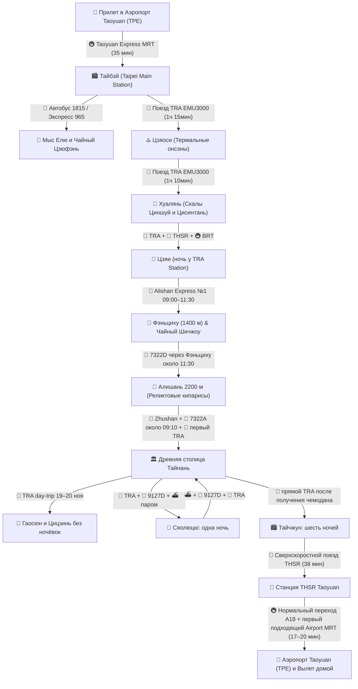

# 🚆 Бронирования: Поезда, Паромы и Трансферы (25 дней / 22 ночи)

> **Транспортная архитектура:** После горного блока база остаётся в Тайнане на четыре ночи. Гаосюн посещается двумя радиальными выездами без ночёвок; Сяолюцю — одна ночь. На остров едем через Kaohsiung TRA и 9127D, обратно — через Тайнань за чемоданом и прямым TRA в центр Тайчжуна.

---

## 📍 Сквозная схема маршрута и логистики

---

## 📋 График междугороднего транспорта

|   Дата...День   | Сегмент                                  |                           Транспорт                            |  Время в пути   | Способ бронирования / Оплата                     |
| :-------------: | :--------------------------------------- | :------------------------------------------------------------: | :-------------: | :----------------------------------------------- |
| **04 ноя (Ср)** | Москва (SVO) ➔ Гуанчжоу (CAN)             |                    ✈️ China Southern CZ656                     |    9 ч 45 мин   | Купленный сквозной билет; багаж до TPE            |
| **05 ноя (Чт)** | CAN-T2 ➔ Pearl Hotel North ➔ CAN-T2        |             🏨 Бесплатный шаттл China Southern                 |  22 ч стыковки  | Отель подтверждён; стойка T2 Gate 50              |
| **06 ноя (Пт)** | Гуанчжоу (CAN) ➔ Тайбэй (TPE)             |                   ✈️ China Southern CZ3097                    |    2 ч 15 мин   | Купленный сквозной билет                          |
| **06 ноя (Пт)** | Аэропорт TPE ➔ Тайбэй Главный              |                     🚇 Taoyuan Express MRT                     |     35 мин      | EasyCard на турникете (`~450 ₽`)                 |
| **08 ноя (Вс)** | Тайбэй (Янминшань)                       |      🚌 Горный автобус Red 5 / 108 в Янминшань (Сяоюкан)       |     45 мин      | EasyCard (`~170–340 ₽`)                          |
| **09 ноя (Пн)** | Северный берег (Елю ➔ Цзюфэнь)           | 🚌 Автобус 1815 + 🚖 прямое такси Елю ➔ Цзюфэнь + экспресс 965 |    Весь день    | EasyCard / касса (`~750–1 200 ₽` на 1 чел)       |
| **10 ноя (Вт)** | Тайбэй ➔ Цзяоси (Илань)                  |               🚆 Поезд TRA Tze-Chiang / EMU3000                |   1 ч 15 мин    | За 28 дней на сайте TRA (`~790 ₽`)               |
| **11 ноя (Ср)** | Цзяоси ➔ Хуалянь                         |                      🚆 Поезд TRA EMU3000                      |   1 ч 10 мин    | За 28 дней на сайте TRA (`~950 ₽`)               |
| **11 ноя (Ср)** | Хуалянь ➔ Скалы Циншуй и Цисинтань       |                🚗 Авто с водителем (customized)                |     4 часа      | `~5 120 ₽` (за всю машину на 4 часа)             |
| **13 ноя (Пт)** | Хуалянь ➔ Banqiao (板橋)                   |                🚆 Скоростной поезд TRA EMU3000                 | **2 ч 10 мин**  | За 28 дней на сайте TRA (`~1 230 ₽`)             |
| **13 ноя (Пт)** | Banqiao ➔ Chiayi (嘉義)                   |            🚄 Сверхскоростной поезд THSR (300 км/ч)            | **1 ч 15 мин**  | За 28 дней на сайте THSR (`~2 800 ₽`)            |
| **14 ноя (Сб)** | Цзяи ➔ Фэньциху (1400 м)                 |          🚂 Alishan Forest Railway, поезд №1 09:00 ➔ 11:30     | **~2 ч 30 мин** | Купить сразу при открытии (окно на сайте); e-ticket (`~1 075 ₽`) |
| **15 ноя (Вс)** | Фэньциху ➔ Шичжоу (радиальный выезд)     |                    🚖 Такси / автобус 7322 (5 км)              |     10 мин      | Наличные / EasyCard (`~300 ₽` на 1 чел)          |
| **16 ноя (Пн)** | Фэньциху ➔ Нацпарк Алишань (2200 м)      |             🚌 7322D, ориентир 11:30 ➔ 12:40                   | **~1 ч 10 мин** | EasyCard; сверить график и прийти заранее         |
| **16 ноя (Пн)** | Парк Алишань (Alishan ➔ Chaoping/Shenmu) |       🚂 Лесной поезд узкоколейки Alishan Forest Railway       |     15 мин      | В кассе Alishan Station (`~280–560 ₽`)           |
| **17 ноя (Вт)** | Нацпарк Алишань ➔ Вокзал Цзяи            |             🚌 7322A через Фэньциху, около 09:10 ➔ 11:55       | **~2 ч 45 мин** | EasyCard; целевой рейс (резервы 11:40, 12:40)     |
| **17 ноя (Вт)** | Вокзал Цзяи ➔ Тайнань (Tainan)           |               🚆 Поезд TRA Tze-Chiang / EMU3000                |  **35–45 мин**  | EasyCard / касса TRA (`~250 ₽`)                  |
| **18 ноя (Ср)** | Тайнань ➔ Анпин и рынок Ушэн             |                    🚖 Городской Uber / такси                   |    15–20 мин    | Приложение Uber (`~600 ₽` на 1 чел)              |
| **19 ноя (Чт)** | Тайнань ⇄ Гаосюн                         | 🚆 TRA + MRT/такси: Lotus Pond ➔ портовый кластер              | **~45–60 мин в сторону** | [TRA](https://www.railway.gov.tw/tra-tip-web/tip); рейс проверить за 2–4 недели (`~380 ₽` TRA round-trip) |
| **20 ноя (Пт)** | Тайнань ⇄ Gushan Ferry Pier              | 🚆 TRA + MRT Orange Line                                       | **~1 ч 15 мин в сторону** | Рейс проверить за 2–4 недели; EasyCard (`~170 ₽` round-trip) |
| **20 ноя (Пт)** | Гушань ⇄ Цицзинь                         | ⛴️ Городской паром                                             | **~5–10 мин** | EasyCard (`~170 ₽` round-trip) |
| **21 ноя (Сб)** | Тайнань ➔ Donggang                       | 🚆 TRA до Kaohsiung + 🚌 9127D                                 | **~2 ч 15 мин door-to-door** | Основной вариант; расписание проверить за 2–4 недели (`~530 ₽`) |
| **21 ноя (Сб)** | Порт Дунган ➔ Остров Сяолюцю             | ⛴️ Скоростной паром                                             | **20–30 мин** | [Tungliu](https://www.tungliuen.com/); рейс проверить за 2–4 недели (`~1 260 ₽` round-trip) |
| **21 ноя (Сб)** | Остров Сяолюцю (передвижение)            |             🛵 Одноместный E-bike без прав / скутер с МВУ      | до 2 тарифов | Без прав — по одному E-bike на человека (`~1 120–2 240 ₽`) |
| **22 ноя (Вс)** | Donggang ➔ Тайнань                       | 🚌 9127D до Kaohsiung + 🚆 TRA                                 | **~2 ч 30 мин door-to-door** | Расписание проверить за 2–4 недели (`~530 ₽`) |
| **22 ноя (Вс)** | Yoshi Hotel ➔ Тайчжун                    | 🚖 до Tainan TRA + 🚆 прямой TRA + 🚖 до Nagahiro Hotel        | **~2 ч 45 мин door-to-door** | Основной вариант с чемоданом (`~1 300 ₽`); THSR — Plan B |
| **28 ноя (Сб)** | Тайчжун ➔ Станция THSR Taoyuan           |            🚄 Сверхскоростной поезд THSR (300 км/ч)            |   **~38 мин** | [Расписание THSR](https://en.thsrc.com.tw/ArticleContent/a3b630bb-1066-4352-a1ef-58c7b4e8ef7c) (`~1 510 ₽`) |
| **28 ноя (Сб)** | Станция THSR Taoyuan ➔ Терминалы TPE     |             🚇 Taoyuan Airport MRT (A18 ➔ A12/A13)             | **17–20 мин** | Первый подходящий поезд в сторону аэропорта, без ожидания Express; [официальная схема](https://www.taoyuan-airport.com/airport_mrt?lang=en), EasyCard (`~70 ₽`) |

---

## 💡 Практические советы по транспорту

1. **Транспортная карта EasyCard (悠遊卡):** Универсальное платежное средство на всем острове: метро (MRT) в Тайбэе, Гаосюне и Тайчжуне, канатка Маокун, городские и пригородные автобусы, паром на Цицзинь, пригородные поезда TRA, комбини 7-Eleven и FamilyMart.
2. **Скоростная связка через остров (TRA + THSR):** Целевые поезда перепроверяются после открытия продаж. После THSR Chiayi используется BRT к TRA Chiayi Station, заселение рядом с вокзалом и спокойный городской вечер без рискованного подъема в горы.
3. **Сверхскоростные поезда THSR (Taiwan High Speed Rail):** Развивают скорость до 300 км/ч по западному побережью. Переезд Гаосюн (Zuoying) ➔ Тайчжун занимает **40 минут**, а Тайчжун ➔ станция аэропорта Таоюань — всего **38 минут**! Билеты поступают в продажу за 28 дней.
4. **Горная логистика Цзяи ➔ Фэньциху ➔ Алишань:** Билеты на субботний Alishan Express купить сразу после открытия бронирования (проверить актуальное окно на официальном сайте afrch.forest.gov.tw, обычно 12–15 дней); автобус 7302 остается планом B. После двух ночей в Фэньциху используется проходящий 7322D в Алишань, а во вторник после рассвета — целевой рейс вниз 7322A около 09:10 (без спешки; резервные автобусы — 11:40, 12:40).
5. **Островной уикенд:** Большой чемодан остаётся в Yoshi Hotel только после письменного подтверждения overnight-хранения. При отказе — согласовать багаж парома и B&B; Black Cat — Plan C. На паром прийти за 30–60 минут. Без подходящих прав использовать только юридически допустимый одноместный низкоскоростной E-bike.
6. **TRA или THSR 22 ноября:** Прямой TRA выбран из-за положения чемодана у Tainan TRA и прибытия в центр Тайчжуна. THSR быстрее только между платформами, но добавляет два наземных трансфера; использовать его как резерв при плохом вечернем окне TRA.
7. **Пересадка в аэропорт Taoyuan (TPE):** На станции THSR Taoyuan спокойно переходите к Airport MRT A18; план закладывает около 22 минут на переход и запас.
