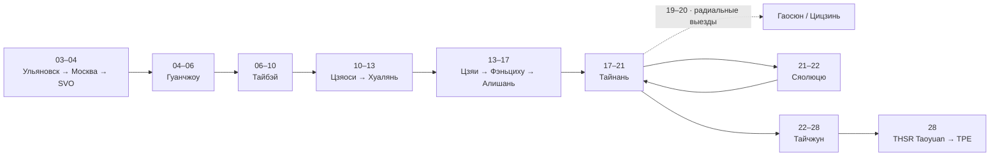

# 🚆 Транспортный пульт: поезда, паромы и трансферы (26 календарных дней / 22 ночи на Тайване)

> **Транспортная архитектура:** Дорога начинается **03–04 ноября** поездом Ульяновск ➔ Москва (купе, билет куплен), затем 04 ноября вылет CZ656 из SVO. После горного блока база остаётся в Тайнане на четыре ночи. Гаосюн посещается двумя радиальными выездами без ночёвок; Сяолюцю — одна ночь. На остров едем Tainan TRA → Xin Zuoying → пеший переход к THSR Zuoying → 9127D → Dongliu Ferry Terminal → паром; обратно возвращаемся через THSR Zuoying и TRA Xin Zuoying, забираем чемодан в Yoshi и садимся на прямой TRA в Тайчжун.

## 🚦 Критические действия

| Когда | Сегмент / зависимость | Статус | Следующее действие |
| :--- | :--- | :--- | :--- |
| Сейчас | Ульяновск ➔ Москва | ✅ Куплено | Сохранить PDF и данные посадки офлайн |
| После открытия продаж | TRA / THSR 10–13 ноября | 🟡 Нужно купить | Выбрать составы и сохранить билеты |
| До 14 ноября | Chiayi ➔ Fenqihu | 🟡 Нужен e-ticket | Купить именно билет Chiayi ➔ Fenqihu |
| 16–17 ноября | Горные автобусы 7322D / 7322A | ⚠️ Realtime | Утром проверить задержку; держать резервные рейсы |
| До 21 ноября | Хранение багажа в Yoshi | 🔒 Требует подтверждения | Получить письменное подтверждение overnight-хранения |
| 21–22 ноября | TRA ➔ 9127D ➔ паром ➔ TRA | ⚠️ Критическая связка | Проверить автобус, паром, погоду и время отправления |
| 22 ноября | Tainan ➔ Taichung | 🔵 Первый подходящий | После получения багажа садиться на прямой TRA около 18:30 |
| 28 ноября | Taichung ➔ TPE | 🟡 Нужно купить | Проверить THSR и заложить переход A18 ➔ A12/A13 |

> [!SUCCESS]- 🚂 Пре-сегмент 03–04 ноября: Ульяновск ➔ Москва (билет куплен)
> * **Маршрут:** Ульяновск Центр. (ул. Локомотивная, 96) ➔ **Москва Казанская** (Комсомольская пл., 2).
> * **Время:** отправление **03 ноя (вт) 20:45** по Ульяновску (UTC+4 / МСК+1), прибытие **04 ноя (ср) 09:56** по Москве (UTC+3 / МСК). В пути **14 ч 11 мин**.
> * **Место и тариф:** купе, **верхнее** место; тариф **2Ф, полный**. Включено: постельное бельё, основное питание, пресса, кондиционер, биотуалет. В вагоне — мультимедийный портал; платные услуги: вагон-ресторан / вагон-буфет, багажное купе.
> * **Документ:** электронный билет, контрольный купон **№ 77 665 043 657 695** (заказ `У0 77665043657695`), оформлен 17.09.2026, перевозчик ФПК / Куйбышевский филиал АО «ФПК». Посадка — по паспорту; предъявление посадочного купона не требуется. PDF-билет: [[Ульяновск-Москва поезд.pdf]]
> * **Оплата:** `3 942,20 ₽` банковской картой (итог по билету, онлайн-возврат возможен до 03.11.2026 19:45 МСК).
> * **Запас до вылета:** после прибытия на Казанский вокзал до вылета **CZ656 из SVO (Терминал C) в 23:15** остаётся около **13 часов**; регистрацию China Southern нужно завершить примерно к 20:15.

## 🧭 Маршрутный каркас

Сплошные стрелки — основной маршрут; пунктир — радиальные выезды без смены базы. Подробные номера транспорта и резервные сценарии находятся ниже, чтобы схема оставалась читаемой.

## ⏱ Междугородской каркас и обязательные билеты

| Дата | Переезд | Основной способ | Время | Статус | Ключевое действие |
| :--- | :--- | :--- | :--- | :--- | :--- |
| **Пре-сегмент (03–04 ноя)** | Ульяновск Центр. ➔ Москва Казанская | 🚂 ФПК, купе, верхнее место | **20:45–09:56** (14 ч 11 мин) | ✅ Куплено | Паспорт и PDF офлайн; билет относится к дорейсовому переезду |
| **04 ноя** | Казанская ➔ SVO, терминал C | 🚖 Такси или такси + 🚇 Аэроэкспресс | 1–2 ч | ⚠️ До 20:15 | Не задерживаться в центре Москвы |
| **04 ноя** | SVO ➔ Гуанчжоу CAN | ✈️ China Southern CZ656 | 9 ч 45 мин | ✅ В сквозном маршруте | Проверить билет и багаж до TPE |
| **05 ноя** | CAN-T2 ➔ Pearl Hotel North ➔ CAN-T2 | 🏨 Транзитный шаттл China Southern | 22 ч стыковки | ⚠️ Уточнить на стойке | После прилёта идти к Gate 50 |
| **06 ноя** | CAN ➔ TPE | ✈️ China Southern CZ3097 | 2 ч 15 мин | ✅ Сквозной билет | Сохранить оба посадочных документа |
| **10 ноя** | Тайбэй ➔ Цзяоси | 🚆 TRA Tze-Chiang / EMU3000 | 1 ч 15 мин | 🟡 За 28 дней | EMU3000 требует отдельного билета |
| **11 ноя** | Цзяоси ➔ Хуалянь | 🚆 TRA EMU3000 | 1 ч 10 мин | 🟡 За 28 дней | Купить отдельный билет TRA |
| **11 ноя** | Хуалянь ⇄ Chongde | 🚆 Local TRA №4187 / №4552 | 13:25–13:46/47 / 17:27–17:52 | ⚠️ Проверить примерно за неделю | EasyCard/iPASS/icash: tap in/out, без брони и закреплённых мест; к Chongde Beach идти местными дорогами, не вдоль Provincial Highway 9 |
| **13 ноя** | Хуалянь ➔ Banqiao | 🚆 TRA EMU3000 | **2 ч 10 мин** | 🟡 За 28 дней | Оставить запас до THSR |
| **13 ноя** | Banqiao ➔ Chiayi | 🚄 THSR | **1 ч 15 мин** | 🟡 За 28 дней | Купить стык с прибытием в Chiayi |
| **13 ноя** | THSR Chiayi Station ➔ TRA Chiayi | 🚌 BRT | — | 🔵 По прибытию THSR | Отдельно доехать BRT; заселиться рядом с TRA Station |
| **14 ноя** | Chiayi ➔ Fenqihu | 🚂 Alishan Forest Railway №1 | **09:00–11:30** | 🟡 Нужен e-ticket | Проверять только operational status линии |
| **16 ноя** | Fenqihu ➔ Alishan | 🚌 7322D, First Parking Lot | **11:30–12:40** | ⚠️ Realtime | Резервы: 7329A или 7322A |
| **17 ноя** | Alishan ➔ TRA Chiayi | 🚌 7322A | **09:10–11:55** | ⚠️ Realtime | Резервы: 11:40 или 12:40 |
| **17 ноя** | Chiayi ➔ Tainan | 🚆 TRA | 35–45 мин | 🔵 Первый подходящий | Прибыть к базе без лишнего THSR |
| **21 ноя** | Tainan ➔ Xin Zuoying ➔ THSR Zuoying ➔ Donggang | 🚆 TRA + пеший переход + 🚌 9127D | **08:20–10:50** | ⚠️ Realtime | Не перепутать THSR Zuoying с Kaohsiung Main |
| **21 ноя** | Donggang ➔ Xiaoliuqiu | ⛴️ Tungliu | около 11:30 | ⚠️ Оператор / погода | Прийти за 30–60 минут; следующий рейс — Plan B |
| **22 ноя** | Xiaoliuqiu ➔ Donggang ➔ Tainan | ⛴️ + 🚌 9127D + 🚆 TRA | **14:00–16:25** | ⚠️ Оператор / realtime | Plan B автобуса: 15:08–16:03 |
| **22 ноя** | Yoshi ➔ Tainan TRA ➔ Taichung | 🚖 за багажом + прямой 🚆 TRA | **16:25–21:15** | 🔵 Первый подходящий | Целевое окно TRA около 18:30 |
| **28 ноя** | Taichung ➔ THSR Taoyuan | 🚄 THSR | **~38 мин** | 🟡 Проверить / купить | [Расписание THSR](https://en.thsrc.com.tw/ArticleContent/a3b630bb-1066-4352-a1ef-58c7b4e8ef7c) |
| **28 ноя** | THSR Taoyuan ➔ терминалы TPE | 🚇 Airport MRT A18 ➔ A12/A13 | **17–20 мин** | 🔵 Первый подходящий | Заложить спокойный переход на A18 |

> [!IMPORTANT] Что должно быть подтверждено до поездки
> * Обратная ночь China Southern в Гуанчжоу: отдельный номер заказа и шаттл ещё не получены.
> * Хранение большого чемодана в Yoshi с 21-го до 22-го ноября: нужно письменное подтверждение отеля; без него использовать план B с багажом на острове.
> * Для 7322D/7322A, 9127D и паромов сохранять опубликованный план, но перепроверять выполнение утром поездки и не считать резервные времена гарантированными.

## 🧩 Критические связки

> [!INFO]- 04 ноября · Казанский вокзал ➔ SVO
> Прибытие в Москву — **09:56**, вылет CZ656 из SVO Terminal C — **23:15**. Запас около **13 часов**. Переезд в аэропорт завершить до начала регистрации примерно в **20:15**. Время в поездном билете указано по местному времени станции: Ульяновск UTC+4, Москва UTC+3.

> [!WARNING]- 14–17 ноября · Фэньциху ➔ Алишань ➔ Цзяи
> **14.11:** Alishan Forest Railway №1, Chiayi ➔ Fenqihu **09:00–11:30**; нужен именно e-ticket до Fenqihu.
>
> **16.11 основной сценарий:** 7322D от First Parking Lot **11:30–12:40**. Резервы: 7329A **12:50–14:05**, затем 7322A **14:00–15:10**.
>
> **17.11:** желаемый автобус 7322A **09:10–11:55** до TRA Chiayi. Резервы **11:40–14:10** и **12:40–15:10**. В день поездки проверять realtime, а не искать заново опубликованное расписание.
>
> В парке идти линейно через Zhaoping к Shenmu. Обратный Shenmu ➔ Alishan — отдельный one-way билет.

> [!WARNING]- 21–22 ноября · Сяолюцю и багаж
> **21.11 основной сценарий:**
> 1. Первый подходящий утренний TRA Tainan ➔ Xin Zuoying.
> 2. Пеший переход к THSR Zuoying.
> 3. 9127D **10:00–10:50** ➔ Dongliu Ferry Terminal.
> 4. Паром Tungliu около **11:30** ➔ Xiaoliuqiu.
>
> **22.11 основной сценарий:** паром около **14:00** ➔ 9127D **14:38–15:33** до THSR Zuoying ➔ пеший переход ➔ TRA Xin Zuoying ➔ Tainan ➔ Yoshi ➔ прямой TRA в Taichung около **18:30**.
>
> **Резервы:** следующий доступный паром; автобус 9127D **15:08–16:03**. Паром подтверждается оператором перед поездкой по сезону, погоде и состоянию моря.
>
> **Багаж:** большой чемодан оставлять в Yoshi только после письменного подтверждения хранения 21➔22 ноября. При отказе — согласовать багаж с B&B; Black Cat остаётся Plan C.

> [!INFO]- 28 ноября · Тайчжун ➔ аэропорт Taoyuan
> Основной вариант — THSR Taichung ➔ THSR Taoyuan, затем нормальный пеший переход к Airport MRT A18 и первый подходящий поезд к A12/A13. Плановый переход на станции — около 22 минут; Express ждать не требуется.

## 🚏 Гибкий местный транспорт

| Дата | Перемещение | Транспорт | Время / стоимость | Режим |
| :--- | :--- | :--- | :--- | :--- |
| **06 ноя** | TPE ➔ Taipei Main Station | 🚇 Taoyuan Express MRT | 35 мин; `~450 ₽` | EasyCard |
| **08 ноя** | Тайбэй ➔ Янминшань ➔ Jiantan ➔ Zhongshan ➔ Dongmen | 🚌 1717 + Red 5 / 260 / S15 + MRT | горный день; `~350 ₽` внутри города | EasyCard; после обеда Jiantan ➔ Zhongshan напрямую по Красной линии, 4 остановки / около 8 мин в поезде |
| **09 ноя** | Елю ➔ Цзюфэнь | 🚌 1815 + 🚖 такси + 🚌 965 | весь день; `~750–1 200 ₽` | EasyCard / касса |
| **11 ноя** | Хуалянь ⇄ Chongde | 🚆 Local TRA №4187 / №4552 | около 21–25 мин в сторону; `~200 ₽` по плану | EasyCard/iPASS/icash, автоматический тариф; не бронировать, проверить номера/время примерно за неделю и доступ к берегу |
| **15 ноя** | Фэньциху ⇄ Шичжоу | 🚌 7322A (утро) + 🚌 7302 (вечер) | ~10–12 мин в сторону; `~150 ₽` на человека | Общественный транспорт: утренний 7322A от First Parking Lot (`~75 ₽` / 26 NTD, EasyCard); вечерний 7302 от Shizhuo в 16:27 (`~75 ₽` / 26 NTD, EasyCard). Такси — только аварийный Plan B |
| **16 ноя** | Alishan ➔ Zhaoping | 🚂 Zhaoping Line | ~15 мин | Пакет admission + one-way; тариф проверить |
| **16 ноя** | Shenmu ➔ Alishan | 🚂 Shenmu Line | ~10 мин | Отдельный one-way билет |
| **18 ноя** | Тайнань ➔ Анпин / рынок Ушэн | 🚖 Uber / такси | 15–20 мин; `~600 ₽` на человека | По приложению |
| **19 ноя** | Тайнань ⇄ Гаосюн | 🚆 TRA + MRT / такси | ~45–60 мин в сторону; `~380 ₽` round-trip | Первый подходящий TRA |
| **20 ноя** | Тайнань ⇄ Gushan Ferry Pier | 🚆 TRA + MRT Orange Line | ~1 ч 15 мин в сторону; `~170 ₽` round-trip | EasyCard |
| **20 ноя** | Gushan ⇄ Cijin | ⛴️ Городской паром | ~5–10 мин; `~170 ₽` round-trip | EasyCard |
| **21 ноя** | Xiaoliuqiu | 🛵 Одноместный E-bike | `~1 120–2 240 ₽` | Только после подтверждения класса, документов и условий оператора; резерв — такси/шаттл |

> [!INFO]- Ориентиры стоимости
> Суммы ниже — ориентиры из текущего плана; фактическая цена зависит от тарифа, даты покупки и оператора.
>
> | Дата | Статья | Ориентир |
> | :--- | :--- | :---: |
> | **10 ноя** | TRA Тайбэй ➔ Цзяоси | `~790 ₽` |
> | **11 ноя** | TRA Цзяоси ➔ Хуалянь | `~950 ₽` |
> | **11 ноя** | Local TRA Hualien ⇄ Chongde | `~200 ₽` за два билета |
> | **13 ноя** | TRA Хуалянь ➔ Banqiao | `~1 230 ₽` |
> | **13 ноя** | THSR Banqiao ➔ Chiayi | `~2 800 ₽` |
> | **14 ноя** | Alishan Railway Chiayi ➔ Fenqihu | `~1 075 ₽` |
> | **15 ноя** | Автобусы 7322A + 7302 Фэньциху ⇄ Шичжоу | `~150 ₽` на человека |
> | **17 ноя** | TRA Chiayi ➔ Tainan | `~250 ₽` |
> | **21 ноя** | 9127D Zuoying ➔ Donggang | `~530 ₽` |
> | **21 ноя** | Паром Tungliu round-trip | `~1 260 ₽` |
> | **22 ноя** | 9127D Donggang ➔ Zuoying | `~530 ₽` |
> | **22 ноя** | Прямой TRA Tainan ➔ Taichung | `~1 300 ₽` |
> | **28 ноя** | THSR Taichung ➔ Taoyuan | `~1 510 ₽` |
> | **28 ноя** | Airport MRT A18 ➔ TPE | `~70 ₽` |

## 💳 Карты, билеты и правила использования

> [!TIP]- EasyCard и TRA / THSR
> EasyCard использовать для MRT, канатки Маокун, городских и пригородных автобусов, парома на Цицзинь, коротких Local / Regional поездок TRA и магазинов 7-Eleven / FamilyMart. Для Hualien ⇄ Chongde (№4187/4552) достаточно tap in/tap out: отдельный билет, QR-код и бронь места не нужны, сумма списывается по тарифу. EMU3000 и междугородние зарезервированные поездки покупать отдельными билетами.

> [!TIP]- Почему 22 ноября выбран TRA
> Прямой TRA оставляет багаж рядом с Tainan TRA и приводит в центр Тайчжуна. THSR быстрее между платформами, но добавляет наземные трансферы, поэтому остаётся резервом для плохого вечернего окна TRA.

> [!CAUTION]- Перед поездкой
> Для Local TRA Hualien ⇄ Chongde повторно проверить расписание примерно за неделю до поездки и в день отправления смотреть табло станции. Для горных автобусов и паромов опубликованное расписание фиксирует план, но не заменяет realtime / operational-проверку. На острове прийти к парому за 30–60 минут. E-bike брать только после подтверждения оператором класса транспорта, документов и страховки; если условия не подходят, заранее использовать такси/шаттл.

## 🔗 Проверенные источники

Проверено **16 сентября 2026**: [Alishan Forest Railway Main Line](https://afrch.forest.gov.tw/EN/0000115), [Taiwan Tourist Shuttle R0008](https://www.taiwantrip.com.tw/Frontend/Bustime/TimeTable/R0008), [R0007](https://www.taiwantrip.com.tw/Frontend/Bustime/TimeTable/R0007), [Taiwan Bus 7302](https://www.taiwanbus.tw/eBUSPage/Query/QueryResult.aspx?rno=73020&rn=1702839256978&lan=E), [9127D / R0065](https://www.taiwantrip.com.tw/Frontend/Bustime/TimeTable/R0065), [Tungliu official](https://www.tungliuen.com/), [официальные правила Changhua Roundhouse](https://www.railway.gov.tw/tra-tip-web/tip/file/9f079a27-b5df-4123-a0bb-816973cf0492), [THSR](https://en.thsrc.com.tw/ArticleContent/a3b630bb-1066-4352-a1ef-58c7b4e8ef7c) и [Taoyuan Airport MRT](https://www.taoyuan-airport.com/airport_mrt?lang=en).

Для Local TRA Hualien ⇄ Chongde добавлены официальные точки проверки: [поиск расписания TRA](https://www.railway.gov.tw/tra-tip-web/tip/tip001/tip112/querybytime?lang=EN_US), [электронные билеты TRA](https://tip.railway.gov.tw/tra-tip-web/tip/tip00C/tipC21/view?subCode=8ae4cac3756b7b41017573dbdd861878), [информация Hualien Station](https://tip.railway.gov.tw/tra-tip-web/tip/tip00H/tipH41/viewStaInfo/7000). Целевые времена №4187/4552 остаются плановыми до проверки примерно за неделю до 11 ноября.
