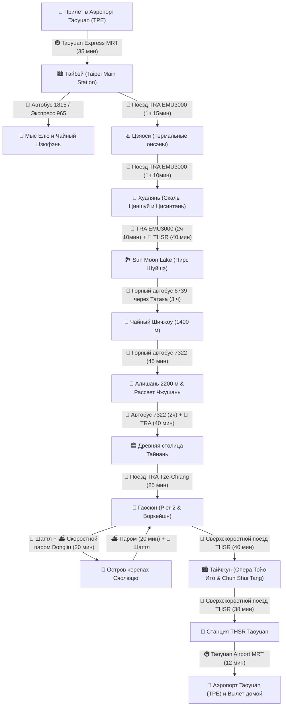

# 🚆 Бронирования: Поезда, Паромы и Трансферы (23 дня / 22 ночи)

> **Транспортная архитектура:** Линейный маршрут без обратных переездов вокруг всего острова Формоза: скоростная северная связка «Северный экспресс» (поезд TRA EMU3000 вдоль тихоокеанских скал до Banqiao + скоростная стрела THSR до Taichung и Sun Moon Lake) без пересылки багажа, горные автобусы в Алишань (Шичжоу 1400 м и нацпарк 2200 м), короткие переезды на юг по западному побережью (Цзяи ➔ Тайнань ~40 мин, Тайнань ➔ Гаосюн 25 мин), полноценный уикенд на коралловом острове черепах Сяолюцю на скоростном пароме (20 мин), скоростная магистраль THSR (300 км/ч) на север в Тайчжун (40 мин) и прямой скоростной трансфер из Тайчжуна в аэропорт Таоюань (38 мин + 12 мин Airport MRT).

---

## 📍 Сквозная схема маршрута и логистики

---

## 📋 График междугороднего транспорта

|  День  | Дата / День | Сегмент                                 |                  Транспорт                  |  Время в пути  | Способ бронирования / Оплата                 |
| :----: | :---------: | :-------------------------------------- | :-----------------------------------------: | :------------: | :------------------------------------------- |
| **01** | **29 окт (Чт)** | Москва (SVO) ➔ Гуанчжоу ➔ Тайбэй (TPE)  | ✈️ China Southern CZ8028 + CZ3097 (A350/B777)| 18 ч 25 мин    | Включено в авиабилет на Trip.com (`62 793 ₽`)|
| **02** | **30 окт (Пт)** | Аэропорт TPE ➔ Тайбэй Главный           |           🚇 Taoyuan Express MRT            |     35 мин     | EasyCard на турникете (`~450 ₽`)             |
| **04** | **01 ноя (Вс)** | Северный берег (Елю ➔ Цзюфэнь) | 🚌 Автобус 1815 + 🚖 прямое такси Елю ➔ Цзюфэнь + экспресс 965 | Весь день | EasyCard / касса (`~750–1 200 ₽` на 1 чел) |
| **05** | **02 ноя (Пн)** | Тайбэй (Янминшань)                      |     🚌 Горный автобус Red 5 / 108 в Янминшань (Сяоюкан) | 45 мин | EasyCard (`~170–340 ₽`)                    |
| **06** | **03 ноя (Вт)** | Тайбэй ➔ Цзяоси (Илань)                 |      🚆 Поезд TRA Tze-Chiang / EMU3000      |   1 ч 15 мин   | За 28 дней на сайте TRA (`~790 ₽`)           |
| **07** | **04 ноя (Ср)** | Цзяоси ➔ Хуалянь                        |            🚆 Поезд TRA EMU3000             |   1 ч 10 мин   | За 28 дней на сайте TRA (`~950 ₽`)           |
| **07** | **04 ноя (Ср)** | Хуалянь ➔ Скалы Циншуй и Цисинтань      |            🚗 Авто с водителем (customized)  |     4 часа     | `~5 120 ₽` (за всю машину на 4 часа)         |
| **09** | **06 ноя (Пт)** | Хуалянь ➔ Banqiao (板橋)                  |       🚆 Скоростной поезд TRA EMU3000       |  **2 ч 10 мин** | За 28 дней на сайте TRA (`~1 230 ₽`)         |
| **09** | **06 ноя (Пт)** | Станция Banqiao ➔ Станция THSR Taichung |  🚄 Сверхскоростной поезд THSR (300 км/ч)   |   **40 мин**   | За 28 дней на сайте THSR (`~2 100 ₽`)        |
| **09** | **06 ноя (Пт)** | THSR Taichung ➔ Sun Moon Lake (Шуйшэ)   |        🚌 Шаттл Taiwan Tourist Shuttle 6670        |  **~1 ч 20 мин**  | EasyCard на посадке (`~350 ₽`)               |
| **10** | **07 ноя (Сб)** | Sun Moon Lake (Шуйшэ) ➔ Alishan         |  🚌 Горный автобус 6739 (через Татака 2610 м)  |    **~3 ч**    | Предварительная бронь Yuanlin Bus (`~700–840 ₽`) |
| **10** | **07 ноя (Сб)** | Alishan ➔ Шичжоу (1400 м)                |        🚌 Локальный автобус 7322/7329        |     35 мин     | EasyCard на посадке (`~170–280 ₽`)           |
| **11** | **08 ноя (Вс)** | Шичжоу ➔ Фэньциху ➔ Алишань (2200 м)       |        🚌 Горный автобус 7322 / 7302        |     45 мин     | EasyCard на посадке (`~270–450 ₽`)           |
| **12** | **09 ноя (Пн)** | Рассвет Чжушань (2451 м)                | 🚂 Узкоколейный поезд Zhushan Sunrise Train |     25 мин     | На станции Alishan накануне (`~420 ₽`)       |
| **12** | **09 ноя (Пн)** | Нацпарк Алишань ➔ Вокзал Цзяи           |       🚌 Горный автобус 7322 (спуск)        |      2 ч       | Бронь ibon в 7-Eleven / EasyCard (`~700 ₽`)  |
| **12** | **09 ноя (Пн)** | Вокзал Цзяи ➔ Тайнань (Tainan)          |      🚆 Поезд TRA Tze-Chiang / EMU3000      | **38–45 мин**  | EasyCard / касса TRA (`~200–380 ₽`)          |
| **15** | **12 ноя (Чт)** | Тайнань ➔ Гаосюн (Kaohsiung)            |   🚆 Поезд TRA Tze-Chiang / Local Express   | **25–30 мин**  | EasyCard на турникете (`~190–300 ₽`)         |
| **16** | **13 ноя (Пт)** | Гаосюн ➔ Остров Цицзинь (туда-обратно)  |      ⛴️ Городской паром Гушань–Цицзинь      |     5 мин      | EasyCard (`~85 ₽` в одну сторону)            |
| **17** | **14 ноя (Сб)** | Гаосюн ➔ Порт Дунган                    |         🚖 Шаттл / такси к причалу          |   35–40 мин    | На месте / Klook (`~500 ₽` на 1 чел)         |
| **17** | **14 ноя (Сб)** | Порт Дунган ➔ Остров Сяолюцю            |     ⛴️ Скоростной паром Dongliu Express     |   **20 мин**   | Касса порта / Klook (`~1 150 ₽` round-trip)  |
| **17** | **14 ноя (Сб)** | Остров Сяолюцю (передвижение)           |      🛵 Электробайк (E-bike, без прав)      |     2 дня      | Прокат у пирса Байша (`~980 ₽` / день)       |
| **18** | **15 ноя (Вс)** | Порт Дунган ➔ Гаосюн (Pier-2)           |         🚖 Шаттл / такси от причала         |   35–40 мин    | На месте / Klook (`~500 ₽` на 1 чел)         |
| **20** | **17 ноя (Вт)** | Гаосюн (Zuoying) ➔ Тайчжун              |  🚄 Сверхскоростной поезд THSR (300 км/ч)   |   **40 мин**   | За 28 дней на сайте THSR (`~2 210 ₽`)        |
| **24** | **21 ноя (Сб)** | Тайчжун ➔ Станция THSR Taoyuan          |  🚄 Сверхскоростной поезд THSR (300 км/ч)   |   **38 мин**   | За 28 дней на сайте THSR (`~1 510 ₽`)        |
| **24** | **21 ноя (Сб)** | Станция THSR Taoyuan ➔ Терминалы TPE    |   🚇 Taoyuan Airport MRT (A18 ➔ A12/A13)    |   **12 мин**   | EasyCard (`~70 ₽`)                           |

---

## 💡 Практические советы по транспорту

1. **Транспортная карта EasyCard (悠遊卡):** Универсальное платежное средство на всем острове: метро (MRT) в Тайбэе, Гаосюне и Тайчжуне, канатка Маокун, городские и пригородные автобусы, паром на Цицзинь, пригородные поезда TRA, комбини 7-Eleven и FamilyMart.
2. **Скоростная связка «Северный экспресс» (TRA EMU3000 + THSR):** Позволяет выехать из Хуаляня в 07:30 утра и уже к 12:10 быть на Sun Moon Lake. Пересадка на станции Banqiao занимает 5–7 минут в одном терминале, а чемоданы комфортно едут с вами без почтовых пересылок.
3. **Сверхскоростные поезда THSR (Taiwan High Speed Rail):** Развивают скорость до 300 км/ч по западному побережью. Переезд Гаосюн (Zuoying) ➔ Тайчжун занимает **40 минут**, а Тайчжун ➔ станция аэропорта Таоюань — всего **38 минут**! Билеты поступают в продажу за 28 дней.
4. **Автобусы Алишаня и Sun Moon Lake (7322/7329/6739/6670):** Горный автобус **6739** (Sun Moon Lake ➔ Алишань через перевал Татака) ходит 1 раз в день микроавтобусом на 19–20 мест и требует **предварительной брони** у перевозчика Yuanlin Bus. На обратный спуск из Алишаня (7322) обязательно берите талон с бронью места в терминале ibon магазина 7-Eleven накануне!
5. **Островной уикенд на Сяолюцю:** Все тяжелые чемоданы бесплатно остаются в камере хранения отеля в Гаосюне. Скоростной паром *Dongliu Express* из порта Дунган идет ровно 20 минут.
6. **Прямая пересадка в аэропорт Taoyuan (TPE):** На станции THSR Taoyuan выход прямо на платформу надземного метро Airport MRT (A18). Поезда ходят каждые 7–10 минут, время в пути до гейта — 12 минут.
