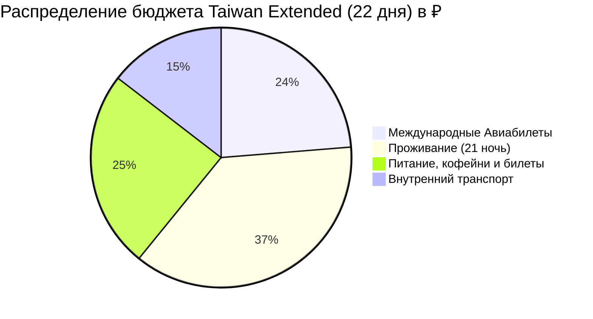

# 💰 Полный Бюджет: Taiwan Extended (22 дня / 21 ночь)

> [!summary]+ 💰 Общий бюджет поездки: **~245 000 ₽** (на 1 человека под ключ)
> - ✈️ **Международный авиаперелет (Москва ➔ Тайбэй ➔ Москва):** `58 000 ₽`
> - 🏨 **Проживание (21 ночь в комфортных дизайн-отелях, онсэнах, чайном доме в Шичжоу и отеле в Алишане):** `~90 860 ₽` (`~32 450 TWD`)
> - 🚄 **Внутренний транспорт (поезда TRA, поезд South-Link, 2 поезда THSR, паром Сяолюцю, паром Цицзинь, канатная дорога Маокун, авто на день, автобусы Алишаня, EasyCard, электробайки):** `~35 560 ₽` (`~12 700 TWD`)
> - 🍜 **Питание, спешелти-кофейни, чайные дегустации Гунфу Ча, билеты в парки и подарки:** `~60 200 ₽` (`~21 500 TWD`)

---

## 📋 Детализация расходов по категориям

### 1. ✈️ Транспорт и Логистика (~93 560 ₽)

| Статья расходов | TWD | RUB (x2.80) | Описание |
| :--- | :---: | :---: | :--- |
| Международный авиабилет туда-обратно | — | `58 000 ₽` | С 1 удобной пересадкой (багаж 23 кг) |
| Автомобиль с водителем на день (Северный берег) | `2 000 TWD` | `5 600 ₽` | Елю, Шифэнь, Цзюфэнь (доля на 1 чел) |
| Поезда TRA + связка THSR (Тайбэй–Цзяоси–Хуалянь, South-Link Чишан–Гаосюн + THSR в Цзяи, Цзяи–Тайнань, Тайнань–Гаосюн) | `2 200 TWD` | `6 160 ₽` | Поезда EMU3000, Tze-Chiang и стрела THSR |
| Канатная дорога Maokong Gondola со стеклянным дном | `120 TWD` | `340 ₽` | По карте EasyCard |
| Скоростной поезд THSR (Гаосюн Zuoying ➔ Тайчжун) | `790 TWD` | `2 210 ₽` | Скорость 300 км/ч (40 мин) |
| Скоростной поезд THSR (Тайчжун ➔ станция аэропорта Taoyuan) | `540 TWD` | `1 510 ₽` | Скорость 300 км/ч (38 мин) |
| Скоростной паром на остров Сяолюцю (туда-обратно) | `410 TWD` | `1 150 ₽` | Скоростной паром 20 мин |
| Паром на остров Цицзинь в Гаосюне | `60 TWD` | `170 ₽` | По EasyCard (2 поездки) |
| Аренда электробайков (Чишан, Сяолюцю) | `700 TWD` | `1 960 ₽` | Рисовые поля Чишана + остров Сяолюцю |
| Горные автобусы 7329/7322 (THSR Цзяи ➔ Шичжоу ➔ Алишань ➔ Цзяи) | `545 TWD` | `1 530 ₽` | Подъем на 1400 м и 2200 м и спуск |
| Рассветный поезд узкоколейки Чжушань (Алишань) | `150 TWD` | `420 ₽` | Билет на рассветный рейс |
| Такси и трансферы (скалы Циншуй, Рифтовая долина, Дунган, такси Сыцао/Qigu) | `2 200 TWD` | `6 160 ₽` | Доля на 1 чел |
| EasyCard (метро Тайбэя/Гаосюна/Тайчжуна, Taoyuan Airport MRT, автобусы) | `1 500 TWD` | `4 200 ₽` | Все городские перемещения за 22 дня |
| Логистический резерв и мелкие трансферы | `1 485 TWD` | `4 150 ₽` | Резервный буфер на транспорт |
| **Итого внутренний транспорт (без авиа)** | **`~12 700 TWD`** | **`~35 560 ₽`** | |

---

### 2. 🏨 Проживание (21 ночь — ~90 860 ₽)

* **Средняя стоимость за ночь на 1 чел:** `~1 545 TWD` (`~4 326 ₽`), что строго укладывается в норматив **3 000 – 6 000 ₽ / ночь**.
* **Разбивка по категориям размещения:**
  * 🏙️ **Городские дизайн-отели (Тайбэй 4н, Тайнань 3н, Гаосюн 4н, Тайчжун 3н — 14 ночей):** `~20 650 TWD` (`~57 820 ₽`).
  * ♨️ **Термальные онсэн-отели (Цзяоси — 2 ночи):** `~3 600 TWD` (`~10 080 ₽`).
  * 🌊 **Океанские и сельские миньсу (Хуалянь 2н, Чишан 1н — 3 ночи):** `~4 200 TWD` (`~11 760 ₽`).
  * 🌲 **Высокогорное проживание в Алишане (Шичжоу 1400 м 1н + парк 2200 м 1н — 2 ночи):** `~4 000 TWD` (`~11 200 ₽`).
* **Итого за 21 ночь:** **`~32 450 TWD`** (**`~90 860 ₽`**).

---

### 3. 🍜 Питание, Кофейни, Чайные дегустации и Билеты (~60 200 ₽)

* **Спешелти-кофе и ланчи в Workation-дни (10 дней):** `~4 500 TWD` (`~12 600 ₽`).
* **Полноценное питание и ночные рынки в активные дни (12 дней):** `~9 500 TWD` (`~26 600 ₽`).
* **Чайные дегустации Гунфу Ча и Bubble Tea (A-Mei, Маокун, Chun Shui Tang 1983 г., плантации Шичжоу):** `~2 500 TWD` (`~7 000 ₽`).
* **Входные билеты и активности (Елю, Юньшаньшуй, нацпарк Алишань, Сыцао, снорклинг на Сяолюцю):** `~1 800 TWD` (`~5 040 ₽`).
* **Закупка элитного чая улун (Алишань, Тегуанинь) и пирожных Фэнлису от Miyahara / SunnyHills:** `~3 200 TWD` (`~8 960 ₽`).
* **Итого по статье:** **`~21 500 TWD`** (**`~60 200 ₽`**).
