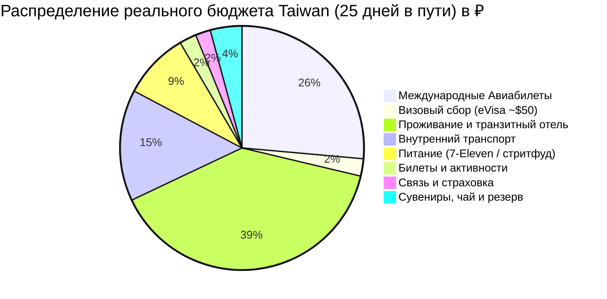

# 💰 Полный Бюджет: Taiwan (25 дней в пути / 22 ночи в отелях)

> [!summary]+ 💰 Общий калиброванный бюджет поездки: **209 734 ₽** (~209 700 ₽ на 1 человека под ключ)
> - ✈️ **Международный авиаперелет (Москва ➔ Тайбэй ➔ Москва):** `55 412 ₽`
> - 🛂 **Визовый сбор (Электронная виза eVisa онлайн, ~1 646 TWD / ~$50–55):** `4 800 ₽`
> - 🏨 **Проживание (22 ночи на Тайване + отдельный номер в Гуанчжоу):** `~82 357 ₽`
> - 🚄 **Внутренний транспорт (TRA, THSR, Alishan Express, автобусы, машина в Хуаляне, паромы, EasyCard и E-bike):** `~30 925 ₽`
> - 🍜 **Ежедневное питание (7-Eleven, FamilyMart, локальный стритфуд и ночные рынки — 23 дня):** `~18 500 ₽`
> - 🎟️ **Входные билеты и активности (Елю, Алишань, Анпин и снорклинг на Сяолюцю):** `~4 740 ₽`
> - 📱 **Связь и страховка (e-SIM 5G безлимит Chunghwa Telecom + полис ВЗР с активным отдыхом):** `~4 200 ₽`
> - 🎁 **Сувениры, чай и резерв на непредвиденные расходы:** `~8 800 ₽`

---

## 📋 Детализация расходов по категориям

### ✈️ 1. Международный авиаперелет и визовый сбор (60 212 ₽)

| Статья расходов | Стоимость (RUB) | Детали и параметры |
| :--- | :---: | :--- |
| **Сбор за электронную визу eVisa** | **`4 800 ₽`** | **~1 646 TWD / ~$50–55** онлайн на портале BOCA картой (Single Entry, 30 дней) |
| Москва (SVO) ➔ Тайбэй (TPE) ➔ Москва (China Southern) | **`55 412 ₽`** | Рейс CZ с удобной пересадкой в CAN, багаж 23 кг + ручная кладь 8 кг *(оплачено онлайн)* |
| **Подитог по визе и авиабилетам** | **`60 212 ₽`** | |

---

### 🚄 2. Поезда, междугородний транспорт и трансферы (~31 095 ₽)

#### 2.1. 🚗 Индивидуальные автомобили с водителем (Private Charters)
*Комфортные поездки в труднодоступные природные локации.*

| Маршрут и локация | Время / Условия | Стоимость (RUB) | Что включено |
| :--- | :---: | :---: | :--- |
| **Хуалянь (Восточный берег):** «Customized» | **4 часа** | **`5 120 ₽`** | Отель/Вокзал ➔ Скалы Циншуй (Chongde Recreation Area) ➔ Пляж Цисинтань ➔ Возвращение в отель / Jiangjunfu 1936 |
| **Подитог по авто с водителем** | | **`5 120 ₽`** | |

---

#### 2.2. 🚄 Междугородние поезда (Сверхскоростные THSR 300 км/ч и экспрессы TRA)
*Магистральные перемещения между ключевыми городами.*

| Тип поезда / Направление | Маршрут и время | Стоимость (RUB) | Класс и бронирование |
| :--- | :--- | :---: | :--- |
| 🚄 **THSR (Стрела 300 км/ч)** | Banqiao ➔ Chiayi *(1 ч 15 мин)* | `2 800 ₽` | Гарантированное место, онлайн-бронь за 28 дней |
| 🚆 **TRA, прямой поезд** | Тайнань ➔ Тайчжун *(около 2 ч)* | `1 300 ₽` | День 19 (22.11), меньше пересадок с чемоданом; THSR — Plan B |
| 🚄 **THSR (Стрела 300 км/ч)** | Тайчжун ➔ Станция Taoyuan *(38 мин)* | `1 510 ₽` | Прямой экспресс к аэропорту в день вылета |
| 🚆 **TRA EMU3000 Экспресс** | Хуалянь ➔ Banqiao *(2 ч 10 мин)* | `1 230 ₽` | Скоростная связка вдоль Тихого океана |
| 🚆 **TRA Региональные поезда** | Тайбэй–Цзяоси, Цзяоси–Хуалянь, Цзяи–Тайнань и 2 поездки Тайнань⇄Гаосюн | `2 810 ₽` | Четыре плеча day-trip 19–20 ноября добавлены |
| **Подитог по поездам** | | **`9 650 ₽`** | |

---

#### 2.3. 🌲 Горная логистика Алишаня (Фэньциху 1400 м, Шичжоу и нацпарк 2200 м)
*Транспорт для подъема в высокогорье, лесной узкоколейки и спуска в Цзяи.*

| Сегмент маршрута | Транспорт | Стоимость (RUB) | Примечание |
| :--- | :--- | :---: | :--- |
| Цзяи ➔ Фэньциху (1400 м) | 🚂 Alishan Express №1 *(09:00–11:30)* | `1 075 ₽` | Основная линия; покупка сразу при открытии продаж |
| Фэньциху ➔ Шичжоу (радиальный выезд) | 🚖 Такси / автобус *(10 мин)* | `300 ₽` | Радиальный выезд 5 км на чайные тропы |
| Фэньциху ➔ Нацпарк Алишань (2200 м) | 🚌 Автобус 7322D *(ориентир 11:30–12:40)* | `250 ₽` | Сверить расписание, оплата EasyCard |
| Парк Алишань (Alishan ➔ Chaoping / Shenmu) | 🚂 Узкоколейка Forest Railway | `560 ₽` | Исторический поезд узкоколейки (2 поездки) |
| Нацпарк Алишань ➔ Вокзал Цзяи (спуск) | 🚌 Автобус 7322A *(целевой 09:10–11:55)* | `700 ₽` | Через Фэньциху; сверить график (резерв 11:40/12:40) |
| **Подитог по горному транспорту** | | **`2 885 ₽`** | |

---

#### 2.4. 🐢 Остров Сяолюцю и Побережье Гаосюна (Морская логистика)
*Уикенд на коралловом острове и гавань Гаосюна.*

| Сегмент | Транспорт | Стоимость (RUB) | Примечание |
| :--- | :--- | :---: | :--- |
| Порт Дунган ➔ Остров Сяолюцю (туда-обратно) | ⛴️ Скоростной паром Dongliu Express *(20 мин)* | `1 150 ₽` | Билет Round-trip туда и обратно |
| Тайнань ➔ Donggang ➔ Тайнань | 🚆 TRA + 🚌 9127D в обе стороны | `1 060 ₽` | Основной маршрут 21–22 ноября |
| Остров Сяолюцю (исследование острова) | 🛵 Одноместный E-bike без прав, до 2 тарифов | `2 240 ₽` | По одному E-bike на человека; двухместный скутер требует прав и МВУ |
| Гаосюн (Гушань) ➔ Остров Цицзинь (туда-обратно) | ⛴️ Городской паром *(5 мин)* | `170 ₽` | Оплата по EasyCard |
| **Подитог по морской логистике** | | **`4 730 ₽`** | Паром оценён в 450 NTD round-trip |

---

#### 2.5. 🚇 Городской транспорт, EasyCard и Буфер
*Все перемещения внутри городов и радиальные выезды на автобусах за 23 дня.*

| Статья | Назначение | Стоимость (RUB) | Примечание |
| :--- | :--- | :---: | :--- |
| **Карта EasyCard (悠遊卡)** | Метро Тайбэя/Гаосюна/Тайчжуна, Taoyuan Airport MRT (35 мин), автобус 1815 в Елю, экспресс 965 в Цзюфэнь, городские автобусы | `4 800 ₽` | Основная транспортная карта (пополнение по мере поездок) |
| **Горные автобусы в Янминшань** | Автобусы Red 5 / 108 к фумаролам вулкана Сяоюкан | `340 ₽` | Оплата по EasyCard |
| **Городские такси и резервный буфер** | Такси в Цзяи и Тайнане, резерв на Цзюфэнь/Елю и вечерние возвращения | `3 400 ₽` | Ten Drum исключен; базовая транспортная подушка сохранена |
| **Подитог по городскому транспорту и буферам** | | **`8 540 ₽`** | |

---

| 📊 Сводка по транспортному блоку | Стоимость (RUB) |
| :--- | :---: |
| ✈️ Международный авиаперелет (China Southern Москва–Тайбэй–Москва) | `55 412 ₽` |
| 🚗 Автомобиль с водителем (Хуалянь 4 ч) | `5 120 ₽` |
| 🚄 Междугородние поезда (2x THSR + поезда TRA) | `9 650 ₽` |
| 🌲 Горный транспорт Алишаня и Фэньциху (поезд + автобусы) | `2 885 ₽` |
| 🐢 Остров Сяолюцю и паромы (паромы + 9127D + электробайк) | `4 730 ₽` |
| 🚇 Городской транспорт, автобусы и такси-буфер (EasyCard + автобус 1815/965 + автобусы Янминшаня + такси) | `8 540 ₽` |
| **ИТОГО ВЕСЬ ТРАНСПОРТ ПО ТАЙВАНЮ (без авиа):** | **`~30 925 ₽`** |
| **ИТОГО С АВИАПЕРЕЛЕТОМ:** | **`~86 337 ₽`** |

---

### 🏨 3. Проживание (Тайвань + транзитный апгрейд — 82 357 ₽)

* **Средняя стоимость за ночь на 1 чел:** `~3 662 ₽`.
* **Текущий статус оплат:** **Все 22 ночи (100%) уже оплачены онлайн** (`80 556,96 ₽`).
* **Гуанчжоу, ночь 5→6 ноября:** бесплатные ночь, завтрак и шаттл в Southern Airlines Pearl Hotel (North District); доплата за отдельный номер `150 CNY` / планово `~1 800 ₽` *(план, оплата при заселении)*.
* **Разбивка по категориям и отелям №1:**
  * 🏙️ **Городские отели (Тайбэй 4н, Цзяи 1н, Тайнань 4н, Тайчжун 6н — 15 ночей):** `51 171 ₽`
    * *Тайбэй (Dongmen Hotel, 4н: 06 ноя – 10 ноя, оплачено онлайн):* `17 501 ₽` *(17 500,72 ₽)*
    * *Цзяи (StarYi Hotel, 1н: 13 ноя – 14 ноя, оплачено онлайн):* `3 249 ₽` *(3 248,81 ₽)*
    * *Тайнань (Yoshi Hotel, 4н: 17–21 ноя, оплачено онлайн):* `15 845 ₽` *(15 844,58 ₽)*
    * *Тайчжун (Nagahiro Hotel- Taichung Wenxin, 6н: 22–28 ноя, оплачено онлайн):* `14 577 ₽` *(14 577,14 ₽)*
  * ♨️ **Термальный онсэн-отель (Цзяоси — 1 ночь: 10 ноя – 11 ноя):** `3 121 ₽`
    * *Цзяоси (Mutaixu hot spring, 1н, оплачено онлайн):* `3 121 ₽` *(3 121,35 ₽)*
  * 🌊 **Отели у океана и островной B&B (Хуалянь 2н, Сяолюцю 1н — 3 ночи):** `8 371 ₽`
    * *Хуалянь (Together hotel-Hualien Zhongshan, 2н: 11 ноя – 13 ноя, оплачено онлайн):* `4 329 ₽` *(4 328,70 ₽)*
    * *Остров Сяолюцю (Sea travel hotel, 1н: 21 ноя – 22 ноя, оплачено онлайн):* `4 042 ₽` *(4 041,89 ₽)*
  * 🌲 **Горный поселок Фэньциху (2 ночи: 14 ноя – 16 ноя):** `10 032 ₽`
    * *Фэньциху (Yahu Hotel, 2н: 14 ноя – 16 ноя, оплачено онлайн):* `10 032 ₽` *(10 032,39 ₽)*
  * 🌲 **Высокогорный нацпарк Алишань (1 ночь: 16 ноя – 17 ноя):** `7 861 ₽`
    * *Алишань 2200 м (Ho Fong Villa Hotel, 1н: 16 ноя – 17 ноя, оплачено онлайн):* `7 861 ₽` *(7 861,38 ₽)*
* **Итого за 22 ночи на Тайване:** **`~80 557 ₽`** *(в среднем ~3 662 ₽ / ночь)*.
* **Итого проживание с транзитным апгрейдом:** **`~82 357 ₽`**.

---

### 🍜 4. Ежедневное питание (~18 500 ₽ на 23 дня)
*Формат: 7-Eleven / FamilyMart 2–3 раза в день + локальный стритфуд, бенто-боксы и ночные рынки (~800 ₽ в день).*
* **Завтраки в 7-Eleven (23 дня):** онигири с тунцом/лососем, сэндвичи, чайные яйца, холодный чай/кофе (`~200 ₽ / день` ➔ `~4 600 ₽`).
* **Обеды (23 дня):** горячие бэнто-боксы (TRA Bento, кацу карри в комбини, лапша, пельмени) (`~300 ₽ / день` ➔ `~6 900 ₽`).
* **Ужины и вечерний стритфуд (23 дня):** готовые наборы из 7-Eleven, уличные баоцзы, перекусы на ночных рынках (`~300–320 ₽ / день` ➔ `~7 000 ₽`).
* **Итого питание на весь тур:** **`~18 500 ₽`**.

---

### 🎟️ 5. Входные билеты и активности (~4 740 ₽)
* **Геопарк Елю (Голова королевы):** `~340 ₽` (120 NTD)
* **Национальный лесной парк Алишань:** `~840 ₽` (300 NTD)
* **Исторические объекты Тайнаня (Анпин Дерево-дом, Форт Зеландия, Чикань, Конфуций):** `~710 ₽` (250 NTD)
* **Рассветный снорклинг с гигантскими черепахами на Сяолюцю (гид + экипировка):** `~1 400 ₽` (500 NTD)
* **Рассветный поезд Zhushan, музеи и резерв на билеты:** `~1 450 ₽`
* **Итого билеты:** **`~4 740 ₽`**.

---

### 🎁 6. Сувениры, чай и подарки (~8 800 ₽, включая резерв)
* Закупка свежего высокогорного чая улун (Алишань/Шичжоу): `~3 000 ₽`.
* Ананасовые пирожные SunnyHills / сувениры: `~2 000 ₽`.
* Резерв на замену лесного поезда автобусом/трансфером, погоду и рост тарифов: `~3 800 ₽`.
* **Итого сувениры и резерв:** **`~8 800 ₽`**.

---

### 📱 7. Связь, страховка и интернет (~4 200 ₽)
* **Туристическая e-SIM Chunghwa Telecom (30 дней безлимит 5G):** `~1 600 ₽`
* **Медицинская страховка ВЗР (покрытие $50 000, активный отдых/треккинг/снорклинг):** `~2 600 ₽`
* **Итого связь и страховка:** **`~4 200 ₽`**.
