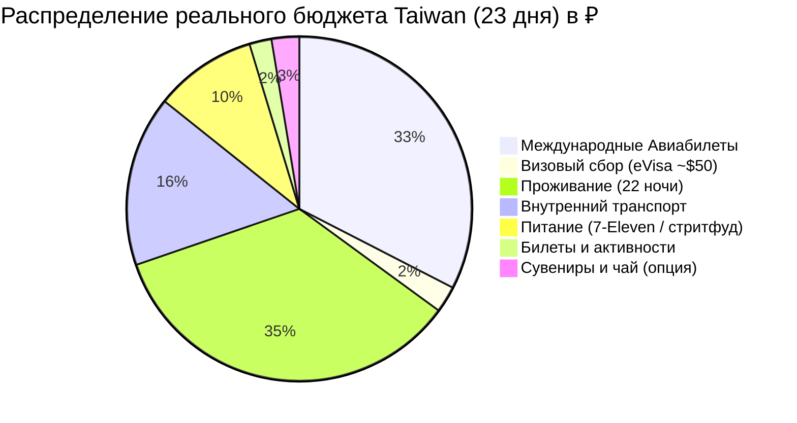

# 💰 Полный Бюджет: Taiwan (23 дня / 22 ночи)

> [!summary]+ 💰 Общий калиброванный бюджет поездки: **192 851 ₽** (~193 000 ₽ на 1 человека под ключ)
> - ✈️ **Международный авиаперелет (Москва ➔ Тайбэй ➔ Москва):** `62 793 ₽`
> - 🛂 **Визовый сбор (Электронная виза eVisa онлайн, ~1 646 TWD / ~$50–55):** `4 800 ₽`
> - 🏨 **Проживание (22 ночи по Варианту №1):** `~66 888 ₽`
> - 🚄 **Внутренний транспорт (поезда TRA EMU3000, 4 скоростных поезда THSR, автобусы и поезда Елю/Цзюфэнь, машина в Хуаляне, паром Сяолюцю, паром Цицзинь, автобусы Янминшаня, автобусы Алишаня и Sun Moon Lake, EasyCard, электробайк):** `~30 870 ₽`
> - 🍜 **Ежедневное питание (7-Eleven, FamilyMart, локальный стритфуд и ночные рынки — 23 дня):** `~18 500 ₽`
> - 🎟️ **Входные билеты и активности (Елю, нацпарк Алишань, лодка Сыцао, снорклинг с черепахами на Сяолюцю):** `~4 000 ₽`
> - 🎁 **Сувениры, чай и подарки (опциональный фонд):** `~5 000 ₽`

---

## 📋 Детализация расходов по категориям

### ✈️ 1. Международный авиаперелет и визовый сбор (67 593 ₽)

| Статья расходов | Стоимость (RUB) | Детали и параметры |
| :--- | :---: | :--- |
| **Сбор за электронную визу eVisa** | **`4 800 ₽`** | **~1 646 TWD / ~$50–55** онлайн на портале BOCA картой (Single Entry, 30 дней) |
| Москва (SVO) ➔ Тайбэй (TPE) ➔ Москва (China Southern) | **`62 793 ₽`** | Рейс CZ с удобной пересадкой в CAN, багаж 23 кг + ручная кладь 8 кг |
| **Подитог по визе и авиабилетам** | **`67 593 ₽`** | |

---

### 🚄 2. Поезда, междугородний транспорт и трансферы (~30 870 ₽)

#### 2.1. 🚗 Индивидуальные автомобили с водителем (Private Charters)
*Комфортные поездки в труднодоступные природные локации.*

| Маршрут и локация | Время / Условия | Стоимость (RUB) | Что включено |
| :--- | :---: | :---: | :--- |
| **Хуалянь (Восточный берег):** «Customized» | **4 часа** | **`5 120 ₽`** | Отель/Вокзал ➔ Скалы Циншуй (Chongde Recreation Area) ➔ Пляж Цисинтань ➔ Возвращение в отель / Jiangjunfu 1936 |
| **Подитог по авто с водителем** | | **`5 120 ₽`** | |

---

#### 2.2. 🚄 Междугородние поезда (Сверхскоростные THSR 300 км/ч и экспрессы TRA)
*Магистральные перемещения между ключевыми городами.*

| Тип поезда / Направление | Маршрут и время | Стоимость (RUB) | Класс и бронирование |
| :--- | :--- | :---: | :--- |
| 🚄 **THSR (Стрела 300 км/ч)** | Banqiao ➔ Taichung *(40 мин)* | `2 100 ₽` | Гарантированное место, онлайн-бронь за 28 дней |
| 🚄 **THSR (Стрела 300 км/ч)** | Гаосюн (Zuoying) ➔ Тайчжун *(40 мин)* | `2 210 ₽` | Скоростной переезд на север |
| 🚄 **THSR (Стрела 300 км/ч)** | Тайчжун ➔ Станция Taoyuan *(38 мин)* | `1 510 ₽` | Прямой экспресс к аэропорту в день вылета |
| 🚆 **TRA EMU3000 Экспресс** | Хуалянь ➔ Banqiao *(2 ч 10 мин)* | `1 230 ₽` | Скоростная связка вдоль Тихого океана |
| 🚆 **TRA Региональные поезда** | Тайбэй–Цзяоси, Цзяоси–Хуалянь, Цзяи–Тайнань, Тайнань–Гаосюн | `2 240 ₽` | Поезда EMU3000 и Tze-Chiang (по EasyCard / касса) |
| **Подитог по поездам** | | **`10 130 ₽`** | |

---

#### 2.3. 🌲 Горная логистика Алишаня (Шичжоу 1400 м и нацпарк 2200 м)
*Транспорт для подъема в высокогорье, лесной узкоколейки и линейного спуска.*

| Сегмент маршрута | Транспорт | Стоимость (RUB) | Примечание |
| :--- | :--- | :---: | :--- |
| THSR Taichung ➔ Sun Moon Lake (Шуйшэ) | 🚌 Шаттл 6670 *(~1 ч 20 мин)* | `350 ₽` | Taiwan Tourist Shuttle, оплата EasyCard |
| Sun Moon Lake ➔ Алишань 2200 м (перевал Татака 2610 м) | 🚌 Горный автобус 6739 *(~3 ч 10 мин)* | `770 ₽` | Микроавтобус 18–20 мест, 1 рейс/день, предварительная бронь Yuanlin Bus |
| Парк Алишань (Alishan ➔ Chaoping / Shenmu) | 🚂 Узкоколейка Forest Railway | `560 ₽` | Исторический поезд узкоколейки (2 поездки) |
| Нацпарк Алишань ➔ Фэньциху (1400 м) | 🚌 Автобус 7322 *(45 мин)* | `270 ₽` | Спуск к кедровому городку по EasyCard |
| Фэньциху ➔ Чайный Шичжоу (1400 м) | 🚖 Местное такси *(10 мин)* | `400 ₽` | Доля за машину 5 км (тариф 250–300 NTD) |
| Шичжоу ➔ Вокзал Цзяи (спуск) | 🚌 Автобус 7322 *(1 ч 15 мин)* | `450 ₽` | Быстрый спуск с чайных плантаций по EasyCard |
| **Подитог по горному транспорту** | | **`2 800 ₽`** | |

---

#### 2.4. 🐢 Остров Сяолюцю и Побережье Гаосюна (Морская логистика)
*Уикенд на коралловом острове и гавань Гаосюна.*

| Сегмент | Транспорт | Стоимость (RUB) | Примечание |
| :--- | :--- | :---: | :--- |
| Порт Дунган ➔ Остров Сяолюцю (туда-обратно) | ⛴️ Скоростной паром Dongliu Express *(20 мин)* | `1 150 ₽` | Билет Round-trip туда и обратно |
| Гаосюн ➔ Порт Дунган ➔ Гаосюн | 🚖 Шаттл / такси к причалу парома | `1 000 ₽` | Доля за трансфер к парому и обратно |
| Остров Сяолюцю (исследование острова) | 🛵 Электробайк (E-bike, 1.5–2 дня) | `1 400 ₽` | Аренда у пирса Байша (права не требуются) |
| Гаосюн (Гушань) ➔ Остров Цицзинь (туда-обратно) | ⛴️ Городской паром *(5 мин)* | `170 ₽` | Оплата по EasyCard |
| **Подитог по морской логистике** | | **`3 720 ₽`** | |

---

#### 2.5. 🚇 Городской транспорт, EasyCard и Буфер
*Все перемещения внутри городов и радиальные выезды на автобусах за 23 дня.*

| Статья | Назначение | Стоимость (RUB) | Примечание |
| :--- | :--- | :---: | :--- |
| **Карта EasyCard (悠遊卡)** | Метро Тайбэя/Гаосюна/Тайчжуна, Taoyuan Airport MRT (35 мин), автобус 1815 в Елю, экспресс 965 в Цзюфэнь, городские автобусы | `4 800 ₽` | Основная транспортная карта (пополнение по мере поездок) |
| **Горные автобусы в Янминшань** | Автобусы Red 5 / 108 к фумаролам вулкана Сяоюкан | `340 ₽` | Оплата по EasyCard |
| **Городские такси и Резервный буфер** | Такси в Тайнане, резервный буфер на сложный отрезок в Цзюфэнь/Елю, вечерние возвращения | `4 000 ₽` | Транспортная подушка безопасности |
| **Подитог по городскому транспорту и буферам** | | **`9 140 ₽`** | |

---

| 📊 Сводка по транспортному блоку | Стоимость (RUB) |
| :--- | :---: |
| ✈️ Международный авиаперелет (China Southern Москва–Тайбэй–Москва) | `62 793 ₽` |
| 🚗 Автомобиль с водителем (Хуалянь 4 ч) | `5 120 ₽` |
| 🚄 Междугородние поезда (4x THSR 300 км/ч + поезда TRA) | `10 130 ₽` |
| 🌲 Горный транспорт Алишаня и Sun Moon Lake (автобусы + узкоколейка) | `2 760 ₽` |
| 🐢 Остров Сяолюцю и паромы (паромы + электробайк) | `3 720 ₽` |
| 🚇 Городской транспорт, автобусы и такси-буфер (EasyCard + автобус 1815/965 + автобусы Янминшаня + такси) | `9 140 ₽` |
| **ИТОГО ВЕСЬ ТРАНСПОРТ ПО ТАЙВАНЮ (без авиа):** | **`~30 870 ₽`** |
| **ИТОГО С АВИАПЕРЕЛЕТОМ:** | **`~93 663 ₽`** |

---

### 🏨 3. Проживание (22 ночи по Варианту №1 — 66 888 ₽)

* **Средняя стоимость за ночь на 1 чел:** `~3 040 ₽`, что строго укладывается в целевой норматив **2 500 – 5 000 ₽ / ночь**.
* **Разбивка по категориям и отелям №1:**
  * 🏙️ **Городские дизайн-отели (Тайбэй 4н, Тайнань 3н, Гаосюн 4н, Тайчжун 4н — 15 ночей):** `37 163 ₽`
    * *Тайбэй (Morwing Hotel Fairy Tale, 4н: 30 окт – 03 ноя):* `12 732 ₽`
    * *Тайнань (WUYU, 3н: 09 ноя – 12 ноя):* `7 131 ₽`
    * *Гаосюн (moon yancheg, 4н: 12–14 ноя, 15–17 ноя):* `9 264 ₽`
    * *Тайчжун (Taichung Box Design Hotel, 4н: 17 ноя – 21 ноя):* `8 036 ₽`
  * ♨️ **Термальный онсэн-отель (Цзяоси — 1 ночь: 03 ноя – 04 ноя):** `3 842 ₽`
    * *Цзяоси (Breeze Hot Spring Hotel, 1н):* `3 842 ₽`
  * 🌊 **Отели у океана и островной B&B (Хуалянь 2н, Сяолюцю 1н — 3 ночи):** `7 078 ₽`
    * *Хуалянь (Together Hotel - Hualien Zhongshan, 2н: 04 ноя – 06 ноя):* `3 508 ₽`
    * *Остров Сяолюцю (Sea Travel Hotel, 1н: 14 ноя – 15 ноя):* `3 570 ₽`
  * 🏞️ **Sun Moon Lake (Отель у пирса Шуйшэ, 1 ночь: 06 ноя – 07 ноя):** `~4 000 ₽`
    * *Пирс Шуйшэ (Shuishe Pier Hotel / Innsight Hotel — выбрать и забронировать):* `~4 000 ₽`
  * 🌲 **Высокогорное проживание в Алишане (парк 2200 м 1н + Шичжоу 1400 м 1н — 2 ночи: 07 ноя – 09 ноя):** `14 805 ₽`
    * *Алишань (Ho Fong Villa Hotel, 1н: 07 ноя – 08 ноя):* `8 310 ₽`
    * *Шичжоу (Cloud Residents Tea Places, 1н: 08 ноя – 09 ноя):* `6 495 ₽`
* **Итого за 22 ночи (Вариант №1):** **`~66 888 ₽`** *(Экономия свыше `25 000 ₽` относительно базового предварительного лимита).*

---

### 🍜 4. Ежедневное питание (~18 500 ₽ на 23 дня)
*Формат: 7-Eleven / FamilyMart 2–3 раза в день + локальный стритфуд, бенто-боксы и ночные рынки (~800 ₽ в день).*
* **Завтраки в 7-Eleven (23 дня):** онигири с тунцом/лососем, сэндвичи, чайные яйца, холодный чай/кофе (`~200 ₽ / день` ➔ `~4 600 ₽`).
* **Обеды (23 дня):** горячие бэнто-боксы (TRA Bento, кацу карри в комбини, лапша, пельмени) (`~300 ₽ / день` ➔ `~6 900 ₽`).
* **Ужины и вечерний стритфуд (23 дня):** готовые наборы из 7-Eleven, уличные баоцзы, перекусы на ночных рынках (`~300–320 ₽ / день` ➔ `~7 000 ₽`).
* **Итого питание на весь тур:** **`~18 500 ₽`**.

---

### 🎟️ 5. Входные билеты и активности (~4 000 ₽)
* **Геопарк Елю (Голова королевы):** `~340 ₽`
* **Национальный лесной парк Алишань (входной билет):** `~840 ₽`
* **Лодочный эко-тур по мангровому туннелю Сыцао:** `~560 ₽`
* **Рассветный снорклинг с гигантскими черепахами на Сяолюцю (гид + экипировка):** `~1 400 ₽`
* **Музеи и исторические объекты (Тайнань, Алишань, храмы):** `~860 ₽`
* **Итого билеты:** **`~4 000 ₽`**.

---

### 🎁 6. Сувениры, чай и подарки (~5 000 ₽ — Опционально)
* Закупка свежего высокогорного чая улун (Алишань/Шичжоу): `~3 000 ₽`.
* Ананасовые пирожные SunnyHills / сувениры: `~2 000 ₽`.
* **Итого сувениры (по желанию):** **`~5 000 ₽`**.
