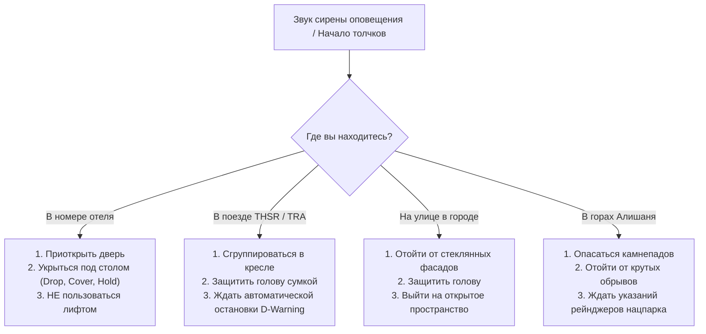

# 🚨 Безопасность, Землетрясения и Экстренная помощь на Тайване

> [!INFO] Высокий уровень безопасности на острове
> Тайвань стабильно входит в **топ-3 самых безопасных стран мира** (Numbeo Safety Index) с практически нулевым уровнем уличной преступности и культурой абсолютной честности (забытый в метро кошелек или ноутбук в 99% случаев возвращают на стойку *Lost & Found*).
> Однако из-за географического расположения на стыке Филиппинской и Евразийской тектонических плит (Тихоокеанское огненное кольцо) и в зоне тропических циклонов путешественнику важно знать простые и четкие правила действий при природных явлениях.

---

## 📞 I. Экстренные службы и горячие линии 24/7

Сохраните эти номера в контакты телефона перед поездкой:

| Служба | Телефон | Язык | Назначение |
| :--- | :---: | :---: | :--- |
| **Полиция (Police)** | **`110`** | Английский / Китайский | Кражи, ДТП, происшествия, утеря документов |
| **Скорая помощь и Пожарные** | **`119`** | Английский / Китайский | Экстренная медицинская помощь, травмы, спасатели |
| **Горячая линия для туристов** | **`0800-011-765`** | **Английский / Русский** | Бесплатная круглосуточная справочная и экстренная помощь Министерства туризма |
| **Единый городской сервис** | **`1999`** | Английский / Китайский | Городская справочная (Тайбэй, Гаосюн, Тайчжун): транспорт, тайфуны, клиники |
| **Береговая охрана (Coast Guard)** | **`118`** | Английский / Китайский | Происшествия на воде, спасение в море (Сяолюцю, Цисинтань) |
| **Представительство РФ в Тайбэе (МТКК)** | **`+886-2-8780-3011`** | Русский | Консульская помощь гражданам РФ при утере паспорта или ЧС |

> [!TIP] 💬 Экстренный чат-переводчик
> Если вы не говорите по-английски или китайски, при звонке в `119` или `110` оператор может подключить трехсторонний переводчик. Также можно набрать бесплатный номер для иностранцев **`1990`** (консультации по любым жизненным вопросам для иностранцев в Тайване на русском/английском).

---

## 🌍 II. Землетрясения: Тайваньский сейсмо-протокол

Тайвань обладает одной из самых передовых в мире систем сейсмической защиты: все здания и мосты строятся по строжайшим антисейсмическим нормам (здания выдерживают магнитуду 7–8+).

### 1. Золотое правило: «Drop, Cover, Hold On» (Присесть, Укрыться, Держаться)
* **В номере отеля:**
  1. **Приоткройте входную дверь номера** (чтобы в случае перекоса проема замок не заклинило).
  2. Немедленно укройтесь под массивным письменным столом или опуститесь на колени возле кровати, защитив голову и шею подушкой или руками.
  3. Держитесь за ножку стола до полного прекращения толчков.
  4. ❌ **Категорически запрещено пользоваться лифтами!** После прекращения сильных толчков спускайтесь строго по аварийной лестнице (*Emergency Exit*).
* **В скоростном поезде THSR или экспрессе TRA:**
  * Магистраль THSR (300 км/ч) оснащена датчиками *D-Warning System* — при первых микротолчках поезд автоматически плавно экстренно тормозит.
  * Прижмитесь к спинке кресла, спрячьте ноги под переднее сиденье и закройте голову сумкой или курткой.
* **В метро MRT (Тайбэй / Гаосюн / Тайчжун):**
  * Поезда метро снижают скорость или останавливаются на станциях. Крепко держитесь за поручни, сохраняйте спокойствие и следуйте указаниям персонала станции.
* **В высокогорном парке Алишань (2200 м) и на пешеходных тропах:**
  * Остерегайтесь оползней и камнепадов. Отойдите от вертикальных скальных стенок и крутых насыпей на открытые поляны или широкие участки тропы.

> [!NOTE] 📱 Система экстренного оповещения (PWS / Cell Broadcast)
> При магнитуде от 4.5+ тайваньская система *Public Warning System* моментально отправляет громкий звуковой сигнал и пуш-уведомление на все мобильные телефоны в радиусе события с указанием эпицентра. Не пугайтесь звука сирены — это стандартная автоматика.

---

## 🌀 III. Тайфуны и штормовые предупреждения

Сезон тихоокеанских циклонов на Тайване длится с июля по октябрь.

### 1. Что такое «Тайфунный день» (Typhoon Holiday / 颱風假 - Tái-fēng-jià)
* При приближении мощного тайфуна правительство каждого конкретного уезда объявляет официальный статус **Typhoon Day**:
  * В этот день закрываются все школы, офисы, туристические достопримечательности и нацпарки.
  * Скоростные поезда THSR и горные поезда TRA могут временно снижать частоту или приостанавливать движение до прохождения фронта.
  * Паромы на остров Сяолюцю временно не выходят в море при высокой волне.
* **Что делать путешественнику в Тайфунный день:**
  * Наслаждайтесь уютным днем в номере отеля: скоростной оптоволоконный Wi-Fi, онсэн/ванна, просмотр фильмов или работа.
  * Комбини 7-Eleven и FamilyMart работают круглосуточно практически при любой погоде — в них всегда есть горячая еда, бенто, кофе и снэки.

### 2. Мониторинг погоды
* **Официальный сайт метеослужбы:** [www.cwa.gov.tw](https://www.cwa.gov.tw) (Central Weather Administration).
* **Мобильное приложение:** **CWA Weather** (прогноз тайфунов, радаров дождя и ветра на английском).

---

## 🏥 IV. Медицинская помощь и Клиники с международными центрами

Медицинская система Тайваня — одна из лучших в Азии. В каждом крупном городе есть многопрофильные госпитали с **Международными медицинскими отделениями (International Medical Centers / IMS)** и свободно говорящими по-английски врачами.

### 1. Алгоритм действий по медицинской страховке (ВЗР):
1. **Звонок в страховую компанию (Ассистанс):** Телефон указан в вашем страховом полисе (работает 24/7 через Telegram / WhatsApp / телефон).
2. Назовите номер полиса, симптомы и ваше точное местоположение (город, отель).
3. Ассистанс согласует визит в ближайший госпиталь и вышлет гарантийное письмо (Guarantee of Payment) либо согласует оплату визита наличными с последующей компенсацией по чекам.
4. **Сохраняйте все документы:** Медицинский отчет с диагнозом на английском (*Medical Certificate / Doctor's Report*), детальный счет (*Itemized Bill*) и квитанцию об оплате (*Official Receipt*).

### 2. Список рекомендуемых англоязычных госпиталей по регионам маршрута:

#### 🏙️ Тайбэй (Север)
* **National Taiwan University Hospital (NTUH / 台大醫院):**
  * *Адрес:* No. 7, Zhongshan S. Rd, Zhongzheng District, Taipei (у станции MRT NTU Hospital).
  * *Телефон IMS:* +886-2-2356-2900.
* **Mackay Memorial Hospital (馬偕紀念醫院):**
  * *Адрес:* No. 92, Sec. 2, Zhongshan N. Rd, Zhongshan District, Taipei (MRT Shuanglian).
  * *Телефон:* +886-2-2543-3535.

#### ♨️ Цзяоси и Илань (Северо-восток)
* **National Yang Ming Chiao Tung University Hospital (Илань):**
  * *Адрес:* No. 152, Xinmin Rd, Yilan City (в 10 мин от Цзяоси).
  * *Телефон:* +886-3-932-5192.

#### 🌊 Хуалянь (Восточный берег)
* **Hualien Tzu Chi Hospital (Буддийский медцентр Цзы Чи / 花蓮慈濟醫院):**
  * *Адрес:* No. 707, Sec. 3, Zhongyang Rd, Hualien City.
  * *Телефон:* +886-3-856-1825. Крупнейший госпиталь востока Тайваня с международным отделением.

#### 🌲 Цзяи и Алишань (Запад и Высокогорье)
* **Chiayi Christian Hospital (嘉義基督教醫院):**
  * *Адрес:* No. 539, Zhongxiao Rd, East District, Chiayi City.
  * *Телефон:* +886-5-276-5041.
* *Внутри нацпарка Алишань (2200 м):* Круглосуточный медицинский пункт скорой помощи **Alishan Medical Clinic (阿里山醫療站)** рядом со станцией Alishan.

#### 🏛️ Тайнань (Древняя столица)
* **National Cheng Kung University Hospital (NCKUH / 成大醫院):**
  * *Адрес:* No. 138, Shengli Rd, North District, Tainan City (рядом с вокзалом Tainan Station).
  * *Телефон:* +886-6-235-3535.

#### 🚢 Гаосюн и Сяолюцю (Юг)
* **Kaohsiung Medical University Chung-Ho Memorial Hospital (KMUH / 高醫):**
  * *Адрес:* No. 100, Tzyou 1st Rd, Sanmin District, Kaohsiung.
  * *Телефон:* +886-7-312-1101.
* *На острове Сяолюцю:* Районная клиника **Liuqiu Health Station (琉球鄉衛生所)** у порта Байша (первая помощь, морские травмы).

#### 🏙️ Тайчжун (Центр)
* **China Medical University Hospital (CMUH / 中國醫藥大學附設醫院):**
  * *Адрес:* No. 2, Yude Rd, North District, Taichung.
  * *Телефон:* +886-4-2205-2121.

---

## 💊 V. Аптеки и безрецептурные средства

* **Сетевые аптечные драгсторы:** Сети **Watsons (屈臣氏)** и **Cosmed (康是美)** есть на каждой торговой улице и станции метро. В них всегда есть фармацевт.
* **Базовые лекарства в 7-Eleven и FamilyMart:** Пластыри, обезболивающее (Panadol/Ибупрофен), сорбенты, дезинфицирующие салфетки и мази от укусов мошек продаются круглосуточно на кассе комбини.
