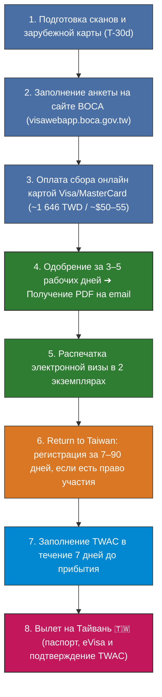
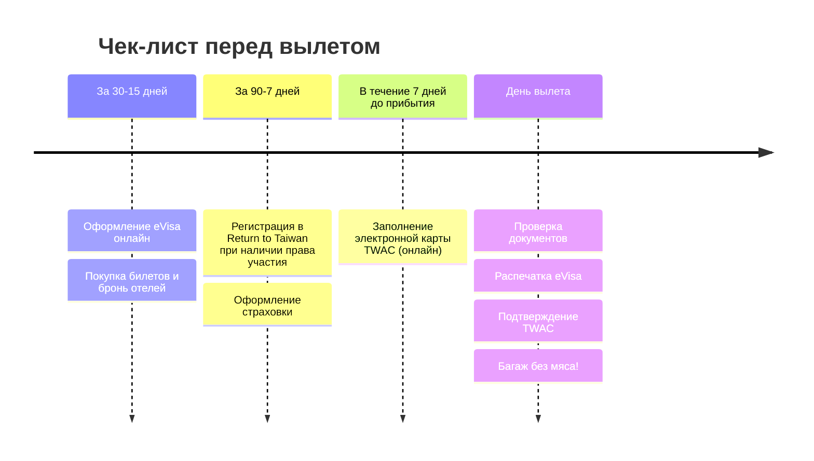

# 🛂 Визовый гайд на Тайвань для граждан РФ (2026): Электронная виза (eVisa)

> [!IMPORTANT] Ехать в Москву или консульство НЕ нужно!
> Оформление электронной визы (eVisa) для граждан РФ с **7 июля 2026 года** проходит **на 100% онлайн** из любого города или страны через официальный портал Бюро консульских дел Тайваня (BOCA). Посещать консульство, отправлять оригиналы документов или стоять в очередях не требуется.

---

## 🧭 Таймлайн оформления и подготовки

---

## ⚡ 1. Условия и параметры электронной визы (eVisa)

| Параметр                        | Условия eVisa                                                                                                     |
| :------------------------------ | :---------------------------------------------------------------------------------------------------------------- |
| **Для кого**                    | Граждане РФ — владельцы обычных заграничных паспортов                                                             |
| **Цель поездки**                | Туризм, отдых, деловые визиты, посещение друзей                                                                   |
| **Кратность въезда**            | **Однократная (Single Entry)**                                                                                    |
| **Срок действия коридора**      | **3 месяца (90 дней)** с момента выдачи                                                                           |
| **Разрешенный срок пребывания** | **До 30 дней** с момента въезда (для нашего 23-дневного тура подходит идеально)                                   |
| **Где оформлять**               | Исключительно онлайн: **[visawebapp.boca.gov.tw](https://visawebapp.boca.gov.tw)** (раздел *eVisa Applications*)  |
| **Стоимость сбора**             | **~1 646 TWD** (~$50–55 USD / `~4 500–5 000 ₽`)                                                                   |
| **Оплата**                      | **Карта иностранного банка** (Visa, MasterCard, JCB). Российские карты («Мир», UnionPay банков РФ) не принимаются |
| **Срок рассмотрения**           | **3–5 рабочих дней**                                                                                              |
| **Результат**                   | Электронная виза в формате **PDF**, приходящая на email                                                           |

---

## 📑 2. Что подготовить перед заполнением анкеты

1. **Заграничный паспорт РФ:**
   * Срок действия — **не менее 6 месяцев** на момент планируемого въезда на остров.
   * Наличие чистых страниц для пограничных штампов.
2. **Цветной скан главной страницы паспорта:**
   * Четкий скан/фото разворота с личными данными и фотографией в формате JPEG/PNG.
3. **Цифровая фотография:**
   * Свежее фото (не старше 6 месяцев) на **строго белом фоне**, анфас, без головных уборов и темных очков (JPEG).
4. **Банковская карта:**
   * Карта зарубежного банка (Казахстан, Турция, ОАЭ, Грузия, Беларусь, ЕС и т.д.) с возможностью интернет-платежей в TWD/USD.
5. **Данные поездки:**
   * Даты прилета и вылета, номера рейсов.
   * Название, адрес и телефон первого отеля в Тайбэе.
   * Информация о месте работы/занятости (на английском языке).

---

## 🖥️ 3. Пошаговая инструкция оформления eVisa (онлайн)

1. **Вход на портал:** Перейдите на официальный визовый сервис МИД Тайваня — **[visawebapp.boca.gov.tw](https://visawebapp.boca.gov.tw)**.
2. **Выбор раздела:** Нажмите **eVisa Applications** ➔ **Apply for eVisa**.
3. **Заполнение анкеты:**
   * Заполните все поля анкеты на **английском языке** строго по данным загранпаспорта (ФИО, дата рождения, серия/номер паспорта, орган выдачи).
   * Укажите цель поездки: `Tourism` / `Sightseeing`.
   * Укажите адрес и телефон первого отеля на Тайване.
4. **Загрузка файлов:** Загрузите скан загранпаспорта и цифровую фотографию.
5. **Оплата сбора:** Введите реквизиты иностранной банковской карты и подтвердите списание сбора (~1 646 TWD).
6. **Ожидание решения:** Рассмотрение занимает обычно **3–5 рабочих дней**.
7. **Получение визы:** На указанный email поступит PDF-документ с одобренной визой. **Распечатайте его минимум в 2 экземплярах** и сохраните копию в телефоне.

---

## 🛫 4. Обязательные шаги перед вылетом на Тайвань

### 1. 🖨️ Распечатка электронной визы (eVisa)
* Пограничные службы и авиакомпании на стойке регистрации требуют предъявить **физическую распечатку PDF-визы**.

### 2. 🛃 Электронная миграционная карта (TWAC — Taiwan Arrival Card)
* **Что это:** Обязательная онлайн-форма прибытия, полностью заменяющая бумажные миграционные карты в самолете.
* **Где заполнять:** [Официальный портал TWAC](https://twac.immigration.gov.tw/).
* **Когда заполнять:** В течение **7 дней до даты прибытия**, включая день прибытия.
* **Стоимость:** **Бесплатно**.
* **Результат:** Сохраните подтверждение с QR-кодом на телефоне. При сканировании паспорта офицер видит запись в базе.

### 3. 🎫 Наличие обратного билета
* Обратный авиабилет (или билет в третью страну) проверяется авиакомпанией при посадке и иммиграционной службой при въезде.

### 4. 🎁 Акция Return to Taiwan, Double Your Luck
* **Право участия:** Нужна запись о въезде на Тайвань после 01.01.2023; повторный гость может добавить одного сопровождающего без такого въезда.
* **Регистрация:** За **7–90 дней** до прилета на [официальном сайте](https://5000.taiwan.net.tw/index_en.html).
* **Розыгрыш и приз:** Онлайн-розыгрыш по средам; NT$5 000 повторному гостю и NT$3 000 сопровождающему.
* **Получение:** После выигрыша в течение 24 часов после въезда загрузить обратный билет и следовать инструкции из email. [Официальные правила](https://5000.taiwan.net.tw/campaign_rules_en.html).

### 5. 🏥 Медицинская страховка
* Рекомендуется полис ВЗР с суммой покрытия от **$30 000 – $50 000 USD**, включающий медицинскую помощь и активный отдых.

---

## 🚨 5. Критически важные таможенные правила

> [!CAUTION] 🚫 Тотальный запрет на мясные продукты (АЧС — штраф ~560 000 ₽)
> Категорически запрещено ввозить любые мясные изделия (колбасы, паштеты, джерки, бутерброды из самолета, лапшу с сублимированным мясом). Штраф за первый случай — **200 000 TWD (`~560 000 ₽`)**, при отказе — немедленная депортация и запрет на въезд!

> [!CAUTION] 🚫 Полный запрет электронных сигарет и вейпов
> Ввоз, продажа и использование любых вейпов, жидкостей, одноразок и систем IQOS на Тайване строго запрещены законом (штрафы до 50 000 TWD). Оставьте их дома.

---

## 📞 6. Полезные ссылки и контакты

* **Официальный визовый портал BOCA (eVisa):** [visawebapp.boca.gov.tw](https://visawebapp.boca.gov.tw)
* **Электронная карта прибытия TWAC:** [twac.immigration.gov.tw](https://twac.immigration.gov.tw/)
* **Акция Return to Taiwan:** [5000.taiwan.net.tw](https://5000.taiwan.net.tw/index_en.html)
* **Представительство РФ в Тайбэе (МТКК):** Taipei, Xinyi District, Section 5, Xinyi Rd, No. 2, 9F (тел. дежурного консула: `+886-2-8780-3011`).
