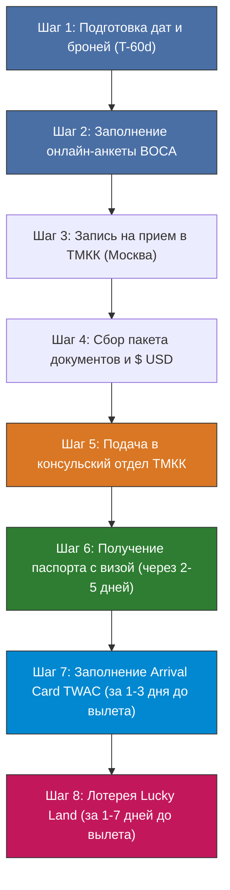
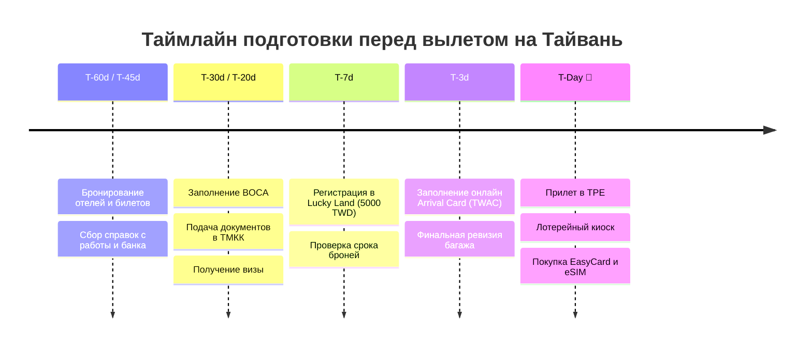

# 🛂 Визовый гайд на Тайвань для граждан РФ (2026)

> [!INFO] Статус визового режима на 2026 год
> * **Нужна ли виза:** **ДА, виза обязательна.** Пилотный безвизовый режим для граждан РФ завершился, и в 2026 году гражданам России требуется заранее оформленная **гостевая/туристическая виза (Visitor Visa)**.
> * **Где оформляется в РФ:** Консульский отдел Представительства **Тайбэйско-Московской координационной комиссии по экономическому и культурному сотрудничеству (ТМКК / TMECCC)** в Москве.
> * **Где оформляется за рубежом:** В зарубежных представительствах Тайваня (**TECO / TRO**) по всему миру (Бангкок, Сеул, Токио, Стамбул, Куала-Лумпур и др.).

---

## 🧭 Навигация по этапам оформления

---

## 🏛️ I. Куда обращаться: ТМКК в Москве

Официальный дипломатический орган Тайваня в России:

* **Организация:** Консульский отдел ТМКК (Taipei-Moscow Economic and Cultural Coordination Commission).
* **Адрес:** 123001, г. Москва, **Ермолаевский переулок, д. 25, 4 этаж** (станция метро «Маяковская» или «Баррикадная» / «Краснопресненская»).
* **Официальный сайт:** [www.tmeccc.org/ru_ru](https://www.tmeccc.org/ru_ru/)
* **Визовый портал МИД Тайваня (BOCA):** [visawebapp.boca.gov.tw](https://visawebapp.boca.gov.tw)
* **Телефон консульского отдела:** +7 (495) 956-37-86 / 87 / 88 / 89 / 90.
* **Email для справок:** `rus@mofa.gov.tw` / `consul.tmeccc@gmail.com`.
* **Приемные часы (строго по предварительной записи):**
  * Подача документов: Понедельник – Пятница с 09:30 до 12:00.
  * Выдача паспортов: Понедельник – Пятница с 14:30 до 17:00.
  * Выходные: суббота, воскресенье, официальные праздники РФ и Тайваня.

---

## 💵 II. Типы виз, сроки и стоимость (Консульский сбор)

Для нашего 22-дневного путешествия оформляется **однократная туристическая гостевая виза (Visitor Visa, Single Entry, срок пребывания 30 дней)**.

| Категория визы | Срок оформления | Консульский сбор | Валюта оплаты | Коридор въезда (Validity) | Разрешенный срок пребывания |
| :--- | :---: | :---: | :---: | :---: | :---: |
| **Однократная (Single)** — Обычная | **5 рабочих дней** | **$50 USD** | Наличные $ USD | 3 месяца (90 дней) | **30 дней** (под даты броней) |
| **Однократная (Single)** — Срочная | **2 рабочих дня** | **$75 USD** | Наличные $ USD | 3 месяца (90 дней) | **30 дней** (под даты броней) |
| **Многократная (Multiple)** — Обычная | **5 рабочих дней** | **$100 USD** | Наличные $ USD | 3–12 месяцев | До 30–60 дней за въезд |
| **Многократная (Multiple)** — Срочная | **2 рабочих дня** | **$150 USD** | Наличные $ USD | 3–12 месяцев | До 30–60 дней за въезд |

> [!CAUTION] 🚨 Строгие требования к наличным долларам США ($ USD)
> 1. Консульский сбор оплачивается **ИСКЛЮЧИТЕЛЬНО НАЛИЧНЫМИ ДОЛЛАРАМИ США** в кассе консульского отдела в момент подачи!
> 2. Рубли, банковские карты РФ, зарубежные карты или переводы **НЕ ПРИНИМАЮТСЯ**.
> 3. **Качество купюр:** Доллары должны быть в идеальном состоянии:
>    * Выпуска не ранее 2013 года (новые «синие» банкноты).
>    * Без малейших надрывов, потертостей, сгибов, пятен, штампов обменников или пометок ручкой.
>    * Подготовьте точную сумму без сдачи (сдачу консульство может не выдать при отсутствии мелких купюр).

---

## 📑 III. Полный чек-лист документов для подачи

Для успешного получения визы подготовьте следующий пакет документов (сложите строго по порядку):

### 1. 🪪 Заграничный паспорт
- **Оригинал:** Срок действия — **не менее 6 месяцев** на момент предполагаемого въезда на Тайвань.
- **Чистые страницы:** Минимум 2 чистые страницы с пометкой «Визы».
- **Копия:** Четкая ксерокопия первой страницы с фотографией и персональными данными (на отдельном листе А4).
- *Если есть второй действующий загранпаспорт или старый паспорт с визами стран ОЭСР (Япония, США, Шенген, Великобритания, Южная Корея) — приложите копии главных страниц и виз для усиления кейса.*

### 2. 📝 Распечатанная электронная анкета (BOCA)
- Анкета заполняется онлайн на сайте [visawebapp.boca.gov.tw](https://visawebapp.boca.gov.tw).
- Выбирается раздел **General Visa Applications**.
- Заполняется на **английском языке**.
- В поле места подачи выбирается: **Taipei-Moscow Economic and Cultural Coordination Commission (Russia)**.
- После заполнения анкета сохраняется в PDF, распечатывается на 2 листах А4 (или двусторонняя печать) и **подписывается заявителем вручную** синей или черной ручкой (подпись как в загранпаспорте).
- На анкете должен четко читаться **сгенерированный штрих-код**.

### 3. 📸 Фотографии (2 штуки)
- **Количество:** 2 цветные матовые фотографии.
- **Размер:** **3.5 × 4.5 см** (или 2 × 2 дюйма).
- **Срок съемки:** Сделаны не более 6 месяцев назад.
- **Фон:** Строго белый или светло-серый (без теней).
- **Лицо:** 70–80% площади снимка, нейтральное выражение лица, открытый лоб и уши, без очков с бликующими/тонированными стеклами, без головных уборов (кроме религиозных).
- *Одну фотографию приклейте клеем-карандашом в специальное поле анкеты, вторую прикрепите скрепкой.*

### 4. ✈️ Бронирование авиабилетов
- Подтверждение бронирования перелетов **туда и обратно** (или в третью страну) с указанием фамилии и имени пассажира (латиницей), номеров рейсов, дат и кода бронирования (PNR).
- *Подходят как выкупленные билеты, так и подтвержденные агентские брони с кодом бронирования.*

### 5. 🏨 Бронирование отелей на весь срок поездки
- Подтверждения бронирований отелей/апартаментов на **каждую ночь пребывания** на Тайване (из Trip.com, Booking.com, Agoda или официальных сайтов отелей).
- В подтверждении бронирования обязательно должны быть указаны:
  - Имя и фамилия заявителя (на латинице).
  - Точные даты заезда и выезда.
  - Название отеля, его адрес и телефон.
- *Для нашего 22-дневного маршрута все отели в Тайбэе, Цзяоси, Хуаляне, Шичжоу, Алишане, Тайнане, Сяолюцю и Тайчжуне должны полностью перекрывать даты поездки без пробелов!*

### 6. 🗺️ Маршрутный план (Travel Itinerary)
- Подробный посуточный план путешествия на **английском языке**.
- Таблица должна содержать: `Date | City / Region | Daily Highlights & Activities | Hotel & Address`.
- Распечатанная англоязычная версия сводного маршрута нашего проекта (`02 - Маршрутный план/Маршрутный план.md`) идеально подходит для консульства.

### 7. 💼 Справка с места работы
- Оригинал справки на официальном фирменном бланке компании с реквизитами, адресом и телефоном.
- Должны быть указаны: дата выдачи, должность, стаж работы в компании, среднемесячный оклад (рекомендуется от **~80 000–120 000 ₽**) и фраза о сохранении рабочего места и предоставлении оплачиваемого отпуска на даты поездки.
- Подпись руководителя/главного бухгалтера и синяя печать организации.
- **Язык:** На английском языке либо на русском с приложением простого перевода на английский (нотариальное заверение не требуется).
- *Для ИП:* Свидетельство о регистрации ИП / выписка из ЕГРИП + налоговая декларация или справка о доходах (с переводом).
- *Для самозанятых:* Справка о постановке на учет (КНД 1122035) + справка о состоянии доходов за текущий/предыдущий год из приложения «Мой налог» (с переводом).

### 8. 💳 Финансовые гарантии (Выписка из банка)
- **Справка об остатке на банковском счете:** Оригинал с синей печатью банка (или факсимиле/QR-кодом Тинькофф/Сбер/Альфа на английском языке).
- **Рекомендуемый остаток:** Из расчета не менее **$100 USD на каждый день пребывания** (для 22 дней — от **$2 500–3 000 USD** или от **~250 000–350 000 ₽** на человека). Чем солиднее баланс, тем выше надежность кейса.
- **Выписка о движении средств:** За последние 3 месяца (желательно приложить для демонстрации стабильности оборотов).

### 9. 📄 Дополнительные документы
- **Копия паспорта РФ:** Ксерокопия страниц с фотографией и действующей регистрацией по месту жительства.
- **Медицинская страховка путешественника:** Полис с покрытием не менее $30 000–50 000 USD, действующий на территории Тайваня на весь срок поездки (рекомендуется приложить, распечатав на английском языке).

---

## 🖥️ IV. Пошаговая инструкция заполнения анкеты BOCA

1. Перейдите на официальный портал: `https://visawebapp.boca.gov.tw`.
2. Нажмите кнопку **General Visa Applications**.
3. Заполните вкладки анкеты строго латиницей по данным загранпаспорта:
   * **Category of Visa:** `Visitor Visa`.
   * **Number of Entries:** `Single` (или `Multiple`, если планируется выезд и повторный въезд).
   * **Purpose of Travel:** `Sightseeing` (или `Tourism`).
   * **Duration of Stay:** `30 Days` (для нашего тура на 22 дня).
   * **Proposed Date of Arrival / Departure:** Точные даты перелетов.
   * **Place of Application:** `Europe ➔ Russia ➔ Taipei-Moscow Economic and Cultural Coordination Commission`.
   * **Occupation / Employer:** Данные о текущем работодателе и должности.
   * **Address and Tel Number in Taiwan:** Адрес и телефон первого отеля в Тайбэе (*Morwing Hotel Fairy Tale* / *Breeze Hot Spring Hotel*).
4. Проверьте все данные, нажмите **Submit**.
5. Скачайте сгенерированный PDF-файл анкеты, распечатайте и поставьте личную подпись внизу страницы.

---

## 🌍 V. Оформление визы за пределами России (для кочевников и релокантов)

Если вы находитесь вне РФ (например, в Юго-Восточной Азии, Турции, Грузии, ОАЭ или Европе), подать документы можно в местное представительство Тайваня (**TECO — Taipei Economic and Cultural Office**):

* **Популярные офисы TECO для граждан РФ:**
  * **Бангкок (Таиланд):** Принимает граждан РФ без тайского ВНЖ (по туристическому штампу/TR-визе). Требуется онлайн-запись через систему бронирования слотов TECO Bangkok.
  * **Сеул (Южная Корея):** Подача по предварительной записи.
  * **Токио (Япония):** Офис в Сироканэдай, требуется подтверждение легального статуса пребывания.
  * **Стамбул / Анкара (Турция):** Принимают документы при наличии турецкого икамета или легального пребывания.
  * **Куала-Лумпур (Малайзия):** TECO Malaysia.
* **Особенности подачи за рубежом:**
  * Сбор оплачивается в **местной валюте** (бат, вона, лира, ринггит) либо безналично по квитанции банка.
  * Анкета BOCA заполняется с выбором соответствующего зарубежного офиса TECO.
  * Справки из банков могут быть зарубежными (счета в иностранных банках с балансом в USD/EUR).

---

## 🛫 VI. Финальные шаги перед вылетом (2026 г.)

Получение визы — это основной этап, но перед посадкой в самолет необходимо выполнить 2 обязательных цифровых действия:

### 1. 🛃 Электронная миграционная карта (TWAC — Taiwan Arrival Card)
* **Когда заполнять:** За **1–3 дня до вылета**.
* **Где заполнять:** Официальный сайт иммиграционной службы Тайваня — [niaspeedy.immigration.gov.tw/webacrn](https://niaspeedy.immigration.gov.tw/webacrn/).
* **Стоимость:** **Бесплатно**.
* **Что дает:** Освобождает от необходимости заполнять бумажную синюю карточку прибытия в самолете. Пограничник видит электронную запись при сканировании паспорта.

### 2. 🎁 Туристическая лотерея «Taiwan the Lucky Land» (金福氣)
* **Когда регистрироваться:** За **1–7 дней до даты прилета** в Международный аэропорт Таоюань (TPE).
* **Где регистрироваться:** Официальный сайт — [5000.taiwan.net.tw](https://5000.taiwan.net.tw).
* **Приз:** Шанс выиграть **5 000 TWD (~14 000 ₽)** на транспортную карту **EasyCard** или **iPASS**.
* **Как получить:** Полученный на email QR-код сканируется в киоске *Lucky Draw* в зале прилета TPE сразу после получения багажа.

---

## ⚠️ VII. Топ-5 частых ошибок при подаче на визу Тайваня

1. ❌ **Неподходящие купюры долларов:** Старые банкноты до 2013 года, со следами штампов или надрывами — касса ТМКК откажет в приеме документов до замены купюр.
2. ❌ **Пробелы в бронировании отелей:** Если из 22 дней тура хотя бы одна ночь не подтверждена бронью отеля или ночного поезда — консул запросит донести бронь.
3. ❌ **Подача «впритык»:** Срок действия визового коридора — ровно 90 дней со дня выдачи. Подавать документы оптимально за **3–4 недели до поездки**, но не ранее чем за 2.5 месяца.
4. ❌ **Недостаточный остаток на счете:** Баланс менее 150 000 ₽ на длительную поездку может вызвать сомнения офицера. Показывайте от 250 000–350 000 ₽.
5. ❌ **Ошибки в транслитерации в анкете:** Имя, фамилия и номер паспорта в анкете BOCA должны строго до символа совпадать с загранпаспортом.

---

## 📞 Контакты экстренной помощи
* **Представительство ТМКК в Москве:** +7 (495) 956-37-86.
* **Представительство РФ в Тайбэе (Московско-Тайбэйская комиссия - МТКК):**
  * Адрес: Taipei, Xinyi District, Section 5, Xinyi Rd, No. 2, 9F (рядом с Taipei 101).
  * Телефон дежурного консула: +886-2-8780-3011.
