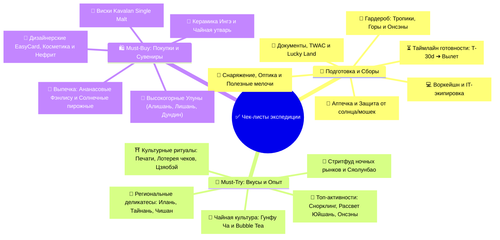

# ✅ 06 - Чек-листы: Подготовка, Сборы, Must-Try и Покупки

> [!TIP] Интерактивный навигатор экспедиции
> Полный комплект контрольных списков для безупречной подготовки к путешествию, сборов экипировки, цифрового воркейшна, а также исчерпывающий каталог гастрономических экспериментов, уникальных активностей и аутентичного шопинга.

---

## 🧭 Навигация по разделу чек-листов

---

## 📂 Документы раздела

| Раздел | Документ | Ключевой фокус |
| :--- | :--- | :--- |
| 🧳 **Сборы и Подготовка** | **[[Чек-лист подготовки и сборов\|📋 Чек-лист подготовки и сборов]]** | Документы, TWAC, лотерея Lucky Land, IT-воркейшн набор, аптечка, гардероб по климатическим зонам (тропики + высокогорный Алишань 2200м), предполетный таймлайн |
| 🍜 **Опыт и Покупки** | **[[Что попробовать и купить (Must-Try & Must-Buy)\|🎯 Что попробовать и купить (Must-Try & Must-Buy)]]** | 40+ блюд стритфуда и высокой кухни, правильный заказ Bubble Tea, культовые активности (черепахи Сяолюцю, онсэны, рассветы), шопинг-лист лучших чаев, виски Kavalan и сувениров |

---

## ⚡ Экспресс-трекер ключевой готовности

### 🚨 Критические шаги перед вылетом (Не забыть!)
- [ ] **Загранпаспорт:** Срок действия более 6 месяцев от даты выезда, проверен на целостность страниц.
- [ ] **Регистрация в лотерее «Taiwan the Lucky Land»:** Заполнена на сайте `5000.taiwan.net.tw` за **1–7 дней до прилета** (шанс выиграть 5 000 TWD / `~14 000 ₽` на EasyCard).
- [ ] **Электронная миграционная карта (TWAC):** Заполнена онлайн на `niaspeedy.immigration.gov.tw` за 1–3 дня до вылета.
- [ ] **Строжайший контроль багажа (АЧС):** В багаже и ручной клади **НЕТ НИКАКИХ мясных продуктов** (колбасы, паштетов, бутербродов, сублиматов) — штраф `~560 000 ₽`!
- [ ] **Запрет вейпов:** Проверено отсутствие электронных сигарет, вейпов, жидкостей и систем IQOS (тотальный запрет на острове).
- [ ] **Связь и e-SIM:** Оформлен и установлен профиль e-SIM (Airalo / Nomad / Klook) для интернета без роуминга.
- [ ] **VPN для РФ-сервисов:** Установлены и протестированы VPN-клиенты для доступа к российским банкам и Госуслугам из-за границы.
- [ ] **Адаптер питания:** Положен компактный переходник на плоскую вилку (Type A/B, 110V / 60Hz).
- [ ] **Тайваньские чеки:** Запомнено правило — сохранять все чеки из магазинов для участия в государственной лотерее *Uniform Invoice*.
- [ ] **Блокнот для штампов:** Приготовлен блокнот для сбора бесплатных авторских печатей путешественника (*紀念章*) на станциях и в храмах.

---

## 🔗 Связанные разделы экспедиции
- 🗓️ **[[Personal Note/Travel/-- Taiwan/02 - Маршрутный план/Маршрутный план|Полный Маршрутный план на 22 дня]]**
- 💻 **[[Гайд по удаленной работе и кофейням Тайваня|Гайд по воркейшну, интернету и спешелти-кофейням]]**
- 💰 **[[Personal Note/Travel/-- Taiwan/04 - Финансы/Финансы|Сводный бюджет и смета расходов]]**
- 📖 **[[05 - Полезная информация|Культурный код, история, правила онсэнов и этикет]]**
