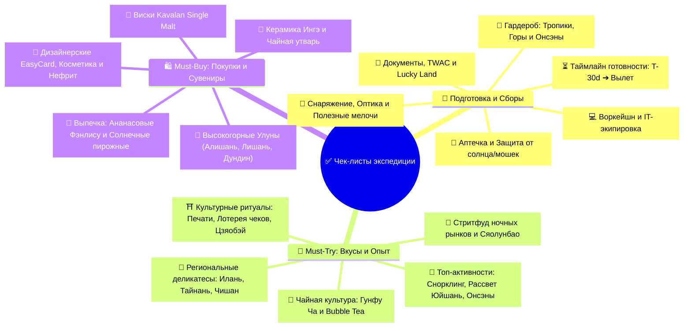

# ✅ 06 - Чек-листы: Подготовка, Сборы, Must-Try и Покупки

> [!TIP] Интерактивный навигатор экспедиции
> Полный комплект контрольных списков для безупречной подготовки к путешествию, сборов экипировки, цифрового воркейшна, а также исчерпывающий каталог гастрономических экспериментов, уникальных активностей и аутентичного шопинга.

---

## 🧭 Навигация по разделу чек-листов



---

## 📂 Документы раздела

| Раздел | Документ | Ключевой фокус |
| :--- | :--- | :--- |
| 🧳 **Сборы и Подготовка** | **[[Чек-лист подготовки и сборов\|📋 Чек-лист подготовки и сборов]]** | Документы, TWAC, Lucky Land, матрица бронирований для иностранца (онлайн vs касса), IT-воркейшн набор, аптечка, гардероб по климату (тропики + Алишань 2200м), предполетный таймлайн |
| 🍜 **Опыт и Покупки** | **[[Что попробовать и купить (Must-Try & Must-Buy)\|🎯 Что попробовать и купить (Must-Try & Must-Buy)]]** | 40+ блюд стритфуда и высокой кухни, правильный заказ Bubble Tea, культовые активности (черепахи Сяолюцю, онсэны, рассветы), шопинг-лист лучших чаев, виски Kavalan и сувениров |

---

## 📊 Прогресс чек-листов

```dataviewjs
const pages = dv.pages(`"${dv.current().file.folder}"`);
const tasks = pages.file.tasks;
const completed = tasks.where((task) => task.completed).length;
const percent = tasks.length ? Math.round((completed / tasks.length) * 100) : 0;

dv.paragraph(`**${completed} из ${tasks.length} задач выполнено (${percent}%)**`);
dv.paragraph(`<progress value="${completed}" max="${Math.max(tasks.length, 1)}"></progress>`);

dv.header(3, "Открытые задачи");
dv.taskList(tasks.where((task) => !task.completed), true);
```

---

## ⚡ Экспресс-трекер ключевой готовности

### 🚨 Критические шаги перед вылетом (Не забыть!)
- [x] **Электронная виза на Тайвань (eVisa):** Получена 05.10.2026; однократный въезд до 05.01.2027, пребывание до 30 дней.
- [x] **Распечатка eVisa:** 2 экземпляра и офлайн-копия PDF на телефоне.
- [x] **Загранпаспорт:** Срок действия более 6 месяцев от даты выезда, проверен на целостность страниц.
- [ ] **Return to Taiwan, Double Your Luck:** При наличии въезда после 01.01.2023 регистрация заполнена за **7–90 дней до прилета**; проверены email и [правила акции](https://5000.taiwan.net.tw/campaign_rules_en.html).
- [ ] **Электронная миграционная карта (TWAC):** Заполнена бесплатно в течение 7 дней до прибытия на [официальном портале](https://twac.immigration.gov.tw/).
- [ ] **Строжайший контроль багажа (АЧС):** В багаже и ручной клади **НЕТ НИКАКИХ мясных продуктов** (колбасы, паштетов, бутербродов, сублиматов) — штраф `~560 000 ₽`!
- [ ] **Связь и e-SIM:** Оформлен и установлен профиль e-SIM (Airalo / Nomad / Klook) для интернета без роуминга.
- [ ] **VPN для РФ-сервисов:** Установлены и протестированы VPN-клиенты для доступа к российским банкам и Госуслугам из-за границы.
- [x] **Переходник питания EU → US/Type A:** Беру компактный переходник на плоскую вилку для розеток Тайваня (110 В / 60 Гц).
- [x] **Зарядные устройства:** Беру Dorten 45 Вт и Lenovo 100 Вт; оба поддерживают вход 100–240 В, 50/60 Гц.
- [ ] **Тайваньские чеки:** Запомнено правило — сохранять все чеки из магазинов для участия в государственной лотерее *Uniform Invoice*.
