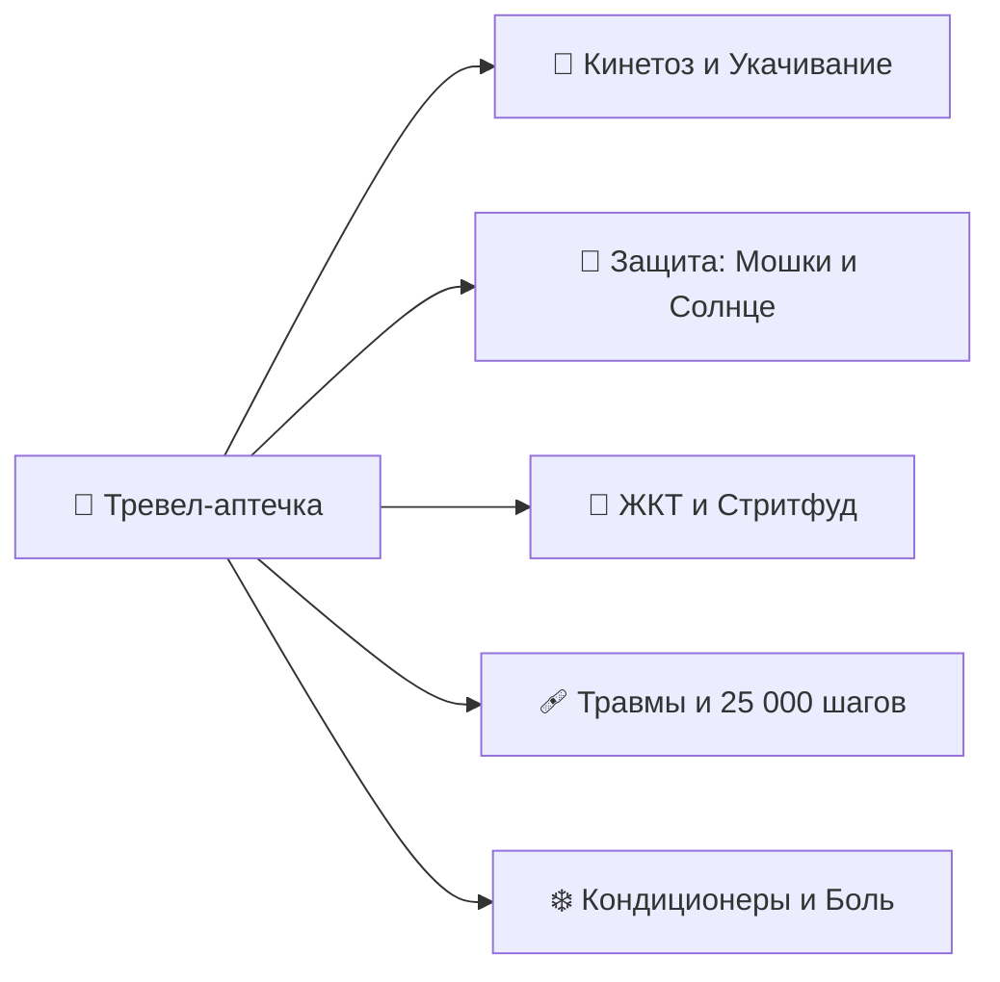
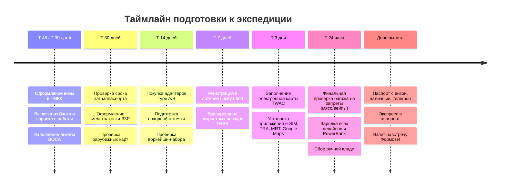

# 📋 Чек-лист подготовки и сборов

> [!INFO] Практическое руководство по экипировке и таймлайну
> Комплексный чек-лист сборов, охватывающий подготовку документов, упаковку цифрового воркейшн-сетапа, аптечку, слоистую одежду для тропиков (+28°C) и высокогорья (+8°C), а также контрольный предполетный таймлайн.

---

## 🪪 1. Документы, Въезд и Финансы

### 📄 Документы и въездные процедуры
- [ ] **Виза на Тайвань (Visitor Visa):** Оформлена заранее в Консульском отделе ТМКК (Москва) или представительстве TECO за рубежом. Получен паспорт со вклеенной визой на 30 дней (коридор въезда — 90 дней со дня выдачи). Полный гайд со списком справок: [[Визовый гайд для граждан РФ (2026)|Визовый гайд для граждан РФ]].
- [ ] **Загранпаспорт:** Срок действия не менее 6 месяцев на момент окончания поездки; наличие минимум 2–3 чистых страниц.
- [ ] **Электронная миграционная карта (TWAC):** Заполнена онлайн на сайте `niaspeedy.immigration.gov.tw` за **1–3 дня до вылета** (освобождает от заполнения бумажных карточек в самолете).
- [ ] **Лотерея «Taiwan the Lucky Land» (金福氣):** Пройдена регистрация на официальном портале `5000.taiwan.net.tw` за **1–7 дней до прилета** (QR-код сохранен в галерее телефона; шанс выиграть карту EasyCard с балансом 5 000 TWD / `~14 000 ₽`).
- [ ] **Международные авиабилеты:** Маршрутные квитанции Москва ➔ Тайбэй ➔ Москва сохранены в PDF на смартфоне и распечатаны на бумаге.
- [ ] **Бронирования отелей и миньсу:** Ваучеры проживания по всему маршруту (Тайбэй, Цзяоси, Хуалянь, Шичжоу, Алишань, Тайнань, Гаосюн, Сяолюцю, Тайчжун) сохранены офлайн с адресами на традиционном китайском языке (для показа таксистам).
- [ ] **Медицинская страховка:** Оформлен полис ВЗР с покрытием от $50 000, включающий активный отдых (треккинг в горах до 2500 м, снорклинг на коралловых рифах) и лечение респираторных инфекций.
- [ ] **Цифровые копии документов:** Сканы паспорта, страховки, билетов и прав загружены в защищенное облачное хранилище (Google Drive / iCloud) и в локальную папку смартфона.
- [ ] **Водительское удостоверение (МВУ / IDP):** Международные права категории A/B (при необходимости аренды авто или бензинового скутера; для электробайков до 25 км/ч на Сяолюцю права обычно не требуются).

### 💳 Финансы и платежные средства
- [ ] **Наличная валюта (USD / EUR):** Подготовлены купюры нового образца (без штампов, надписей и надрывов) для обмена в аэропорту Таоюань (TPE) в кассах *Bank of Taiwan* или *Mega Bank*.
- [ ] **Зарубежные банковские карты:** Карты зарубежных банков (Казахстан, Кыргызстан, Турция, ОАЭ, Беларусь) или UnionPay, проверенные на снятие наличных в банкоматах 7-Bank (в магазинах 7-Eleven).
- [ ] **Уведомление банков:** В банковских приложениях установлены разрешения на операции в Тайване / сняты лимиты на трансграничные платежи.
- [ ] **Транспортная карта EasyCard / iPASS:** Приобретение физической карты в аэропорту TPE или в любом 7-Eleven (100 TWD) + первичное пополнение наличными на 1 000–1 500 TWD.

---

## 💻 2. Воркейшн, Электроника и Софт

### 🔌 Аппаратная часть (Hardware)
- [ ] **Рабочий ноутбук:** Проверен аккумулятор, очищен диск, установлены все критические обновления ОС перед вылетом.
- [ ] **Адаптеры питания (Type A / B):** 2–3 компактных адаптера с европейской вилки (Type C/F) на плоские американские штырьки (110V / 60Hz).
- [ ] **Сетевое зарядное устройство GaN (65W / 100W):** Компактный многопортовый блок (2x Type-C + 1x USB-A), способный одновременно заряжать ноутбук, смартфон и пауэрбанк.
- [ ] **Внешний аккумулятор (PowerBank 10 000 – 20 000 мАч):** Емкость до 100 Вт·ч / 20 000 мАч (**строго в ручную кладь**, провоз пауэрбанков в багаже авиакомпаниями категорически запрещен!).
- [ ] **Комплект кабелей:**
  - [ ] 2x Type-C ➔ Type-C (с поддержкой 100W PD и быстрой зарядки, один длинный 2м).
  - [ ] 1x Type-C ➔ Lightning / USB-C для смартфона.
  - [ ] Магнитный кабель для зарядки смарт-часов / фитнес-браслета.
- [ ] **Наушники:**
  - [ ] Полноразмерные беспроводные наушники с активным шумоподавлением (ANC) для перелетов и работы в лобби/кофейнях.
  - [ ] Компактные TWS-вкладыши для прогулок, хайкинга и поездок на YouBike.
- [ ] **Периферия для работы:** Компактная беспроводная мышь + легкая складная алюминиевая подставка под ноутбук (для правильной эргономики спины в отелях).
- [ ] **Резервный смартфон:** Запасной телефон (на случай потери основного, а также для использования в качестве независимой Wi-Fi точки доступа).

### 📱 Цифровой софт и приложения (Software)
- [ ] **Связь и e-SIM:** Установлено приложение (Airalo / Nomad / Klook / KKday) и активирован профиль тайваньской e-SIM (операторы Chunghwa Telecom / Taiwan Mobile / FarEasTone).
- [ ] **VPN-сервисы:** Установлены и настроены 2 независимых VPN-клиента (необходимы для доступа к российским банковским приложениям, Госуслугам и сервисам РФ из-за рубежа).
- [ ] **Карты и навигация:**
  - [ ] **Google Maps:** Загружена офлайн-карта всего Тайваня.
  - [ ] **Apple Maps / Maps.me:** Офлайн-метки ключевых отелей, вокзалов и природных троп.
- [ ] **Транспортные приложения:**
  - [ ] **TRA e-Ticketing (台鐵e訂通):** Официальное приложение железных дорог Тайваня для отслеживания расписания и покупки билетов на поезда EMU3000 / Tze-Chiang.
  - [ ] **T Express (台灣高鐵):** Приложение скоростных поездов THSR (300 км/ч) с мобильными посадочными QR-билетами.
  - [ ] **Taipei MRT / Bus+:** Навигация по метро Тайбэя, Гаосюна и городским автобусам в реальном времени.
  - [ ] **YouBike 2.0:** Официальное приложение велопроката (привязка карты EasyCard и аренда велосипедов по всему острову).
  - [ ] **Uber / 55688 (FindTaxi):** Приложения для быстрого вызова официального такси.
- [ ] **Языковые помощники:**
  - [ ] **Google Translate / DeepL:** Загружен офлайн-пакет традиционного китайского языка (функция мгновенного перевода вывесок и меню через камеру).
- [ ] **Локальный лайфстайл:**
  - [ ] **Taiwan Receipt Lottery (發票對獎):** Приложение для автоматического сканирования QR-кодов на магазинных чеках для участия в государственной лотерее *Uniform Invoice*.
  - [ ] **Line:** Главный мессенджер в Азии для оперативной связи с хозяевами миньсу (B&B) и гидами.

---

## 💊 3. Аптечка путешественника и Здоровье

### 🤢 Укачивание (Критически важно!)
- [ ] **Таблетки от укачивания (Драмина / Авиамарин):** Необходимы для скоростного 20-минутного парома Дунган ➔ Сяолюцю через открытый пролив Баши и извилистых горных серпантинов при подъеме в Шичжоу и Алишань (автобус 7329).

### 🦟 Защита от солнца и насекомых
- [ ] **Репеллент от мошек «Сяохэйвэнь» (小黑蚊):** Средство с ДЭТА или маслом лимонного эвкалипта (также доступно на кассе любого 7-Eleven под маркой *Xiaoheiwen Repellent*).
- [ ] **Бальзам после укусов:** Tiger Balm / Звездочка / Фенистил-гель (быстро снимает зуд и отек).
- [ ] **Солнцезащитный крем SPF 50+ (Reef-Safe):** Крем без оксибензона и октиноксата (экологическое требование для защиты кораллов и зеленых черепах на острове Сяолюцю).
- [ ] **Пантенол / Алоэ-вера гель:** Средство для регенерации кожи после длительного нахождения на тропическом солнце.

### 🍜 ЖКТ, Пищеварение и Адаптация
- [ ] **Сорбенты:** Полисорб (в саше), Энтеросгель или Смекта (первая помощь при непривычной пище на ночных рынках).
- [ ] **Ферменты:** Мезим / Панкреатин / Креон (для комфортного пищеварения при дегустации обильного стритфуда).
- [ ] **Противодиарейные препараты:** Лоперамид / Имодиум.
- [ ] **Регидратация:** Регидрон / Гидровит (порошки для восстановления электролитного баланса при жаре +28...+30°C).
- [ ] **Пробиотики:** Пробиологический комплекс для поддержания микрофлоры ЖКТ в поездке.

### 🩹 Травмы, Мозоли и Мышцы (20 000+ шагов в день)
- [ ] **Гидроколлоидные пластыри (Compeed):** Специальные пластыри от влажных мозолей на пятках и пальцах.
- [ ] **Бактерицидные пластыри:** Набор из 20–30 пластырей разного размера.
- [ ] **Антисептик:** Хлоргексидин / Мирамистин в пластиковом флаконе (до 100 мл).
- [ ] **Обезболивающая разогревающая/охлаждающая мазь:** Вольтарен / Диклофенак или тайский бальзам для снятия усталости мышц ног после треккинга на Алишане и Лиюй.
- [ ] **Эластичный бинт:** Для фиксации голеностопа при активном хайкинге.

### ❄️ Простуда, Кондиционеры и Боль
- [ ] **Обезболивающее / Жаропонижающее:** Ибупрофен (Нурофен) и Парацетамол.
- [ ] **Леденцы от боли в горле:** Стрепсилс / Граммидин (в поездах THSR, метро и отелях кондиционеры часто работают на +18...+20°C).
- [ ] **Сосудосуживающие капли / спрей в нос:** Для комфортных взлетов и посадок при заложенности носа.
- [ ] **Увлажняющие капли для глаз:** Систейн / искусственная слеза (снимают сухость от сухого воздуха в салоне самолета и экранов).

---

## 👕 4. Гардероб и Обувь по климатическим зонам

| Зона / Локация | Температура | Специфика | Комплект одежды |
| :--- | :---: | :--- | :--- |
| 🌴 **Тропики и Побережье** *(Тайбэй, Тайнань, Гаосюн, Сяолюцю)* | `+26...+30°C` | Влажный субтропический климат, яркое солнце, кондиционированный транспорт | Легкие льняные/хлопковые футболки, шорты, брюки свободного кроя, льняная рубашка с длинным рукавом, головной убор |
| 🌲 **Высокогорье** *(Шичжоу 1400м, Алишань 2200м, Чжушань 2451м)* | `+8...+16°C` | Прохладный туманный горный воздух, сырость, холодный рассвет на смотровой | Флисовая кофта, легкая пуховая жилетка/куртка (Packable Down), ветровка, треккинговые брюки, теплые носки |
| ♨️ **Онсэны и Вода** *(Цзяоси, Бэйтоу, Сяолюцю)* | Вода `+27...+42°C` | Минеральные термы, океанский снорклинг | Плавки/купальник, **плавательная шапочка** (для открытых терм), рашгард UPF 50+ для снорклинга |

### 👟 Обувь
- [ ] **Основная пара:** Разношенные треккинговые кроссовки с дышащей сеткой, хорошей амортизацией и цепким протектором (для 15–25 км пеших прогулок в день и троп Алишаня).
- [ ] **Вторая легкая пара:** Легкие дышащие городские кроссовки / слипоны для смены.
- [ ] **Треккинговые / пляжные сандалии:** Быстросохнущие сандалии с фиксацией пятки (для прогулок по пляжу Цицзинь, каякинга и острова Сяолюцю).
- [ ] **Сланцы / Шлепанцы:** Для номера отеля и переходов в онсэнах.

### 🩳 Одежда для городов и тропиков (Дни 01–09, 11–22)
- [ ] **Футболки / Поло (5–7 шт.):** Из натурального льна, органического хлопка или функциональной синтетики (CoolMax / меринос).
- [ ] **Шорты (2–3 шт.):** Легкие городские и спортивные шорты из быстросохнущей ткани.
- [ ] **Легкие длинные брюки / Чиносы (2 пары):** Для посещения храмов, вечерних ресторанов и работы.
- [ ] **Льняная рубашка с длинным рукавом (1–2 шт.):** Защита плеч и рук от палящего полуденного солнца и спасение от холодных кондиционеров в поездах.
- [ ] **Нижнее белье и носки (7–8 комплектов):** Быстросохнущие спортивные носки (включая компрессионные гольфы для длительных авиаперелетов).
- [ ] **Головной убор:** Легкая панама, кепка или бандана с защитой от ультрафиолета.
- [ ] **Солнцезащитные очки:** Очки с поляризацией и фильтром UV400.

### 🌲 Одежда для высокогорья Алишаня (Дни 09–11)
- [ ] **Флисовая кофта / Толстовка:** Плотный средний слой для вечера в Шичжоу (1400 м) и Алишане (2200 м).
- [ ] **Компактная пуховая куртка (Packable Down Jacket):** Ультралегкая куртка, сжимающаяся в маленький чехол (критична для рассвета Чжушань на высоте 2451 м в 05:30 утра при температуре `+8°C`).
- [ ] **Ветро-влагозащитная мембранная куртка (Ветровка):** Защита от тумана, росы и порывов горного ветра.
- [ ] **Плотные треккинговые штаны:** Для комфортного хайкинга среди вековых кипарисов.
- [ ] **Теплые треккинговые носки (1–2 пары):** С добавлением шерсти мериноса.

### 🤿 Одежда для водных активностей и онсэнов
- [ ] **Купальные плавки / Шорты:** 2 пары для быстрой смены.
- [ ] **Рашгард с длинным рукавом (UPF 50+):** Гидромайка для защиты спины и плеч от ожогов во время утреннего снорклинга с зелеными морскими черепахами на Сяолюцю.
- [ ] **Плавательная резиновая/тканевая шапочка:** Обязательный аксессуар для допуска в общественные открытые термальные минеральные бассейны в Цзяоси и Бэйтоу.

---

## 🎒 5. Снаряжение, Оптика и Полезные мелочи

- [ ] **Городской рюкзак (15–20 л):** Легкий эргономичный рюкзак для радиальных выходов, ноутбука, бутылки с водой и ветровки.
- [ ] **Термобутылка / Термос (0.5 – 0.7 л):** На всех станциях метро MRT, вокзалах TRA и в культурных центрах установлены бесплатные диспенсеры питьевой воды с опцией горячего кипятка (*Вэнь-Жэ-Кай*) — термос позволяет заваривать высокогорный чай прямо во время прогулок.
- [ ] **Блокнот для штампов путешественника (紀念章):** Компактный нелинованный блокнот с плотной бумагой для сбора бесплатных дизайнерских печатей на станциях, у храмов и в музеях.
- [ ] **Гермочехол для смартфона (IPX8):** Водонепроницаемый прозрачный чехол на шнурке для подводной съемки черепах на Сяолюцю и каякинга.
- [ ] **Компактный шоппер / Экосумка:** В тайваньских магазинах одноразовые пакеты платные; складная сумка в кармане экономит деньги и бережет экологию.
- [ ] **Герметичный зип-пакет для личного мусора:** На улицах практически нет урн; небольшой пакет позволяет носить фантики до ближайшего 7-Eleven или станции метро.
- [ ] **Компактный дождевик-пончо или складной зонт:** Легкая защита от субтропического дождя на восточном побережье Хуаляня и в Цзюфэне.
- [ ] **Быстросохнущее микрофибровое полотенце:** Компактное полотенце для ног после онсэн-ванночек в Цзяоси или купания на Цицзине.
- [ ] **Набор индивидуальной гигиены:** Зубная щетка, паста, компактный твердый шампунь (с 2025 года многие эко-отели Тайваня не предоставляют одноразовые пластиковые щетки в номерах).

---

## 🚨 6. Строжайшие таможенные запреты (Штрафы и Депортация)

> [!CAUTION] 🚫 ЧЕК-ЛИСТ ТАМОЖЕННОЙ БЕЗОПАСНОСТИ ТАЙВАНЯ
> Перед закрытием чемодана убедитесь, что в багаже и ручной клади **ПОЛНОСТЬЮ ОТСУТСТВУЮТ** следующие категории:

- [ ] ❌ **Мясные продукты в любом виде:** Колбаса, сосиски, хамон, вяленое мясо (джерки), паштеты, бутерброды из самолета с курицей/ветчиной, мясные консервы, лапша б/п с пакетиками сублимированного мясного соуса. *(Штраф: `~560 000 ₽` при первой попытке ввоза / моментальная депортация!).*
- [ ] ❌ **Электронные сигареты и вейпы:** Вейпы, одноразовые электронные испарители, жидкости для заправки с никотином и без него, устройства и стики систем нагревания табака IQOS / Glo / Ploom. *(Штраф за ввоз: от `~140 000 ₽` до `~14 000 000 ₽`!).*
- [ ] ❌ **Свежие фрукты, овощи и растения:** Яблоки, цитрусовые, бананы, манго, свежие ягоды, семена, саженцы и живые растения с почвой. *(Штраф: от `~84 000 ₽`).*
- [ ] ❌ **Крупные пауэрбанки в багаже:** Внешние аккумуляторы мощностью свыше 100 Вт·ч / 20 000 мАч, а также любые пауэрбанки, сданные в зарегистрированный багаж (разрешены строго в ручной клади до 20 000 мАч).
- [ ] ❌ **Дроны и квадрокоптеры без регистрации:** Полеты дронов в городах Тайваня и над нацпарками без лицензии CAA запрещены (штрафы от `~84 000 ₽` с конфискацией).

---

## ⏳ 7. Контрольный таймлайн готовности

### 🗓️ За 45–30 дней до вылета (T-45d / T-30d) — Визовый блок
- [ ] Заказать на работе **справку о доходах и отпуске** на английском языке (на фирменном бланке с печатью).
- [ ] Получить **выписку из банка с остатком** от $2 500–3 000 USD (от ~250 000–350 000 ₽) с синей печатью / факсимиле.
- [ ] Собрать ваучеры бронирования отелей на все 22 ночи и брони авиабилетов.
- [ ] Заполнить онлайн-анкету на визовом портале BOCA (`visawebapp.boca.gov.tw`), распечатать PDF и подписать.
- [ ] Записаться на прием в Консульский отдел ТМКК в Москве (Ермолаевский пер., 25).
- [ ] Подготовить сбор **$50 USD** (или $75 USD за срочность) наличными в **идеальных купюрах 2013+ года**.
- [ ] Сдать документы в ТМКК и забрать паспорт с вклеенной визой (через 2–5 рабочих дней). Подробно: [[Визовый гайд для граждан РФ (2026)]].

### 🗓️ За 30 дней до вылета (T-30d)
- [ ] Проверить срок действия загранпаспорта (запас > 6 месяцев).
- [ ] Оформить расширенную медицинскую страховку с опцией активного отдыха.
- [ ] Проверить работоспособность зарубежных банковских карт и выпустить виртуальные резервные карты.
- [ ] Сверить маршрутный план и зафиксировать даты бронирования отелей.

### 🗓️ За 14 дней до вылета (T-14d)
- [ ] Приобрести переходники на плоские американские розетки (Type A/B 110V).
- [ ] Собрать полную индивидуальную аптечку (включая Драмину, сорбенты, Reef-Safe солнцезащиту и антимоскитные средства).
- [ ] Проверить состояние треккинговой обуви и докупить недостающие слои одежды для Алишаня.
- [ ] Проверить рабочее оборудование (ноутбук, кабели, GaN-зарядку 65–100W, пауэрбанк).

### 🗓️ За 7 дней до вылета (T-7d)
- [ ] **Зарегистрироваться в лотерее «Taiwan the Lucky Land»** на сайте `5000.taiwan.net.tw` (получить входной QR-код).
- [ ] Проверить и выкупить билеты на скоростные поезда THSR со скидкой раннего бронирования Early Bird.
- [ ] Загрузить офлайн-карты Google Maps и офлайн-словарь китайского языка в Google Translate / DeepL.

### 🗓️ За 3 дня до вылета (T-3d)
- [ ] **Заполнить электронную миграционную карту (TWAC)** на официальном портале иммиграции.
- [ ] Установить профиль e-SIM на смартфон (без активации роуминга до прилета).
- [ ] Сохранить все ваучеры отелей, билеты и расписания в отдельную офлайн-папку на телефоне.
- [ ] Уведомить обслуживающие банки о географии поездки.

### 🗓️ За 24 часа до вылета (T-24h)
- [ ] Пройти онлайн-регистрацию на международный авиарейс и выбрать комфортные места в салоне.
- [ ] Провести тотальную ревизию чемодана на отсутствие мясных изделий, фруктов и вейпов.
- [ ] Полностью зарядить ноутбук, смартфон, пауэрбанк, беспроводные наушники и смарт-часы.
- [ ] Сложить в ручную кладь: паспорт, наличные деньги, банковские карты, ноутбук, пауэрбанк, аптечку первой необходимости, сменную футболку и адаптер питания.

### 🛫 В день вылета (День 00)
- [ ] Финальная проверка: Паспорт, Билеты, Деньги, Телефон, Зарядки.
- [ ] Прибытие в аэропорт за 3 часа до вылета рейса.
- [ ] Перевести телефон в режим полета, надеть шумоподавляющие наушники и настроиться на грандиозное путешествие!
