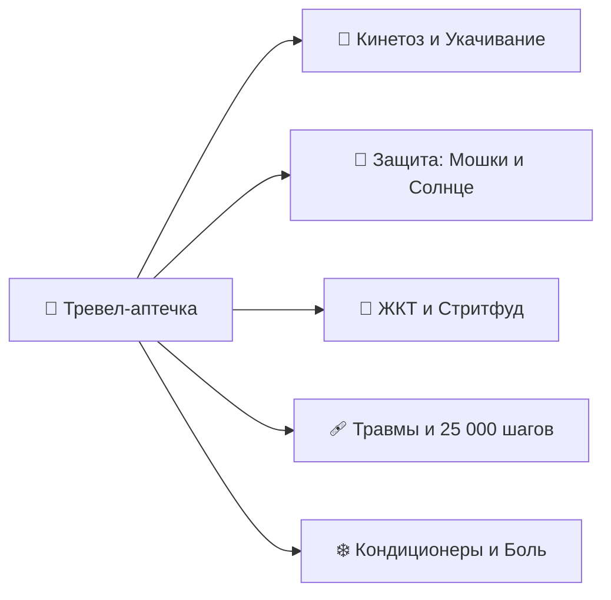
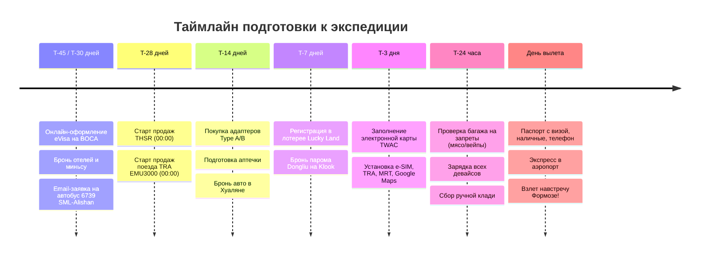

# 📋 Чек-лист подготовки и сборов

> [!INFO] Практическое руководство по экипировке и таймлайну
> Комплексный чек-лист сборов, охватывающий подготовку документов, упаковку цифрового воркейшн-сетапа, аптечку, слоистую одежду для тропиков (+28°C) и высокогорья (+8°C), а также контрольный предполетный таймлайн.

---

## 🪪 1. Документы, Въезд и Финансы

### 📄 Документы и въездные процедуры
- [ ] **Электронная виза на Тайвань (eVisa):** Оформлена на 100% онлайн через официальный портал BOCA на 30 дней. Распечатанный PDF-файл электронной визы подготовлен для посадки на рейс.
- [ ] **Загранпаспорт:** Срок действия не менее 6 месяцев на момент окончания поездки; наличие минимум 2–3 чистых страниц.
- [ ] **Электронная миграционная карта (TWAC):** Заполнена бесплатно **в течение 7 дней до прибытия** на [официальном портале TWAC](https://twac.immigration.gov.tw/); письмо-подтверждение сохранено офлайн.
- [ ] **Акция Return to Taiwan, Double Your Luck:** Если есть въезд на Тайвань после 01.01.2023, регистрация выполнена за **7–90 дней до прилета**; при необходимости добавлен один сопровождающий. Проверены email и [официальные правила](https://5000.taiwan.net.tw/campaign_rules_en.html).
- [ ] **Международные авиабилеты:** Маршрутные квитанции Москва ➔ Тайбэй ➔ Москва сохранены в PDF на смартфоне и распечатаны на бумаге.
- [ ] **Бронирования отелей и миньсу:** Ваучеры проживания по всему маршруту (Тайбэй, Цзяоси, Хуалянь, Шичжоу, Алишань, Тайнань, Гаосюн, Сяолюцю, Тайчжун) сохранены офлайн с адресами на традиционном китайском языке (для показа таксистам).
- [ ] **Медицинская страховка:** Оформлен полис ВЗР с покрытием от $50 000, включающий активный отдых (треккинг в горах до 2500 м, снорклинг на коралловых рифах) и лечение респираторных инфекций.
- [ ] **Цифровые копии документов:** Сканы паспорта, страховки, билетов и прав загружены в защищенное облачное хранилище (Google Drive / iCloud) и в локальную папку смартфона.

### 💳 Финансы и платежные средства
- [ ] **Наличная валюта (USD / EUR):** Подготовлены купюры нового образца (без штампов, надписей и надрывов) для обмена в аэропорту Таоюань (TPE) в кассах *Bank of Taiwan* или *Mega Bank*.
- [ ] **Зарубежные банковские карты:** Карты зарубежных банков (Казахстан, Кыргызстан, Турция, ОАЭ, Беларусь) или UnionPay, проверенные на снятие наличных в банкоматах 7-Bank (в магазинах 7-Eleven).
- [ ] **Уведомление банков:** В банковских приложениях установлены разрешения на операции в Тайване / сняты лимиты на трансграничные платежи.
- [ ] **Транспортная карта EasyCard / iPASS:** Приобретение физической карты в аэропорту TPE или в любом 7-Eleven (100 TWD) + первичное пополнение наличными на 1 000–1 500 TWD.

### 🎫 Матрица бронирования для иностранцев (Онлайн vs На месте)

> [!IMPORTANT] Ключевые правила для иностранных туристов на Тайване
> * **Идентификатор туриста:** При любой онлайн-покупке на тайваньских сайтах (THSR, TRA, отели) в поле документа всегда выбирайте **«Passport Number»** и вводите номер своего загранпаспорта (латиница и цифры, без знака № и пробелов). Внутренний тайваньский ID (身分證) иностранцу **не нужен**!
> * **Оплата российскими картами:** Напрямую тайваньские государственные платформы (TRA, THSR, BOCA) карты РФ не принимают (требуются карты зарубежных банков с 3D-Secure). **Выход для карт РФ:** использовать международные агрегаторы **Trip.com** (авиабилеты, отели) и **Klook / KKday** (ваучеры THSR со скидкой, билеты на паром Сяолюцю, аренда авто в Хуаляне).
> * **Наличные и EasyCard:** 80% повседневных транспортных расходов (метро, городские автобусы, паромы, шаттлы) оплачиваются физической картой **EasyCard (悠遊卡)**, пополняемой наличными в банкоматах или на кассе любого магазина 7-Eleven / FamilyMart.

| Сегмент / Услуга | Категория брони | Окно открытия | Где бронировать иностранцу | Способ оплаты | Что нужно для посадки / проезда |
| :--- | :---: | :---: | :--- | :--- | :--- |
| ✈️ **Авиабилеты РФ ⇌ Тайбэй** | 🔴 **Строго онлайн** | За 2–6 мес | [Trip.com](https://ru.trip.com) или авиакомпания | Карта РФ (на Trip.com) / Зарубежная карта | Загранпаспорт + распечатанная маршрутная квитанция |
| 🏨 **Отели и миньсу (B&B)** | 🔴 **Строго онлайн** | За 1–3 мес | [Trip.com](https://ru.trip.com), Booking, Agoda | Карта РФ (Trip.com) / Зарубежная карта | Паспорт + ваучер бронирования (с адресом на китайском) |
| 🚄 **Поезда THSR (Скоростные 300 км/ч)** | 🔴 **Строго онлайн** | **За 28 дней** (00:00 UTC+8) | Сайт `thsrc.com.tw`, апп *T Express* или ваучер на **Klook** | Зарубежная карта / Карта РФ (через Klook) | Мобильный QR-код в аппе *T Express* или билет из кассы по ваучеру Klook |
| 🚆 **Поезд TRA EMU3000 (Хуалянь ➔ Banqiao)** | 🔴 **Строго онлайн** | **За 28 дней** (00:00 UTC+8) | Сайт `tip.railway.gov.tw` или апп *TRA e-Ticketing* | Зарубежная карта (Visa/MC/JCB) | Электронный QR-билет в аппе или распечатка из кассы вокзала (**стоять по EasyCard запрещено!**) |
| 🚌 **Горный автобус 6739 (Sun Moon Lake ➔ Алишань)** | 🔴 **Строго онлайн** | **За 30–60 дней** | Email перевозчика Yuanlin Bus: `yulinbus@gmail.com` | При посадке водителю (EasyCard / нал) | Распечатанный email с подтверждением брони места |
| 🚗 **Авто с водителем (Хуалянь: Циншуй и Цисинтань)** | 🔴 **Строго онлайн** | За 7–14 дней | [Klook](https://www.klook.com) (Charter Day Tour) или отель | Карта РФ (Klook) / Зарубежная карта | Электронный ваучер Klook / контакт водителя в WhatsApp / Line |
| ⛴️ **Паром Dongliu Express (Дунган ➔ Сяолюцю)** | 🟡 **Онлайн / Касса** | За 3–7 дней | [Klook](https://www.klook.com) (Round-trip) или касса порта | Карта РФ (Klook) / Наличные в кассе | Паспорт + QR-ваучер Klook в кассе порта (выдают пластиковый билет) |
| 🚖 **Трансфер Гаосюн ➔ Порт Дунган** | 🟡 **Онлайн / Касса** | За 1–3 дня | Klook (Shared Shuttle) / Такси Uber на месте | Карта РФ (Klook) / Наличные таксисту | Электронный ваучер или посадка в такси |
| 🚂 **Поезд лесной узкоколейки Алишань** | 🟢 **Строго на месте** | В день поездки | Касса вокзала *Alishan Station* | Наличные NTD / Карта (~100 NTD) | Билет на исторический состав Chaoping / Shenmu |
| 🚌 **Автобус 7322 (Алишань ➔ Фэньциху)** | 🟢 **Строго на месте** | В момент посадки | Терминал *Alishan Bus Terminal* | Карта EasyCard (~90 NTD) | Карта EasyCard при входе и выходе |
| 🚌 **Спуск из Шичжоу в Цзяи (рейс 7322D)** | 🟢 **Строго на месте** | Перед посадкой | Остановка *Shizhuo Bus Stop* | Карта EasyCard (~150 NTD) | Рейс `10:10–11:55`; прийти к 10:00 |
| 🚌 **Шаттл 6670 (Тайчжун ➔ Sun Moon Lake)** | 🟢 **Строго на месте** | В день выезда | Стойка *Nantou Bus* на вокзале THSR Taichung | Карта EasyCard / Наличные (~85 NTD) | Посадка по живой очереди (автобусы каждые 15–20 мин) |
| 🚇 **Метро (MRT Тайбэй, Гаосюн, Taoyuan Airport)** | 🟢 **Строго на месте** | В момент поездки | Турникет любой станции | Карта EasyCard / iPASS | Прикосновение картой к турникету на входе и выходе |
| ⛴️ **Паром на о. Цицзинь (Гушань ➔ Цицзинь)** | 🟢 **Строго на месте** | В момент поездки | Турникет пирса Гушань | Карта EasyCard (~30 NTD) | Прикосновение картой к турникету перед посадкой |
| 🛵 **Электробайк (E-bike) на о. Сяолюцю** | 🟢 **Строго на месте** | По прибытии парома | Пункты проката у пирса Байша | Наличные (~400 TWD / день) | Загранпаспорт (права для E-bike до 25 км/ч **не требуются**) |

---

## 💻 2. Воркейшн, Электроника и Софт

### 🔌 Аппаратная часть (Hardware)
- [ ] **Рабочий ноутбук:** Проверен аккумулятор, очищен диск, установлены все критические обновления ОС перед вылетом.
- [ ] **Адаптеры питания (Type A / B):** 2–3 компактных адаптера с европейской вилки (Type C/F) на плоские американские штырьки (110V / 60Hz).
- [ ] **Сетевое зарядное устройство GaN (65W / 100W):** Компактный многопортовый блок (2x Type-C + 1x USB-A), способный одновременно заряжать ноутбук, смартфон и пауэрбанк.
- [ ] **Внешний аккумулятор (PowerBank 10 000 – 20 000 мАч):** Емкость до 100 Вт·ч / 20 000 мАч (**строго в ручную кладь**, провоз пауэрбанков в багаже авиакомпаниями категорически запрещен!).
- [ ] **Комплект кабелей:**
  - [ ] 2x Type-C ➔ Type-C (с поддержкой 100W PD и быстрой зарядки, один длинный 2м).
  - [ ] 1x Type-C ➔ Lightning / USB-C для смартфона.
  - [ ] Магнитный кабель для зарядки смарт-часов / фитнес-браслета.
- [ ] **Наушники:**
  - [ ] Полноразмерные беспроводные наушники с активным шумоподавлением (ANC) для перелетов и работы в лобби/кофейнях.
  - [ ] Компактные TWS-вкладыши для прогулок, хайкинга и поездок на YouBike.
- [ ] **Периферия для работы:** Компактная беспроводная мышь + легкая складная алюминиевая подставка под ноутбук (для правильной эргономики спины в отелях).
- [ ] **Резервный смартфон:** Запасной телефон (на случай потери основного, а также для использования в качестве независимой Wi-Fi точки доступа).

### 📱 Цифровой софт и приложения (Software)
- [ ] **Связь и e-SIM:** Установлено приложение (Airalo / Nomad / Klook / KKday) и активирован профиль тайваньской e-SIM (операторы Chunghwa Telecom / Taiwan Mobile / FarEasTone).
- [ ] **VPN-сервисы:** Установлены и настроены 2 независимых VPN-клиента (необходимы для доступа к российским банковским приложениям, Госуслугам и сервисам РФ из-за рубежа).
- [ ] **Карты и навигация:**
  - [ ] **Google Maps:** Загружена офлайн-карта всего Тайваня.
  - [ ] **Apple Maps / Maps.me:** Офлайн-метки ключевых отелей, вокзалов и природных троп.
- [ ] **Транспортные приложения:**
  - [ ] **TRA e-Ticketing (台鐵e訂通):** Официальное приложение железных дорог Тайваня для отслеживания расписания и покупки билетов на поезда EMU3000 / Tze-Chiang.
  - [ ] **T Express (台灣高鐵):** Приложение скоростных поездов THSR (300 км/ч) с мобильными посадочными QR-билетами.
  - [ ] **Taipei MRT / Bus+:** Навигация по метро Тайбэя, Гаосюна и городским автобусам в реальном времени.
  - [ ] **YouBike 2.0:** Официальное приложение велопроката (привязка карты EasyCard и аренда велосипедов по всему острову).
  - [ ] **Uber / 55688 (FindTaxi):** Приложения для быстрого вызова официального такси.
- [ ] **Языковые помощники:**
  - [ ] **Google Translate / DeepL:** Загружен офлайн-пакет традиционного китайского языка (функция мгновенного перевода вывесок и меню через камеру).
- [ ] **Локальный лайфстайл:**
  - [ ] **Taiwan Receipt Lottery (發票對獎):** Приложение для автоматического сканирования QR-кодов на магазинных чеках для участия в государственной лотерее *Uniform Invoice*.
  - [ ] **Line:** Главный мессенджер в Азии для оперативной связи с хозяевами миньсу (B&B) и гидами.

---

## 💊 3. Аптечка путешественника и Здоровье

### 🤢 Укачивание (Критически важно!)
- [ ] **Таблетки от укачивания (Драмина / Авиамарин):** Необходимы для скоростного 20-минутного парома Дунган ➔ Сяолюцю через открытый пролив Баши и извилистых горных серпантинов при подъеме в Шичжоу и Алишань (автобус 7329).

### 🦟 Защита от солнца и насекомых
- [ ] **Репеллент от мошек «Сяохэйвэнь» (小黑蚊):** Средство с ДЭТА или маслом лимонного эвкалипта (также доступно на кассе любого 7-Eleven под маркой *Xiaoheiwen Repellent*).
- [ ] **Бальзам после укусов:** Tiger Balm / Звездочка / Фенистил-гель (быстро снимает зуд и отек).
- [ ] **Солнцезащитный крем SPF 50+ (Reef-Safe):** Крем без оксибензона и октиноксата (экологическое требование для защиты кораллов и зеленых черепах на острове Сяолюцю).
- [ ] **Пантенол / Алоэ-вера гель:** Средство для регенерации кожи после длительного нахождения на тропическом солнце.

### 🍜 ЖКТ, Пищеварение и Адаптация
- [ ] **Сорбенты:** Полисорб (в саше), Энтеросгель или Смекта (первая помощь при непривычной пище на ночных рынках).
- [ ] **Ферменты:** Мезим / Панкреатин / Креон (для комфортного пищеварения при дегустации обильного стритфуда).
- [ ] **Противодиарейные препараты:** Лоперамид / Имодиум.
- [ ] **Регидратация:** Регидрон / Гидровит (порошки для восстановления электролитного баланса при жаре +28...+30°C).
- [ ] **Пробиотики:** Пробиологический комплекс для поддержания микрофлоры ЖКТ в поездке.

### 🩹 Травмы, Мозоли и Мышцы (20 000+ шагов в день)
- [ ] **Гидроколлоидные пластыри (Compeed):** Специальные пластыри от влажных мозолей на пятках и пальцах.
- [ ] **Бактерицидные пластыри:** Набор из 20–30 пластырей разного размера.
- [ ] **Антисептик:** Хлоргексидин / Мирамистин в пластиковом флаконе (до 100 мл).
- [ ] **Обезболивающая разогревающая/охлаждающая мазь:** Вольтарен / Диклофенак или тайский бальзам для снятия усталости мышц ног после треккинга на Алишане и Лиюй.
- [ ] **Эластичный бинт:** Для фиксации голеностопа при активном хайкинге.

### ❄️ Простуда, Кондиционеры и Боль
- [ ] **Обезболивающее / Жаропонижающее:** Ибупрофен (Нурофен) и Парацетамол.
- [ ] **Леденцы от боли в горле:** Стрепсилс / Граммидин (в поездах THSR, метро и отелях кондиционеры часто работают на +18...+20°C).
- [ ] **Сосудосуживающие капли / спрей в нос:** Для комфортных взлетов и посадок при заложенности носа.
- [ ] **Увлажняющие капли для глаз:** Систейн / искусственная слеза (снимают сухость от сухого воздуха в салоне самолета и экранов).

---

## 👕 4. Гардероб и Обувь по климатическим зонам

| Зона / Локация | Температура | Специфика | Комплект одежды |
| :--- | :---: | :--- | :--- |
| 🌴 **Тропики и Побережье** *(Тайбэй, Тайнань, Гаосюн, Сяолюцю)* | `+26...+30°C` | Влажный субтропический климат, яркое солнце, кондиционированный транспорт | Легкие льняные/хлопковые футболки, шорты, брюки свободного кроя, льняная рубашка с длинным рукавом, головной убор |
| 🌲 **Высокогорье** *(Шичжоу 1400м, Алишань 2200м, Чжушань 2451м)* | `+8...+16°C` | Прохладный туманный горный воздух, сырость, холодный рассвет на смотровой | Флисовая кофта, легкая пуховая жилетка/куртка (Packable Down), ветровка, треккинговые брюки, теплые носки |
| ♨️ **Онсэны и Вода** *(Цзяоси, Бэйтоу, Сяолюцю)* | Вода `+27...+42°C` | Минеральные термы, океанский снорклинг | Плавки/купальник, **плавательная шапочка** (для открытых терм), рашгард UPF 50+ для снорклинга |

> [!TIP] 🧺 Тайваньские монетоприемные прачечные (Coin Laundry)
> Не набирайте лишней одежды на все 24 дня! На Тайване на каждом углу и почти в каждом отеле/хостеле работают автоматические круглосуточные прачечные (*自助洗衣*). Полный цикл стирки и сушки занимает 40–50 минут и стоит `~80–120 NT$` (`~220–340 ₽`). Достаточно компактного капсульного гардероба на 4–5 дней из легких быстросохнущих тканей.

### 👟 Обувь (Универсальный минимум)
- [ ] **Основная пара:** Удобные разношенные кроссовки с дышащей сеткой и хорошей амортизацией (для города, 15–20 км в день и горных троп Алишаня).
- [ ] **Универсальные сандалии / сланцы:** Легкие быстросохнущие сандалии или сланцы (для пляжа на Сяолюцю, номера в отеле и онсэнов).

### 🩳 Одежда для городов и тропиков (Капсула на 4–5 дней)
- [ ] **Футболки / Поло (3–4 шт.):** Из быстросохнущей функциональной ткани (CoolMax / меринос / легкий хлопок).
- [ ] **Шорты (1–2 шт.):** Удобные городские или спортивные шорты.
- [ ] **Легкие длинные брюки (1 пара):** Чиносы или технологичные стрейч-брюки (для работы, ресторанов, храмов и перелетов).
- [ ] **Рубашка с длинным рукавом (1 шт.):** Льняная или тревел-рубашка (защита от солнца и кондиционеров в транспорте).
- [ ] **Нижнее белье и носки (4–5 комплектов):** Быстросохнущие (стираются в прачечной раз в 4 дня).
- [ ] **Головной убор и очки:** Кепка/панама от солнца и очки UV400.

### 🌲 Одежда для высокогорья Алишаня (Принцип многослойности)
> [!NOTE] Нет смысла везти отдельный тяжелый зимний гардероб ради одного рассвета. Используется принцип слоев поверх городской одежды:
- [ ] **Флиска / Толстовка:** Базовый утепляющий слой (пригодится и в холодных кондиционированных поездах).
- [ ] **Легкая ветровка / Дождевик:** Защита от ветра и влаги (надевается поверх флиски).
- [ ] **Ультралегкий пуховик / пуховая жилетка (Packable Down):** Сворачивается в кулак, надевается под ветровку на рассвете Чжушань (+8°C).
- [ ] **Теплые носки (1 пара):** Для прохладной ночи в горах.

### 🤿 Водные активности и онсэны
- [ ] **Купальные плавки / Шорты (1 шт.).**
- [ ] **Рашгард UPF 50+:** Защита спины от солнца при снорклинге с черепахами на Сяолюцю.
- [ ] **Плавательная шапочка:** Обязательна для общественных онсэнов в Цзяоси и Бэйтоу.

---

## 🎒 5. Снаряжение, Оптика и Полезные мелочи

- [ ] **Городской рюкзак (15–20 л):** Легкий эргономичный рюкзак для радиальных выходов, ноутбука, бутылки с водой и ветровки.
- [ ] **Термобутылка / Термос (0.5 – 0.7 л):** На всех станциях метро MRT, вокзалах TRA и в культурных центрах установлены бесплатные диспенсеры питьевой воды с опцией горячего кипятка (*Вэнь-Жэ-Кай*) — термос позволяет заваривать высокогорный чай прямо во время прогулок.
- [ ] **Блокнот для штампов путешественника (紀念章):** Компактный нелинованный блокнот с плотной бумагой для сбора бесплатных дизайнерских печатей на станциях, у храмов и в музеях.
- [ ] **Гермочехол для смартфона (IPX8):** Водонепроницаемый прозрачный чехол на шнурке для подводной съемки черепах на Сяолюцю и каякинга.
- [ ] **Компактный шоппер / Экосумка:** В тайваньских магазинах одноразовые пакеты платные; складная сумка в кармане экономит деньги и бережет экологию.
- [ ] **Герметичный зип-пакет для личного мусора:** На улицах практически нет урн; небольшой пакет позволяет носить фантики до ближайшего 7-Eleven или станции метро.
- [ ] **Компактный дождевик-пончо или складной зонт:** Легкая защита от субтропического дождя на восточном побережье Хуаляня и в Цзюфэне.
- [ ] **Быстросохнущее микрофибровое полотенце:** Компактное полотенце для ног после онсэн-ванночек в Цзяоси или купания на Цицзине.
- [ ] **Набор индивидуальной гигиены:** Зубная щетка, паста, компактный твердый шампунь (с 2025 года многие эко-отели Тайваня не предоставляют одноразовые пластиковые щетки в номерах).

---

## 🚨 6. Строжайшие таможенные запреты (Штрафы и Депортация)

> [!CAUTION] 🚫 ЧЕК-ЛИСТ ТАМОЖЕННОЙ БЕЗОПАСНОСТИ ТАЙВАНЯ
> Перед закрытием чемодана убедитесь, что в багаже и ручной клади **ПОЛНОСТЬЮ ОТСУТСТВУЮТ** следующие категории:

- [ ] ❌ **Мясные продукты в любом виде:** Колбаса, сосиски, хамон, вяленое мясо (джерки), паштеты, бутерброды из самолета с курицей/ветчиной, мясные консервы, лапша б/п с пакетиками сублимированного мясного соуса. *(Штраф: `~560 000 ₽` при первой попытке ввоза / моментальная депортация!).*
- [ ] ❌ **Электронные сигареты и вейпы:** Вейпы, одноразовые электронные испарители, жидкости для заправки с никотином и без него, устройства и стики систем нагревания табака IQOS / Glo / Ploom. *(Штраф за ввоз: от `~140 000 ₽` до `~14 000 000 ₽`!).*
- [ ] ❌ **Свежие фрукты, овощи и растения:** Яблоки, цитрусовые, бананы, манго, свежие ягоды, семена, саженцы и живые растения с почвой. *(Штраф: от `~84 000 ₽`).*
- [ ] ❌ **Крупные пауэрбанки в багаже:** Внешние аккумуляторы мощностью свыше 100 Вт·ч / 20 000 мАч, а также любые пауэрбанки, сданные в зарегистрированный багаж (разрешены строго в ручной клади до 20 000 мАч).
- [ ] ❌ **Дроны и квадрокоптеры без регистрации:** Полеты дронов в городах Тайваня и над нацпарками без лицензии CAA запрещены (штрафы от `~84 000 ₽` с конфискацией).

---

## ⏳ 7. Контрольный таймлайн готовности

### 🗓️ За 45–30 дней до вылета (T-45d / T-30d) — eVisa, Отели и Автобус 6739
- [ ] Подготовить цветной скан главной страницы загранпаспорта и цифровую фотографию (на белом фоне, JPEG).
- [ ] Заполнить анкету на официальном портале BOCA (`visawebapp.boca.gov.tw` ➔ раздел *eVisa Applications*).
- [ ] Оплатить сбор ~1 646 TWD (~$50–55 USD) зарубежной банковской картой.
- [ ] Получить одобрение на email (через 3–5 рабочих дней) и распечатать PDF-файл электронной визы в 2 экземплярах.
- [ ] Подробный гайд: [[Визовый гайд для граждан РФ (2026)]].
- [ ] **Забронировать горный автобус 6739 (Sun Moon Lake ➔ Алишань):** Отправить письмо на английском перевозчику Yuanlin Bus (`yulinbus@gmail.com`) с указанием даты, количества пассажиров и номеров паспортов (всего 1 рейс в день на 19 мест!).
- [ ] Зафиксировать бронирования всех отелей и горных миньсу (особенно на Алишане и Сяолюцю).

### 🗓️ За 28 дней до поездки (T-28d) — Критический день поездов THSR и TRA!
- [ ] **00:00 по Тайваню (19:00 по Москве накануне):** Открываются продажи на скоростные поезда **THSR** (Баньцяо ➔ Тайчжун, Гаосюн ➔ Тайчжун, Тайчжун ➔ Таоюань) со скидками Early Bird до 35% на сайте `thsrc.com.tw` или в приложении *T Express*.
- [ ] **00:00 по Тайваню:** Открываются продажи на поезд **TRA EMU3000 (Хуалянь ➔ Banqiao)** на сайте `tip.railway.gov.tw`. *(Критично выкупить сразу, так как билеты на восточную ветку разбирают мгновенно, а стоячий проезд по EasyCard запрещен).*

### 🗓️ За 14 дней до вылета (T-14d)
- [ ] Забронировать авто с водителем в Хуаляне (на Klook или через отель).
- [ ] Приобрести переходники на плоские американские розетки (Type A/B 110V).
- [ ] Собрать полную индивидуальную аптечку (включая Драмину, сорбенты, Reef-Safe солнцезащиту и антимоскитные средства).
- [ ] Проверить состояние треккинговой обуви и докупить недостающие слои одежды для Алишаня.
- [ ] Проверить рабочее оборудование (ноутбук, кабели, GaN-зарядку 65–100W, пауэрбанк).

### 🗓️ За 7 дней до вылета (T-7d)
- [ ] **Проверить акцию Return to Taiwan, Double Your Luck:** Регистрация должна быть завершена не позже чем за 7 дней до прилета; проверить письмо и результат ближайшего розыгрыша.
- [ ] Забронировать скоростной паром Dongliu Express на о. Сяолюцю (ваучер round-trip на Klook со скидкой).
- [ ] Загрузить офлайн-карты Google Maps и офлайн-словарь китайского языка в Google Translate / DeepL.

### 🗓️ За 3 дня до вылета (T-3d)
- [ ] **Заполнить TWAC** на [официальном портале](https://twac.immigration.gov.tw/) и сохранить письмо-подтверждение.
- [ ] Установить профиль e-SIM на смартфон (без активации роуминга до прилета).
- [ ] Сохранить все ваучеры отелей, билеты и расписания в отдельную офлайн-папку на телефоне.
- [ ] Уведомить обслуживающие банки о географии поездки.

### 🗓️ За 24 часа до вылета (T-24h)
- [ ] Пройти онлайн-регистрацию на международный авиарейс и выбрать комфортные места в салоне.
- [ ] Провести тотальную ревизию чемодана на отсутствие мясных изделий, фруктов и вейпов.
- [ ] Полностью зарядить ноутбук, смартфон, пауэрбанк, беспроводные наушники и смарт-часы.
- [ ] Сложить в ручную кладь: паспорт, наличные деньги, банковские карты, ноутбук, пауэрбанк, аптечку первой необходимости, сменную футболку и адаптер питания.

### 🛫 В день вылета (День 01)
- [ ] Финальная проверка: Паспорт, Билеты, Деньги, Телефон, Зарядки.
- [ ] Прибытие в аэропорт за 3 часа до вылета рейса.
- [ ] Перевести телефон в режим полета, надеть шумоподавляющие наушники и настроиться на грандиозное путешествие!
