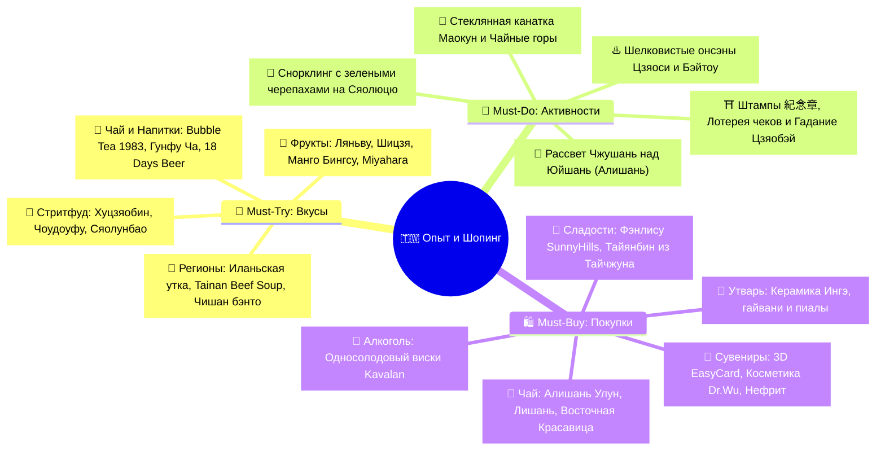
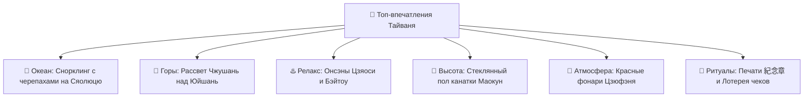
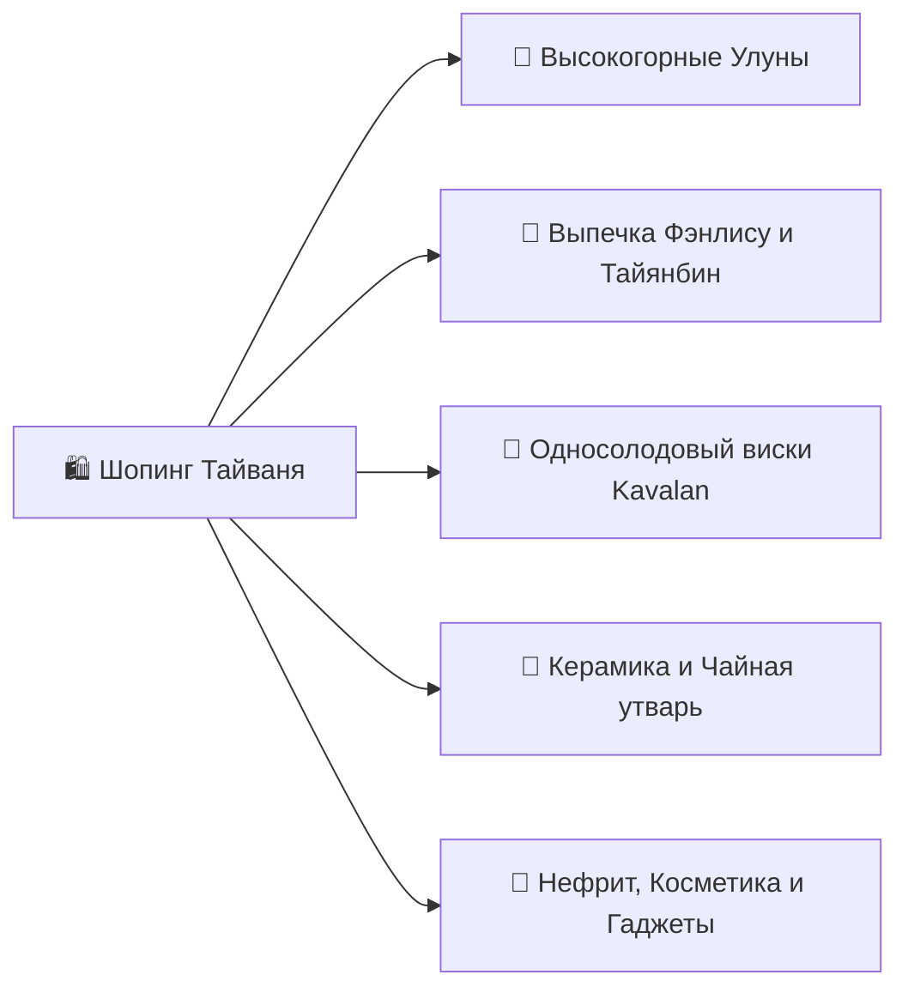

# 🎯 Что попробовать и купить (Must-Try & Must-Buy)

> [!INFO] Полный каталог гастрономии, впечатлений и аутентичного шопинга
> Интерактивный трекер всех вкусов, культовых активностей и лучших сувениров Тайваня с ориентировочными ценами, адресами и проверенными рекомендациями.

---

## 🧭 Карта гастрономии и шопинга

---

## 🍜 I. Must-Try: Гастрономический гид (Что попробовать)

### 🏮 1. Легендарный стритфуд ночных рынков
- [ ] **Хуцзяобин (Hu Jiao Bing / 胡椒餅) — Перечные булочки из тандыра:**
  - *Что это:* Хрустящая слоеная булочка, запеченная на внутренних стенках глиняной печи-тандыра. Внутри — обжигающая сочная рубленая свинина с черным перцем и зеленым луком.
  - *Где пробовать:* Ночной рынок Раохэ (Raohe Night Market) в Тайбэе — лавка *Fuzhou Black Pepper Bun* у главного входа (`~65 TWD / ~180 ₽`).
- [ ] **Чоудоуфу (Stinky Tofu / 臭豆腐) — Хрустящий «Вонючий тофу»:**
  - *Что это:* Ферментированный тофу, обжаренный во фритюре до золотистой корочки (хрустящий снаружи, нежный внутри). Подается с чесночно-соевым соусом и кисло-сладкой маринованной капустой *паоцай*.
  - *Где пробовать:* Ночные рынки Шилинь, Симэньдин, Люхэ в Гаосюне (`~60–80 TWD / ~170–220 ₽`).
- [ ] **Лужоуфань (Lu Rou Fan / 滷肉飯) — Рис с томленой свининой:**
  - *Что это:* Национальное блюдо Тайваня: тающая во рту свиная грудинка, долго томленная в темном соевом соусе с китайскими специями (бадьян, корица, сычуаньский перец), выложенная на подушку из горячего риса с половинкой чайного яйца.
  - *Где пробовать:* *Jin Feng Lu Rou Fan* (у станции MRT Chiang Kai-shek Memorial Hall) или *Formosa Chang* (`~45–70 TWD / ~130–200 ₽`).
- [ ] **Сяолунбао (Xiao Long Bao / 小籠包) — Эталонные шанхайские пельмени:**
  - *Что это:* Паровые пельмени в тончайшем тесте (ровно 18 складок) с сочной мясной начинкой и обжигающим ароматным бульоном внутри.
  - *Где пробовать:* Мировая сеть *Din Tai Fung* (флагман на Dongmen / Xinyi Rd или в Taipei 101; `~250–350 TWD / ~700–980 ₽` за порцию).
- [ ] **Гуабао (Gua Bao / 刈包) — «Тайваньский бургер»:**
  - *Что это:* Мягкая белоснежная паровая булочка в форме ракушки, начиненная нежнейшей свиной грудинкой, посыпанная сладкой арахисовой пудрой, рубленой кинзой и маринованной горчичной зеленью.
  - *Где пробовать:* *Lan Jia Traditional Taiwanese Snack* у станции MRT Gongguan в Тайбэе (`~70 TWD / ~200 ₽`).
- [ ] **О-а-цзянь (Oyster Omelet / 蚵仔煎) — Устричный омлет:**
  - *Что это:* Свежие тихоокеанские мелкие устрицы, обжаренные с яйцом, листьями хрустящего салата и тапиоковым крахмалом (придает упругую текстуру *Q-texture*), под фирменным кисло-сладким розовым соусом.
  - *Где пробовать:* Ночные рынки Нинся (Ningxia) в Тайбэе и Дадун в Тайнане (`~80–100 TWD / ~220–280 ₽`).
- [ ] **Дачанбао Сяочан (Large Sausage Wrap Small Sausage / 大腸包小腸):**
  - *Что это:* Традиционная тайваньская свиная колбаска-гриль со сладковатым вкусом, завернутая в надрезанную «булочку» из клейкого риса с добавлением чеснока и маринованных огурчиков.
  - *Где пробовать:* Ночной рынок Фэнцзя (Fengjia) в Тайчжуне (`~75 TWD / ~210 ₽`).
- [ ] **Шэнцзяньбао (Sheng Jian Bao / 生煎包):**
  - *Что это:* Паровые сочные булочки с мясом и зеленым луком, поджаренные на плоской сковороде до хрустящей золотистой нижней корочки и посыпанные кунжутом.
  - *Где пробовать:* Ночной рынок Шida (Shida Night Market) в Тайбэе (`~15–20 TWD / ~45–60 ₽` за штуку).

---

### 🍲 2. Региональные специалитеты и Высокая кухня
- [ ] **Иланьская вишневая утка (Cherry Valley Duck / 櫻桃鴨) в Цзяоси и Илане:**
  - *Что это:* Птица свободного выгула из экологических предгорий Иланя с идеальной тонкой прослойкой жира. Фирменная подача — утиные суши с хрустящей карамельной кожицей и расплавленным сыром.
  - *Где пробовать:* Ресторан *Red Lantern* в отеле Silks Place Yilan или специализированные утиные рестораны Цзяоси (`~900–1 600 ₽` за сет).
- [ ] **Саньсинские слоеные лепешки с луком (Sanxing Scallion Pancake / 蔥油餅):**
  - *Что это:* Пышные многослойные лепешки, жаренные в кипящем масле, с гигантским количеством сочного сладкого зеленого лука Саньсин.
  - *Где пробовать:* Уличные лотки у вокзала Цзяоси и в поселке Саньсин (`~40–55 TWD / ~110–155 ₽`).
- [ ] **Тайнаньский парной говяжий суп (Tainan Fresh Beef Soup / 台南牛肉湯):**
  - *Что это:* Главный утренний ритуал древней столицы: тончайшие лепестки свежайшей утренней сырой говядины прямо в пиале заливаются кипящим прозрачным бульоном из костей, трав и овощей. Мясо доходит до нежнейшей готовности за 10 секунд.
  - *Где пробовать:* *Six Thousand Beef Soup (六千牛肉湯)* или *A-Cun Beef Soup* в Тайнане в 06:00–08:00 утра (`~150–200 TWD / ~420–560 ₽`).
- [ ] **Лапша Даньцзай (Danzai Noodles / 擔仔麵) в Тайнане:**
  - *Что это:* Историческая лапша, созданная в 1895 году рыбаком Хун Юйтоу: упругая лапша в наваристом бульоне из креветочных панцирей с мясным фаршем, свежей креветкой и ростками сои.
  - *Где пробовать:* Легендарное заведение *Du Hsiao Yueh (度小月)* в Тайнане (`~60–90 TWD / ~170–250 ₽`).
- [ ] **Чишанский железнодорожный бэнто (Chishang Fanbao / 池上飯包):**
  - *Что это:* Эталонный ланч-бокс в коробочке из тонкого шпона дерева павловнии с премиальным чишанским рисом *Гун Ми*, свиной отбивной, чайным яйцом, жареным тофу и горным бамбуком.
  - *Где пробовать:* Исторический музей-кафе *Chishang Fanbao Cultural Story House* в Чишане или на перронах станций TRA (`~90–120 TWD / ~250–340 ₽`).
- [ ] **Суп с тушеной говядиной (Taiwanese Beef Noodle Soup / 牛肉麵):**
  - *Что это:* Культовое блюдо: тягучий насыщенный бульон (красный пряный *Hong Shao* или прозрачный целебный *Qing Dun*), домашняя толстая лапша и гигантские тающие куски говяжьей голени с сухожилиями.
  - *Где пробовать:* *Yong Kang Beef Noodle* или *Lin Dong Fang* в Тайбэе (`~220–300 TWD / ~600–840 ₽`).
- [ ] **Островное Seafood BBQ на углях на Сяолюцю:**
  - *Что это:* Безлимитный гриль на свежем воздухе у океана: свежайшие тихоокеанские устрицы, креветки, кальмары, рыба и овощи, обжариваемые самостоятельно на решетках с углями.
  - *Где пробовать:* Открытые BBQ-рестораны вдоль побережья Сяолюцю (`~450–550 TWD / ~1 260–1 540 ₽` за безлимит).

---

### 🍵 3. Чайная культура, Bubble Tea и Напитки
- [ ] **Оригинальный Bubble Tea в Chun Shui Tang (春水堂) в Тайчжуне:**
  - *Что это:* Место рождения жемчужного чая (1983 г.): черный чай с молоком и упругими шариками тапиоки ручной работы.
  - *Секретный код заказа:* **Сахар: 30% (Micro Sugar / 微糖 - Wei Tang) | Лед: Без льда (No Ice / 去冰 - Qu Bing)**.
  - *Где пробовать:* Оригинальное кафе *Chun Shui Tang Siwei Original Store* в Тайчжуне (`~100–160 TWD / ~280–450 ₽`).
- [ ] **Традиционная чайная церемония Гунфу Ча (Gongfu Cha / 功夫茶):**
  - *Что это:* Вдумчивое заваривание высокогорного улуна в глиняном чайнике или гайвани с оценкой аромата из специальных чайных пар (*вэньсянбэй*).
  - *Где пробовать:* Чайный миньсу в поселке Шичжоу (1400 м), высокогорный Алишань или чайный дом *A-Mei Tea House* в Цзюфэне (`~300–600 TWD / ~840–1 680 ₽`).
- [ ] **Свежее пиво Taiwan Beer «18 Days» (18天台灣生啤酒):**
  - *Что это:* Непастеризованное разливное лагерное пиво со сроком годности ровно 18 дней, доставляемое в магазины в охлаждаемых автоцистернах. Невероятно мягкий, освежающий чистый вкус.
  - *Где покупать:* В холодильниках 7-Eleven и FamilyMart в зеленых стеклянных бутылках 0.6 л (`~70 TWD / ~195 ₽`).
- [ ] **Освежающее желе Айюй с лимоном (Lemon Aiyu Jelly / 檸檬愛玉):**
  - *Что это:* Натуральное растительное желе из семян эндемичного горного фикуса, подаваемое с колотым льдом, натуральным лимонным соком и медом.
  - *Где пробовать:* Уличные чайные лавки в Цзюфэне, Алишане и ночных рынках (`~45–60 TWD / ~125–170 ₽`).

---

### 🥭 4. Тропические фрукты и Авторские десерты
- [ ] **Восковое яблоко (Wax Apple / 蓮霧 - Ляньву):**
  - *Что это:* Колоколообразный блестящий розово-красный фрукт. Хрустит как сочное яблоко, не имеет косточки, обладает нежным освежающим цветочным вкусом и отлично утоляет жажду.
  - *Где покупать:* В фруктовых лавках и на рынках (`~80–120 TWD / ~220–340 ₽` за кг).
- [ ] **Сахарное яблоко (Custard Apple / 釋迦 - Шицзя):**
  - *Что это:* Чешуйчатый зеленый плод с кремовой белой мякотью, напоминающей по вкусу смесь пломбира, ананаса, банана и заварного крема.
  - *Где покупать:* На фруктовых развалах Хуаляня, Тайдуна и на ночных рынках (`~100–150 TWD / ~280–420 ₽` за плод).
- [ ] **Манговый ледяной десерт (Mango Bingsu / 芒果冰):**
  - *Что это:* Гигантская чаша тончайшего молочного ледяного снега, щедро усыпанная кубиками спелого манго сорта Irwin, политая манговым пюре, сгущенным молоком и шариком мангового сорбета.
  - *Где пробовать:* *Smoothie House* на улице Yongkang в Тайбэе или в фруктовых лавках Гаосюна (`~220–280 TWD / ~600–780 ₽`).
- [ ] **Дворец десертов Miyahara (宮原眼科) в Тайчжуне:**
  - *Что это:* Историческое здание бывшей японской глазной клиники 1927 года, превращенное в сказочную библиотеку сладостей в стиле «Гарри Поттера». 50+ авторских сортов мороженого (шоколад разной степени какао, улуны, экзотические фрукты), которые украшают целыми кусками ананасовых пирожных и сырных кейков.
  - *Где пробовать:* *Miyahara* возле вокзала Тайчжуна (`~200–350 TWD / ~560–980 ₽`).
- [ ] **Сезонное мягкое мороженое FamiSoft в FamilyMart:**
  - *Что это:* Легендарный десерт сети FamilyMart со сменяющимися вкусами (чай Тегуаньинь, манго, японская матча, крем-брюле).
  - *Где покупать:* В любом FamilyMart с аппаратом для мороженого (`~39–49 TWD / ~110–140 ₽`).
- [ ] **Зеленая хрустящая гуава с порошком сливы (Plum Powder / 梅子粉):**
  - *Что это:* Свеженарезанная хрустящая тайваньская гуава, посыпанная кисло-сладко-соленым порошком из сушеной сливы. Необыкновенный гастрономический контраст!
  - *Где покупать:* В стаканчиках на ночных рынках (`~50 TWD / ~140 ₽`).

---

## 🎯 II. Must-Do: Топ-впечатления и Культурные ритуалы

### 🌊 Природа и Океан
- [ ] **Рассветный снорклинг с зелеными морскими черепахами на Сяолюцю:**
  - *Детали:* Выход в 07:30 утра к Скале-вазе (*Vase Rock*) или пляжу Гебань. Десятки метровых черепах пасутся на водорослях на глубине 1–2 метра при абсолютном отсутствии толп туристов.
  - *Правило:* Не прикасаться к черепахам (штраф `~840 000 ₽`).
- [ ] **Встреча рассвета на станции Чжушань над морем облаков (Алишань, 2451 м):**
  - *Детали:* Поездка на ночном историческом горном поезде в 05:00 утра на вершину Чжушань и наблюдение за появлением первых золотых лучей солнца из-за высочайшего пика Восточной Азии — горы Юйшань (3952 м).
- [ ] **Прогулка среди 2000-летних реликтовых кипарисов Хиноки:**
  - *Детали:* Хайкинг по деревянным настилам «Тропы священных деревьев» в национальном парке Алишань среди гигантских кипарисов, проросших до нашей эры.
- [ ] **Велопрогулка по мраморному берегу пляжа Цисинтань в Хуаляне:**
  - *Детали:* Аренда велосипеда и поездка вдоль серповидного залива Тихого океана с миллиардами обточенных волнами поющих камней под шум мощного прибоя.

### ♨️ Онсэн-культура и Релакс
- [ ] **Шелковистые бессерные ванны красоты (*Мэйжэнь-тан*) в Цзяоси:**
  - *Детали:* Вечернее погружение в горячую (+58°C) минеральную воду без запаха серы прямо в глубокой каменной ванне своего гостиничного номера.
- [ ] **Традиционный японский онсэн под открытым небом в Бэйтоу:**
  - *Детали:* Купание в серных термальных источниках в окружении субтропической зелени у подножия вулкана Янминшань.

### 🏙️ Городской вайб и Технологии
- [ ] **Полет на канатной дороге Маокун в кабинке со стеклянным полом (Crystal Cabin):**
  - *Детали:* 4-километровый подъем над чайными плантациями и джунглями юга Тайбэя с прозрачным дном кабинки под ногами.
- [ ] **Велопрогулка YouBike 2.0 по арт-набережной Pier-2 в Гаосюне:**
  - *Детали:* Разблокировка велосипеда за 2 секунды картой EasyCard и неспешный круиз вдоль морского порта, скульптур-трансформеров и поворотного моста Great Harbor Bridge.
- [ ] **Прогулка по вечернему Цзюфэню в свете красных фонарей:**
  - *Детали:* Погружение в кинематографическую атмосферу чайных домов и узких каменных лестниц, вдохновивших Хаяо Миядзаки.

### ⛩️ Культурные ритуалы и Лайфхаки
- [ ] **Сбор авторских штампов путешественника (Traveler's Stamps / 紀念章):**
  - *Детали:* Бесплатные штампы установлены на столиках у турникетов каждой станции метро MRT, ж/д вокзалов TRA, в храмах, на маяках и в арт-парках. Личный блокнот превращается в уникальный иллюстрированный дневник!
- [ ] **Гадание «Цзяобэй» (擲筊) в Храме Луншань:**
  - *Детали:* Задать мысленный вопрос богам и бросить на каменный пол два красных деревянных бруска в форме полумесяцев (один плоский + один круглый = одобрение божества).
- [ ] **Проверка магазинных чеков в государственной лотерее Uniform Invoice:**
  - *Детали:* Сохранять все чеки из 7-Eleven, FamilyMart и кафе, чтобы проверить 8-значные номера в приложении *Taiwan Receipt Lottery* перед вылетом (розыгрыш каждые 2 месяца, призы до 10 млн TWD).

---

## 🛍️ III. Must-Buy: Что привезти домой (Шопинг-гид)

### 🍃 1. Чай мирового класса (Царство Улунов)

| Сорт чая | Регион / Высота | Вкусовой профиль | Ориентировочная цена |
| :--- | :--- | :--- | :---: |
| **Алишань Гаошань Улун (Alishan Gaoshan Cha)** | Алишань / 1400–1600 м | Нежный сливочно-цветочный аромат (*найсян*), шелковистый настой, сладкое послевкусие | `~600–1 200 TWD` *(~1 680–3 360 ₽)* за 150 г |
| **Лишань Улун (Lishan High Mountain)** | Лишань / 2000–2600 м | Самый высокогорный и редкий улун: фруктовые ноты спелой груши, кристальная чистота | `~1 200–2 500 TWD` *(~3 360–7 000 ₽)* за 150 г |
| **Дундин Улун (Dong Ding Oolong)** | Уезд Наньтоу / 800 м | Улун средней ферментации и сильной прожарки на углях: ноты печеных орехов, меда и карамели | `~500–900 TWD` *(~1 400–2 520 ₽)* за 150 г |
| **Восточная Красавица (Oriental Beauty / 東方美人)** | Синьчжу, Мяоли | Уникальный чай, покусанный зелеными цикадами: яркий аромат мускатного винограда и дикого меда | `~800–1 800 TWD` *(~2 240–5 040 ₽)* за 100 г |
| **Мучжа Тегуаньинь (Muzha Tieguanyin)** | Холмы Маокун (Тайбэй) | Глубокая традиционная прожарка на древесных углях, сухофрукты, легкая благородная кислинка | `~500–850 TWD` *(~1 400–2 380 ₽)* за 150 г |

- [ ] **Покупка вакуумных упаковок чая:** Брать в чайных фермерских кооперативах в поселке Шичжоу / Алишань либо в проверенных чайных магазинах улицы Дихуа в Тайбэе (*Lin Mao Sen Tea Co.*).

---

### 🍍 2. Культовая традиционная выпечка и десерты
- [ ] **Ананасовые пирожные Фэнлису (Pineapple Cakes / 鳳梨酥):**
  - **Бренд SunnyHills (微熱山丘):** Премиальный бренд — 100% натуральная волокнистая начинка из местных тайваньских ананасов без добавления восковой тыквы, рассыпчатое песочное тесто на новозеландском сливочном масле (`~450–550 TWD / ~1 260–1 540 ₽` за коробку 10 шт.).
  - **Бренд Chia Te (佳德糕餅):** Исторический победитель конкурсов — классическая мягкая сливочная корочка и нежная ананасовая начинка (`~380–480 TWD / ~1 060–1 340 ₽` за коробку 12 шт.).
- [ ] **Солнечные пирожные Тайянбин (Sun Cakes / 太陽餅) из Тайчжуна:**
  - *Что это:* Невероятно хрупкие многослойные круглые коржики со сладкой тягучей начинкой из солодового сахара (мальтозы).
  - *Где покупать:* Фирменные кондитерские Тайчжуна (*Miyahara*, *Dawn Cake*, *23 Sun Bakery*; `~350–500 TWD / ~980–1 400 ₽`).
- [ ] **Лимонные бисквитные пирожные (Lemon Cakes / 檸檬餅):**
  - *Что это:* Нежнейший бисквит в форме лимона, покрытый тонкой корочкой лимонного белого шоколада.
  - *Где покупать:* Старейшая пекарня Тайчжуна *Yi-Zhong Street Lemon Cakes* (`~300 TWD / ~840 ₽`).

---

### 🥃 3. Знаменитый тайваньский виски Kavalan (King Car Distillery)
- [ ] **Kavalan Classic Single Malt (40% ABV):**
  - *Профиль:* Флагманский односолодовый виски, созревающий в субтропическом климате Иланя в 3–4 раза быстрее шотландского. Яркие ноты манго, кокоса, ванили и меда.
  - *Цена:* `~1 600–2 000 TWD / ~4 500–5 600 ₽` за 0.7 л в Дьюти-фри аэропорта TPE.
- [ ] **Kavalan Solist Vinho Barrique / Sherry Cask (Cask Strength ~57%):**
  - *Профиль:* Обладатель титула «Лучший односолодовый виски в мире» (World Whiskies Awards). Выдержан в бочках из-под португальского крепленого вина или хереса Олоросо. Насыщенный цвет темного янтаря, ноты сухофруктов, шоколада и специй.
  - *Цена:* `~3 200–4 000 TWD / ~8 960–11 200 ₽` за бутылку.

---

### 🍵 4. Чайная посуда и Керамика Ингэ (Yingge)
- [ ] **Исинский или тайваньский глиняный чайник (Чайник из пурпурной глины):**
  - *Особенность:* Пористая глина «нарабатывается» со временем, впитывая эфирные масла определенного сорта улуна.
  - *Цена:* от `~800 TWD` за базовый до `~3 000+ TWD` за авторскую ручную работу.
- [ ] **Фарфоровая гайвань (Чаша с крышкой и блюдцем):**
  - *Особенность:* Тонкостенный белый фарфор с ручной росписью гор или лотосов — идеален для беспристрастной дегустации аромата высокогорного листа.
  - *Цена:* `~300–600 TWD / ~840–1 680 ₽`.
- [ ] **Пиалы с селадоновой глазурью (Celadon):**
  - *Особенность:* Матовая полупрозрачная глазурь нефритово-зеленого или небесно-голубого оттенка с сеткой микротрещинок *кракле*.
  - *Цена:* `~150–300 TWD / ~420–840 ₽` за пару.

---

### 🧴 5. Косметика, Уход и Гастро-сувениры
- [ ] **Тканевые маски для лица My Beauty Diary (我的美麗日記):**
  - *Особенность:* Знаменитые маски с экстрактом черного жемчуга (*Black Pearl*), ласточкиного гнезда и гиалуроновой кислотой (`~220 TWD / ~600 ₽` за упаковку 8 шт. в аптеках Watsons / Cosmed).
- [ ] **Космецевтика Dr. Wu (Сыворотка Mandelic Acid 18%):**
  - *Особенность:* Топовая тайваньская сыворотка с миндальной кислотой для мягкого пилинга и идеальной гладкости кожи (`~800–1 200 TWD`).
- [ ] **Лимитированные 3D-брелоки EasyCard (3D 造型悠遊卡):**
  - *Особенность:* Полнофункциональные транспортные карты в виде миниатюрных 3D-фигурок (пачка лапши быстрого приготовления, стаканчик бабл-ти, баночка пива Taiwan Beer). Продаются на кассах 7-Eleven и FamilyMart (`~350–500 TWD / ~980–1 400 ₽`).
- [ ] **Сушеный манго сорта Irwin (愛文芒果乾):**
  - *Особенность:* Натуральные толстые ломтики спелого сладкого тайваньского манго естественной сушки без добавления сахара и консервантов (`~150–220 TWD / ~420–600 ₽` за пачку).
- [ ] **Порошок из сушеной сливы (Plum Powder / 梅子粉):**
  - *Особенность:* Фирменная баночка кисло-сладкого сливового порошка для посыпания домашних яблок, груш и свежей гуавы (`~50–80 TWD / ~140–220 ₽`).
- [ ] **Соус чили XO с морепродуктами (XO Sauce):**
  - *Особенность:* Деликатесный соус на основе сушеных морских гребешков, креветок, чеснока и чили для добавления в рис и домашнюю лапшу (`~250–400 TWD / ~700–1 120 ₽`).
- [ ] **Сувениры из тихоокеанского нефрита и мрамора из Хуаляня:**
  - *Особенность:* Кулоны, браслеты или резные печати из эндемичного зеленого нефрита (*Taiwan Nephrite*).

---

## 🛄 IV. Правила упаковки покупок в самолет

> [!WARNING] Памятка по таможенным нормам и провозу багажа при возвращении в РФ
> - **Алкоголь (Виски Kavalan / Пиво):** Беспошлинный ввоз в РФ — **до 3 литров алкоголя на 1 совершеннолетнего пассажира** (строго в сдаваемом багаже или в опломбированных пакетах Duty Free).
> - **Чай и сушеные фрукты:** Разрешены к провозу в фабричных вакуумных упаковках с заводской маркировкой.
> - **Хрупкие покупки (Керамика, выпечка Фэнлису, Солнечные пирожные):** Упаковывать в ручную кладь или надежно оборачивать воздушно-пузырьковой пленкой в центре чемодана между мягкими вещами.
