# 🧋 Тайвань Extended — 14 Дней Гранд-Экспедиции + 7 Дней с Работой (22 дня)

> **Концепция путешествия:** Четкое и выверенное разделение на 3 гармоничные фазы:
> 1. 🌴 **Фаза 1 (Дни 01–14 — 14 дней):** **100% ПОЛНЫЙ ОТПУСК И СВОБОДА ОТ РАБОТЫ.** Экспедиция вокруг всего острова Формоза с максимальным погружением в природу и культуру: Тайбэй, марсианский геопарк Елю, водопад Шифэнь, чайный Цзюфэнь, минеральные термы Цзяоси, отвесные скалы Циншуй над Тихим океаном, озера Юньшаньшуй, рисовые поля Чишана, 3 ночи на нишевых пляжах Кэньдина (Ваньлитун, Малое Бали, Чуаньфаньши, Цзялэшуй), снорклинг с гигантскими черепахами на острове Сяолюцю, аутентичный чайный миньсу в предгорьях Шичжоу (1400 м) и реликтовые 2000-летние кипарисы высокогорного Алишаня (2200 м).
> 2. 💻 **Фаза 2 (Дни 15–21 — 7 дней):** **ГОРОДСКОЙ ВОРКЕЙШН.** Комфортное проживание в топовых городских мегаполисах (Гаосюн — 2 ночи, древний Тайнань — 2 ночи, Тайчжун — 3 ночи) с идеальным ежедневным расписанием:
>    * 🌅 **До 14:45 — Свободное время:** пляж Цицзинь и теплое море (+28°C), арт-центр Pier-2, старейший Храм Конфуция 1665 г., форт Зеландия, дегустация Tainan Beef Soup, родина Bubble Tea Chun Shui Tang 1983 г., Оперный театр Тойо Ито, дворец сладостей Miyahara и спешелти-кофейни.
>    * 💻 **С 15:00 до 20:30 — Выделенная работа в отеле:** фокусированная работа за ноутбуком на оптоволоконном интернете (100–500 Мбит/с, 0% блокировок, Zoom, Slack, Figma, ChatGPT).
>    * 🌙 **После 20:30 — Вечерний гастро-релакс:** знаменитые ночные рынки (Жуйфэн, Шэньнун, крупнейший ночной рынок Тайваня Фэнцзя, Ичжун).
> 3. 🛫 **Фаза 3 (День 22 — 1 день):** **ФИНАЛ И ПРЯМОЙ ВЫЛЕТ.** Утренний кофе, скоростной поезд THSR Тайчжун ➔ станция Таоюань (**38 минут!**) + Taoyuan Airport MRT (**12 минут**) прямо в терминал TPE и комфортный вылет домой.

```mermaid
timeline
    title Хронология 22 дней — 14 дней Отпуска + 7 дней с Работой (15.00-20.30)
    section Фаза 1 — 100% Отпуск (Природа и Релакс)
        День 01 : Прилет в Тайбэй : Улица Дихуа : Гора Слон : Закат над Taipei 101 : Рынок Жаохэ
        День 02 : Северный берег : Мыс Елю : Водопад Шифэнь : Чайный Цзюфэнь
        День 03 : Тайбэй : Храм Луншань : Арт-парк Huashan 1914 : Симэньдин
        День 04 : Поезд в Цзяоси : Водопады Уфэнцы : Термальный онсэн в номере
        День 05 : Цзяоси : Парк Танвэйгоу : Тропа Линьмэй Шипань : Иланьская утка
        День 06 : Экспресс в Хуалянь : Скалы Циншуй : Велотрасса Цисинтань
        День 07 : Хуалянь : Поющие камни Цисинтаня : Мыс Сыбагаоди : Сосновый парк Pine Garden
        День 08 : Рифтовая долина : Озера Юньшаньшуй : Поселок Линьтяньшань : Чишан
        День 09 : Рисовый Чишан : Mr. Brown Avenue : Озеро Дапочи : Поезд на юг в Кэньдин
        День 10 : Кэньдин : Бухта Ваньлитун : Секретная лагуна Little Bali Rock : Закат Гуаньшань
        День 11 : Кэньдин : Серф-побережье Цзялэшуй : Мыс и маяк Элуаньби : Вечер в Little Bay
        День 12 : Кэньдин : Пляж Чуаньфаньши : Пляж Байша : Морепродукты Хоубиху
        День 13 : Остров Сяолюцю : Снорклинг с черепахами : Чайные предгорья Шичжоу : Закат Эряньпин
        День 14 : Алишань 2200м : Тропа гигантских кипарисов : Сестринские озера : Спуск в Гаосюн
    section Фаза 2 — Воркейшн (До 14.45 город / 15.00-20.30 работа в отеле)
        День 15 💻 : Гаосюн : Паром на Цицзинь и теплое море +28C : Pier-2 : Ночной рынок Жуйфэн
        День 16 💻 : Гаосюн : Холм Шоушань : Мост Great Harbor Bridge : Река Любви
        День 17 💻 : Тайнань : Форт Zeelandia : Дом на дереве : Tainan Beef Soup : Улица Шэньнун
        День 18 💻 : Тайнань : Храм Конфуция 1665 г : Башня Чикань : Спешелти-кофейни
        День 19 💻 : Тайчжун : Стрела THSR : Родина Bubble Tea Chun Shui Tang : Арт-деревня Шэньцзи : Рынок Фэнцзя
        День 20 💻 : Тайчжун : Оперный театр Тойо Ито : Calligraphy Greenway : Дворец Miyahara
        День 21 💻 : Тайчжун : Парк Тайчжун 1908 г : Японский центр Six Arts : Рынок Ичжун
    section Фаза 3 — Вылет домой
        День 22 : Экспресс THSR Тайчжун-Таоюань (38 мин) : Taoyuan Airport MRT : Вылет домой
```

---

## 🗺️ Ключевые параметры

* **Продолжительность:** 22 дня / 21 ночь.
* **Структура:**
  * 🌴 **14 дней 100% Отпуска (Дни 01–14):** Ноутбук в рюкзаке. Максимальная свобода, хайкинг, переезды, тропические пляжи, снорклинг с черепахами, чайные предгорья и высокогорный реликтовый лес.
  * 💻 **7 дней городского воркейшна (Дни 15–21):** Утром до 14:45 — созерцание, купание, музеи, архитектура и кофе (слоты трапез строго ≤ 1 часа); с 15:00 до 20:30 — фокусированная работа в отелях на оптоволокне.
  * 🛫 **1 день (День 22):** Прямой скоростной трансфер на THSR прямо в аэропорт (38 мин + 12 мин) и вылет домой.
* **Бюджет проживания (21 ночь):** `~32 200 TWD` (`~90 100 ₽`) — комфортные городские дизайн-отели, онсэн-отели, серф-миньсу и чайный миньсу в Шичжоу (`~4 500 ₽`), строго без оверпрайса и лакшери-резортов.
* **Бюджет под ключ на 1 чел:** `~245 000 ₽` (международные авиабилеты `58 000 ₽`, проживание 21 ночь `~90 100 ₽`, весь транспорт `~36 900 ₽`, питание, кофейни, дегустации и билеты `~60 000 ₽`).

---

## 📋 Разделы проекта `-- Taiwan`

1. **[[Personal Note/Travel/-- Taiwan/02 - Маршрутный план/Маршрутный план|🗓️ Сводный Маршрутный план (22 Дня)]]**
2. **[[Гайд по удаленной работе и кофейням Тайваня|💻 Гайд: Удаленная работа, Скорости и Коворкинги]]**
3. **[[Тайбэй, Маокун и Север|🏙️ Заметки: Тайбэй, Елю и Цзюфэнь]]**
4. **[[Термальный курорт Цзяоси и Илань|♨️ Заметки: Цзяоси и горячие источники]]**
5. **[[Хуалянь, Скалы Циншуй и Цисинтань|🌊 Заметки: Хуалянь, Скалы Циншуй и Цисинтань]]**
6. **[[Рифтовая долина и Чишан|🌾 Заметки: Рифтовая долина и рисовый рай Чишан]]**
7. **[[Зеленый остров (Люйдао) и Сяолюцю|🐢 Заметки: Остров черепах Сяолюцю и островной снорклинг]]**
8. **[[Тропический Кэньдин и Пляжи|🏄 Заметки: Кэньдин, Нишевые пляжи и Серфинг]]**
9. **[[Гаосюн и Пляж Цицзинь|🚢 Заметки: Гаосюн, Пляж Цицзинь (+28°C) и Pier-2]]**
10. **[[Древняя столица Тайнань|🏛️ Заметки: Древний Тайнань и гастрономия]]**
11. **[[Тайчжун, Арт-деревни и Родина Bubble Tea|🏙️ Заметки: Тайчжун, Арт-деревни и Родина Bubble Tea]]**
12. **[[Высокогорный Алишань (2200м)|🌲 Заметки: Чайный Шичжоу (1400 м) и Высокогорный Алишань (2200 м)]]**
13. **[[Отели и Воркейшн-миньсу|🏨 Бронирования: Отели и Воркейшн-миньсу]]**
14. **[[Поезда, Паромы и Трансферы|🚆 Бронирования: Поезда, Паромы и Трансферы]]**
15. **[[Personal Note/Travel/-- Taiwan/03 - Бронирования/Авиаперелеты|✈️ Бронирования: Авиаперелеты]]**
16. **[[Финансы (-- Taiwan Extended)|💰 Бюджет и Полная смета (22 дня)]]**
17. **[[05 - Полезная информация|📖 Полезная информация: История, Дух Мест и Культурный Код]]**
