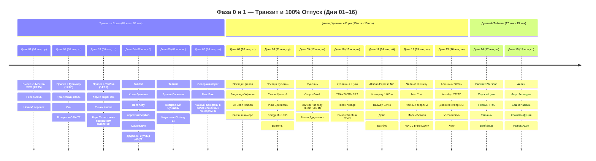
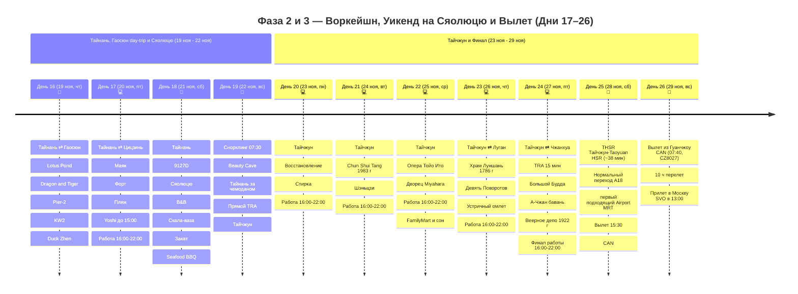

# Тайвань

## 📝 Краткое описание

25-дневное путешествие сквозь природные контрасты и культуру Тайваня (4–28 ноября 2026): от неонового пульса столицы, горячих терм Цзяоси и диких скал Хуаляня до кедрового городка Фэньциху, туманных чайных террас Шичжоу, священных 2000-летних кипарисов Алишаня (2200 м), 400-летнего наследия Тайнаня и коралловых вод Сяолюцю с гигантскими морскими черепахами.

## 📖 Подробная концепция путешествия

Четкое и выверенное разделение на 4 логические фазы (**4–28 ноября 2026**, возвращение в Москву 29 ноября):

0. 🛫 **Фаза 0 (Дни 01–02 / 04–05 ноя — 2 дня):** **МЕЖДУНАРОДНЫЙ ТРАНЗИТ И СТАРТ.** Вылет из Москвы 4 ноября в 23:15 рейсом CZ656, прибытие в Гуанчжоу 5 ноября в 14:00, 22-часовая стыковка с ночёвкой и вылет в Тайбэй 6 ноября в 12:00 рейсом CZ3097. Багаж зарегистрирован до конечного пункта.

1. 🌴 **Фаза 1 (Дни 03–16 / 06 ноя – 19 ноя — 14 дней):** **100% ПОЛНЫЙ ОТПУСК И СВОБОДА ОТ РАБОТЫ.** Тайбэй, термы Цзяоси и тихоокеанский Хуалянь сменяются ночью в Цзяи и панорамным поездом в Фэньциху. Две ночи в кедровых горах сохраняют полноценный день Шичжоу, затем следуют Алишань и две ночи в древнем Тайнане с Анпином, храмами и рынком Ушэн.

2. 💻 **Фаза 2 (Дни 17–24 / 20 ноя – 27 ноя — 8 дней):** **ГОРОДСКОЙ ВОРКЕЙШН И ОСТРОВНОЙ УИКЕНД НА СЯОЛЮЦЮ.**

    * 💻 **Будние дни воркейшна (6 дней — День 17 в Тайнане и Дни 20–24 в Тайчжуне):**
      * 🌅 **До 15:00/15:15 — Дневной слот:** ранний Цицзинь из Тайнаня, затем дни в Тайчжуне с утренними поездками в купеческий Луган и железнодорожный Чжанхуа; Lotus Pond перенесён на отпускной День 16.
      * ☕ **С 15:15/15:30 до 16:00 — Комфортная подготовка к работе (30–45 мин):** возвращение в отель, освежающий душ, заваривание чая улун/кофе, настройка монитора и проверка скорости оптоволокна.
      * 💻 **С 16:00 до 22:00 — Выделенная работа в отеле:** **6 часов глубокого фокуса** за ноутбуком на оптоволоконном интернете (300–500 Мбит/с, 0% блокировок, Zoom, Slack, Figma, ChatGPT, **соответствует 11:00–17:00 по Москве**; при 8-часовом графике слот продлевается до 00:00 = 11:00–19:00 МСК).
      * 🌙 **После 22:00 — Вечерний гастро-релакс:** знаменитые ночные рынки (Жуйфэн, Люхэ, Фэнцзя, Чжунсяо, Ичжун работают до полуночи / 01:00 ночи).
    * 🐢 **Островной уикенд (2 дня — Дни 18–19, суббота 21 ноя и воскресенье 22 ноя):** **100% ВЫХОДНЫЕ ДНИ БЕЗ РАБОТЫ!** Скоростной паром на Сяолюцю (20 мин), B&B у океана, легальный вариант электробайка, Скала-ваза, пляж Гебань, закат, Seafood BBQ и ранний снорклинг с зелеными морскими черепахами (*Chelonia mydas*) в 07:30 до основного дневного наплыва.

3. 🛫 **Фаза 3 (Дни 25–26 / 28–29 ноя — 2 дня):** **ФИНАЛ И ПРЯМОЙ ВЫЛЕТ.** Утренний кофе, THSR Тайчжун ➔ Таоюань (~38 минут), пересадочный запас и Airport MRT A18 ➔ TPE (17–20 минут), вылет в Гуанчжоу в 15:30. Ночь транзита и утренний рейс CZ8027 в Москву (прибытие в SVO 29 ноября в 13:00).

---

## 🗺️ Ключевые параметры

* **Даты перелета:** **4 ноября 2026 (Ср) ➔ 29 ноября 2026 (Вс)** (вылет из SVO 4 ноя в 23:15, прилет в TPE 6 ноя в 14:15; вылет из TPE 28 ноя в 15:30, прилет в SVO 29 ноя в 13:00).
* **Продолжительность экспедиции:** 26 дней (23 дня на Тайване + 3 дня дороги и транзита).
* **Структура ночевок (всего 24 ночи: 22 ночи на Тайване + 2 транзитные в Гуанчжоу):**
  * Гуанчжоу (транзит) — **1 ночь** (05 ноя – 06 ноя, транзитный отель у аэропорта CAN).
  * Тайбэй — **4 ночи** (06 ноя – 10 ноя, *Morwing Hotel Fairy Tale* у вокзала Taipei Main Station).
  * Цзяоси — **1 ночь** (10 ноя – 11 ноя, *Mutaixu hot spring* с термальной ванной в номере, оплачено онлайн `3 121 ₽`).
  * Хуалянь — **2 ночи** (11 ноя – 13 ноя, *Together hotel-Hualien Zhongshan*, оплачено онлайн `4 329 ₽`).
  * Цзяи — **1 ночь** (13 ноя – 14 ноя, *Chiayi Country Garden Hotel* у TRA Station).
  * Фэньциху (1400 м) — **2 ночи** (14 ноя – 16 ноя, *Yahu Hotel*, оплачено онлайн `10 032 ₽`).
  * Алишань (2200 м) — **1 ночь** (16 ноя – 17 ноя, *Ho Fong Villa Hotel* внутри национального парка, завтрак включен, оплачено онлайн `7 861 ₽`).
  * Тайнань — **4 ночи** (17 ноя – 21 ноя, *Yoshi Hotel - Tainan Sinmei Branch*, оплачено онлайн `15 845 ₽`).
  * Гаосюн — **0 ночей**; только day-trip 19–20 ноября из Тайнаня.
  * Остров Сяолюцю — **1 ночь** (21 ноя – 22 ноя, *Sea travel hotel* у океана, оплачено онлайн `4 042 ₽`).
  * Тайчжун — **6 ночей** (22 ноя – 28 ноя, *Taichung Box Design Hotel*; 2 дополнительные ночи требуют бронирования).
  * Гуанчжоу (транзит) — **1 ночь** (28 ноя – 29 ноя, транзитный отель у CAN перед утренним вылетом в Москву).
* **Калиброванный бюджет проживания на Тайване (22 ночи):** **`~73 016 ₽`** (в среднем `~3 319 ₽ / ночь`).
* **Бюджет под ключ на 1 чел:** **`~200 400 ₽`** (авиабилеты `55 412 ₽`, eVisa `4 800 ₽`, жилье `73 016 ₽`, транспорт `30 925 ₽`, питание `18 500 ₽`, активности `4 740 ₽`, связь и страховка `4 200 ₽`, сувениры `5 000 ₽`, резерв `3 800 ₽`).
