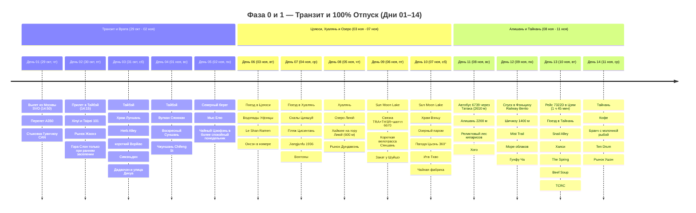
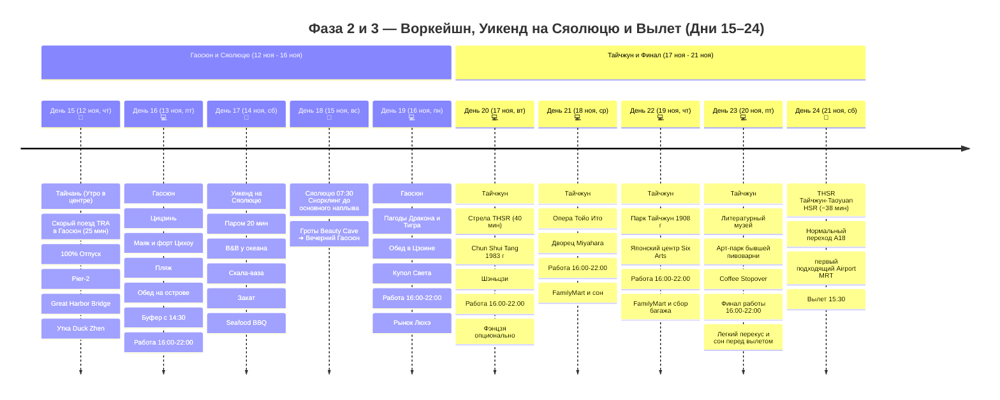

# Тайвань

## 📝 Краткое описание

23-дневное масштабное гранд-путешествие по Тайваню (29 октября – 21 ноября 2026) с выверенным разделением на 100% отпуск (Тайбэй, термы Цзяоси, скалы Хуаляня, чайный Шичжоу, реликтовые кипарисы Алишаня 2200 м и древний Тайнань), комфортный городской воркейшн (Гаосюн, Тайчжун) и тропический уикенд со снорклингом к гигантским черепахам на острове Сяолюцю.

## 📖 Подробная концепция путешествия

Четкое и выверенное разделение на 4 логические фазы (**29 октября – 21 ноября 2026**):

0. 🛫 **Фаза 0 (День 01 / 29 окт — 1 день):** **МЕЖДУНАРОДНЫЙ ТРАНЗИТ И СТАРТ.** Плавное и комфортное начало экспедиции: дневной вылет из Москвы (Шереметьево-C) в 14:50 на лайнере Airbus A350 авиакомпании China Southern, сквозная сдача багажа до Тайбэя, ночной полет (9ч 25м), утренняя стыковка в Терминале 2 Гуанчжоу (6ч 45м) с отдыхом и димсамами, и короткий перелет на Формозу (прибытие 30 окт в 14:15).

1. 🌴 **Фаза 1 (Дни 02–15 / 30 окт – 12 ноя — 14 дней):** **100% ПОЛНЫЙ ОТПУСК И СВОБОДА ОТ РАБОТЫ.** Экспедиция с максимальным погружением в природу и культуру: Тайбэй с ночной панорамой Taipei 101, Янминшань, Елю и Цзюфэнь; термы Цзяоси; скалы и тропы Хуаляня; Озеро Солнца и Луны; автобус 6739 через Татака; Алишань, Фэньциху и чайный Шичжоу; затем реалистичный спуск на рейсе 7322D и Тайнань с Beef Soup, Snail Alley, Хаяси, The Spring, локальным бранчем с молочной рыбой, Ten Drum и рынком Ушэн. Анпин остаётся факультативом.

2. 💻 **Фаза 2 (Дни 16–23 / 13 ноя – 20 ноя — 8 дней):** **ГОРОДСКОЙ ВОРКЕЙШН И ОСТРОВНОЙ УИКЕНД НА СЯОЛЮЦЮ.**

   * 💻 **Будние дни воркейшна (6 дней — Дни 16, 19 в Гаосюне и Дни 20, 21, 22, 23 в Тайчжуне):**
     * 🌅 **До 15:00/15:15 — Расширенный дневной городской слот:** паром на остров Цицзинь, холм Шоушань, Пагоды Дракона и Тигра, родина Bubble Tea Chun Shui Tang, Оперный театр Тойо Ито, дворец Miyahara, Литературный музей, арт-парк бывшей пивоварни и авторские кофейни.
     * ☕ **С 15:15/15:30 до 16:00 — Комфортная подготовка к работе (30–45 мин):** возвращение в отель, освежающий душ, заваривание чая улун/кофе, настройка монитора и проверка скорости оптоволокна.
     * 💻 **С 16:00 до 22:00 — Выделенная работа в отеле:** **6 часов глубокого фокуса** за ноутбуком на оптоволоконном интернете (300–500 Мбит/с, 0% блокировок, Zoom, Slack, Figma, ChatGPT, **соответствует 11:00–17:00 по Москве**; при 8-часовом графике слот продлевается до 00:00 = 11:00–19:00 МСК).
     * 🌙 **После 22:00 — Вечерний гастро-релакс:** знаменитые ночные рынки (Жуйфэн, Люхэ, Фэнцзя, Чжунсяо, Ичжун работают до полуночи / 01:00 ночи).
   * 🐢 **Островной уикенд (2 дня — Дни 17–18, суббота 14 ноя и воскресенье 15 ноя):** **100% ВЫХОДНЫЕ ДНИ БЕЗ РАБОТЫ!** Скоростной паром на Сяолюцю (20 мин), B&B у океана, легальный вариант электробайка, Скала-ваза, пляж Гебань, закат, Seafood BBQ и ранний снорклинг с зелеными морскими черепахами (*Chelonia mydas*) в 07:30 до основного дневного наплыва.

3. 🛫 **Фаза 3 (День 24 / 21 ноя — 1 день):** **ФИНАЛ И ПРЯМОЙ ВЫЛЕТ.** Утренний кофе, THSR Тайчжун ➔ Таоюань (~38 минут), пересадочный запас и Airport MRT A18 ➔ TPE (17–20 минут), вылет домой в 15:30 (Москва — 22 ноября в 21:15).

---

## 🗺️ Ключевые параметры

* **Даты перелета:** **29 октября 2026 (Чт) ➔ 21 ноября 2026 (Сб)** (вылет из SVO 29 окт в 14:50, прилет в TPE 30 окт в 14:15; вылет из TPE 21 ноя в 15:30, прилет в SVO 22 ноя в 21:15).
* **Продолжительность на Тайване:** 23 дня / 22 ночи (+ 1 ночь стыковки в Гуанчжоу).
* **Структура ночевок (22 ночи на Тайване):**
  * Тайбэй — **4 ночи** (30 окт – 03 ноя, *Morwing Hotel Fairy Tale* у вокзала Taipei Main Station).
  * Цзяоси — **1 ночь** (03 ноя – 04 ноя, *Breeze Hot Spring Hotel* с термальной ванной в номере).
  * Хуалянь — **2 ночи** (04 ноя – 06 ноя, *Together Hotel - Hualien Zhongshan*).
  * Sun Moon Lake (Пирс Шуйшэ) — **2 ночи** (06 ноя – 08 ноя, *Shuishe Pier Hotel / Innsight Hotel* — забронировать заранее, ~3 500–4 500 ₽).
  * Алишань (2200 м) — **1 ночь** (08 ноя – 09 ноя, *Ho Fong Villa Hotel* внутри национального парка).
  * Шичжоу (1400 м) — **1 ночь** (09 ноя – 10 ноя, *Cloud Residents Tea Places* на чайной плантации).
  * Тайнань — **2 ночи** (10 ноя – 12 ноя, *WUYU* в историческом центре).
  * Гаосюн — **4 ночи** (12–14 ноя и 15–17 ноя, *moon yancheg* у арт-квартала Pier-2).
  * Остров Сяолюцю — **1 ночь** (14 ноя – 15 ноя, *Sea Travel Hotel* у океана).
  * Тайчжун — **4 ночи** (17 ноя – 21 ноя, *Taichung Box Design Hotel*).
* **Калиброванный бюджет проживания (22 ночи):** **`~66 888 ₽`** (в среднем `~3 040 ₽ / ночь`) — комфортные городские дизайн-отели, термальный отель в Цзяоси, вид на озеро Sun Moon Lake, чайный дом в Шичжоу, отель в Алишане и B&B на Сяолюцю, строго без оверпрайса.
* **Бюджет под ключ на 1 чел:** **`~193 000 ₽`** (международные авиабилеты China Southern `62 793 ₽`, визовый сбор $50 USD `4 800 ₽`, проживание 22 ночи `~66 888 ₽`, весь внутренний транспорт `~30 870 ₽`, ежедневное питание в 7-Eleven и стритфуд на 23 дня `~18 500 ₽`, билеты и активности `~4 000 ₽`, сувениры/подарки `~5 000 ₽`).
