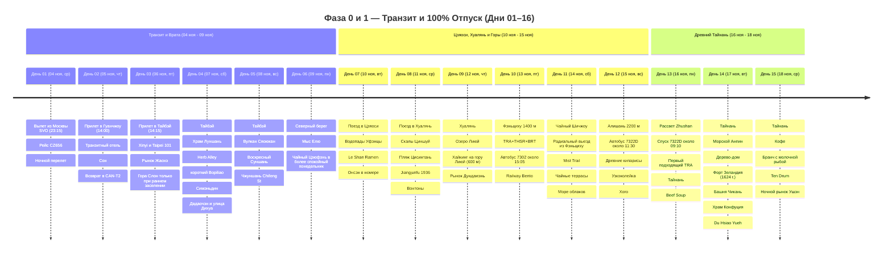

# Тайвань

## 📝 Краткое описание

25-дневное путешествие сквозь природные контрасты и культуру Тайваня (4–28 ноября 2026): от неонового пульса столицы, горячих терм Цзяоси и диких скал Хуаляня до кедрового городка Фэньциху, туманных чайных террас Шичжоу, священных 2000-летних кипарисов Алишаня (2200 м), 400-летнего наследия Тайнаня и коралловых вод Сяолюцю с гигантскими морскими черепахами.

## 📖 Подробная концепция путешествия

Четкое и выверенное разделение на 4 логические фазы (**4–28 ноября 2026**, возвращение в Москву 29 ноября):

0. 🛫 **Фаза 0 (Дни 01–02 / 04–05 ноя — 2 дня):** **МЕЖДУНАРОДНЫЙ ТРАНЗИТ И СТАРТ.** Вылет из Москвы 4 ноября в 23:15 рейсом CZ656, прибытие в Гуанчжоу 5 ноября в 14:00, 22-часовая стыковка с ночёвкой и вылет в Тайбэй 6 ноября в 12:00 рейсом CZ3097. Багаж зарегистрирован до конечного пункта.

1. 🌴 **Фаза 1 (Дни 03–16 / 06 ноя – 19 ноя — 14 дней):** **100% ПОЛНЫЙ ОТПУСК И СВОБОДА ОТ РАБОТЫ.** Экспедиция с максимальным погружением в природу и культуру: Тайбэй с ночной панорамой Taipei 101, Янминшань, Елю и Цзюфэнь; термы Цзяоси; скалы и тропы Хуаляня; скоростной транзит в кедровые горы Фэньциху с депо узкоколейки и Alishan Railway Bento; чайные тропы Шичжоу и Море облаков; подъем в нацпарк Алишань (2200 м) к 2000-летним священным кипарисам хиноки; прямой горный спуск на автобусе 7322 и 3 ночи в древнем Тайнане (морской форпост Анпин с Деревом-домом и Фортом Зеландия, A-Cun Beef Soup, Snail Alley, универмаг Хаяси, The Spring, Храм Конфуция 1665 г., стимпанк-парк Ten Drum и ночной рынок Ушэн).

2. 💻 **Фаза 2 (Дни 17–24 / 20 ноя – 27 ноя — 8 дней):** **ГОРОДСКОЙ ВОРКЕЙШН И ОСТРОВНОЙ УИКЕНД НА СЯОЛЮЦЮ.**

   * 💻 **Будние дни воркейшна (6 дней — Дни 17, 20 в Гаосюне и Дни 21–24 в Тайчжуне):**
     * 🌅 **До 15:00/15:15 — Расширенный дневной городской слот:** паром на остров Цицзинь, холм Шоушань, Пагоды Дракона и Тигра, родина Bubble Tea Chun Shui Tang, Оперный театр Тойо Ито, дворец Miyahara, Литературный музей, арт-парк бывшей пивоварни и авторские кофейни.
     * ☕ **С 15:15/15:30 до 16:00 — Комфортная подготовка к работе (30–45 мин):** возвращение в отель, освежающий душ, заваривание чая улун/кофе, настройка монитора и проверка скорости оптоволокна.
     * 💻 **С 16:00 до 22:00 — Выделенная работа в отеле:** **6 часов глубокого фокуса** за ноутбуком на оптоволоконном интернете (300–500 Мбит/с, 0% блокировок, Zoom, Slack, Figma, ChatGPT, **соответствует 11:00–17:00 по Москве**; при 8-часовом графике слот продлевается до 00:00 = 11:00–19:00 МСК).
     * 🌙 **После 22:00 — Вечерний гастро-релакс:** знаменитые ночные рынки (Жуйфэн, Люхэ, Фэнцзя, Чжунсяо, Ичжун работают до полуночи / 01:00 ночи).
   * 🐢 **Островной уикенд (2 дня — Дни 18–19, суббота 21 ноя и воскресенье 22 ноя):** **100% ВЫХОДНЫЕ ДНИ БЕЗ РАБОТЫ!** Скоростной паром на Сяолюцю (20 мин), B&B у океана, легальный вариант электробайка, Скала-ваза, пляж Гебань, закат, Seafood BBQ и ранний снорклинг с зелеными морскими черепахами (*Chelonia mydas*) в 07:30 до основного дневного наплыва.

3. 🛫 **Фаза 3 (День 25 / 28 ноя — 1 день):** **ФИНАЛ И ПРЯМОЙ ВЫЛЕТ.** Утренний кофе, THSR Тайчжун ➔ Таоюань (~38 минут), пересадочный запас и Airport MRT A18 ➔ TPE (17–20 минут), вылет домой в 15:30 (Москва — 29 ноября в 13:00).

---

## 🗺️ Ключевые параметры

* **Даты перелета:** **4 ноября 2026 (Ср) ➔ 28 ноября 2026 (Сб)** (вылет из SVO 4 ноя в 23:15, прилет в TPE 6 ноя в 14:15; вылет из TPE 28 ноя в 15:30, прилет в SVO 29 ноя в 13:00).
* **Продолжительность на Тайване:** 23 дня / 22 ночи (+ 1 ночь стыковки в Гуанчжоу).
* **Структура ночевок (22 ночи на Тайване):**
  * Тайбэй — **4 ночи** (06 ноя – 10 ноя, *Morwing Hotel Fairy Tale* у вокзала Taipei Main Station).
  * Цзяоси — **1 ночь** (10 ноя – 11 ноя, *Mutaixu hot spring* с термальной ванной в номере).
  * Хуалянь — **2 ночи** (11 ноя – 13 ноя, *Together Hotel - Hualien Zhongshan*).
  * Фэньциху (1400 м) — **2 ночи** (13 ноя – 15 ноя, *Fenqihu Hotel / B&B*, ~5 800 ₽).
  * Алишань (2200 м) — **1 ночь** (15 ноя – 16 ноя, *Ho Fong Villa Hotel* внутри национального парка).
  * Тайнань — **3 ночи** (16 ноя – 19 ноя, *WUYU* в историческом центре).
  * Гаосюн — **4 ночи** (19–21 ноя и 22–24 ноя, *moon yancheg* у арт-квартала Pier-2).
  * Остров Сяолюцю — **1 ночь** (21 ноя – 22 ноя, *Sea Travel Hotel* у океана).
  * Тайчжун — **4 ночи** (24 ноя – 28 ноя, *Taichung Box Design Hotel*).
* **Калиброванный бюджет проживания (22 ночи):** **`~67 272 ₽`** (в среднем `~3 058 ₽ / ночь`) — комфортные городские дизайн-отели, термальный отель в Цзяоси, кедровый отель в Фэньциху, отель в Алишане и B&B на Сяолюцю, строго без оверпрайса.
* **Бюджет под ключ на 1 чел:** **`~203 405 ₽`** (международные авиабилеты China Southern `62 793 ₽`, визовый сбор eVisa `4 800 ₽`, проживание 22 ночи `67 272 ₽`, внутренний транспорт `31 040 ₽`, питание `18 500 ₽`, билеты и активности `6 000 ₽`, сувениры и чай `5 000 ₽`, резерв `8 000 ₽`).
