# 🧋 Тайвань Extended — 11 Дней Гранд-Экспедиции + 10 Дней Воркейшна (22 дня)

> **Концепция путешествия:** Четкое и выверенное разделение на 3 гармоничные фазы:
> 1. 🌴 **Фаза 1 (Дни 01–11 — 11 дней):** **100% ПОЛНЫЙ ОТПУСК И СВОБОДА ОТ РАБОТЫ.** Экспедиция с максимальным погружением в природу и культуру: Тайбэй (улица Дихуа, гора Слон, марсианский мыс Елю, водопад Шифэнь, чайный Цзюфэнь, канатная дорога Маокун со стеклянным полом, термальная долина Бэйтоу и квартал Чжуншань), нейтральные термы Цзяоси, отвесные скалы Циншуй над океаном, джунглевый хайкинг на гору Лиюй (600 м), озера Юньшаньшуй, 1 ночь рисового дзена в Чишане, панорамный поезд TRA South-Link в Цзяи, аутентичный чайный миньсу в Шичжоу (1400 м, закат над Морем облаков на тропе Эряньпин) и реликтовые 2000-летние кипарисы высокогорного Алишаня (2200 м).
> 2. 💻 **Фаза 2 (Дни 12–21 — 10 дней):** **ГОРОДСКОЙ ВОРКЕЙШН И ВЫЕЗД НА ОСТРОВ СЯОЛЮЦЮ.** Проживание в топовых городах (древний Тайнань — 3 ночи, морской Гаосюн — 4 ночи с радиальным выездом на коралловый остров Сяолюцю налегке со снорклингом с гигантскими зелеными черепахами, Тайчжун — 3 ночи):
>    * 🌅 **До 14:45 — Свободное время:** форт Zeelandia, зеленый туннель Сыцао («Тайваньская Амазонка»), Храм Конфуция 1665 г., Tainan Beef Soup, пляж Цицзинь и теплое море (+28°C), арт-центр Weiwuying, Скала-ваза и снорклинг с черепахами на Сяолюцю, родина Bubble Tea Chun Shui Tang 1983 г., Оперный театр Тойо Ито, дворец сладостей Miyahara и авторские кофейни (слоты трапез строго ≤ 1 часа).
>    * 💻 **С 15:00 до 21:00 — Выделенная работа в отеле:** фокусированная работа за ноутбуком на оптоволоконном интернете (300–500 Мбит/с, 0% блокировок, Zoom, Slack, Figma, ChatGPT, соответствует 10:00–16:00 МСК).
>    * 🌙 **После 21:00 — Вечерний гастро-релакс:** знаменитые ночные рынки (Дадун, Гарден, Жуйфэн, Люхэ, Фэнцзя, Ичжун).
> 3. 🛫 **Фаза 3 (День 22 — 1 день):** **ФИНАЛ И ПРЯМОЙ ВЫЛЕТ.** Утренний кофе, скоростной поезд THSR Тайчжун ➔ станция Таоюань (**38 минут!**) + Taoyuan Airport MRT (**12 минут**) прямо в терминал TPE и комфортный вылет домой.

```mermaid
timeline
    title Хронология 22 дней — 11 дней Отпуска + 10 дней Воркейшна
    section Фаза 1 — 100% Отпуск (Природа, Горы и Чай)
        День 01 : Прилет в Тайбэй : Улица Дихуа : Гора Слон : Закат над Taipei 101 : Рынок Жаохэ
        День 02 : Северный берег : Мыс Елю : Водопад Шифэнь : Чайный Цзюфэнь
        День 03 : Тайбэй : Храм Луншань : Арт-парк Huashan 1914 : Simple Kaffa : Симэньдин : Онсэн Бэйтоу
        День 04 : Тайбэй : Канатка Маокун со стеклянным полом : Арт-парк Суншань : Чжуншань Chifeng St
        День 05 : Поезд в Цзяоси : Водопады Уфэнцы : Le Shan Ramen : Онсэн в номере
        День 06 : Цзяоси : Тропа Линьмэй Шипань : Сад 設治紀念館 : Иланьская утка в Red Lantern
        День 07 : Поезд в Хуалянь : Скалы Циншуй : Пляж Цисинтань : Jiangjunfu 1936 : Вонтоны
        День 08 : Хуалянь : Озеро Лиюй : Хайкинг на гору Лиюй (600 м) : Рынок Дундамэнь
        День 09 : Рифтовая долина : Озера Юньшаньшуй : Линьтяньшань : Чишан и Mr. Brown Ave : 7-Eleven багаж
        День 10 : Чишан Dachi : South-Link + THSR в Цзяи : Шичжоу 1400м : Закат Эряньпин : Гунфу Ча
        День 11 : Шичжоу Mist Trail : Алишань 2200м : Тропа 2000-летних кипарисов : Хого
    section Фаза 2 — Воркейшн и Сяолюцю (До 14.30 город / 15.00-21.00 работа)
        День 12 🌅 : Рассвет Чжушань над пиками Юйшань : Спуск в Цзяи : Поезд в Тайнань : Beef Soup : Релакс
        День 13 💻 : Тайнань : Анпин Zeelandia & Tree House : Храм Конфуция : Обед Danzai
        День 14 💻 : Тайнань : Мангровый туннель Сыцао : Обед молочной рыбой : Рынок Дадун
        День 15 💻 : Скорый поезд в Гаосюн : Паром на Цицзинь (+28C) : Pier-2 : Рынок Жуйфэн
        День 16 💻 : Гаосюн : Холм Шоушань : Мост Great Harbor Bridge : Река Любви
        День 17 🐢 : Остров Сяолюцю Day Trip : Скоростной паром 20 мин : Снорклинг с черепахами
        День 18 💻 : Гаосюн : Арт-центр Weiwuying : Пагоды Дракона и Тигра : Купол Света
        День 19 💻 : Тайчжун : Стрела THSR : Родина Bubble Tea Chun Shui Tang : Рынок Фэнцзя
        День 20 💻 : Тайчжун : Оперный театр Тойо Ито : Calligraphy Greenway : Дворец Miyahara
        День 21 💻 : Тайчжун : Парк Тайчжун 1908 г : Японский центр Six Arts : Рынок Ичжун
    section Фаза 3 — Вылет домой
        День 22 : Экспресс THSR Тайчжун-Таоюань (38 мин) : Taoyuan Airport MRT : Вылет домой
```

---

## 🗺️ Ключевые параметры

* **Продолжительность:** 22 дня / 21 ночь.
* **Структура ночевок (21 ночь):**
  * Тайбэй — **4 ночи** (*Star Hostel Taipei Main* / *City Suites Beimen*).
  * Цзяоси — **2 ночи** (*Yunoyado Onsen* / *Muen Hot Spring Hotel* с термальной ванной в номере).
  * Хуалянь — **2 ночи** (*Hotel Bayview* / *Barefoot B&B* на берегу залива Цисинтань).
  * Чишан — **1 ночь** (*Chishang Rice Country B&B* среди рисовых полей).
  * Алишань / Шичжоу — **2 ночи** (1 ночь в чайном миньсу в Шичжоу 1400 м + 1 ночь в отеле внутри парка Алишань 2200 м).
  * Тайнань — **3 ночи** (*U.I.J Hotel & Hostel* / *Kindness Hotel Tainan*).
  * Гаосюн — **4 ночи** (*City Suites Chenai* / *Kindness Hotel Pier-2* у набережной гавани).
  * Тайчжун — **3 ночи** (*Star Hostel Taichung Parklane* в коворкинг-районе Calligraphy Greenway).
* **Бюджет проживания (21 ночь):** `~32 400 TWD` (`~90 700 ₽`) — комфортные городские дизайн-отели, онсэн-отели, чайный миньсу в Шичжоу, строго без оверпрайса и лакшери-резортов.
* **Бюджет под ключ на 1 чел:** `~245 000 ₽` (международные авиабилеты `58 000 ₽`, проживание 21 ночь `~90 700 ₽`, весь транспорт `~35 500 ₽`, питание, кофейни, дегустации и билеты `~60 000 ₽`).

---

## 📋 Разделы проекта `-- Taiwan`

1. **[[Personal Note/Travel/-- Taiwan/02 - Маршрутный план/Маршрутный план|🗓️ Сводный Маршрутный план (22 Дня)]]**
2. **[[Гайд по удаленной работе и кофейням Тайваня|💻 Гайд: Удаленная работа, Скорости и Коворкинги]]**
3. **[[Тайбэй, Маокун и Север|🏙️ Заметки: Тайбэй, Маокун, Бэйтоу, Елю и Цзюфэнь]]**
4. **[[Термальный курорт Цзяоси и Илань|♨️ Заметки: Цзяоси и горячие источники]]**
5. **[[Хуалянь, Скалы Циншуй и Цисинтань|🌊 Заметки: Хуалянь, Скалы Циншуй и Цисинтань]]**
6. **[[Рифтовая долина и Чишан|🌾 Заметки: Рифтовая долина и рисовый рай Чишан]]**
7. **[[Высокогорный Алишань (2200м)|🌲 Заметки: Чайный Шичжоу (1400 м) и Высокогорный Алишань (2200 м)]]**
8. **[[Древняя столица Тайнань|🏛️ Заметки: Древний Тайнань, Сыцао и гастрономия]]**
9. **[[Гаосюн и Пляж Цицзинь|🚢 Заметки: Гаосюн, Пляж Цицзинь (+28°C), Pier-2 и Weiwuying]]**
10. **[[Зеленый остров (Люйдао) и Сяолюцю|🐢 Заметки: Остров черепах Сяолюцю и островной снорклинг]]**
11. **[[Тайчжун, Арт-деревни и Родина Bubble Tea|🏙️ Заметки: Тайчжун, Арт-деревни и Родина Bubble Tea]]**
12. **[[Отели и Воркейшн-миньсу|🏨 Бронирования: Отели и Воркейшн-миньсу]]**
13. **[[Поезда, Паромы и Трансферы|🚆 Бронирования: Поезда, Паромы и Трансферы]]**
14. **[[Personal Note/Travel/-- Taiwan/03 - Бронирования/Авиаперелеты|✈️ Бронирования: Авиаперелеты]]**
15. **[[Финансы (-- Taiwan Extended)|💰 Бюджет и Полная смета (22 дня)]]**
16. **[[05 - Полезная информация|📖 Полезная информация: История, Дух Мест и Культурный Код]]**
