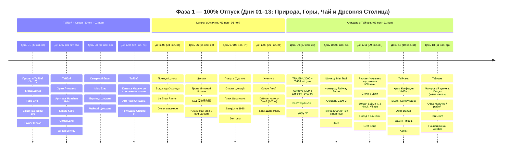
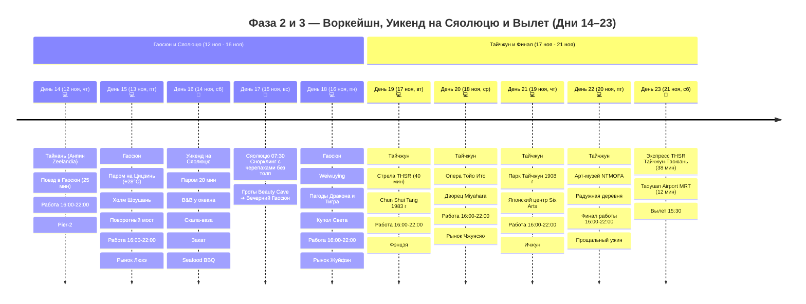

# Тайвань

> **Концепция путешествия:** Четкое и выверенное разделение на 3 гармоничные фазы (**29 октября – 21 ноября 2026**):
> 1. 🌴 **Фаза 1 (Дни 01–13 / 30 окт – 11 ноя — 13 дней):** **100% ПОЛНЫЙ ОТПУСК И СВОБОДА ОТ РАБОТЫ.** Экспедиция с максимальным погружением в природу и культуру: Тайбэй (улица Дихуа, гора Слон, марсианский мыс Елю, водопад Шифэнь, чайный Цзюфэнь, канатная дорога Маокун со стеклянным полом, термальная долина Бэйтоу и квартал Чжуншань), нейтральные термы Цзяоси, отвесные скалы Циншуй над океаном, джунглевый хайкинг на гору Лиюй (600 м), скоростная связка «Северный экспресс» (TRA EMU3000 + THSR без пересылки багажа), аутентичный чайный миньсу в Шичжоу (1400 м, закат над Морем облаков на тропе Эряньпин, чайная церемония Гунфу Ча), реликтовые 2000-летние кипарисы высокогорного Алишаня (2200 м), рассвет Чжушань над пиками Юйшань (2451 м) и 2 полных свободных дня в древнем Тайнане (Храм Конфуция 1665 г., музей Сигэру Бана, мангровый туннель Сыцао «Тайваньская Амазонка», соляные горы Цигу, Башня Чикань, Большой Храм Мацзу, Tainan Beef Soup и лапша Danzai).
> 
> 2. 💻 **Фаза 2 (Дни 14–22 / 12 ноя – 20 ноя — 9 дней):** **ГОРОДСКОЙ ВОРКЕЙШН И ОСТРОВНОЙ УИКЕНД НА СЯОЛЮЦЮ.** 
>    * 💻 **Будние дни воркейшна (7 дней — Дни 14, 15, 18 в Гаосюне и Дни 19, 20, 21, 22 в Тайчжуне):**
>      * 🌅 **До 15:00/15:15 — Расширенный дневной городской слот (+1 час свободы!):** район Анпин (Форт Zeelandia, Дом на дереве Tait), паром на остров Цицзинь и теплое море (+28°C), холм Шоушань, поворотный мост Great Harbor Bridge, арт-центр Weiwuying, Пагоды Дракона и Тигра, родина Bubble Tea Chun Shui Tang 1983 г., Оперный театр Тойо Ито, дворец сладостей Miyahara, арт-музей NTMOFA и авторские кофейни (неспешные обеды и дегустации).
>      * ☕ **С 15:15/15:30 до 16:00 — Комфортная подготовка к работе (30–45 мин):** возвращение в отель, освежающий душ, заваривание чая улун/кофе, настройка монитора и проверка скорости оптоволокна.
>      * 💻 **С 16:00 до 22:00 — Выделенная работа в отеле:** **6 часов глубокого фокуса** за ноутбуком на оптоволоконном интернете (300–500 Мбит/с, 0% блокировок, Zoom, Slack, Figma, ChatGPT, **соответствует 11:00–17:00 по Москве**; при 8-часовом графике слот продлевается до 00:00 = 11:00–19:00 МСК).
>      * 🌙 **После 22:00 — Вечерний гастро-релакс:** знаменитые ночные рынки (Жуйфэн, Люхэ, Фэнцзя, Чжунсяо, Ичжун работают до полуночи / 01:00 ночи).
>    * 🐢 **Островной уикенд (2 дня — Дни 16–17, суббота 14 ноя и воскресенье 15 ноя):** **100% ВЫХОДНЫЕ ДНИ БЕЗ РАБОТЫ!** Скоростной паром на коралловый остров Сяолюцю (20 мин), заселение в видовой ocean-view B&B у океана, электробайк, Скала-ваза, пляж Гебань, панорама заката, Seafood BBQ на углях и эксклюзивный рассветный снорклинг с гигантскими зелеными морскими черепахами (*Chelonia mydas*) в 07:30 утра без толп туристов!
>
> 3. 🛫 **Фаза 3 (День 23 / 21 ноя — 1 день):** **ФИНАЛ И ПРЯМОЙ ВЫЛЕТ.** Утренний кофе, скоростной поезд THSR Тайчжун ➔ станция Таоюань (**38 минут!**) + Taoyuan Airport MRT (**12 минут**) прямо в терминал TPE и комфортный вылет домой в 15:30 (прибытие в Москву 22 ноября в 21:15).

---

## 🗺️ Ключевые параметры

* **Даты перелета:** **29 октября 2026 (Чт) ➔ 21 ноября 2026 (Сб)** (вылет из SVO 29 окт в 14:50, прилет в TPE 30 окт в 14:15; вылет из TPE 21 ноя в 15:30, прилет в SVO 22 ноя в 21:15).
* **Продолжительность на Тайване:** 23 дня / 22 ночи (+ 1 ночь стыковки в Гуанчжоу).
* **Структура ночевок (22 ночи на Тайване):**
  * Тайбэй — **4 ночи** (30 окт – 03 ноя, *Morwing Hotel Fairy Tale* у вокзала Taipei Main Station).
  * Цзяоси — **2 ночи** (03 ноя – 05 ноя, *Breeze Hot Spring Hotel* с термальной ванной в номере).
  * Хуалянь — **2 ночи** (05 ноя – 07 ноя, *Together Hotel - Hualien Zhongshan*).
  * Шичжоу (1400 м) — **1 ночь** (07 ноя – 08 ноя, *Cloud Residents Tea Places* на чайной плантации).
  * Алишань (2200 м) — **1 ночь** (08 ноя – 09 ноя, *Ho Fong Villa Hotel* внутри национального парка).
  * Тайнань — **3 ночи** (09 ноя – 12 ноя, *WUYU* в историческом центре).
  * Гаосюн — **4 ночи** (12–14 ноя и 15–17 ноя, *moon yancheg* у арт-квартала Pier-2).
  * Остров Сяолюцю — **1 ночь** (14 ноя – 15 ноя, *Sea Travel Hotel* у океана).
  * Тайчжун — **4 ночи** (17 ноя – 21 ноя, *Taichung Box Design Hotel*).
* **Калиброванный бюджет проживания (22 ночи):** **`66 730 ₽`** (в среднем `~3 033 ₽ / ночь`) — комфортные городские дизайн-отели, термальный отель в Цзяоси, чайный дом в Шичжоу, отель в Алишане и B&B на Сяолюцю, строго без оверпрайса.
* **Бюджет под ключ на 1 чел:** **`~192 000 ₽`** (международные авиабилеты China Southern `62 793 ₽`, визовый сбор $50 USD `4 800 ₽`, проживание 22 ночи `66 730 ₽`, весь внутренний транспорт `~30 100 ₽`, ежедневное питание в 7-Eleven и стритфуд на 23 дня `~18 500 ₽`, билеты и активности `~4 000 ₽`, сувениры/подарки `~5 000 ₽`).

---

## 📋 Разделы проекта `-- Taiwan`

1. **[[Personal Note/Travel/-- Taiwan/02 - Маршрутный план/Маршрутный план|🗓️ Сводный Маршрутный план (23 Дня)]]**
2. **[[Гайд по удаленной работе и кофейням Тайваня|💻 Гайд: Удаленная работа, Скорости и Коворкинги]]**
3. **[[Тайбэй, Маокун и Север|🏙️ Заметки: Тайбэй, Маокун, Бэйтоу, Елю и Цзюфэнь]]**
4. **[[Термальный курорт Цзяоси и Илань|♨️ Заметки: Цзяоси и горячие источники]]**
5. **[[Хуалянь, Скалы Циншуй и Цисинтань|🌊 Заметки: Хуалянь, Скалы Циншуй и Цисинтань]]**
6. **[[Высокогорный Алишань (2200м)|🌲 Заметки: Чайный Шичжоу (1400 м) и Высокогорный Алишань (2200 м)]]**
7. **[[Древняя столица Тайнань|🏛️ Заметки: Древний Тайнань, Сыцао и гастрономия]]**
8. **[[Гаосюн и Пляж Цицзинь|🚢 Заметки: Гаосюн, Пляж Цицзинь (+28°C), Pier-2 и Weiwuying]]**
9. **[[Зеленый остров (Люйдао) и Сяолюцю|🐢 Заметки: Остров черепах Сяолюцю и островной снорклинг]]**
10. **[[Тайчжун, Арт-деревни и Родина Bubble Tea|🏙️ Заметки: Тайчжун, Арт-деревни и Родина Bubble Tea]]**
11. **[[Personal Note/Travel/-- Taiwan/03 - Бронирования/Отели|🏨 Бронирования: Отели и Воркейшн-миньсу]]**
12. **[[Personal Note/Travel/-- Taiwan/03 - Бронирования/Транспорт|🚆 Бронирования: Поезда, Паромы и Трансферы]]**
13. **[[Personal Note/Travel/-- Taiwan/03 - Бронирования/Авиаперелеты|✈️ Бронирования: Авиаперелеты]]**
14. **[[Personal Note/Travel/-- Taiwan/04 - Финансы/Финансы|💰 Бюджет и Полная смета (23 дня)]]**
15. **[[Personal Note/Travel/-- Taiwan/05 - Полезная информация/Полезная информация|📖 Полезная информация: История, Дух Мест и Культурный Код]]**
16. **[[05 - Полезная информация/Визовый гайд для граждан РФ (2026)|🛂 Визовый гайд: Оформление визы для граждан РФ (2026)]]**
17. **[[05 - Полезная информация/Безопасность, Землетрясения и Экстренная помощь|🚨 Безопасность, Землетрясения и Экстренная помощь]]**
18. **[[06 - Чек лист/Чек лист|✅ Чек-листы: Подготовка, Сборы, Must-Try & Must-Buy]]**

