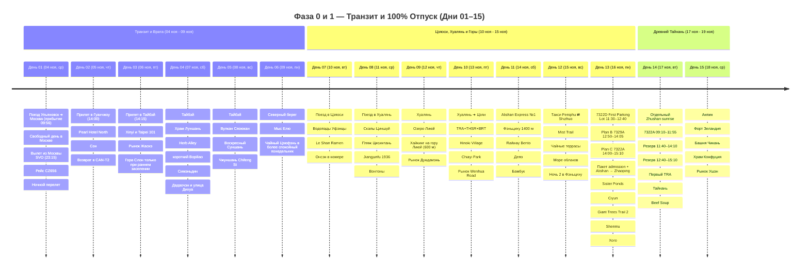
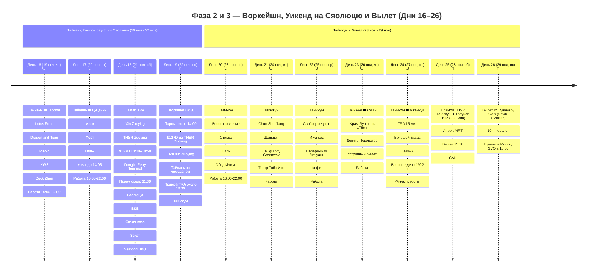

# Тайвань

## 📝 Краткое описание

25-дневное путешествие сквозь природные контрасты и культуру Тайваня (4–28 ноября 2026): от неонового пульса столицы, горячих терм Цзяоси и диких скал Хуаляня до кедрового городка Фэньциху, туманных чайных террас Шичжоу, священных 2000-летних кипарисов Алишаня (2200 м), 400-летнего наследия Тайнаня и коралловых вод Сяолюцю с гигантскими морскими черепахами.

## 📖 Подробная концепция путешествия

Четкое и выверенное разделение на 4 логические фазы (**4–28 ноября 2026**, возвращение в Москву 29 ноября):

0. 🛫 **Фаза 0 (Дни 01–02 / 04–05 ноя — 2 дня):** **МЕЖДУНАРОДНЫЙ ТРАНЗИТ И СТАРТ.** Дорога начинается **3 ноября**: поезд Ульяновск ➔ Москва (купе, отправление 20:45, прибытие на Казанский вокзал 4 ноября в 09:56). Вылет из Москвы 4 ноября в 23:15 рейсом CZ656, прибытие в Гуанчжоу 5 ноября в 14:00, 22-часовая стыковка с ночёвкой и вылет в Тайбэй 6 ноября в 12:00 рейсом CZ3097. Багаж зарегистрирован до конечного пункта.

1. 🌴 **Фаза 1 (Дни 03–15 / 06 ноя – 18 ноя — 13 дней):** **100% ПОЛНЫЙ ОТПУСК И СВОБОДА ОТ РАБОТЫ.** Тайбэй, термы Цзяоси и тихоокеанский Хуалянь сменяются ночью в Цзяи и панорамным поездом в Фэньциху. Две ночи в кедровых горах сохраняют полноценный день Шичжоу, затем следуют Алишань и два исторических дня в древнем Тайнане.

2. 💻 **Фаза 2 (Дни 16–24 / 19 ноя – 27 ноя — 9 дней):** **ГОРОДСКОЙ ВОРКЕЙШН И ОСТРОВНОЙ УИКЕНД НА СЯОЛЮЦЮ.**

    * 💻 **Будние дни воркейшна (7 дней — Дни 16–17 в Тайнане и Дни 20–24 в Тайчжуне):**
      * 🏛️ **Тайнань как короткая рабочая база (19–21 ноября):** День 16 — утренний радиальный выезд в Гаосюн с Lotus Pond, Pier-2, KW2 и Duck Zhen; День 17 — ранний Цицзинь. В оба дня работа начинается в 16:00 из Yoshi Hotel.
      * 🏙️ **Тайчжун как единая стабильная рабочая база (22–28 ноября, 6 ночей):** комфортное забронированное жилье в Nagahiro Hotel- Taichung Wenxin без чемоданных переездов, скоростной интернет для работы 16:00–22:00, откуда удобно и спокойно делать утренние радиальные поездки:
        * 22 ноя (Вс): поздний переезд с Сяолюцю через Тайнань и спокойное заселение без спешки.
        * 23 ноя (Пн): восстановительный день (район отеля, стирка, быт, парки, сиеста и работа).
        * 24 ноя (Вт): насыщенный цельный городской день — родина Bubble Tea Chun Shui Tang, арт-деревня ремесленников Шэньцзи, Calligraphy Greenway и театр Тойо Ито в едином утреннем маршруте.
        * 25 ноя (Ср): свободный и гибкий день воркейшна — неспешное утро, дворец десертов Miyahara, набережная Лючуань, спешелти-кофе и отдых (Sun Moon Lake — только факультативная альтернатива на случай полного дня без работы).
        * 26 ноя (Чт): историческая радиалка в древний купеческий Луган (храм Луншань 1786 г., Девять Поворотов, Тяньхоу).
        * 27 ноя (Пт): надежная 15-минутная радиалка на TRA в Чжанхуа (Будда Багуашань, А-Чжан бавань, веерное паровозное депо 1922 г.).
      * ☕ **С 15:15/15:30 до 16:00 — Комфортная подготовка к работе (30–45 мин):** возвращение в отель, освежающий душ, заваривание чая улун/кофе, настройка монитора и проверка скорости оптоволокна.
      * 💻 **С 16:00 до 22:00 — Выделенная работа в отеле:** **6 часов глубокого фокуса** за ноутбуком на оптоволоконном интернете (высокоскоростной Wi-Fi + 5G-хотспот как бэкап, 0% блокировок, Zoom, Slack, Figma, ChatGPT, **соответствует 11:00–17:00 по Москве**; при 8-часовом графике слот продлевается до 00:00 = 11:00–19:00 МСК).
      * 🌙 **После 22:00 — Вечерний гастро-релакс:** легендарный ночной рынок Фэнцзя (Fengjia Night Market) в районе отеля или FamilyMart и сон.
    * 🐢 **Островной уикенд (2 дня — Дни 18–19, суббота 21 ноя и воскресенье 22 ноя):** **100% ВЫХОДНЫЕ ДНИ БЕЗ РАБОТЫ!** Скоростной паром на Сяолюцю (20 мин), B&B у океана, легальный вариант электробайка, Скала-ваза, пляж Гебань, закат, Seafood BBQ и ранний снорклинг с зелеными морскими черепахами (*Chelonia mydas*) в 07:30 до основного дневного наплыва.

3. 🛫 **Фаза 3 (Дни 25–26 / 28–29 ноя — 2 дня):** **ФИНАЛ И ПРЯМОЙ ВЫЛЕТ.** Прямой и простой выезд из Тайчжуна без промежуточных остановок: THSR Тайчжун ➔ Таоюань (~38 минут), пересадочный запас и Airport MRT A18 ➔ TPE (17–20 минут), вылет в Гуанчжоу в 15:30. Ночь транзита и утренний рейс CZ8027 в Москву (прибытие в SVO 29 ноября в 13:00).

---

## 🗺️ Ключевые параметры

* **Дорога к старту:** **3 ноября 2026 (Вт) 20:45** поезд Ульяновск Центр. ➔ Москва Казанская, прибытие **4 ноября (Ср) 09:56** (купе, верхнее место, тариф 2Ф). Билет куплен: `3 942 ₽`, контрольный купон № 77 665 043 657 695. См. [[03 - Бронирования/Транспорт|Бронирования: Транспорт]].
* **Даты перелета:** **4 ноября 2026 (Ср) ➔ 29 ноября 2026 (Вс)** (вылет из SVO 4 ноя в 23:15, прилет в TPE 6 ноя в 14:15; вылет из TPE 28 ноя в 15:30, прилет в SVO 29 ноя в 13:00).
* **Продолжительность экспедиции:** 27 дней (3–29 ноября: ночной поезд до Москвы, 23 дня на Тайване и дни международного транзита).
* **Структура ночевок (всего 24 ночи в отелях: 22 ночи на Тайване + 2 транзитные в Гуанчжоу, плюс ночь 3–4 ноября в поезде):**
  * Поезд Ульяновск ➔ Москва — **1 ночь** (03 ноя – 04 ноя, купе, верхнее место, `3 942 ₽`, оплачено онлайн).
  * Гуанчжоу (транзит) — **1 ночь** (05 ноя – 06 ноя, *Southern Airlines Pearl Hotel (North District)*, бесплатная бронь China Southern; отдельный номер — доплата 150 CNY).
  * Тайбэй — **4 ночи** (06 ноя – 10 ноя, *Dongmen Hotel* у станции MRT Dongmen / Yongkang St, оплачено онлайн `17 501 ₽`).
  * Цзяоси — **1 ночь** (10 ноя – 11 ноя, *Mutaixu hot spring* с термальной ванной в номере, оплачено онлайн `3 121 ₽`).
  * Хуалянь — **2 ночи** (11 ноя – 13 ноя, *Together hotel-Hualien Zhongshan*, оплачено онлайн `4 329 ₽`).
  * Цзяи — **1 ночь** (13 ноя – 14 ноя, *StarYi Hotel* у TRA Chiayi Station, оплачено онлайн `3 249 ₽`).
  * Фэньциху (1400 м) — **2 ночи** (14 ноя – 16 ноя, *Yahu Hotel*, оплачено онлайн `10 032 ₽`).
  * Алишань (2200 м) — **1 ночь** (16 ноя – 17 ноя, *Ho Fong Villa Hotel* внутри национального парка, завтрак включен, оплачено онлайн `7 861 ₽`).
  * Тайнань — **4 ночи** (17 ноя – 21 ноя, *Yoshi Hotel - Tainan Sinmei Branch*, оплачено онлайн `15 845 ₽`).
  * Гаосюн — **0 ночей**; только day-trip 19–20 ноября из Тайнаня.
  * Остров Сяолюцю — **1 ночь** (21 ноя – 22 ноя, *Sea travel hotel* у океана, оплачено онлайн `4 042 ₽`).
  * Тайчжун — **6 ночей** (22 ноя – 28 ноя, *Nagahiro Hotel- Taichung Wenxin* у MRT Wenhua Senior High School, оплачено онлайн `14 577 ₽`).
  * Гуанчжоу (транзит) — **1 ночь** (28 ноя – 29 ноя, транзитный отель у CAN перед утренним вылетом в Москву).
* **Калиброванный бюджет проживания на Тайване (22 ночи):** **`~80 557 ₽`** (в среднем `~3 662 ₽ / ночь`, все 22 ночи оплачены онлайн).
* **Бюджет под ключ на 1 чел:** **`~213 800 ₽`** (поезд Ульяновск ➔ Москва `3 942 ₽`, авиабилеты `55 412 ₽`, eVisa `4 800 ₽`, жилье на Тайване `80 557 ₽`, отдельный номер в транзитном отеле `~1 800 ₽`, транспорт `30 925 ₽`, питание `18 500 ₽`, активности `4 740 ₽`, связь и страховка `4 200 ₽`, сувениры `5 000 ₽`, резерв `3 800 ₽`).
