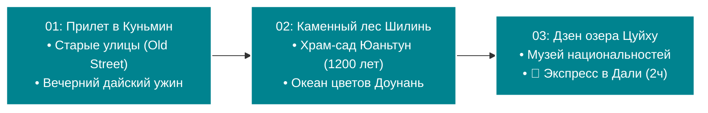
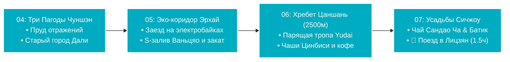
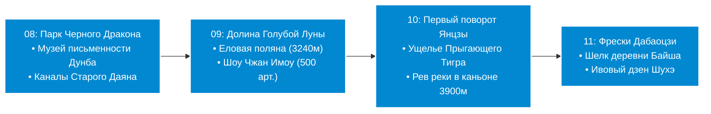

# 🗺️ Маршрутный план: «От Вечной весны к Киберпанку» (18 дней)

> [!INFO] О путешествии
> **Продолжительность:** 18 дней / 17 ночей
> **Маршрут:** Куньмин (3 дня) ➔ Дали (4 дня) ➔ Лицзян (4 дня) ➔ Чэнду (7 дней)
> **Концепция:** Идеально сбалансированное эстетическое путешествие для визуалов и ценителей природы. Плавный подъем на высокогорье (Куньмин 1900 м ➔ Дали 2000 м ➔ Лицзян 2400 м), исследование бирюзовых ледниковых озер, каньонов и аутентичных деревень Бай и Наси, с последующим мгновенным телепортом на самолете в теплые субтропики Сычуани (500 м) — к пандам, 100-летним чайным садам, колоссу Лэшаня и неоновому киберпанку Чэнду.
> **Приоритет транспорта:** Высокоскоростные магистрали CRH (200–300 км/ч), горные канатные дороги, экологичные электробайки, прогулочные катера, один комфортный внутренний авиаперелет (Лицзян ✈️ Чэнду, 1 ч 20 мин) и скоростное прямое метро.

---

## 🌸 Этап I: Куньмин — Мягкая посадка и Вечная весна (Дни 01–03)
*Провинция Юньнань (высота ~1900 м). Плавная акклиматизация, древнейшие карстовые лабиринты ЮНЕСКО, чайные дворики Старого города и ночной океан миллионов цветов.*

* **День 01 (сб):** [[Personal Note/Travel/-- The Southern Cloud Trail/02 - Маршрутный план/01 Куньмин (сб) 🛬 Врата в Юньнань, огни Старых улиц и дайский ужин|01 Куньмин (сб) 🛬 Врата в Юньнань, огни Старых улиц и дайский ужин]]
  *Прилет в Куньмин (KMG), скоростное метро в центр, заселение у озера Цуйху. Вечерняя прогулка по историческому кварталу Kunming Old Street, творческая улица Вэньлинь, дайский ужин с курицей в лемонграссе и чай пуэр.*
* **День 02 (вс):** [[Personal Note/Travel/-- The Southern Cloud Trail/02 - Маршрутный план/02 Куньмин (вс) 🪨 Карстовый лабиринт Шилинь, храм Юаньтун и океан цветов Доунань|02 Куньмин (вс) 🪨 Карстовый лабиринт Шилинь, храм Юаньтун и океан цветов Доунань]]
  *Скоростной поезд (20 мин) в Каменный лес Шилинь (ЮНЕСКО: Большой и Малый лес, скала Ашима), древнейший водный храм-сад Юаньтун (1200 лет), дзен Зеленого озера, ритуал кипящей «лапши через мост» и грандиозный ночной оптовый цветочный рынок Доунань.*
* **День 03 (пн):** [[Personal Note/Travel/-- The Southern Cloud Trail/02 - Маршрутный план/03 Куньмин (пн) 🌿 Дзен Зеленого озера Цуйху, Музей национальностей и экспресс в Дали|03 Куньмин (пн) 🌿 Дзен Зеленого озера Цуйху, Музей национальностей и экспресс в Дали]]
  *Утренний дзен и гимнастика тайцзи в Парке Зеленого озера (Цуйху), Музей национальностей Юньнани у озера Дяньчи (культура 25 народов). Скоростной экспресс CRH в Дали (2 ч). Заселение в видовой отель на берегу озера Эрхай и закатный ужин у воды.*

---

## 🌊 Этап II: Дали — Чилл у озера и Древние пагоды (Дни 04–07)
*Провинция Юньнань (высота ~2000 м). Ритм замедляется. Расширенный 4-дневный блок: королевские пагоды, 27 км заезда на электробайках по эко-коридору озера Эрхай, парящая тропа в облаках и ремесла народа Бай.*

* **День 04 (вт):** [[Personal Note/Travel/-- The Southern Cloud Trail/02 - Маршрутный план/04 Дали (вт) 🏛️ Королевские Три Пагоды Чуншэн и древние кварталы Дали|04 Дали (вт) 🏛️ Королевские Три Пагоды Чуншэн и древние кварталы Дали]]
  *Королевские Три Пагоды и монастырь Чуншэн IX–X веков (пагода Цяньсюнь 69 м, Пруд отражений). Старый город Дали: барабанная башня Ухуа, журчащий ручей Хунлунцзин, улица Жэньминь, Улица Иностранцев и деревянная церковь 1904 г. Кисло-острая рыба озера Эрхай и сыр Рушан.*
* **День 05 (ср):** [[Personal Note/Travel/-- The Southern Cloud Trail/02 - Маршрутный план/05 Дали (ср) 🚴 Экологический коридор озера Эрхай, деревня Ваньцяо и закат у воды|05 Дали (ср) 🚴 Экологический коридор озера Эрхай, деревня Ваньцяо и закат у воды]]
  *Большой пробег на бесшумных электробайках по 27.5-километровому Экологическому коридору озера Эрхай (S-образный залив в деревне Ваньцяо, плакучие ивы и метасеквойи в воде). Обед над гладью озера, водный круиз или прогулка по восточному берегу Шуанлан. Закат над хребтом Цаншань.*
* **День 06 (чт):** [[Personal Note/Travel/-- The Southern Cloud Trail/02 - Маршрутный план/06 Дали (чт) 🚠 Парящая тропа хребта Цаншань и хрустальные чаши Цинбиси|06 Дали (чт) 🚠 Парящая тропа хребта Цаншань и хрустальные чаши Цинбиси]]
  *Канатная дорога Gantong Cableway на высоту 2500 м на хребет Цаншань. Хайкинг по парящему каменному карнизу Yudai Cloud Road («Дорога нефритового пояса»): ледниковые чаши ущелья Цинбиси, первозданный хвойный лес и панорама всего озера Эрхай под ногами. Спешелти-кофе и вечерний релакс.*
* **День 07 (пт):** [[Personal Note/Travel/-- The Southern Cloud Trail/02 - Маршрутный план/07 Дали (пт) 🌾 Рисовые усадьбы Сичжоу, чай Сандао Ча, батик Чжоучэн и поезд в Лицзян|07 Дали (пт) 🌾 Рисовые усадьбы Сичжоу, чай Сандао Ча, батик Чжоучэн и поезд в Лицзян]]
  *Утренний колоритный базар Сичжоу, резные усадьбы народа Бай «Саньфан Ичжаобэй», круглая башня Чжуаньцзяолоу, кофейня в полях Linden Centre, лепешки Сичжоу Баба. Чайная церемония трех чаш Сандао Ча (Горькая, Сладкая, Послевкусие) и мастерские индиго-батика в Чжоучэн. Скоростной поезд в Лицзян (1.5 ч). Вечерний старый город и хот-пот La Ribs.*

---

## 🏔️ Этап III: Лицзян — Кульминация, Ледники и Каньоны (Дни 08–11)
*Провинция Юньнань (высота 2400 м – 3240 м). Главный визуальный и высокогорный восторг: бирюзовые ледниковые каскады, 5596-метровый пик Нефритового Дракона, шоу 500 артистов, мощь Ущелья Прыгающего Тигра и древнейшие фрески.*

* **День 08 (сб):** [[Personal Note/Travel/-- The Southern Cloud Trail/02 - Маршрутный план/08 Лицзян (сб) 🏮 Парк Черного Дракона, музей Дунба и лабиринты каналов старого Лицзяна|08 Лицзян (сб) 🏮 Парк Черного Дракона, музей Дунба и лабиринты каналов старого Лицзяна]]
  *Парк Черного Дракона с зеркальным отражением Нефритового Дракона в пруду, Музей культуры Дунба (пиктографическая письменность народа Наси). Старый город Лицзяна (Даян / ЮНЕСКО): мощеные улицы, каналы с талой водой, площадь Сыфан, панорама с холма Льва и вечерние хороводные танцы.*
* **День 09 (вс):** [[Personal Note/Travel/-- The Southern Cloud Trail/02 - Маршрутный план/09 Лицзян (вс) 💎 Бирюзовая Долина Голубой Луны, Еловая поляна и шоу Чжан Имоу|09 Лицзян (вс) 💎 Бирюзовая Долина Голубой Луны, Еловая поляна и шоу Чжан Имоу]]
  *Ранний выезд в Долину Голубой Луны (каскад 4 молочно-бирюзовых ледниковых озер), канатная дорога на Еловую поляну (3240 м) в кольце реликтовых елей. Монументальное этно-шоу Чжан Имоу «Впечатление: Лицзян» на фоне заснеженного пятитысячника. Ужин с дикими грибами мацутакэ.*
* **День 10 (пн):** [[Personal Note/Travel/-- The Southern Cloud Trail/02 - Маршрутный план/10 Лицзян (пн) 🐅 Первый поворот реки Янцзы в Шигу и мощь Ущелья Прыгающего Тигра|10 Лицзян (пн) 🐅 Первый поворот реки Янцзы в Шигу и мощь Ущелья Прыгающего Тигра]]
  *Эпический 180-градусный Первый поворот Янцзы в городке Шигу. Сокрушительная мощь реки Цзиньша в Верхнем Ущелье Прыгающего Тигра (глубина 3900 м, Камень Прыгающего Тигра). Обед с видом на каньон, возвращение в Лицзян и дегустация пуэра.*
* **День 11 (вт):** [[Personal Note/Travel/-- The Southern Cloud Trail/02 - Маршрутный план/11 Лицзян (вт) 🌿 Древние фрески Дабаоцзи, шелк Байша и дзен деревни Шухэ|11 Лицзян (вт) 🌿 Древние фрески Дабаоцзи, шелк Байша и дзен деревни Шухэ]]
  *Тихая аутентичная деревня Байша: полирелигиозные настенные фрески дворца Дабаоцзи (буддизм, даосизм, конфуцианство), школа шелковой вышивки наси, чай на крыше с видом на ледник. Старый городок Шухэ (мост Цинлун, родники) и прощальный грибной хот-пот.*

---

## 🐼 Этап IV: Чэнду и Сычуань — Индустриальный дзен, Панды и Киберпанк (Дни 12–18)
*Провинция Сычуань (сброс высоты до 500 м). Полноценная неделя сычуаньского «slow living»: панды в живом лесу, горячие источники, 100-летний чайный дом, колосс в Лэшане, арт-завод, неоновый киберпанк и гастрономия.*

* **День 12 (ср):** [[Personal Note/Travel/-- The Southern Cloud Trail/02 - Маршрутный план/12 Чэнду (ср) ✈️ Телепорт в Сычуань, бамбуковый Ванцзянлоу и неон Taikoo Li|12 Чэнду (ср) ✈️ Телепорт в Сычуань, бамбуковый Ванцзянлоу и неон Taikoo Li]]
  *Прямой авиаперелет Лицзян ✈️ Чэнду (1 ч 20 мин). Мгновенный спуск с гор в теплый богатый кислородом климат. Ботанический бамбуковый парк Ванцзянлоу (200 видов бамбука) и чай у реки. Вечерний контраст футуристичного района Taikoo Li (3D-экраны, неон, киберпанк) и пельмени Чаошоу.*
* **День 13 (чт):** [[Personal Note/Travel/-- The Southern Cloud Trail/02 - Маршрутный план/13 Чэнду (чт) 🐼 Долина Панд в Дуцзянъяне, улицы Кхуаньчжай и сычуаньский хот-пот|13 Чэнду (чт) 🐼 Долина Панд в Дуцзянъяне, улицы Кхуаньчжай и сычуаньский хот-пот]]
  *Скоростной поезд в Дуцзянъянь (25 мин). Заповедник Panda Valley — большие панды в бамбуковых рощах и свободно гуляющие пушистые красные панды. Старинные кварталы эпохи Цин Кхуаньчжай и Цзиньли. Праздничный обжигающий Сычуаньский Хот-Пот.*
* **День 14 (пт):** [[Personal Note/Travel/-- The Southern Cloud Trail/02 - Маршрутный план/14 Чэнду (пт) 🏭 Индустриальный арт-кластер Eastern Suburb Memory и вечерний мост Аньшунь|14 Чэнду (пт) 🏭 Индустриальный арт-кластер Eastern Suburb Memory и вечерний мост Аньшунь]]
  *Арт-кластер Eastern Suburb Memory (Восточное предместье) — бывший радиозавод, ставший центром галерей, винила, лофт-кофеен и дизайна. Дзен-монастырь Вэньшу с чайным садом монахов. Золотые огни исторического моста Аньшунь над рекой.*
* **День 15 (сб):** [[Personal Note/Travel/-- The Southern Cloud Trail/02 - Маршрутный план/15 Лэшань (сб) 🚢 Скоростной экспресс в Лэшань, круиз к 71-метровому Будде и утка Тяньпи|15 Лэшань (сб) 🚢 Скоростной экспресс в Лэшань, круиз к 71-метровому Будде и утка Тяньпи]]
  *Скоростной поезд в Лэшань (45 мин). Обед с фирменной карамельной уткой Тяньпи Я. Речной круиз к 71-метровому Гигантскому Будде на слиянии трех рек и силуэт Спящего Будды. Возвращение в Чэнду и ужин с Chen Mapo Tofu.*
* **День 16 (вс):** [[Personal Note/Travel/-- The Southern Cloud Trail/02 - Маршрутный план/16 Чэнду (вс) 🍵 Столетний чайный дом Хэмин в Народном парке, маджонг и сычуаньская опера|16 Чэнду (вс) 🍵 Столетний чайный дом Хэмин в Народном парке, маджонг и сычуаньская опера]]
  *Народный парк: 100-летний чайный дом Хэмин (с 1923 г.), гайвани с чаем «Бамбуковые верхушки» Zhuyeqing, ритуал чистки ушей Cai Er, маджонг и лодки на озере. Вечерняя Сычуаньская опера с шоу мгновенной смены масок «Бянь Лянь» в Shufeng Yayun.*
* **День 17 (пн):** [[Personal Note/Travel/-- The Southern Cloud Trail/02 - Маршрутный план/17 Чэнду (пн) 🌿 Изумрудный каньон Задней горы Цинчэн, термы и рынок специй Юйлинь|17 Чэнду (пн) 🌿 Изумрудный каньон Задней горы Цинчэн, термы и рынок специй Юйлинь]]
  *Вылазка на Заднюю гору Цинчэн (Qingcheng Houshan): подвесные деревянные мостки над водопадами Ущелья Пяти Водопадов среди изумрудного мха, канатка Baiyun. Вечером — рынок специй Юйлинь (перец хуацзяо, чай Мэндин Ганьлу), шпажки Чуаньчуань и традиционный массаж.*
* **День 18 (вт):** [[Personal Note/Travel/-- The Southern Cloud Trail/02 - Маршрутный план/18 Чэнду (вт) 🛫 Финальное утро в Чэнду, скоростное метро и вылет домой|18 Чэнду (вт) 🛫 Финальное утро в Чэнду, скоростное метро и вылет домой]]
  *Неспешное сычуаньское утро, финальный гастрономический обед, скоростная Линия 18 метро прямо в терминал аэропорта Тяньфу (TFU) или Линия 10 в Шуанлю (CTU) и комфортный вылет домой.*

---

## 🚄 Сводная таблица перемещений

| День | Откуда | Куда | Транспорт | Время в пути | Особенности |
| :---: | :--- | :--- | :---: | :---: | :--- |
| **01** | Аэропорт KMG | Центр Куньмина | Метро Линия 6 | ~35 мин | Бирюзовая ветка прямо от зала прилета. |
| **02** | Куньмин | Шилинь (и обратно) | Поезд CRH (C/D) + Шаттл | 20 мин + 15 мин | Скоростной поезд с вокзала Kunming South. |
| **03** | Куньмин | Дали | Скоростной поезд CRH (D/G) | **2 часа** | Плавный подъем на высоту 2000 м. |
| **05** | Дали | Эко-коридор Эрхай | Электробайк / Катер | Весь день | 27.5 км выделенной трассы без машин. |
| **06** | Дали | Хребет Цаншань | Канатка Gantong | ~20 мин | Подъем на высоту 2500 м к тропе Yudai. |
| **07** | Дали | Лицзян | Скоростной поезд CRH (C/D) | **1.5 часа** | Переезд к 5596-метровому Нефритовому Дракону. |
| **09** | Лицзян | Гора Нефритового Дракона | Эко-автобус + Канатка | ~40 мин + 15 мин | Подъем к Долине Голубой Луны и Еловой поляне. |
| **10** | Лицзян | Шигу ➔ Ущелье Тигра ➔ Лицзян | Туристический авто/шаттл | ~1.5 ч в одну сторону | Экскурсия на весь день в глубочайший каньон. |
| **12** | Лицзян (LJG) | Чэнду (TFU/CTU) | ✈️ Авиаперелет прямой | **1 ч 20 мин** | Мгновенный спуск с 2400 м до 500 м. |
| **13** | Чэнду (Xipu) | Дуцзянъянь (Panda Valley) | Скоростной поезд CRH (C) | **25 мин** | Удобная радиальная ветка от вокзала Xipu. |
| **15** | Чэнду | Лэшань (и обратно) | Скоростной поезд CRH (C/G) | **45 мин** | Экспресс от вокзала Chengdu East / South. |
| **17** | Чэнду (Xipu) | Цинчэншань (и обратно) | Скоростной поезд CRH (C) | **35 мин** | Выезд к изумрудным водопадам Задней горы. |
| **18** | Центр Чэнду | Аэропорт Тяньфу (TFU) / CTU | Метро Линия 18 / 10 | ~33 мин / 20 мин | Скоростное прямое метро прямо в терминал. |
