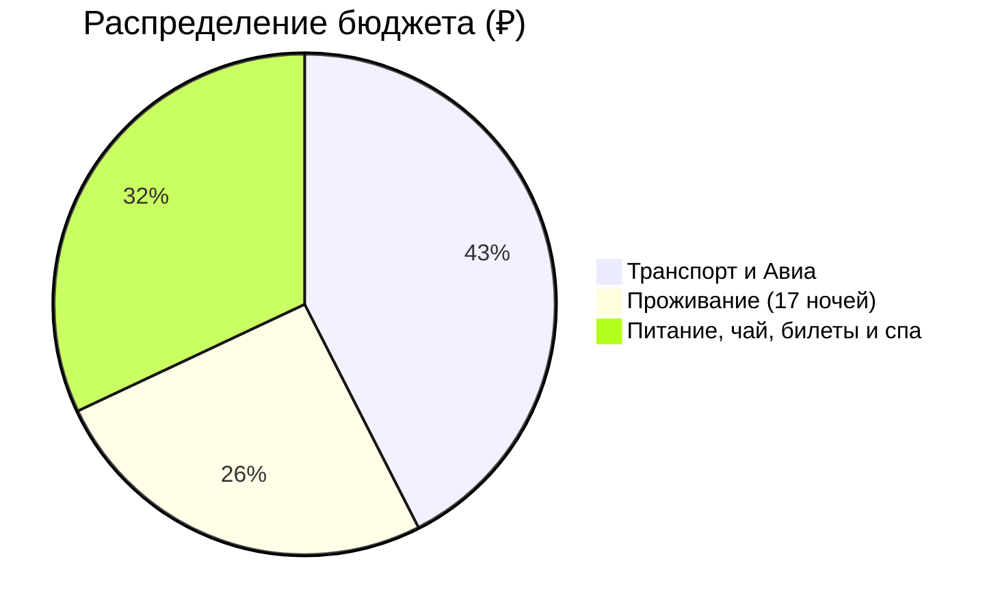
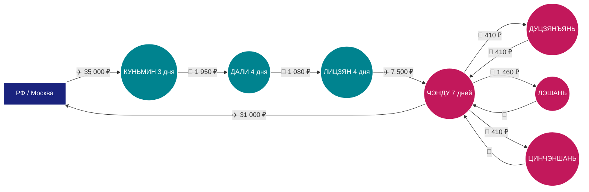

# 🗺️ Маршрут: РФ → Куньмин → Дали → Лицзян → Чэнду → РФ (18 дней)

> [!summary]+ 💰 Общий бюджет поездки: **~200 000 ₽** (на 1 человека)
> - ✈️ **Транспорт (международные авиа + скоростные поезда CRH + внутренний перелет + такси/метро):** 85 000 ₽
> - 🏨 **Проживание (17 ночей в видовых бутик-отелях и миньсу):** 51 000 ₽
> - 🍜 **Остальное (Питание, чайные церемонии, нацпарки, канатные дороги, шоу, термы/массаж):** 64 000 ₽

---

### 📍 Визуальный маршрут перемещений

---

### 📋 Детализация расходов

> [!info]- ✈️ Логистика и Транспорт (85 000 ₽)
> *Нажмите, чтобы развернуть детали всех междугородних и локальных переездов.*
> 
> | Откуда | Куда | Тип транспорта | Оценочная стоимость |
> | :--- | :--- | :---: | ---: |
> | РФ (Москва) | Куньмин (KMG) | ✈️ Авиаперелет | `35 000 ₽` |
> | Куньмин | Шилинь (и обратно) | 🚄 Скоростной поезд CRH | `490 ₽` |
> | Куньмин | Дали | 🚄 Скоростной поезд CRH (2 ч) | `1 950 ₽` |
> | Дали (Эрхай) | Экологический коридор | 🚲 Электробайк на день | `680 ₽` |
> | Дали | Хребет Цаншань | 🚠 Канатная дорога Gantong | `1 490 ₽` |
> | Дали | Лицзян | 🚄 Скоростной поезд CRH (1.5 ч) | `1 080 ₽` |
> | Лицзян | Нефритовый Дракон (Долина Голубой Луны) | 🚌 Эко-автобус + 🚠 Канатка | `2 430 ₽` |
> | Лицзян | Шигу ➔ Ущелье Прыгающего Тигра ➔ Лицзян | 🚗 Туристический авто-трансфер | `1 080 ₽` |
> | Лицзян (LJG) | Чэнду (TFU/CTU) | ✈️ Прямой внутренний перелет | `7 500 ₽` |
> | Чэнду | Дуцзянъянь (Panda Valley) | 🚄 Скоростной поезд CRH | `410 ₽` |
> | Чэнду | Лэшань (и обратно) | 🚄 Скоростной поезд CRH | `1 460 ₽` |
> | Чэнду | Цинчэншань (и обратно) | 🚄 Скоростной поезд CRH | `410 ₽` |
> | Чэнду | Задняя гора Цинчэн | 🚠 Канатная дорога Baiyun | `610 ₽` |
> | Чэнду (TFU/CTU) | РФ (Москва) | ✈️ Авиаперелет прямой/стыковочный | `31 000 ₽` |
> | Внутригородской транспорт | Метро Линии 6 и 18, такси DiDi | 🚇 🚖 Городской транспорт | `~3 410 ₽` |

> [!abstract]- 🏨 Проживание (51 000 ₽)
> *Нажмите, чтобы развернуть детали размещения в видовых бутик-отелях и миньсу (17 ночей на 1 чел при 2-местном размещении).*
> 
> | Локация | Ночей | Тип отеля | Стоимость (доля на 1 чел) |
> | :--- | :---: | :--- | ---: |
> | 🌸 Куньмин | 2 | Бутик-отель у озера Цуйху (район Wuhua) | `4 500 ₽` |
> | 🌊 Дали (Озеро Эрхай) | 4 | Видовой бутик-миньсу прямо над водой (Шуанлан / Эко-коридор) | `15 000 ₽` |
> | 🏔️ Лицзян (Байша / Даян) | 5 | Традиционная усадьба Наси с видом на снежный ледник | `14 000 ₽` |
> | 🐼 Чэнду | 6 | Премиум-отель у реки Цзиньцзян / Taikoo Li | `17 500 ₽` |

> [!todo]- 🍜 Повседневные расходы, Чай, Билеты и Спа (64 000 ₽)
> *Нажмите, чтобы развернуть детализацию активности, гастрономии и релакса.*
> 
> | Статья расходов | Стоимость | Описание |
> | :--- | ---: | :--- |
> | 🍽️ **Питание и чайная культура** | `32 000 ₽` | Дайская кухня, юньнаньская «лапша через мост», рыба озера Эрхай, чайная церемония трех чаш Сандао Ча в Дали, хот-пот с ребрышками La Ribs, дикие грибы мацутакэ, сычуаньский хот-пот, сладкая утка Тяньпи в Лэшане, Chen Mapo Tofu, чайные сады (пуэр, чжуецин, мэндин ганьлу в чайной Хэмин) |
> | 🎟️ **Билеты и шоу** | `23 000 ₽` | Каменный лес Шилинь, Храм Юаньтун, комплекс Трех Пагод Чуншэн, Нацпарк Снежной горы Нефритового Дракона, шоу Чжан Имоу «Впечатление: Лицзян», Ущелье Прыгающего Тигра, фрески Байша (Дабаоцзи), заповедник панд Panda Valley в Дуцзянъяне, речной круиз к Будде в Лэшане, Сычуаньская опера Shufeng Yayun, билет на Заднюю гору Цинчэн |
> | 💆 **Релакс, сувениры и специи** | `9 000 ₽` | Традиционная чистка ушей Cai Er, сеанс китайского массажа Tuina, закупка чая (Пуэр, Чжуецин, Мэндин Ганьлу), свежего сычуаньского перца хуацзяо, пасты доубаньчжан и розовых пирожных |
