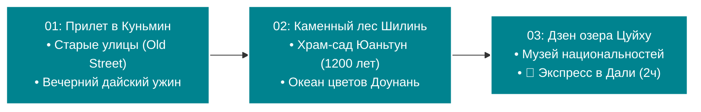
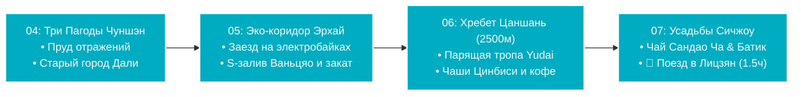
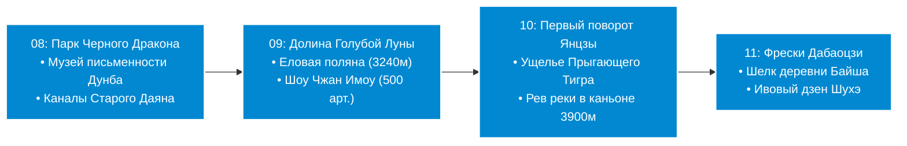

# 🗺️ Концепция маршрута: «От Вечной весны к Киберпанку» (18 дней)

> [!INFO] О концепции путешествия
> **Маршрут:** Куньмин (3 дня) ➔ Дали (4 дня) ➔ Лицзян (4 дня) ➔ Чэнду (7 дней)
> **Продолжительность:** 18 дней / 17 ночей
> **Плавный набор высоты:** Маршрут логистически выстроен для идеальной физиологической акклиматизации: Куньмин (1900 м) ➔ Дали (2000 м) ➔ Лицзян (2400 м ➔ 3240 м). Вы подойдете к заснеженным вершинам и каньонам полностью подготовленными.
> **Приоритет транспорта:** Высокоскоростные поезда CRH (D/G/C), горные канатные дороги, экологичные электробайки по выделенным набережным, комфортные речные катера и единственный короткий внутренний авиаперелет (Лицзян ✈️ Чэнду, 1 ч 20 мин).
> **Чэнду в качестве финала:** Мгновенный сброс высоты до 500 метров (дышится невероятно легко и свободно!). Это возвращение в цивилизацию: контраст неонового киберпанка и 100-летних чайных домов, панды в живом лесу, горячие источники, колосс в Лэшане и ультрасовременный аэропорт Тяньфу (TFU).

---

## 🗺️ Подробная структура путешествия

### 🌸 Блок 1: Куньмин (Дни 01–03)

### 🌊 Блок 2: Дали (Дни 04–07)

### 🏔️ Блок 3: Лицзян (Дни 08–11)

### 🐼 Блок 4: Чэнду и Сычуань (Дни 12–18)

---

## 🌿 Программа по блокам

### Блок 1: Куньмин — «Мягкая посадка и Вечная весна» (Дни 1–3)
*Провинция Юньнань (высота 1890 м). Идеальный старт для акклиматизации после перелета. Природа, парки и спокойный вайб.*

* **День 1: Прибытие, Старые улицы и Огни Вэньлинь.** 
  Прилет в Куньмин (KMG). Метро Линия 6 в центр города, заселение у озера Цуйху, первая дайская кухня с курицей в лемонграссе и вечерняя прогулка по историческому кварталу **Kunming Old Street**.
  *Файл дня:* [[Personal Note/Travel/-- The Southern Cloud Trail/02 - Маршрутный план/01 Куньмин (сб) 🛬 Врата в Юньнань, огни Старых улиц и дайский ужин|01 Куньмин (сб) 🛬 Врата в Юньнань, огни Старых улиц и дайский ужин]]
* **День 2: Каменный лабиринт Шилинь, Храм Юаньтун и Океан цветов Доунань.** 
  Скоростной поезд (20 мин) к фантастическому **Каменному лесу Шилинь** (объект ЮНЕСКО, 270 млн лет). Во второй половине дня — 1200-летний водный храм-сад **Юаньтун**, дегустация кипящей «лапши через мост» и ночной трехэтажный аукцион живых цветов **Доунань**.
  *Файл дня:* [[Personal Note/Travel/-- The Southern Cloud Trail/02 - Маршрутный план/02 Куньмин (вс) 🪨 Карстовый лабиринт Шилинь, храм Юаньтун и океан цветов Доунань|02 Куньмин (вс) 🪨 Карстовый лабиринт Шилинь, храм Юаньтун и океан цветов Доунань]]
* **День 3: Дзен Зеленого озера Цуйху, Музей национальностей и Экспресс в горы.** 
  Утро в **Парке Зеленого озера (Цуйху)** — наблюдение за тайцзи и чай в беседке. Посещение крупнейшего в Азии **Музея национальностей Юньнани** у озера Дяньчи. Во второй половине дня — посадка на скоростной поезд и переезд в Дали (~2 часа). Заселение в бутик-отель на берегу озера Эрхай и закатный ужин.
  *Файл дня:* [[Personal Note/Travel/-- The Southern Cloud Trail/02 - Маршрутный план/03 Куньмин (пн) 🌿 Дзен Зеленого озера Цуйху, Музей национальностей и экспресс в Дали|03 Куньмин (пн) 🌿 Дзен Зеленого озера Цуйху, Музей национальностей и экспресс в Дали]]

---

### Блок 2: Дали — «Чилл у озера и Древние пагоды» (Дни 4–7)
*Провинция Юньнань (высота 2000 м). Ритм замедляется. Здесь мы ловим дзен, катаемся на электробайках и пьем спешелти-кофе.*

* **День 4: Королевские Три Пагоды и Древние кварталы Дали.**
  Знакомство с символом Дали — **Тремя пагодами храма Чуншэн** (IX–X вв., пагода Цяньсюнь 69 м, зеркальный пруд отражений). Исследование пешеходного **Старого города Дали**: башня Ухуа, ручей Хунлунцзин («Красный драконий колодец») и деревянная церковь 1904 г.
  *Файл дня:* [[Personal Note/Travel/-- The Southern Cloud Trail/02 - Маршрутный план/04 Дали (вт) 🏛️ Королевские Три Пагоды Чуншэн и древние кварталы Дали|04 Дали (вт) 🏛️ Королевские Три Пагоды Чуншэн и древние кварталы Дали]]
* **День 5: Скорость вдоль бирюзовой воды (Экологический коридор Эрхай).**
  Аренда бесшумного электробайка на весь день. Большой пробег по **Экологическому коридору озера Эрхай**: S-образный залив в деревне Ваньцяо, плакучие ивы и метасеквойи в воде, рыбацкие поселки, водный круиз и закат над хребтом Цаншань.
  *Файл дня:* [[Personal Note/Travel/-- The Southern Cloud Trail/02 - Маршрутный план/05 Дали (ср) 🚴 Экологический коридор озера Эрхай, деревня Ваньцяо и закат у воды|05 Дали (ср) 🚴 Экологический коридор озера Эрхай, деревня Ваньцяо и закат у воды]]
* **День 6: Парящая тропа хребта Цаншань и хрустальные чаши Цинбиси.**
  Подъем по канатной дороге Gantong Cableway на **хребет Цаншань** (2500 м). Хайкинг по мощеному карнизу **Yudai Cloud Road** («Дорога нефритового пояса») над облаками: ледниковые чаши ущелья Цинбиси, реликтовый лес и панорама озера Эрхай под ногами. Спешелти-кофе и вечерний отдых.
  *Файл дня:* [[Personal Note/Travel/-- The Southern Cloud Trail/02 - Маршрутный план/06 Дали (чт) 🚠 Парящая тропа хребта Цаншань и хрустальные чаши Цинбиси|06 Дали (чт) 🚠 Парящая тропа хребта Цаншань и хрустальные чаши Цинбиси]]
* **День 7: Рисовые усадьбы Сичжоу, Чай Сандао Ча, Батик и Поезд в Лицзян.**
  Утренний базар народа Бай в **Сичжоу**, резные усадьбы «Саньфан Ичжаобэй», кофейня в полях Linden Centre, слоеные лепешки Сичжоу Баба. Чайная церемония трех чаш **Сандао Ча** и мастерские индиго-батика в **Чжоучэн**. После обеда — скоростной поезд в Лицзян (1.5 ч). Вечерний старый город и хот-пот La Ribs.
  *Файл дня:* [[Personal Note/Travel/-- The Southern Cloud Trail/02 - Маршрутный план/07 Дали (пт) 🌾 Рисовые усадьбы Сичжоу, чай Сандао Ча, батик Чжоучэн и поезд в Лицзян|07 Дали (пт) 🌾 Рисовые усадьбы Сичжоу, чай Сандао Ча, батик Чжоучэн и поезд в Лицзян]]

---

### Блок 3: Лицзян — «Кульминация, Ледники и Каньоны» (Дни 8–11)
*Провинция Юньнань (высота 2400 м – 3240 м). Главный природный и культурный вызов поездки. Вы полностью акклиматизированы и готовы к горам.*

* **День 8: Врата Лицзяна, Музей Дунба и Парк Черного Дракона.**
  Исследование **Парка Черного Дракона** с открыточным отражением Нефритового Дракона в пруду и Музея культуры Дунба (пиктограммы народа Наси). Неспешная прогулка по каналам **Старого города Лицзяна (Даян)**, панорама с холма Льва и вечерние хороводные танцы.
  *Файл дня:* [[Personal Note/Travel/-- The Southern Cloud Trail/02 - Маршрутный план/08 Лицзян (сб) 🏮 Парк Черного Дракона, музей Дунба и лабиринты каналов старого Лицзяна|08 Лицзян (сб) 🏮 Парк Черного Дракона, музей Дунба и лабиринты каналов старого Лицзяна]]
* **День 9: Бирюзовая Долина Голубой Луны, Еловая поляна и Шоу Чжан Имоу.**
  Ранний выезд в Нацпарк Нефритового Дракона: 4 каскадных молочно-бирюзовых озера **Долины Голубой Луны**, подъем на канатке на альпийскую **Еловую поляну** (3240 м). Грандиозное этно-шоу режиссера Чжан Имоу **«Впечатление: Лицзян»** с участием 500 артистов на фоне снежного пятитысячника.
  *Файл дня:* [[Personal Note/Travel/-- The Southern Cloud Trail/02 - Маршрутный план/09 Лицзян (вс) 💎 Бирюзовая Долина Голубой Луны, Еловая поляна и шоу Чжан Имоу|09 Лицзян (вс) 💎 Бирюзовая Долина Голубой Луны, Еловая поляна и шоу Чжан Имоу]]
* **День 10: Первый поворот реки Янцзы в Шигу и Мощь Ущелья Прыгающего Тигра.**
  Однодневная экспедиция: эпический 180-градусный V-образный разворот великой реки Янцзы в городке **Шигу**. Спуск на дно колоссального 3900-метрового каньона **Ущелья Прыгающего Тигра** к бурлящему Камню Прыгающего Тигра. Обед над ущельем и возвращение в Лицзян.
  *Файл дня:* [[Personal Note/Travel/-- The Southern Cloud Trail/02 - Маршрутный план/10 Лицзян (пн) 🐅 Первый поворот реки Янцзы в Шигу и мощь Ущелья Прыгающего Тигра|10 Лицзян (пн) 🐅 Первый поворот реки Янцзы в Шигу и мощь Ущелья Прыгающего Тигра]]
* **День 11: Древние фрески Дабаоцзи, Шелк Байша и Дзен деревни Шухэ.**
  Тихая аутентичная деревня **Байша**: полирелигиозные фрески дворца Дабаоцзи XIV–XVII веков (буддизм, даосизм, конфуцианство), школа шелковой вышивки наси, чай на видовой крыше с панорамой ледника. Прогулка по ивовым набережным городка **Шухэ** (мост Цинлун) и прощальный грибной хот-пот.
  *Файл дня:* [[Personal Note/Travel/-- The Southern Cloud Trail/02 - Маршрутный план/11 Лицзян (вт) 🌿 Древние фрески Дабаоцзи, шелк Байша и дзен деревни Шухэ|11 Лицзян (вт) 🌿 Древние фрески Дабаоцзи, шелк Байша и дзен деревни Шухэ]]

---

### Блок 4: Чэнду и Сычуань — «Индустриальный дзен, Панды и Киберпанк» (Дни 12–18)
*Провинция Сычуань (сброс высоты до 500 м). Возвращение в цивилизацию, шопинг, острая еда и абсолютный комфорт.*

* **День 12: Телепорт в Киберпанк (Парк Ванцзянлоу и Taikoo Li).**
  Утренний короткий внутренний перелет из Лицзяна в Чэнду (~1 ч 20 мин). Заселение в отель. Ботанический бамбуковый парк **Ванцзянлоу** (200 видов бамбука) и чай у реки Цзиньцзян. Вечером — контрастный шок: огромные 3D-экраны, неон и бутики футуристичных районов **Taikoo Li** и **Chunxi Road**.
  *Файл дня:* [[Personal Note/Travel/-- The Southern Cloud Trail/02 - Маршрутный план/12 Чэнду (ср) ✈️ Телепорт в Сычуань, бамбуковый Ванцзянлоу и неон Taikoo Li|12 Чэнду (ср) ✈️ Телепорт в Сычуань, бамбуковый Ванцзянлоу и неон Taikoo Li]]
* **День 13: Утренние Панды в Дуцзянъяне, Улочки Цин и Сычуаньский Хот-Пот.**
  Скоростной экспресс (25 мин) в заповедник **Panda Valley в Дуцзянъяне** (большие панды и свободный выгул красных панд). Днем — исторические кварталы **Кхуаньчжай** и **Цзиньли**. Вечером — классический обжигающий **Сычуаньский Хот-Пот** с соусом из хуацзяо.
  *Файл дня:* [[Personal Note/Travel/-- The Southern Cloud Trail/02 - Маршрутный план/13 Чэнду (чт) 🐼 Долина Панд в Дуцзянъяне, улицы Кхуаньчжай и сычуаньский хот-пот|13 Чэнду (чт) 🐼 Долина Панд в Дуцзянъяне, улицы Кхуаньчжай и сычуаньский хот-пот]]
* **День 14: Индустриальная ностальгия (Eastern Suburb Memory) и Мост Аньшунь.**
  Поездка в культовый арт-кластер **Eastern Suburb Memory** (бывший радиозавод №773, превращенный в хаб галерей, винила и лофт-кофеен). Дзен-монастырь **Вэньшу** с чайным садом монахов. Вечерняя прогулка у золотых огней исторического крытого моста **Аньшунь**.
  *Файл дня:* [[Personal Note/Travel/-- The Southern Cloud Trail/02 - Маршрутный план/14 Чэнду (пт) 🏭 Индустриальный арт-кластер Eastern Suburb Memory и вечерний мост Аньшунь|14 Чэнду (пт) 🏭 Индустриальный арт-кластер Eastern Suburb Memory и вечерний мост Аньшунь]]
* **День 15: Взгляд каменного гиганта (Скоростной поезд в Лэшань).**
  Скоростной поезд (45 мин) в Лэшань. Обед с карамелизированной уткой Тяньпи Я. Комфортный речной круиз к 71-метровому **Гигантскому Будде**, высеченному в скале над слиянием трех рек, и панорама «Спящего Будды». Ужин с аутентичным Chen Mapo Tofu в Чэнду.
  *Файл дня:* [[Personal Note/Travel/-- The Southern Cloud Trail/02 - Маршрутный план/15 Лэшань (сб) 🚢 Скоростной экспресс в Лэшань, круиз к 71-метровому Будде и утка Тяньпи|15 Лэшань (сб) 🚢 Скоростной экспресс в Лэшань, круиз к 71-метровому Будде и утка Тяньпи]]
* **День 16: Чайная философия в Народном парке и Сычуаньская опера.**
  День философии «медленной жизни». Идем в **People's Park**: 100-летний чайный дом **Хэмин** (с 1923 г.), гайвани с чаем «Бамбуковые верхушки» Zhuyeqing, традиционная чистка ушей бамбуковыми перьями (*Cai Er*), партии в маджонг. Вечерняя Сычуаньская опера с шоу смены масок **Бянь Лянь** в театре Шуфэн Яюнь.
  *Файл дня:* [[Personal Note/Travel/-- The Southern Cloud Trail/02 - Маршрутный план/16 Чэнду (вс) 🍵 Столетний чайный дом Хэмин в Народном парке, маджонг и сычуаньская опера|16 Чэнду (вс) 🍵 Столетний чайный дом Хэмин в Народном парке, маджонг и сычуаньская опера]]
* **День 17: Изумрудный каньон Задней горы Цинчэн, Рынок специй и Спа.**
  Вылазка на **Заднюю гору Цинчэн** (Qingcheng Houshan): подвесные деревянные настилы над водопадами Ущелья Пяти Водопадов среди изумрудного мха, канатка Baiyun. Вечером — рынок специй **Юйлинь** (закупка свежего сычуаньского перца хуацзяо, чая Мэндин Ганьлу) и сеанс традиционного китайского массажа.
  *Файл дня:* [[Personal Note/Travel/-- The Southern Cloud Trail/02 - Маршрутный план/17 Чэнду (пн) 🌿 Изумрудный каньон Задней горы Цинчэн, термы и рынок специй Юйлинь|17 Чэнду (пн) 🌿 Изумрудный каньон Задней горы Цинчэн, термы и рынок специй Юйлинь]]
* **День 18: Финальное утро в Чэнду и Вылет домой.**
  Неспешный сычуаньский завтрак, финальная чашка чая у канала, скоростная Линия 18 метро прямо в терминал ультрасовременного аэропорта Тяньфу (TFU) или Линия 10 в Шуанлю (CTU). Вылет домой!
  *Файл дня:* [[Personal Note/Travel/-- The Southern Cloud Trail/02 - Маршрутный план/18 Чэнду (вт) 🛫 Финальное утро в Чэнду, скоростное метро и вылет домой|18 Чэнду (вт) 🛫 Финальное утро в Чэнду, скоростное метро и вылет домой]]

---

## 📊 Общая сводка маршрута

| День   | Локация        | Главные события дня                                                                        |
| ------ | -------------- | ------------------------------------------------------------------------------------------ |
| **01** | Куньмин        | Прибытие в KMG, метро в центр, Старые улицы (Old Street), дайский ужин                     |
| **02** | Куньмин        | Скоростной поезд в Каменный лес Шилинь (ЮНЕСКО), храм Юаньтун, рынок цветов Доунань        |
| **03** | Куньмин / Дали | Парк Зеленого озера Цуйху, Музей национальностей, поезд CRH (2ч) в Дали, закат у озера     |
| **04** | Дали           | Королевские Три Пагоды Чуншэн, Пруд отражений, Старый город Дали и ручей Хунлунцзин        |
| **05** | Дали           | Большой заезд на электробайках по Эко-коридору Эрхай (27.5 км), S-залив Ваньцяо, закат     |
| **06** | Дали           | Канатка Gantong на хребет Цаншань (2500 м), парящая тропа Yudai Cloud Road, чаши Цинбиси   |
| **07** | Дали / Лицзян  | Утренний базар Сичжоу, чай Сандао Ча, батик Чжоучэн, поезд CRH (1.5ч) в Лицзян             |
| **08** | Лицзян         | Парк Черного Дракона, Музей культуры Дунба, каналы старого Лицзяна и хороводные танцы      |
| **09** | Лицзян         | Долина Голубой Луны (4 бирюзовых озера), Еловая поляна (3240 м), шоу «Впечатление: Лицзян» |
| **10** | Лицзян         | Экспедиция: Первый поворот Янцзы в Шигу, ревущее 3900м Ущелье Прыгающего Тигра             |
| **11** | Лицзян         | Тихая деревня Байша, настенные фрески Дабаоцзи, школа шелка, городок Шухэ и пуэр           |
| **12** | Чэнду          | Прямой авиаперелет LJG ✈️ Чэнду (1 ч 20 мин), бамбуковый Ванцзянлоу, неон Taikoo Li        |
| **13** | Чэнду          | Экспресс в Panda Valley (большие и красные панды), улочки Кхуаньчжай, сычуаньский хот-пот  |
| **14** | Чэнду          | Арт-кластер Eastern Suburb Memory (арт-завод), монастырь Вэньшу, мост Аньшунь              |
| **15** | Лэшань         | Экспресс в Лэшань (45 мин), круиз к 71-метровому Будде, утка Тяньпи Я, Chen Mapo Tofu      |
| **16** | Чэнду          | Народный парк: 100-летний чайный дом Хэмин, ритуал Cai Er, маджонг, Сычуаньская опера      |
| **17** | Чэнду          | Задняя гора Цинчэн (ущелье водопадов, изумрудный мох, канатка), рынок специй Юйлинь, спа   |
| **18** | Чэнду          | Финальное утро, гастрономический обед, скоростное метро в аэропорт TFU/CTU, вылет домой    |

---

## 🚄 Таблица ключевых перемещений

| День | Откуда | Куда | Транспорт | Время в пути | Примечание |
| :--- | :--- | :--- | :--- | :--- | :--- |
| **02** | Куньмин | Шилинь (и обратно) | Скоростной поезд CRH | ~ 20 мин | Однодневная вылазка. Поезда отходят каждые 20 минут. |
| **03** | Куньмин | Дали | Скоростной поезд CRH (D/G) | ~ 2 часа | Очень живописный маршрут, плавный подъем на 2000 м. |
| **07** | Дали | Лицзян | Скоростной поезд CRH (C/D) | ~ 1.5 часа | Переезд глубже в горы провинции Юньнань (2400 м). |
| **12** | Лицзян (LJG) | Чэнду (TFU/CTU) | ✈️ Самолет (Внутренний рейс) | ~ 1 ч 20 мин | **Телепорт в субтропики.** Экономит сутки пути, спуск с 2400 м до 500 м. |
| **13** | Чэнду (Xipu) | Дуцзянъянь (Panda Valley) | Скоростной поезд CRH (C) | ~ 25 мин | Радиальная ветка прямо к подножию гор. |
| **15** | Чэнду | Лэшань (и обратно) | Скоростной поезд CRH (C/G) | ~ 45 мин | Однодневный скоростной выезд к Гигантскому Будде. |
| **17** | Чэнду (Xipu) | Цинчэншань (и обратно) | Скоростной поезд CRH (C) | ~ 35 мин | Скоростной поезд к Задней горе Цинчэн. |
| **18** | Центр Чэнду | Аэропорт Тяньфу (TFU) | Скоростное метро Линия 18 | ~ 33 мин | Прямой экспресс без пробок прямо в терминал. |

---

## 📁 Структура папок маршрута

- **[[Personal Note/Travel/-- The Southern Cloud Trail/01 - Заметки/Куньмин и Шилинь|01 - Заметки/Куньмин и Шилинь.md]]** — Достопримечательности, кухня и логистика Куньмина.
- **[[Personal Note/Travel/-- The Southern Cloud Trail/01 - Заметки/Дали и Озеро Эрхай|01 - Заметки/Дали и Озеро Эрхай.md]]** — Озеро Эрхай, Три Пагоды, хребет Цаншань, Сичжоу и культура Бай.
- **[[Personal Note/Travel/-- The Southern Cloud Trail/01 - Заметки/Лицзян и Ущелье Прыгающего Тигра|01 - Заметки/Лицзян и Ущелье Прыгающего Тигра.md]]** — Нефритовый Дракон, Долина Голубой Луны, Ущелье Тигра и Байша.
- **[[Personal Note/Travel/-- The Southern Cloud Trail/01 - Заметки/Чэнду и Сычуань|01 - Заметки/Чэнду и Сычуань.md]]** — Панды, 100-летние чайные дома, гора Цинчэн, Лэшань и сычуаньская кухня.
- **[[Personal Note/Travel/-- The Southern Cloud Trail/02 - Маршрутный план/Маршрутный план|02 - Маршрутный план/Маршрутный план.md]]** — Полный хаб со всеми 18 днями маршрута.
- **[[Personal Note/Travel/-- The Southern Cloud Trail/03 - Бронирования/Авиаперелеты|03 - Бронирования/Авиаперелеты.md]]** — Все международные и внутренние авиаперелеты.
- **[[Personal Note/Travel/-- The Southern Cloud Trail/03 - Бронирования/Отели|03 - Бронирования/Отели.md]]** — Бронирования бутик-отелей и миньсу на 17 ночей.
- **[[Personal Note/Travel/-- The Southern Cloud Trail/03 - Бронирования/Поезда|03 - Бронирования/Поезда.md]]** — Расписание и бронирование всех скоростных поездов CRH.
- **[[Personal Note/Travel/-- The Southern Cloud Trail/04 - Финансы/Финансы (-- The Southern Cloud Trail)|04 - Финансы/Финансы (-- The Southern Cloud Trail).md]]** — Полный бюджет и расчет всех расходов поездки.

---

> [!TIP] Особенности высоты и практические советы
> * **Физиологическая адаптация:** В Лицзяне (2400 м) и на Нефритовой горе (3240 м) воздух разрежен. Благодаря предварительным 3 дням в Куньмине (1890 м) и 4 дням в Дали (2000 м) организм будет полностью адаптирован. Пейте больше воды и пользуйтесь солнцезащитным кремом (горный ультрафиолет активен).
> * **Китайские вокзалы:** Бумажные билеты не нужны. Проход на платформу осуществляется по **загранпаспорту** через сканер на турникете.
> * **Внутренние рейсы:** В аэропорту Лицзяна (LJG) строгие правила проверки пауэрбанков — на корпусе аккумулятора должна быть четкая заводская маркировка емкости (до 20 000 мАч / 100 Вт·ч).
