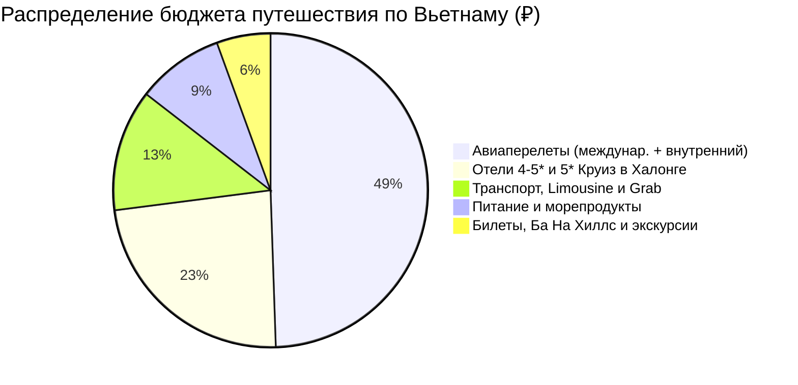

# 💰 Финансы и Полная смета тура: Вьетнам (12 дней / 11 ночей)

> [!summary]+ 💰 Общий бюджет экспедиции «под ключ»: **~105 000 – 118 000 ₽** (`~1 100 – 1 250 $` / `~28 000 000 – 31 000 000 VND`) на 1 человека
> - ✈️ **Авиаперелеты (Международные + внутренний HAN-DAD с багажом):** `~58 000 ₽`
> - 🏨 **Проживание (10 ночей в бутик-отелях 4-5* + 1 ночь на 5* круизном лайнере):** `~27 550 ₽` (из расчета `55 100 ₽` за двухместный номер / `~40 000 ₽` соло)
> - 🚐 **Весь транспорт без авто (D-Car Limousine, Grab, сампаны, лодки-корзины):** `~14 700 ₽` (`~3 880 000 VND`)
> - 🍜 **Питание, морепродукты, Фо Бо, Бун Ча, яичный кофе и рестораны:** `~10 500 ₽` (`~2 800 000 VND`)
> - 🎟️ **Билеты (Ba Na Hills, Транг Ан, Ханг Муа, Цитадель Хюэ, театр):** `~6 500 ₽` (`~1 700 000 VND`)

---

## 📋 Детализированная структура расходов на 2026 год

### 1. ✈️ Авиаперелеты (`~58 000 ₽`)
* Международный перелет Москва ➔ Ханой / Дананг ➔ Москва: `~52 000 ₽`.
* Внутренний рейс Ханой ➔ Дананг (Vietnam Airlines с багажом 20 кг): `~6 000 ₽` (`1 600 000 VND`).

### 2. 🏨 Проживание (11 ночей — `~14 500 000 VND` / `~55 100 ₽` на двоих)
* 3 ночи в Ханое (бутик-отель в Старом квартале): `3 300 000 VND`.
* 1 ночь в Ниньбине (эко-резорт): `1 000 000 VND`.
* 1 ночь в 5* круизе в Халонге/Ланха (каюта с балконом + всё питание): `3 500 000 VND`.
* 2 ночи в Хюэ (колониальный отель): `1 900 000 VND`.
* 2 ночи в Хойане (бутик-резорт): `2 400 000 VND`.
* 2 ночи в Дананге (отель у моря Ми Кхе): `2 400 000 VND`.

### 3. 🚐 Транспорт без машины (`~3 880 000 VND` / `~14 700 ₽`)
* Все поездки на Grab, D-Car Limousine Ханой ↔ Ниньбинь, трансферы и лодки.

### 4. 🎟️ Билеты и Экскурсии (`~1 700 000 VND` / `~6 500 ₽`)
* Sun World Ba Na Hills + Золотой Мост + канатная дорога: `900 000 VND`.
* Лодка в Транг Ан: `250 000 VND`.
* Пик Ханг Муа: `100 000 VND`.
* Цитадель Хюэ + гробница Кхай Диня: `350 000 VND`.
* Старый город Хойана: `120 000 VND`.
* Водный театр кукол в Ханое: `100 000 VND`.

### 5. 🍜 Питание и Гастрономия (`~2 800 000 VND` / `~10 500 ₽`)
* Супы Фо Бо, Бун Ча, Бань Ми, морепродукты в Дананге, яичный кофе: `~230 000 VND/день` × 12 дней.
