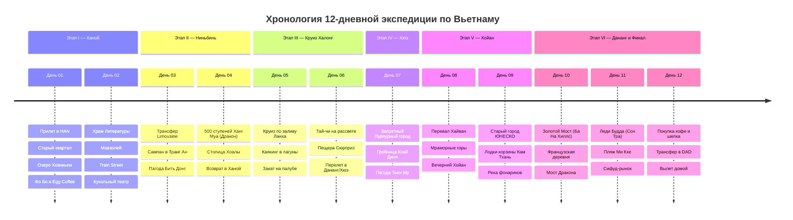

# 🐉 Дракон Индокитая — 12 Дней Гранд-Экспедиции по Вьетнаму (Север и Центр)

> **Концепция путешествия:** Насыщенное 12-дневное путешествие сквозь самые выразительные природные чудеса, древние императорские столицы и колониальные города Северного и Центрального Вьетнама.
> 
> 1. 🏙️ **Этап I (Дни 01–02): 1000-летний Ханой и Французский Индокитай.** Колоритный Старый квартал 36 улиц, священное озеро Хоанкьем, Храм Литературы (Ван Мьеу), легендарная Поездная улица (Train Street), чашка аутентичного яичного кофе и театр кукол на воде.
> 2. 🛶 **Этап II (Дни 03–04): Ниньбинь — «Халонг на суше».** Карстовые пики посреди изумрудных рисовых полей, лодочная экспедиция на сампан сквозь пещеры Транг Ан (ЮНЕСКО), пагода Бить Донг и подъем по 500 каменным ступеням к парящему дракону на вершине Ханг Муа.
> 3. 🚢 **Этап III (Дни 05–06): Мистическая Бухта Халонг и Залив Ланха.** 2-дневный круиз на премиальном корабле среди 2000 известняковых островов-исполинов, каякинг в карстовые лагуны, пещера Сюрприз, рассветный тай-чи на верхней палубе и перелет в Центральный Вьетнам.
> 4. 👑 **Этап IV (День 07): Императорский Хюэ.** Запретный Пурпурный город династии Нгуен, монументальная гробница императора Кхай Диня, пагода Тьен Му на берегу Ароматной реки и банкет королевской кухни.
> 5. 🏮 **Этап V (Дни 08–09): Сказочный Хойан — Город шелковых фонариков.** Живописный перевал Хайван («Морские облака»), Мраморные горы, старинный купеческий Хойан (ЮНЕСКО), плавание на круглых лодках-корзинах *тхунг чай* в кокосовой роще Кам Тхань и вечерние реки плавающих фонариков желаний.
> 6. ✋ **Этап VI (Дни 10–12): Футуристичный Дананг и Золотой Мост.** Канатная дорога в Ба На Хиллс к знаменитому Золотому мосту в руках Великана (Golden Bridge), огненное шоу Моста Дракона, гигантская Леди Будда на полуострове Сон Тра, песчаный пляж Ми Кхе и вылет домой.

---

## 🗺️ Ключевые параметры экспедиции

* **Продолжительность:** 12 дней / 11 ночей.
* **Сезонность:** Октябрь – май (сухой сезон, комфортная температура без изнуряющей жары и тайфунов).
* **Формат перемещений:** 100% без водительских прав (приложения **Grab** / **Gojek**, премиальные микроавтобусы **D-Car Limousine** с массажными креслами от отеля до отеля, внутренний перелет Vietnam Airlines, традиционные сампаны и лодки-корзины).
* **Бюджет под ключ на 1 чел:** `~95 000 – 115 000 ₽` (`~1 000 – 1 200 $` / `~25 000 000 – 30 000 000 VND`), включая международный и внутренний перелеты, отели 4*, 2-дневный круиз в Халонге «всё включено», все трансферы Grab/Limousine, дегустации морепродуктов и билеты.

---

## 📋 Разделы проекта `-- Vietnam`

1. **[[Personal Note/Travel/-- Vietnam/02 - Маршрутный план/Маршрутный план|🗓️ Сводный Маршрутный план (12 Дней)]]**
2. **[[Ханой, Старый квартал 36 улиц и Поездная улица|🏙️ Заметки: Ханой, 36 улиц и Train Street]]**
3. **[[Ниньбинь, Транг Ан и Вершина Ханг Муа (Халонг на суше)|🛶 Заметки: Ниньбинь, Транг Ан и Пик Дракона Ханг Муа]]**
4. **[[Бухта Халонг, Залив Ланха и Карстовые острова|🚢 Заметки: Бухта Халонг, Залив Ланха и Круизы]]**
5. **[[Хюэ, Запретный Пурпурный город и Гробницы Императоров|👑 Заметки: Хюэ, Императорская Цитадель и Гробницы]]**
6. **[[Хойан, Город шелковых фонариков и Кокосовый лес|🏮 Заметки: Хойан, Фонарики и Лодки-корзины]]**
7. **[[Дананг, Золотой Мост в руках Бога (Ba Na Hills) и Мраморные горы|✋ Заметки: Дананг, Золотой Мост и Мраморные горы]]**
8. **[[Вьетнамская гастрономия, Фо Бо, Бань Ми и Кофе с яйцом|🍜 Заметки: Вьетнамская кухня, Фо, Бань Ми и Кофе]]**
9. **[[Гайд по транспорту без прав, Grab и поездам во Вьетнаме|🚕 Заметки: Гайд по транспорту без водительских прав]]**
10. **[[Авиаперелеты (Vietnam)|✈️ Бронирования: Авиаперелеты (Международные и Внутренние)]]**
11. **[[Отели, Бутик-резорты и Круиз|🏨 Бронирования: Отели, Бутик-резорты и Круиз 5*]]**
12. **[[Транспорт, Лимузин-басы и Grab (Без авто)|🚙 Бронирования: D-Car Limousine, Трансферы и Grab]]**
13. **[[Финансы (Vietnam)|💰 Бюджет и Полная смета (12 дней)]]**
14. **[[05 - Полезная информация|📖 Полезная информация: Е-виза, Этикет, Деньги и Безопасность]]**
