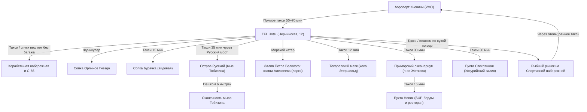

# 🗺️ Владивосток: 7 дней Японского моря, скал и дальневосточной кухни

> [!INFO] О путешествии
> **Длительность:** 7 дней / 6 ночей (05.09.2026 – 11.09.2026)  
> **Маршрут:** Кневичи ➔ Владивосток ➔ Остров Русский (мыс Тобизина, мыс Вятлина) ➔ Залив Петра Великого (катер) ➔ Токаревский маяк ➔ Океанариум и бухта Новик ➔ Бухта Стеклянная ➔ Кневичи  
> **Формат:** Комфортный морской и природный отдых для пары в бархатный сезон. Базирование в отеле 4* с панорамным видом на море, пешие маршруты по скалистым мысам, морская экспедиция к котикам и дегустация свежих морепродуктов.

---

## 🌊 Сводная таблица маршрута по дням

| День | Дата | День нед. | Локация | Программа дня | Ссылка на подробный день |
|:---:|:---:|:---:|:---|:---|:---|
| **01** | 05.09 | Сб | Владивосток | Прилет, прямое такси, С-56, набережная Цесаревича и ранний отдых после ночного перелёта | [[01 Владивосток (сб) 🛬 Врата Тихого океана, набережные и закат над Амурским заливом\|День 01: Врата Тихого океана]] |
| **02** | 06.09 | Вс | Владивосток | Историческая Миллионка, фуникулер, сопка Орлиное Гнездо, хинкали с крабом в «Супра», видовая сопки Бурачка и закат на Спортивной набережной | [[02 Владивосток (вс) 🏙️ Панорамы сопок, видовая сопки Бурачка, Миллионка и Золотой Рог\|День 02: Панорамы сопок и Миллионка]] |
| **03** | 07.09 | Пн | Остров Русский | Русский мост, живописный хайкинг на мыс Тобизина, скальные гроты, мыс Вятлина, купание в чистом море и свежие гребешки в бухте Рында | [[03 Остров Русский (пн) 🌊 Треккинг на мыс Тобизина, скалы и мыс Вятлина\|День 03: Скалы Тобизина и мыс Вятлина]] |
| **04** | 08.09 | Вт | Владивосток / Залив | Утренняя морская прогулка на катере под мостами к камням Алексеева (лежбище ларг), Токаревский маяк на косе Эгершельда и ужин морских ежей | [[04 Владивосток (вт) 🛥️ Морская прогулка на катере, лежбище ларг и Токаревский маяк\|День 04: Катер к ларгам и Токаревский маяк]] |
| **05** | 09.09 | Ср | Остров Русский | Приморский океанариум (подводный тоннель), парковая набережная ДВФУ, SUP-борды в тихой бухте Новик и ужин в яхт-клубе «Новик» | [[05 Остров Русский (ср) 🐋 Приморский океанариум, набережная ДВФУ и бухта Новик\|День 05: Океанариум и бухта Новик]] |
| **06** | 10.09 | Чт | Побережье / Город | Бухта Стеклянная, неспешный Нагорный парк и прощальный гастро-ужин в Zuma | [[06 Приморское побережье (чт) 🌊 Бухта Стеклянная, Нагорный парк и ужин в Zuma\|День 06: Бухта Стеклянная и Zuma]] |
| **07** | 11.09 | Пт | Владивосток ➔ Кневичи | Завтрак, рыбный рынок, раннее прямое такси в Кневичи и вылет домой | [[07 Владивосток (пт) 🛫 Утренний кофе у моря, сувенирный шопинг и ранний трансфер\|День 07: Рыбный рынок и вылет]] |

---

## 🧭 Фазы экспедиции

### 🏙️ Фаза 1: Морской город, сопки и история (Дни 01–02)
Мягкая акклиматизация после дальнего перелета. Размещение в 4* **TFL Hotel Vladivostok** у подножия сопки Орлиное Гнездо. Знакомство с портовым сердцем Владивостока: Корабельная набережная, подлодка С-56, исторический китайский квартал Миллионка, подъем на сопку Орлиное Гнездо и сопку Бурачка с панорамами Золотого Рога. Городские переходы выполняются пешком по сухой погоде или на такси; дальние выезды сохраняются радиальными.

### 🌊 Фаза 2: Остров Русский, морские экспедиции и скалы (Дни 03–05)
Погружение в стихию Японского моря:
- **День 03:** Главный пеший маршрут Приморья — скалистый мыс Тобизина с его обрывами, гротами и бирюзовой водой, мыс Вятлина и садки с живыми морепродуктами.
- **День 04:** Индивидуальная морская прогулка на быстроходном катере из бухты Золотой Рог под двумя вантовыми мостами к камням Алексеева, где на рифах нежатся тихоокеанские пятнистые тюлени (ларги), и легендарный Токаревский маяк на закате.
- **День 05:** Полуостров Житкова и грандиозный Приморский океанариум, набережная кампуса ДВФУ и сап-прогулка в закрытой реликтовой бухте Новик.

### 🌅 Фаза 3: Побережье Уссурийского залива и гастрономия (Дни 06–07)
Уникальный природный феномен — бухта Стеклянная, видовой Нагорный парк на сопке Тюменская, праздничный ужин в ресторане «Zuma» и покупка дальневосточных даров моря перед ранним выездом в аэропорт.

## 🌦️ Правило погодной перестановки

- **День 04 ↔ День 05:** при сильном ветре, тумане или отмене катера поменять морской день со средой-Океанариумом, предварительно переоформив билет и согласовав оператора.
- **День 03 (понедельник):** Океанариум закрыт, поэтому он не является прямым запасным планом. При небезопасной тропе оставить городской крытый день; перенос Тобизина на вторник допустим только после согласования всей цепочки катер → среда и Океанариум → другой доступный слот.
- Решение принимать вечером накануне по прогнозу ветра, осадков и видимости, а утром подтверждать у капитана или оператора.

---

## 🚆 Логистическая нить перемещений

