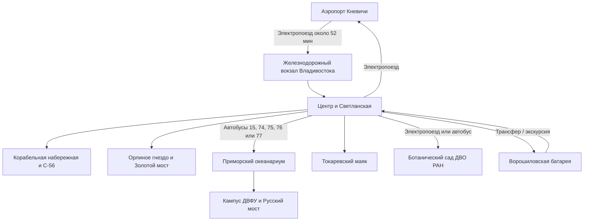

# 🗺️ Владивосток: город-порт, острова и тайга (7 дней)

> [!INFO] О путешествии
> **Длительность:** 7 дней / 6 ночей  
> **Маршрут:** Кневичи ➔ центр Владивостока ➔ остров Русский ➔ Токаревский маяк ➔ Ботанический сад ДВО РАН ➔ Ворошиловская батарея ➔ центр ➔ Кневичи  
> **Концепция:** первая поездка без аренды автомобиля. Городские дни чередуются с островом и природой, а дальние выезды вынесены в отдельные дни, чтобы не тратить время на постоянные переезды.

---

## 🌊 Программа маршрута по дням

### 🛬 День 01 | Первое знакомство, набережные и маяк

* **Подробная страница:** [[01 Владивосток (д1) 🛬 Первое знакомство, набережные и маяк]]
* **Краткое содержание:** поезд из аэропорта Кневичи до железнодорожного вокзала, заселение, мемориальная подводная лодка С-56, Корабельная набережная, прогулка у Золотого моста и первый ужин с дальневосточной рыбой.

---

### 🏛️ День 02 | История города, Миллионка и панорама бухты

* **Подробная страница:** [[02 Владивосток (д2) 🏛️ История города, Миллионка и панорама бухты]]
* **Краткое содержание:** музей Арсеньева, Светланская, триумфальная арка, историческая Миллионка, улица Адмирала Фокина, набережная Спортивной гавани и закат на сопке Орлиное гнездо.

---

### 🌊 День 03 | Остров Русский, океанариум и Русский мост

* **Подробная страница:** [[03 Остров Русский (д3) 🌊 Океанариум, ДВФУ и Русский мост]]
* **Краткое содержание:** ранний автобус №15/74/75/76/77 к Приморскому океанариуму, основная экспозиция, прогулка по кампусу ДВФУ и смотровая точка на Русский мост. Билет в океанариум нужно покупать на официальном сайте.

---

### 🗼 День 04 | Токаревский маяк, берег и морепродукты

* **Подробная страница:** [[04 Владивосток (д4) 🗼 Токаревский маяк, бухта и морепродукты]]
* **Краткое содержание:** прогулка по Токаревской кошке при подходящем уровне воды, Эгершельд, береговая линия и большой ужин с камчатским крабом, гребешком или морским ежом.

---

### 🌲 День 05 | Ботанический сад и Уссурийская тайга

* **Подробная страница:** [[05 Приморский край (д5) 🌲 Ботанический сад и Уссурийская тайга]]
* **Краткое содержание:** электропоезд или автобус на север города, лесные экотропы Ботанического сада-института ДВО РАН, оранжерея по желанию и спокойный вечер в центре. Основной билет на территорию — 300 ₽, оранжерея — ещё 300 ₽ по официальному прайсу.

---

### 🏰 День 06 | Ворошиловская батарея и форты Русского острова

* **Подробная страница:** [[06 Остров Русский (д6) 🏰 Ворошиловская батарея и форты]]
* **Краткое содержание:** заранее заказанный трансфер на юг острова, военно-исторический музей «Ворошиловская батарея», прогулка у береговых укреплений и возвращение через мосты до закатной набережной.

---

### 🌅 День 07 | Свободное утро, сувениры и вылет

* **Подробная страница:** [[07 Владивосток (д7) 🌅 Свободное утро, сувениры и вылет]]
* **Краткое содержание:** завтрак, короткая прогулка у вокзала или Покровского парка, покупка морских сувениров, поезд до аэропорта Кневичи с запасом не менее трёх часов до вылета.

---

## 🚆 Логика перемещений

> [!TIP] Порядок дней можно менять по погоде: День 03 и День 06 лучше ставить на самые ясные дни, а День 02 или День 05 использовать как замену при тумане и сильном ветре.
