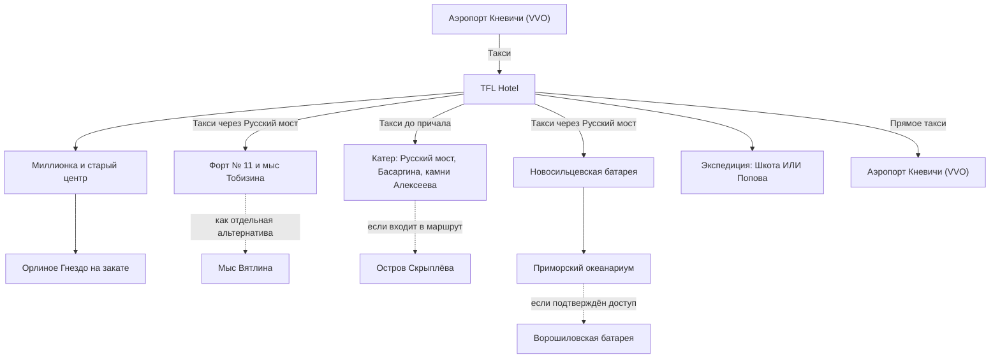

# 🗺️ Владивосток: 7 дней моря, островов и крепости

> [!INFO] О путешествии
> **Длительность:** 7 дней / 6 ночей (05.09.2027 – 11.09.2027).
> **Маршрут:** Кневичи ➔ центр Владивостока ➔ мыс Тобизина и Форт № 11 ➔ морская прогулка к мостам и маяку Басаргина ➔ батареи Русского острова и океанариум ➔ остров Шкота **или** остров Попова ➔ Кневичи.
> **Формат:** городской центр, сильные виды, хайкинг и две разные морские перспективы. Питание оставлено гибким.

---

## 🌊 Сводная таблица маршрута по дням

| День | Дата | День нед. | Локация | Программа дня | Подробный день |
|:---:|:---:|:---:|:---|:---|:---|
| **01** | 05.09 | Вс | Владивосток | Прилёт, отель, С-56 и лёгкая прогулка после перелёта | [[01 Владивосток (вс) 🛬 Прибытие и набережные|День 01: Прибытие]] |
| **02** | 06.09 | Пн | Владивосток | Миллионка и старый центр; Орлиное Гнездо на закате и в синий час | [[02 Владивосток (пн) 🏙️ Миллионка, старый центр и Орлиное Гнездо|День 02: Старый центр и панорама]] |
| **03** | 07.09 | Вт | Остров Русский | Форт № 11 и пеший маршрут на Тобизина; Вятлина — отдельная альтернатива | [[03 Остров Русский (вт) 🌊 Мыс Тобизина и Форт № 11|День 03: Тобизина и Форт № 11]] |
| **04** | 08.09 | Ср | Владивосток / залив | Катер под Русским мостом к камням Алексеева и маяку Басаргина; Скрыплёва — по подтверждению; вечером Токаревский маяк | [[04 Владивосток (ср) 🛥️ Мосты и маяки с моря|День 04: Мосты и маяки]] |
| **05** | 09.09 | Чт | Остров Русский | Новосильцевская батарея, океанариум; Ворошиловская батарея при подтверждённом доступе | [[05 Остров Русский (чт) 🏰 Батареи Русского острова и Приморский океанариум|День 05: Батареи и океанариум]] |
| **06** | 10.09 | Пт | Острова / море | Полный день: выбрать Шкота **или** Попова с мысом Ликандера по расписанию 2027 года | [[06 Острова и море (пт) 🌊 Остров Шкота или Попова|День 06: Островная экспедиция]] |
| **07** | 11.09 | Сб | Владивосток ➔ Кневичи | Завтрак, чек-аут и прямой трансфер в аэропорт | [[07 Владивосток (сб) 🛫 Спокойный выезд в аэропорт|День 07: Вылет]] |

---

## 🧭 Логика маршрута

### 🏙️ День 01–02: город и панорама
Мягко адаптироваться после перелёта, увидеть портовый центр и Миллионку, а главную городскую панораму оставить на вечер, когда зажигаются огни.

### 🌊 День 03–06: Русский остров и море
- **День 03:** Форт № 11 и тропа на Тобизина займут большую часть дня; Вятлина — отдельный вариант вместо полного маршрута.
- **День 04:** короткая морская прогулка под мостом к Басаргина и камням Алексеева; отдельную высадку на Скрыплёве подтвердить у капитана. Для ценового ориентира из сметы сейчас сбор на Токаревской кошке; причал из ваучера имеет приоритет. Токаревский маяк — вечером.
- **День 05:** Новосильцевская батарея соединяет крепость с видом на мост; океанариум остаётся большой крытой остановкой. Ворошиловскую батарею добавить, только если подтвердятся режим и транспорт.
- **День 06:** одна полноценная экспедиция: Шкота (основной выбор) **или** Попова и Ликандера. Не совмещать острова.

### 🛫 День 07: возвращение
Оставить завтрак, чек-аут и трансфер. Время выезда поставить после выбора рейса.

## 🌦️ Погодный план

- Дни 04 и 06 зависят от состояния моря. Условия отмены и возврата уточнить до оплаты, прогноз проверить накануне и утром.
- При отмене выхода на Шкота/Попова оставить день свободным или выбрать короткий городской вариант. Не заменять его второй морской экскурсией в тот же день. Конкретный вариант на суше — главный корпус музея Арсеньева на Светланской, 20 на 1,5–2 часа, затем обед рядом и отдых в TFL. Сейчас музей работает ежедневно 10:00–19:00; [режим и билеты](https://arseniev.org/visitors/), проверено 08.10.2026. Расходы оплачивать из резерва; на 2027 год режим уточнить.
- Если на Дне 03 небезопасны тропа или обрывы, сократить маршрут до Форта № 11 и доступной части берега; не переносить хайк впритык к другому бронированию.
- Режим батарей, океанариума, катеров, парома и островных маршрутов 2027 года пока не подтверждён.

## 🚗 Логистическая нить

```mermaid
flowchart TD
    A["Аэропорт Кневичи (VVO)"] -->|Такси| B["TFL Hotel"]
    B --> C["Миллионка и старый центр"]
    C --> D["Орлиное Гнездо на закате"]
    B -->|Такси через Русский мост| E["Форт № 11 и мыс Тобизина"]
    E -. "как отдельная альтернатива" .-> F["Мыс Вятлина"]
    B -->|Такси до причала| G["Катер: Русский мост, Басаргина, камни Алексеева"]
    G -. "если входит в маршрут" .-> H["Остров Скрыплёва"]
    B -->|Такси через Русский мост| I["Новосильцевская батарея"]
    I --> J["Приморский океанариум"]
    J -. "если подтверждён доступ" .-> K["Ворошиловская батарея"]
    B --> L["Экспедиция: Шкота ИЛИ Попова"]
    B -->|Прямое такси| M["Аэропорт Кневичи (VVO)"]
```
