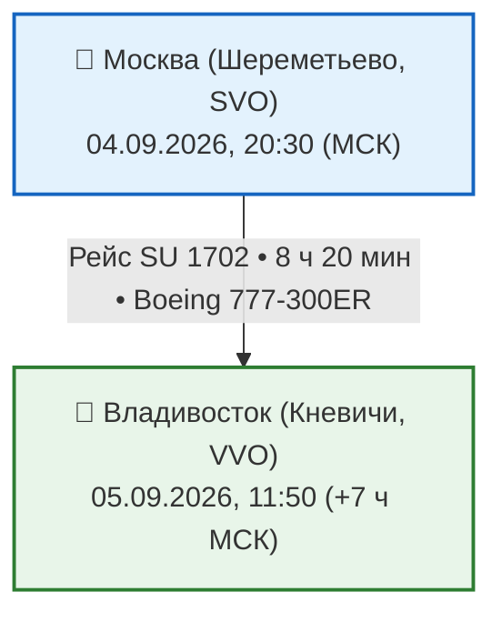
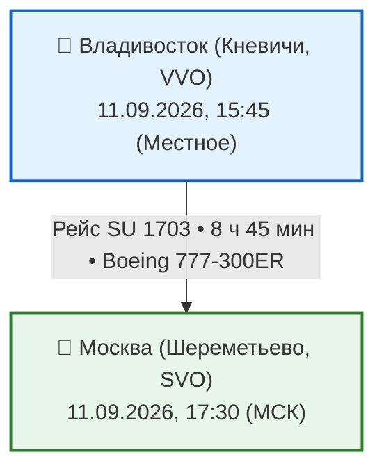

# ✈️ Бронирования: Авиаперелеты во Владивосток (Кневичи, VVO)

> [!SUCCESS]+ 🥇 Выбранный авиаперелет: **Аэрофлот (Шереметьево SVO ⇄ Кневичи VVO)**
> **Стоимость на 1 человека:** `35 000 ₽` туда-обратно (на двоих: `70 000 ₽`).  
> **Тариф:** «Эконом Оптимум» с включенным багажом `23 кг` на каждого пассажира + `10 кг` ручной клади.  
> **Статус:** плановый вариант; номер рейса, время, тариф, багаж и фактический тип борта подтвердить в бронировании. Замена самолёта возможна.

---

## 🛫 1. Перелет ТУДА: Москва ➔ Владивосток (04–05 сентября 2026)

### Таблица сегмента ТУДА

| Дата | Рейс | Авиакомпания | Вылет | Прилет | В пути | Класс / Багаж |
|:---:|:---:|:---|:---:|:---:|:---:|:---:|
| **04.09 ➔ 05.09** | **SU 1702** | Аэрофлот | 20:30 (SVO) | 11:50 (VVO) | 8 ч 20 мин | Эконом / 23 кг + 10 кг |

> [!TIP] Адаптация к смене часовых поясов (+7 часов к Москве)
> Ночной беспосадочный перелёт не гарантирует полноценного сна. Сразу после взлёта переведите часы на владивостокское время; после прилёта избегайте дневного сна и оставьте только лёгкую программу с ранним ужином.

---

## 🛫 2. Перелет ОБРАТНО: Владивосток ➔ Москва (11 сентября 2026)

### Таблица сегмента ОБРАТНО

| Дата | Рейс | Авиакомпания | Вылет | Прилет | В пути | Класс / Багаж |
|:---:|:---:|:---|:---:|:---:|:---:|:---:|
| **11.09.2026** | **SU 1703** | Аэрофлот | 15:45 (VVO) | 17:30 (SVO) | 8 ч 45 мин | Эконом / 23 кг + 10 кг |

> [!IMPORTANT] Правила провоза дальневосточной икры и морепродуктов
> 1. **Красная икра:** Покупайте продукцию заводского изготовления с маркировкой и сохраняйте чек. Актуальные региональные ограничения и норму перевозки проверить перед вылетом — не переносить ограничения другого субъекта РФ на Приморье автоматически.
> 2. **Краб и рыба:** Попросить продавца герметично упаковать продукцию в термобокс с хладоэлементами. Не обещать сохранение глубокой заморозки в обычном багаже; максимально допустимое время и сухой лёд согласовать с авиакомпанией заранее.
> 3. **Треккинговые палки:** Сдаются **строго в багаж** (в ручную кладь службы авиабезопасности их не пропускают).
> 4. **Power Bank и аккумуляторы:** Провозятся **строго в ручной клади**.
