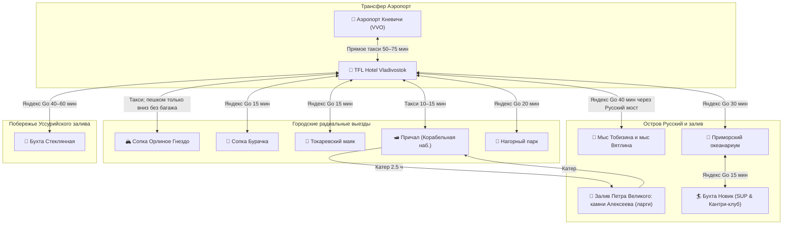

# 🚄 Бронирования: Транспорт, трансферы и морские катера

> Маршрут рассчитан без аренды автомобиля: прямое такси используется для обоих аэропортовых трансферов, Яндекс Go — для радиальных выездов, а катер включается только после получения подтверждённого ваучера с причалом и условиями погодной отмены.

---

## 📋 Сводная таблица междугородних и ключевых перемещений

| День | Сегмент | Транспорт | Время в пути | Способ бронирования / Оплата |
|:---:|:---|:---|:---:|:---|
| **01** | Аэропорт Кневичи (VVO) ➔ TFL Hotel | Яндекс Go «Комфорт» | 50–70 мин | Базовый сценарий; заказать после получения багажа |
| **02** | Отель ➔ Фуникулер ➔ Сопка Бурачка ➔ Отель | Яндекс Go (радиально) | 12–15 мин | Приложение Яндекс Go (~1 000 ₽ на двоих за день) |
| **02** | Пушкинская ➔ Суханова (Орлиное Гнездо) | Владивостокский фуникулер | 2 мин | Наличные / карта у кондуктора (50 ₽/чел) |
| **03** | Владивосток ➔ Остров Русский (мыс Тобизина) | Яндекс Go (Комфорт+) | 35–40 мин | Приложение Яндекс Go (~1 200 ₽ за машину в одну сторону) |
| **03** | Бухта Рында ➔ TFL Hotel | Яндекс Go / трансфер | 40–50 мин | Заказ заранее / через администратора ресторана |
| **04** | Набережная Цесаревича ➔ Залив Петра Великого (камни Алексеева, гроты, мосты) ➔ Набережная | Скоростной катер (морская экспедиция) | 2.5–3 ч | Бронь морской экскурсии / катера (4 500 ₽/чел) |
| **04** | Отель ➔ Токаревский маяк (коса Эгершельд) ➔ Отель | Яндекс Go | 15 мин | Приложение Яндекс Go (~800 ₽ на двоих туда-обратно) |
| **05** | Отель ➔ Остров Русский (Приморский океанариум) | Яндекс Go | 30 мин | Приложение Яндекс Go (~900 ₽ за машину) |
| **05** | Океанариум ➔ Набережная ДВФУ ➔ Бухта Новик | Яндекс Go | 15 мин | Приложение Яндекс Go (~500 ₽ за поездку) |
| **05** | Бухта Новик ➔ TFL Hotel | Яндекс Go | 40–45 мин | Приложение Яндекс Go |
| **06** | Отель ➔ Бухта Стеклянная ➔ Нагорный парк ➔ отель | Яндекс Go / авто с водителем | 35–60 мин на плечо | Проверить обратную подачу машины до выезда |
| **07** | TFL Hotel ➔ Аэропорт Кневичи (VVO) | Яндекс Go «Комфорт+» | 50–75 мин | Выезд 12:15–12:30; не позже 12:30 |

---

## 🗺️ Граф перемещений и транспортных связок

---

## 💡 Практические советы по транспорту во Владивостоке

1. **Аэропортовые трансферы:** В Дни 01 и 07 использовать прямое такси. Электропоезд считать только резервом после проверки актуального расписания: в День 01 стыковка после выдачи багажа ненадёжна, а в День 07 прибытие в 14:03 слишком позднее для спокойной сдачи багажа на рейс 15:45.
2. **Такси (Яндекс Go):** Во Владивостоке прекрасно работает Яндекс Go. Рекомендуется выбирать тариф «Комфорт» или «Комфорт+», где работают просторные кроссоверы и седаны с опытными водителями, хорошо знающими сопочный рельеф и узкие подъемы.
3. **Особенности поездок на остров Русский:**
   - До мыса Вятлина и океанариума проложен качественный асфальт, такси вызывается без проблем.
   - Грунтовая дорога до шлагбаума мыса Тобизина может быть ухабистой: выбирайте класс «Комфорт» или паркетник.
   - Для возвращения с мыса Тобизина или из бухты Рында вызывайте такси за 20–30 минут до выхода или попросите администратора ресторана «Штурвал» помочь с трансфером.
4. **Морской катер:** Штиль и появление ларг не гарантированы. До оплаты получить точное судно, причал, контакт капитана, спасательные жилеты и письменные условия переноса/возврата при ветре, тумане или отмене выхода.
