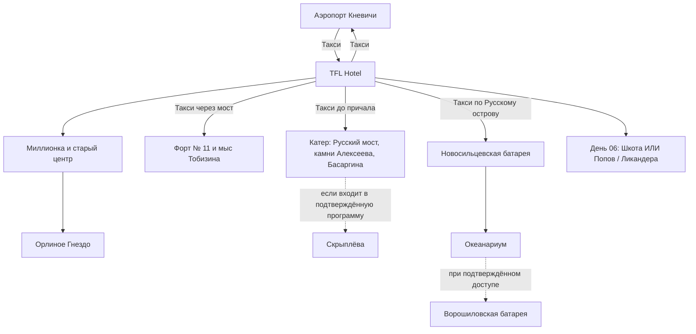

# 🚄 Транспорт, трансферы и морские маршруты

> Маршрут рассчитан без аренды автомобиля. Такси — для городских и островных поездок; катер и паром — по расписанию оператора с заранее понятными условиями отмены. В финансах заложены ориентиры на местный транспорт; время подачи и фактическую цену проверять перед поездкой.

## 📋 Основные перемещения

| День | Сегмент | Транспорт | Примечание |
|:---:|:---|:---|:---|
| **01** | VVO ➔ TFL Hotel | Прямое такси | Заказать после получения багажа; цена и время по факту |
| **02** | Городской центр, Миллионка, Орлиное Гнездо | Пешком, фуникулер и такси по необходимости | Режим фуникулера проверить на 2027 год |
| **03** | TFL ➔ Форт № 11 ➔ Тобизина | Такси / согласованный водитель | Точку высадки и обратную подачу подтвердить заранее; Вятлина — альтернатива длинному маршруту |
| **04** | Отель ➔ причал ➔ залив ➔ причал; затем Токаревский маяк | Такси и катер | У ценового ориентира 4 900 ₽ посадка на Токаревской кошке. Подтвердить Русский мост и Басаргина; Скрыплёва — только по подтверждению оператора |
| **05** | Отель ➔ Новосильцевская батарея ➔ океанариум ➔ Ворошиловская батарея | Такси / согласованный водитель | Порядок остановок и доступ к Ворошиловской батарее проверить до выезда |
| **06А** | Владивосток ➔ остров Шкота ➔ Владивосток | Морская экскурсия или отдельный наземный трансфер | Сначала искать морской тур с высадкой; 2027 расписание не опубликовано |
| **06Б** | Владивосток ➔ остров Попова / мыс Ликандера ➔ Владивосток | Паром или организованный тур | Альтернатива дню на Шкота; перепроверить причал, паром, доступ к тропе |
| **07** | TFL Hotel ➔ VVO | Прямое такси | Выезд рассчитать по фактическому рейсу, дорожному запасу и правилам авиакомпании |

## 🗺️ Схема связок

```mermaid
flowchart TD
    VVO["Аэропорт Кневичи"] -->|Такси| HOTEL["TFL Hotel"]
    HOTEL --> CITY["Миллионка и старый центр"]
    CITY --> VIEW["Орлиное Гнездо"]
    HOTEL -->|Такси через мост| FORT["Форт № 11 и мыс Тобизина"]
    HOTEL -->|Такси до причала| BOAT["Катер: Русский мост, камни Алексеева, Басаргина"]
    BOAT -. "если входит в подтверждённую программу" .-> SKR["Скрыплёва"]
    HOTEL -->|Такси по Русскому острову| BAT["Новосильцевская батарея"]
    BAT --> AQUA["Океанариум"]
    AQUA -. "при подтверждённом доступе" .-> VOR["Ворошиловская батарея"]
    HOTEL --> CHOICE["День 06: Шкота ИЛИ Попов / Ликандера"]
    HOTEL -->|Такси| VVO
```

## Практические условия

1. **День на Русском:** планировать дорогу от отеля до конкретного объекта, а не только до моста; на День 03 заложено 75 минут до форта и отдельный переезд к началу тропы. Заранее иметь план возврата от удалённой точки. Мобильная связь и наличие свободного такси не гарантируются.
2. **Дорога к Шкота:** грунтовый участок может зависеть от дождей и клиренса машины. Не ехать на обычном такси до побережья без подтверждения проходимости и договорённости о возврате.
3. **Коса Шкота:** переход по галечной косе планировать только по свежей таблице приливов и безопасному временному окну.
4. **Катера:** до оплаты получить название оператора, точный причал, состав маршрута, спасательные жилеты и письменные правила переноса/возврата из-за ветра, тумана или волны.
5. **Остров Попова:** не строить график только по прошлогоднему парому. Проверить расписание, причал, наземный путь к началу маршрута и разрешённый порядок посещения Ликандера.

## 🎟️ Билеты и активности на 2027 год

> Плановые даты: 5–11 сентября 2027 года. Публичные страницы и текущие тарифные ориентиры проверены 08.10.2026; конкретные расписания, доступ и цены на даты маршрута уточнять у перевозчиков и объектов.

| Активность | День | Что подтвердить | Статус |
|:---|:---:|:---|:---|
| Музей-подводная лодка С-56 | 01 | Режим работы и билет на дату | Проверить ближе к поездке |
| Форт № 11 и мыс Тобизина | 03 | Состояние подходов, доступ, точку высадки и обратное такси | Без брони; доступ перепроверить |
| Морская прогулка под Русским мостом к Басаргина | 04 | Оператор, причал, судно, маршрут, жилеты, отмену по погоде; спросить про Скрыплёва | Оператор не выбран |
| Новосильцевская батарея | 05 | Режим и билет на 2027 год | Проверить перед выездом |
| Приморский океанариум | 05 | Режим, слоты и тариф; покупать после публикации продаж | Не куплен |
| Ворошиловская батарея | 05, опционально | Режим, доступ, экскурсию и трансфер | Добавлять только при подтверждении |
| Остров Шкота **или** Попова и мыс Ликандера | 06 | Выбрать один маршрут; проверить сезон, оператора, высадку/паром, погоду и возврат | Расписание 2027 не опубликовано |

### Источники для перепроверки

- [Катер «Мосты и маяки»: три часа, 4 900 ₽, сбор на Токаревской кошке](https://extraguide.ru/russia/vladivostok/excursion-127034/); текущая карточка проверена 08.10.2026. Проход под Золотым мостом не заявлен; для него нужен другой подтверждённый маршрут.

- [Музей-заповедник «Владивостокская крепость»: визит и режим объектов](https://fortressvl.ru/visit/)
- [Новосильцевская батарея — описание и доступность](https://fortressvl.ru/fortress/novosilcevskaya-batareya/)
- [Форт № 11 — музей-заповедник «Владивостокская крепость»](https://fortressvl.ru/fortress/fort-11/)
- [Приморский океанариум — официальный сайт](https://primocean.ru/)
- [Остров Шкота — Visit Primorye](https://visit-primorye.ru/what-to-do/ostrov-shkota)
- [Морская экскурсия к островам и ларгам — Visit Primorye](https://visit-primorye.ru/events/morskoe-puteshestvie-k-ostrovam-yaponskogo-morya-i-morskim-kotikam)

### Порядок подготовки

1. После выбора рейсов и отеля зафиксировать фактические даты и сверить их с дневными файлами.
2. Билет в океанариум покупать только после публикации режима и слотов на сентябрь 2027 года.
3. Катера и островную экспедицию бронировать с письменными условиями отмены и точным причалом; не ставить два больших морских выхода в один день.
4. Для Дня 06 выбрать Шкота или Попова. Для Шкота сверить состояние дороги и приливы; для Попова — расписание парома и разрешённый порядок посещения Ликандера.
